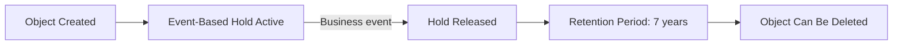

# How to Configure Object Hold Policies in Google Cloud Storage for Compliance

Author: [nawazdhandala](https://www.github.com/nawazdhandala)

Tags: GCP, Google Cloud Storage, Object Hold, Compliance, Data Retention

Description: A practical guide to configuring object hold policies in Google Cloud Storage for compliance requirements, legal holds, and data immutability.

---

Retention policies apply uniformly to an entire bucket, but sometimes you need more granular control. Object holds let you prevent deletion or modification of individual objects, independent of any bucket-level retention policy. This is especially useful for legal holds where specific documents must be preserved, or for event-based retention where the hold period should start from a business event rather than the upload time.

This guide covers both types of object holds - temporary holds and event-based holds - with practical examples for compliance workflows.

## Types of Object Holds

Google Cloud Storage offers two types of holds:

**Temporary Hold** - A simple flag on an object that prevents it from being deleted or overwritten. Anyone with the right permissions can place or remove a temporary hold. There is no automatic release.

**Event-Based Hold** - A hold that is placed automatically when an object is uploaded (if configured on the bucket) and must be explicitly released when a business event occurs. When released, the retention period starts counting from the release time.

```mermaid
graph TD
    subgraph "Temporary Hold"
        A[Object uploaded] --> B[Hold placed manually]
        B --> C[Object protected]
        C --> D[Hold removed manually]
        D --> E[Object can be deleted]
    end

    subgraph "Event-Based Hold"
        F[Object uploaded] --> G[Hold applied automatically]
        G --> H[Object protected]
        H --> I[Business event occurs]
        I --> J[Hold released]
        J --> K[Retention period starts]
        K --> L[Retention expires]
        L --> M[Object can be deleted]
    end
```



## Setting Up Temporary Holds

### Placing a Temporary Hold

```bash
# Place a temporary hold on a specific object
gcloud storage objects update gs://my-bucket/legal/contract-2026-001.pdf \
  --temporary-hold
```

While the temporary hold is active, any attempt to delete or overwrite the object will fail with a 403 error.

### Checking Hold Status

```bash
# Check if an object has a hold
gcloud storage objects describe gs://my-bucket/legal/contract-2026-001.pdf \
  --format="json(temporaryHold, eventBasedHold)"
```

### Releasing a Temporary Hold

```bash
# Remove the temporary hold from an object
gcloud storage objects update gs://my-bucket/legal/contract-2026-001.pdf \
  --no-temporary-hold
```

### Bulk Hold Operations

Place holds on multiple objects matching a pattern:

```python
from google.cloud import storage

def place_holds_on_prefix(bucket_name, prefix):
    """Place temporary holds on all objects under a prefix."""
    client = storage.Client()
    bucket = client.bucket(bucket_name)

    # List all objects with the given prefix
    blobs = bucket.list_blobs(prefix=prefix)

    count = 0
    for blob in blobs:
        # Set the temporary hold flag
        blob.temporary_hold = True
        blob.patch()
        count += 1
        print(f"Hold placed: {blob.name}")

    print(f"Placed holds on {count} objects")

def release_holds_on_prefix(bucket_name, prefix):
    """Release temporary holds on all objects under a prefix."""
    client = storage.Client()
    bucket = client.bucket(bucket_name)

    blobs = bucket.list_blobs(prefix=prefix)

    count = 0
    for blob in blobs:
        if blob.temporary_hold:
            blob.temporary_hold = False
            blob.patch()
            count += 1
            print(f"Hold released: {blob.name}")

    print(f"Released holds on {count} objects")

# Place holds on all documents related to a legal case
place_holds_on_prefix("legal-docs", "cases/case-2026-0042/")
```

## Setting Up Event-Based Holds

Event-based holds are more sophisticated. They are designed for scenarios where you need the retention period to start from a specific business event rather than from the object's creation time.

### Enabling Default Event-Based Hold on a Bucket

When you enable default event-based hold on a bucket, every new object uploaded gets an event-based hold automatically:

```bash
# Enable default event-based hold on a bucket
gcloud storage buckets update gs://my-compliance-bucket \
  --default-event-based-hold
```

### How the Workflow Works

1. An object is uploaded to the bucket
2. The event-based hold is automatically applied
3. The object cannot be deleted or overwritten
4. When the relevant business event occurs (e.g., account closure, case resolution), your application releases the hold
5. If the bucket has a retention policy, the retention period starts counting from the hold release time
6. The object is protected by the retention policy until the period expires

### Setting Up a Complete Event-Based Retention System

```bash
# Step 1: Create the bucket
gcloud storage buckets create gs://financial-records \
  --location=us-central1 \
  --uniform-bucket-level-access

# Step 2: Set a retention policy (7 years from when the hold is released)
gcloud storage buckets update gs://financial-records \
  --retention-period=7y

# Step 3: Enable default event-based hold
gcloud storage buckets update gs://financial-records \
  --default-event-based-hold
```

Now every uploaded object is held until you explicitly release it, and after release, it is retained for 7 years.

### Releasing an Event-Based Hold

When the triggering business event occurs:

```bash
# Release the event-based hold on a specific object
gcloud storage objects update gs://financial-records/accounts/acct-12345/statement.pdf \
  --no-event-based-hold
```

### Python Implementation for Event-Based Workflow

```python
from google.cloud import storage
from datetime import datetime

def upload_with_event_hold(bucket_name, file_path, destination, metadata=None):
    """Upload a file to a bucket that has default event-based holds."""
    client = storage.Client()
    bucket = client.bucket(bucket_name)
    blob = bucket.blob(destination)

    # Add metadata to track the business context
    if metadata:
        blob.metadata = metadata

    # Upload the file (event-based hold is applied automatically by the bucket)
    blob.upload_from_filename(file_path)

    print(f"Uploaded with event-based hold: {destination}")
    print(f"Hold will be released when business event occurs")

def release_event_hold(bucket_name, blob_name, event_type, event_id):
    """Release an event-based hold when a business event occurs."""
    client = storage.Client()
    bucket = client.bucket(bucket_name)
    blob = bucket.get_blob(blob_name)

    if not blob:
        print(f"Object not found: {blob_name}")
        return

    if not blob.event_based_hold:
        print(f"No event-based hold on: {blob_name}")
        return

    # Record the triggering event in metadata before releasing
    current_metadata = blob.metadata or {}
    current_metadata.update({
        "hold-released-by-event": event_type,
        "event-id": event_id,
        "hold-released-at": datetime.utcnow().isoformat(),
    })
    blob.metadata = current_metadata

    # Release the event-based hold
    blob.event_based_hold = False
    blob.patch()

    print(f"Released event-based hold on: {blob_name}")
    print(f"Retention period now starts from: {datetime.utcnow().isoformat()}")

def release_holds_for_account(bucket_name, account_id, event_type, event_id):
    """Release holds on all objects for a specific account."""
    client = storage.Client()
    bucket = client.bucket(bucket_name)

    prefix = f"accounts/{account_id}/"
    blobs = bucket.list_blobs(prefix=prefix)

    released_count = 0
    for blob in blobs:
        if blob.event_based_hold:
            blob.event_based_hold = False
            blob.patch()
            released_count += 1
            print(f"Released: {blob.name}")

    print(f"Released holds on {released_count} objects for account {account_id}")

# Upload a financial record
upload_with_event_hold(
    "financial-records",
    "/tmp/statement.pdf",
    "accounts/acct-12345/2026/02/statement.pdf",
    {"account-id": "acct-12345", "document-type": "monthly-statement"}
)

# When the account is closed, release the holds
release_holds_for_account(
    "financial-records",
    "acct-12345",
    "account-closure",
    "closure-2026-789"
)
```

## Combining Holds with Retention Policies

Object holds and retention policies complement each other:



The retention period does not start until the hold is released. This is powerful for compliance scenarios where you need to retain data for a fixed period after an event, not after creation.

## Terraform Configuration

```hcl
resource "google_storage_bucket" "compliance_bucket" {
  name     = "compliance-records"
  location = "US"

  uniform_bucket_level_access = true

  # Enable default event-based hold for new objects
  default_event_based_hold = true

  # 7-year retention from hold release
  retention_policy {
    retention_period = 220752000  # 7 years in seconds
  }
}
```

## Auditing Hold Operations

Track hold operations using Cloud Audit Logs. Every hold placement and release is logged:

```bash
# Query audit logs for hold operations
gcloud logging read \
  'resource.type="gcs_bucket" AND protoPayload.methodName="storage.objects.update" AND protoPayload.request.updateMask="temporaryHold"' \
  --limit=50 \
  --format="table(timestamp, protoPayload.authenticationInfo.principalEmail, protoPayload.resourceName)"
```

## Important Considerations

**Holds prevent deletion even by admins.** A held object cannot be deleted by anyone, regardless of their IAM permissions. The hold must be released first.

**Temporary holds have no expiration.** Unlike retention policies, temporary holds stay in place until explicitly removed. Make sure you have a process to release them when appropriate.

**Event-based holds and retention are complementary.** The event-based hold pauses the retention clock. The retention policy provides the guaranteed minimum retention after the hold is released.

**Bucket-level lock affects holds.** If you lock the retention policy on a bucket, the retention behavior becomes permanent. However, you can still place and release holds on individual objects.

**Versioning interaction.** Holds apply to specific object versions. In a versioned bucket, noncurrent versions can have holds independent of the current version.

Object holds give you the fine-grained control that bucket-level retention policies lack. For legal holds, event-based retention, and compliance workflows that need per-object control, they are an essential tool in your data governance toolkit.
