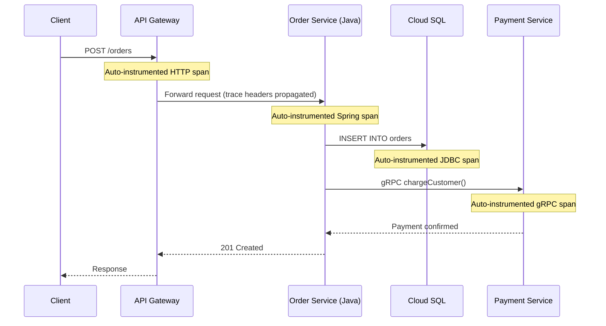

# How to Configure OpenTelemetry Auto-Instrumentation for Java Applications on Google Cloud

Author: [nawazdhandala](https://www.github.com/nawazdhandala)

Tags: GCP, OpenTelemetry, Java, Auto-Instrumentation, Cloud Trace, Google Cloud

Description: Step-by-step guide to configuring OpenTelemetry automatic instrumentation for Java applications running on Google Cloud Platform.

---

Java is one of those languages where OpenTelemetry auto-instrumentation really shines. Instead of manually adding tracing code to every HTTP client call, database query, and framework method, you attach the Java agent and it instruments everything automatically. Combined with Google Cloud as the backend for traces and metrics, you get comprehensive observability with minimal code changes. Let me show you how to set this up.

## What Auto-Instrumentation Gives You

The OpenTelemetry Java agent uses bytecode manipulation to automatically instrument popular libraries and frameworks. Without changing a single line of your application code, you get traces for Spring Boot controllers and filters, JDBC database calls, HTTP client libraries like OkHttp and Apache HttpClient, gRPC calls, Kafka producers and consumers, Redis operations, and many more. The full list covers over 100 libraries.

## Prerequisites

- Java 11 or later
- A GCP project with Cloud Trace API enabled
- A running Java application (Spring Boot, Quarkus, or any framework)
- Application Default Credentials or a service account key

## Step 1: Download the Java Agent

Grab the latest OpenTelemetry Java agent JAR and the Google Cloud auto-configuration module.

```bash
# Download the OpenTelemetry Java agent
curl -L -o opentelemetry-javaagent.jar \
  https://github.com/open-telemetry/opentelemetry-java-instrumentation/releases/latest/download/opentelemetry-javaagent.jar

# Download the Google Cloud trace exporter extension
curl -L -o gcp-exporter.jar \
  https://github.com/GoogleCloudPlatform/opentelemetry-operations-java/releases/latest/download/exporter-auto-0.31.0.jar
```

## Step 2: Configure the Agent

You can configure the agent through environment variables, system properties, or a configuration file. Environment variables are the most common approach for cloud deployments.

```bash
# Set the service name so traces are identifiable
export OTEL_SERVICE_NAME=my-java-service

# Use the Google Cloud Trace exporter
export OTEL_TRACES_EXPORTER=google_cloud_trace

# Use the Google Cloud Monitoring exporter for metrics
export OTEL_METRICS_EXPORTER=google_cloud_monitoring

# Set the GCP project ID
export GOOGLE_CLOUD_PROJECT=my-gcp-project

# Configure sampling - trace 10% of requests in production
export OTEL_TRACES_SAMPLER=parentbased_traceidratio
export OTEL_TRACES_SAMPLER_ARG=0.1

# Set resource attributes for better trace identification
export OTEL_RESOURCE_ATTRIBUTES=service.namespace=production,service.version=1.2.3
```

## Step 3: Run Your Application with the Agent

Attach the agent when starting your Java application. The agent loads before your application code and instruments everything.

```bash
# Run a Spring Boot application with the OpenTelemetry agent attached
java -javaagent:opentelemetry-javaagent.jar \
     -Dotel.javaagent.extensions=gcp-exporter.jar \
     -jar my-application.jar
```

That is it for the basic setup. Your application will now automatically generate traces for all supported libraries.

## Step 4: Deploy on GKE

For Kubernetes deployments, you typically add the agent JAR to your Docker image and configure it via environment variables in the pod spec.

Here is a Dockerfile that includes the agent.

```dockerfile
FROM eclipse-temurin:21-jre

# Download the OpenTelemetry Java agent at build time
ADD https://github.com/open-telemetry/opentelemetry-java-instrumentation/releases/latest/download/opentelemetry-javaagent.jar /opt/otel/opentelemetry-javaagent.jar

# Copy the GCP exporter extension
ADD https://github.com/GoogleCloudPlatform/opentelemetry-operations-java/releases/latest/download/exporter-auto-0.31.0.jar /opt/otel/gcp-exporter.jar

# Copy your application JAR
COPY target/my-application.jar /app/my-application.jar

# Set the agent as a JVM argument
ENTRYPOINT ["java", \
    "-javaagent:/opt/otel/opentelemetry-javaagent.jar", \
    "-Dotel.javaagent.extensions=/opt/otel/gcp-exporter.jar", \
    "-jar", "/app/my-application.jar"]
```

And the Kubernetes deployment manifest.

```yaml
apiVersion: apps/v1
kind: Deployment
metadata:
  name: my-java-service
spec:
  replicas: 3
  selector:
    matchLabels:
      app: my-java-service
  template:
    metadata:
      labels:
        app: my-java-service
    spec:
      serviceAccountName: my-java-service
      containers:
        - name: app
          image: gcr.io/my-project/my-java-service:latest
          env:
            # Service identification
            - name: OTEL_SERVICE_NAME
              value: my-java-service
            # Export traces to Google Cloud Trace
            - name: OTEL_TRACES_EXPORTER
              value: google_cloud_trace
            # Export metrics to Google Cloud Monitoring
            - name: OTEL_METRICS_EXPORTER
              value: google_cloud_monitoring
            # GCP project for trace export
            - name: GOOGLE_CLOUD_PROJECT
              value: my-gcp-project
            # Sample 10% of traces
            - name: OTEL_TRACES_SAMPLER
              value: parentbased_traceidratio
            - name: OTEL_TRACES_SAMPLER_ARG
              value: "0.1"
            # Resource attributes
            - name: OTEL_RESOURCE_ATTRIBUTES
              value: "service.namespace=production,service.version=1.2.3"
          resources:
            requests:
              # The agent adds some overhead - account for it
              cpu: 500m
              memory: 512Mi
            limits:
              cpu: "1"
              memory: 1Gi
```

## Step 5: Using an OpenTelemetry Collector Instead

Instead of exporting directly to GCP from each service, you might prefer sending telemetry through a collector. This is especially useful when you have many services or want centralized processing.

```bash
# Point the agent at a collector instead of directly at GCP
export OTEL_TRACES_EXPORTER=otlp
export OTEL_METRICS_EXPORTER=otlp
export OTEL_EXPORTER_OTLP_ENDPOINT=http://otel-collector:4317
export OTEL_EXPORTER_OTLP_PROTOCOL=grpc
```

## Customizing What Gets Instrumented

Sometimes the auto-instrumentation is too noisy, or you want to exclude certain libraries. You can control this with configuration.

```bash
# Disable instrumentation for specific libraries
export OTEL_INSTRUMENTATION_JDBC_ENABLED=false

# Suppress specific spans by name pattern
export OTEL_INSTRUMENTATION_COMMON_EXPERIMENTAL_SUPPRESS_MESSAGING_RECEIVE_SPANS=true

# Add custom span attributes to HTTP server spans
export OTEL_INSTRUMENTATION_HTTP_SERVER_CAPTURE_REQUEST_HEADERS=X-Request-ID,X-Tenant-ID
```

## Adding Manual Instrumentation Alongside Auto-Instrumentation

Auto-instrumentation handles the framework-level stuff, but you will often want to add custom spans for your business logic. The two work together seamlessly.

```java
import io.opentelemetry.api.GlobalOpenTelemetry;
import io.opentelemetry.api.trace.Span;
import io.opentelemetry.api.trace.Tracer;

public class OrderService {
    // Get a tracer instance from the global provider set by the agent
    private static final Tracer tracer =
        GlobalOpenTelemetry.getTracer("com.example.orderservice");

    public Order processOrder(OrderRequest request) {
        // Create a custom span for your business logic
        Span span = tracer.spanBuilder("processOrder")
            .setAttribute("order.type", request.getType())
            .setAttribute("order.item_count", request.getItems().size())
            .startSpan();

        try {
            // Your business logic here
            Order order = validateAndCreate(request);
            span.setAttribute("order.id", order.getId());
            return order;
        } catch (Exception e) {
            // Record the error on the span
            span.recordException(e);
            throw e;
        } finally {
            span.end();
        }
    }
}
```

## Trace Propagation Flow

Here is how trace context flows through a typical request.



## Performance Impact

The Java agent does add some overhead. In my testing, expect around 2-5% increase in CPU usage and 50-100MB additional heap memory usage. The overhead is mostly from the bytecode instrumentation at startup and the span creation at runtime. For most production workloads, this is negligible compared to the observability you gain. If you are running extremely latency-sensitive services, use sampling aggressively and disable instrumentation for libraries you do not need traced.

## Troubleshooting

If traces are not showing up, first check that the agent is actually loaded by looking at your startup logs for the OpenTelemetry banner. Then verify your GCP credentials are available to the process. You can enable debug logging to see exactly what the agent is doing.

```bash
# Enable debug logging for the OpenTelemetry agent
export OTEL_JAVAAGENT_DEBUG=true
```

## Wrapping Up

OpenTelemetry auto-instrumentation for Java gives you deep visibility into your application with almost zero effort. Attach the agent, set a few environment variables, and you get automatic tracing for all the libraries your application uses. On Google Cloud, the traces flow into Cloud Trace where you can analyze latency, find bottlenecks, and track requests across services. The combination of auto-instrumentation for framework code and manual instrumentation for business logic gives you the best of both worlds.
