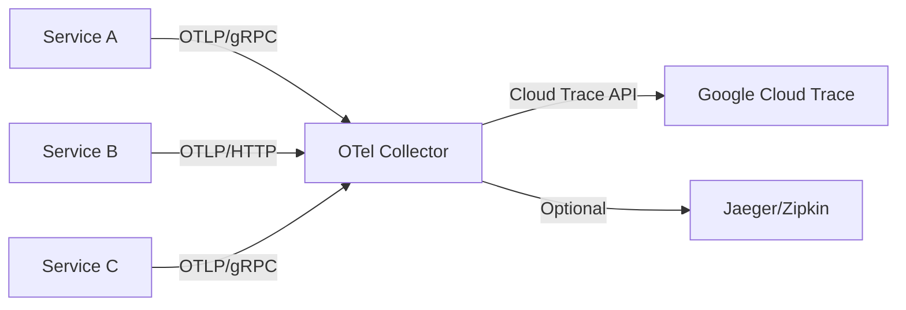

# How to Configure OpenTelemetry Collector to Send Traces to Google Cloud Trace

Author: [nawazdhandala](https://www.github.com/nawazdhandala)

Tags: GCP, OpenTelemetry Collector, Cloud Trace, Distributed Tracing, Observability

Description: A complete guide to deploying and configuring the OpenTelemetry Collector to receive traces from your applications and export them to Google Cloud Trace.

---

Instead of having each application export traces directly to Cloud Trace, you can route everything through the OpenTelemetry Collector. The collector acts as a central pipeline that receives telemetry data from your services, processes it (filtering, batching, sampling), and exports it to one or more backends.

This architecture has several advantages: your applications only need to know how to send data to the collector (using standard OTLP), the collector handles authentication with Cloud Trace, and you can add processing like tail-based sampling without changing any application code.

## Architecture

Here is how the pieces fit together:



Your applications send traces to the collector using OTLP (OpenTelemetry Protocol). The collector receives them, applies any configured processors, and exports them to Cloud Trace.

## Step 1: Create the Collector Configuration

The collector configuration has four main sections: receivers (how data comes in), processors (transformations), exporters (where data goes), and service (how they connect).

This configuration sets up the collector to receive OTLP traces and export them to Cloud Trace.

```yaml
# otel-collector-config.yaml
receivers:
  # OTLP receiver accepts traces from applications
  otlp:
    protocols:
      grpc:
        endpoint: 0.0.0.0:4317  # Standard OTLP gRPC port
      http:
        endpoint: 0.0.0.0:4318  # Standard OTLP HTTP port

processors:
  # Batch processor reduces API calls by grouping spans
  batch:
    send_batch_size: 256        # Send after collecting 256 spans
    timeout: 5s                 # Or after 5 seconds, whichever comes first

  # Memory limiter prevents the collector from using too much memory
  memory_limiter:
    check_interval: 1s
    limit_mib: 512              # Hard limit at 512 MiB
    spike_limit_mib: 128        # Allow spikes up to 128 MiB above the limit

  # Resource detection adds GCP metadata to spans
  resourcedetection:
    detectors: [gcp]
    timeout: 5s

exporters:
  # Google Cloud Trace exporter
  googlecloud:
    # project is auto-detected on GCP, set explicitly for non-GCP environments
    # project: your-project-id
    retry_on_failure:
      enabled: true
      initial_interval: 5s
      max_interval: 30s
      max_elapsed_time: 300s

  # Debug exporter for troubleshooting (writes to collector logs)
  debug:
    verbosity: basic

service:
  pipelines:
    traces:
      receivers: [otlp]
      processors: [memory_limiter, resourcedetection, batch]
      exporters: [googlecloud]
```

## Step 2: Deploy on GKE

For GKE deployments, run the collector as a Deployment with a Kubernetes Service. This gives all your pods a stable endpoint to send traces to.

```yaml
# k8s/otel-collector.yaml
apiVersion: v1
kind: ConfigMap
metadata:
  name: otel-collector-config
data:
  config.yaml: |
    receivers:
      otlp:
        protocols:
          grpc:
            endpoint: 0.0.0.0:4317
          http:
            endpoint: 0.0.0.0:4318
    processors:
      batch:
        send_batch_size: 256
        timeout: 5s
      memory_limiter:
        check_interval: 1s
        limit_mib: 512
        spike_limit_mib: 128
      resourcedetection:
        detectors: [gcp]
        timeout: 5s
    exporters:
      googlecloud:
        retry_on_failure:
          enabled: true
    service:
      pipelines:
        traces:
          receivers: [otlp]
          processors: [memory_limiter, resourcedetection, batch]
          exporters: [googlecloud]

---
apiVersion: apps/v1
kind: Deployment
metadata:
  name: otel-collector
spec:
  replicas: 2
  selector:
    matchLabels:
      app: otel-collector
  template:
    metadata:
      labels:
        app: otel-collector
    spec:
      serviceAccountName: trace-sa  # Must have cloudtrace.agent role
      containers:
        - name: collector
          image: otel/opentelemetry-collector-contrib:latest
          args: ["--config=/conf/config.yaml"]
          ports:
            - containerPort: 4317  # OTLP gRPC
              protocol: TCP
            - containerPort: 4318  # OTLP HTTP
              protocol: TCP
          resources:
            requests:
              cpu: 200m
              memory: 256Mi
            limits:
              cpu: 500m
              memory: 512Mi
          volumeMounts:
            - name: config
              mountPath: /conf
      volumes:
        - name: config
          configMap:
            name: otel-collector-config

---
apiVersion: v1
kind: Service
metadata:
  name: otel-collector
spec:
  selector:
    app: otel-collector
  ports:
    - name: otlp-grpc
      port: 4317
      targetPort: 4317
    - name: otlp-http
      port: 4318
      targetPort: 4318
```

## Step 3: Configure Applications to Send to the Collector

Update your application's OpenTelemetry configuration to export traces to the collector instead of directly to Cloud Trace.

For Python applications:

```python
# tracing.py - Send traces to the OTel Collector
from opentelemetry import trace
from opentelemetry.sdk.trace import TracerProvider
from opentelemetry.sdk.trace.export import BatchSpanProcessor
from opentelemetry.exporter.otlp.proto.grpc.trace_exporter import OTLPSpanExporter
from opentelemetry.sdk.resources import Resource
import os


def init_tracing():
    """Initialize OpenTelemetry to export to the collector."""
    resource = Resource.create({
        "service.name": os.environ.get("SERVICE_NAME", "my-service"),
    })

    provider = TracerProvider(resource=resource)

    # Export to the OTel Collector via OTLP gRPC
    collector_endpoint = os.environ.get(
        "OTEL_EXPORTER_OTLP_ENDPOINT",
        "http://otel-collector:4317"
    )

    exporter = OTLPSpanExporter(endpoint=collector_endpoint, insecure=True)
    provider.add_span_processor(BatchSpanProcessor(exporter))

    trace.set_tracer_provider(provider)
```

For Node.js applications:

```javascript
// tracing.js - Send traces to the OTel Collector
const { NodeSDK } = require('@opentelemetry/sdk-node');
const { OTLPTraceExporter } = require('@opentelemetry/exporter-trace-otlp-grpc');
const { getNodeAutoInstrumentations } = require('@opentelemetry/auto-instrumentations-node');
const { Resource } = require('@opentelemetry/resources');

// Point the exporter at the collector service
const collectorEndpoint = process.env.OTEL_EXPORTER_OTLP_ENDPOINT || 'http://otel-collector:4317';

const sdk = new NodeSDK({
  resource: new Resource({
    'service.name': process.env.SERVICE_NAME || 'my-service',
  }),
  traceExporter: new OTLPTraceExporter({
    url: collectorEndpoint,
  }),
  instrumentations: [getNodeAutoInstrumentations()],
});

sdk.start();
```

## Step 4: Add Tail-Based Sampling

One of the biggest advantages of using the collector is tail-based sampling. Instead of deciding whether to sample at the start of a request, the collector waits for the entire trace and then decides based on the outcome.

```yaml
# Add tail-based sampling to the collector config
processors:
  tail_sampling:
    decision_wait: 15s
    num_traces: 50000
    expected_new_traces_per_sec: 1000
    policies:
      # Always keep traces with errors
      - name: keep-errors
        type: status_code
        status_code:
          status_codes: [ERROR]

      # Always keep slow traces (over 1 second)
      - name: keep-slow
        type: latency
        latency:
          threshold_ms: 1000

      # Sample 5% of everything else
      - name: probabilistic
        type: probabilistic
        probabilistic:
          sampling_percentage: 5

  batch:
    send_batch_size: 256
    timeout: 5s

  memory_limiter:
    check_interval: 1s
    limit_mib: 1024
    spike_limit_mib: 256

service:
  pipelines:
    traces:
      receivers: [otlp]
      processors: [memory_limiter, tail_sampling, batch]
      exporters: [googlecloud]
```

With this configuration, your applications send all spans to the collector (100% sampling), and the collector keeps only errors, slow requests, and 5% of normal requests. This gives you full visibility into problems while keeping costs manageable.

## Step 5: Add Filtering and Attribute Processing

You can also use the collector to filter out unwanted spans or modify attributes before export.

```yaml
processors:
  # Filter out health check spans to reduce noise
  filter:
    traces:
      span:
        - 'attributes["http.target"] == "/health"'
        - 'attributes["http.target"] == "/readiness"'

  # Add or modify attributes on all spans
  attributes:
    actions:
      # Add an environment label to all spans
      - key: environment
        value: production
        action: upsert
      # Remove sensitive attributes
      - key: http.request.header.authorization
        action: delete
```

## Running Locally with Docker Compose

For local development, run the collector in Docker Compose alongside your services.

```yaml
# docker-compose.yaml
version: '3.8'

services:
  otel-collector:
    image: otel/opentelemetry-collector-contrib:latest
    command: ["--config=/conf/config.yaml"]
    volumes:
      - ./otel-collector-config.yaml:/conf/config.yaml
      # Mount credentials for local development
      - ~/.config/gcloud/application_default_credentials.json:/etc/gcloud/credentials.json
    environment:
      - GOOGLE_APPLICATION_CREDENTIALS=/etc/gcloud/credentials.json
      - GOOGLE_CLOUD_PROJECT=your-project-id
    ports:
      - "4317:4317"  # OTLP gRPC
      - "4318:4318"  # OTLP HTTP

  my-service:
    build: .
    environment:
      - OTEL_EXPORTER_OTLP_ENDPOINT=http://otel-collector:4317
      - SERVICE_NAME=my-service
    depends_on:
      - otel-collector
```

## Monitoring the Collector Itself

The collector exposes internal metrics about its own health. Enable the telemetry endpoint to monitor dropped spans, export errors, and memory usage.

```yaml
# Add to the collector config
service:
  telemetry:
    logs:
      level: info
    metrics:
      address: 0.0.0.0:8888  # Prometheus metrics endpoint
```

Then scrape the metrics endpoint to monitor the collector's health and watch for dropped spans or export failures.

## Wrapping Up

The OpenTelemetry Collector gives you a central point of control for your trace pipeline. Applications send data using standard OTLP, and the collector handles the Cloud Trace-specific details. You get tail-based sampling, attribute filtering, and the flexibility to add new exporters without touching application code. Start with a simple configuration and add processors as your needs grow.
