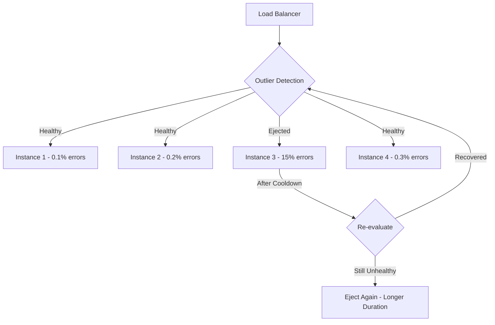

# How to Configure Outlier Detection to Automatically Eject Unhealthy Backends on Google Cloud

Author: [nawazdhandala](https://www.github.com/nawazdhandala)

Tags: GCP, Load Balancer, Outlier Detection, Backend Health, Reliability

Description: Learn how to configure outlier detection on Google Cloud Load Balancer to automatically eject unhealthy backend instances and improve service reliability.

---

Health checks tell you whether a backend instance is up or down, but they do not catch every type of failure. A backend can pass health checks while still serving errors to real traffic. Maybe it has a memory leak that causes intermittent 500 errors, or a flaky database connection that makes 10% of requests fail. Standard health checks will not catch these issues until the backend is completely broken. Outlier detection fills this gap by monitoring real traffic and automatically ejecting backends that are performing worse than their peers.

In this post, I will walk through how to configure outlier detection on Google Cloud's load balancer, explain the different detection methods, and show you how to tune the parameters for your workload.

## How Outlier Detection Works

Outlier detection tracks the error rate and response behavior of each individual backend instance. When an instance's error rate exceeds a threshold (either absolute or relative to its peers), the load balancer temporarily removes it from the rotation. After a cooldown period, it gets added back. If it fails again, the ejection time increases.



The key difference from health checks: outlier detection uses the actual traffic passing through the load balancer to determine health, not synthetic probes.

## Detection Methods

GCP supports several outlier detection methods:

1. **Consecutive errors**: Eject after N consecutive 5xx errors from a backend
2. **Success rate**: Eject backends whose success rate is below the mean minus a standard deviation threshold
3. **Consecutive gateway errors**: Eject after N consecutive gateway errors (502, 503, 504)

Each method has its strengths. Consecutive errors is simple and predictable. Success rate is more sophisticated and compares each backend against the group average.

## Step 1 - Configure Basic Consecutive Error Detection

The simplest configuration ejects backends after a specified number of consecutive errors.

```bash
# Configure outlier detection on a backend service
gcloud compute backend-services update my-api-backend \
    --global \
    --outlier-detection=\
consecutive-errors=5,\
interval=10s,\
base-ejection-time=30s,\
max-ejection-percent=50,\
enforcing-consecutive-errors=100
```

Here is what each parameter does:

- **consecutive-errors=5**: Eject after 5 consecutive 5xx errors from a single instance
- **interval=10s**: Check for outliers every 10 seconds
- **base-ejection-time=30s**: First ejection lasts 30 seconds. Subsequent ejections last longer (base * number of ejections)
- **max-ejection-percent=50**: Never eject more than 50% of backends. This prevents total loss of capacity.
- **enforcing-consecutive-errors=100**: Enforce this policy 100% of the time. You can set this lower for gradual rollout.

## Step 2 - Configure Success Rate Detection

Success rate detection is more nuanced. It ejects backends whose success rate is statistically worse than the group average.

```bash
gcloud compute backend-services update my-api-backend \
    --global \
    --outlier-detection=\
interval=10s,\
base-ejection-time=30s,\
max-ejection-percent=50,\
success-rate-minimum-hosts=3,\
success-rate-request-volume=100,\
success-rate-stdev-factor=1900,\
enforcing-success-rate=100
```

The success-rate specific parameters:

- **success-rate-minimum-hosts=3**: Need at least 3 hosts to compute meaningful statistics. If you have fewer, success rate detection is disabled.
- **success-rate-request-volume=100**: A host must have at least 100 requests in the interval to be evaluated. This prevents ejecting hosts with too little data.
- **success-rate-stdev-factor=1900**: The ejection threshold. A host is ejected if its success rate is below: `mean - (stdev_factor/1000 * standard_deviation)`. A factor of 1900 means 1.9 standard deviations below the mean.

For example, if the group average success rate is 99.5% with a standard deviation of 0.5%, a host with a success rate below `99.5 - (1.9 * 0.5) = 98.55%` would be ejected.

## Step 3 - Configure Gateway Error Detection

Gateway error detection specifically targets 502, 503, and 504 errors, which typically indicate infrastructure-level problems rather than application errors.

```bash
gcloud compute backend-services update my-api-backend \
    --global \
    --outlier-detection=\
consecutive-gateway-failure=3,\
interval=10s,\
base-ejection-time=60s,\
max-ejection-percent=30,\
enforcing-consecutive-gateway-failure=100
```

Gateway errors are usually more serious than application 500 errors, so you might want to eject faster (lower consecutive count) and for longer (higher base ejection time).

## Step 4 - Full Configuration via API

For the most control, use the REST API or a client library.

```python
from google.cloud import compute_v1

client = compute_v1.BackendServicesClient()

# Get the current backend service
backend = client.get(
    project="my-project",
    backend_service="my-api-backend"
)

# Configure comprehensive outlier detection
backend.outlier_detection = compute_v1.OutlierDetection(
    # Check every 10 seconds
    interval=compute_v1.Duration(seconds=10),

    # Base ejection time of 30 seconds, increases on repeated ejections
    base_ejection_time=compute_v1.Duration(seconds=30),

    # Never eject more than 50% of backends
    max_ejection_percent=50,

    # Consecutive error detection
    consecutive_errors=5,
    enforcing_consecutive_errors=100,

    # Consecutive gateway error detection
    consecutive_gateway_failure=3,
    enforcing_consecutive_gateway_failure=100,

    # Success rate detection
    success_rate_minimum_hosts=3,
    success_rate_request_volume=100,
    success_rate_stdev_factor=1900,
    enforcing_success_rate=100,
)

# Apply the update
operation = client.update(
    project="my-project",
    backend_service="my-api-backend",
    backend_service_resource=backend
)

print(f"Updated outlier detection: {operation.name}")
```

## Step 5 - Monitor Ejection Events

Track when backends are being ejected to understand the health of your infrastructure.

```bash
# Check backend health including outlier detection status
gcloud compute backend-services get-health my-api-backend \
    --global \
    --format=json
```

Set up monitoring queries to track ejection patterns:

```sql
-- Query Cloud Logging for outlier ejection events
-- These appear as load balancer logs with 503 status when all backends are ejected
SELECT
    timestamp,
    jsonPayload.statusDetails,
    resource.labels.backend_service_name,
    resource.labels.url_map_name,
    httpRequest.requestUrl
FROM
    `my_project.global._Default._AllLogs`
WHERE
    resource.type = "http_load_balancer"
    AND jsonPayload.statusDetails LIKE "%backend_connection_closed%"
    AND timestamp > TIMESTAMP_SUB(CURRENT_TIMESTAMP(), INTERVAL 1 HOUR)
ORDER BY timestamp DESC;
```

## Tuning Guidelines

Getting the right outlier detection parameters takes experimentation. Here are guidelines based on different workload types.

**For latency-sensitive APIs**:
```bash
# Aggressive detection - eject fast, recover fast
gcloud compute backend-services update latency-api-backend \
    --global \
    --outlier-detection=\
consecutive-errors=3,\
interval=5s,\
base-ejection-time=15s,\
max-ejection-percent=30,\
enforcing-consecutive-errors=100
```

**For batch processing backends**:
```bash
# Tolerant detection - allow for bursty errors
gcloud compute backend-services update batch-backend \
    --global \
    --outlier-detection=\
consecutive-errors=10,\
interval=30s,\
base-ejection-time=60s,\
max-ejection-percent=20,\
enforcing-consecutive-errors=100
```

**For multi-region deployments with few instances per region**:
```bash
# Conservative detection - avoid ejecting too many in small pools
gcloud compute backend-services update regional-backend \
    --global \
    --outlier-detection=\
consecutive-errors=10,\
interval=15s,\
base-ejection-time=30s,\
max-ejection-percent=20,\
success-rate-minimum-hosts=5,\
success-rate-request-volume=200,\
success-rate-stdev-factor=2500,\
enforcing-success-rate=50
```

## Common Pitfalls

**Setting max-ejection-percent too high**: If you allow 100% ejection, all backends can be removed, and every request fails. Always keep this at 50% or below.

**Too sensitive thresholds**: Setting consecutive-errors=1 will eject backends on any single error, including legitimate 500 responses from application logic. Start with 5 and adjust down only if needed.

**Forgetting about scale-in**: When your instance group scales in, the remaining instances get more traffic. If outlier detection ejects one of the remaining few, the others might get overloaded. Coordinate outlier detection thresholds with your autoscaling configuration.

**Not monitoring ejections**: If you do not track ejection events, you will not know when backends are being silently removed from rotation. This can mask underlying issues that need fixing.

## Wrapping Up

Outlier detection fills the gap between health checks and real traffic monitoring. It automatically removes backend instances that are degrading the user experience, and adds them back when they recover. The configuration is on the backend service, and you can use consecutive errors for simple cases or success rate detection for more sophisticated analysis. Start with conservative settings, monitor ejection patterns, and tighten thresholds as you gain confidence in your backends' behavior. Combined with circuit breaking, outlier detection gives you a solid foundation for backend reliability on GCP.
