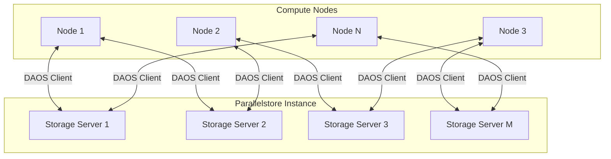

# How to Configure Parallelstore for Maximum Throughput in Large-Scale Scientific Simulations

Author: [nawazdhandala](https://www.github.com/nawazdhandala)

Tags: GCP, Parallelstore, HPC, Scientific Computing, High Throughput Storage

Description: Configure Google Cloud Parallelstore for maximum throughput in large-scale scientific simulations with optimal striping and client settings.

---

Scientific simulations generate and consume massive amounts of data. Weather models, fluid dynamics, genomics pipelines, and molecular simulations can produce terabytes of intermediate data that thousands of compute nodes need to read and write concurrently. Traditional storage solutions buckle under this kind of parallel I/O pressure.

Google Cloud Parallelstore is a high-performance parallel file system based on Intel DAOS, designed specifically for HPC workloads. It can deliver hundreds of gigabytes per second of throughput across thousands of clients. But getting maximum performance requires proper configuration of both the Parallelstore instance and the client-side mount options.

## Understanding Parallelstore Architecture

Parallelstore distributes data across multiple storage servers using a technique called striping. When a file is written, it is split into chunks (stripes) that are spread across different servers. When multiple clients read the same file, each client can pull different stripes from different servers simultaneously, dramatically increasing aggregate throughput.



## Creating a Parallelstore Instance

Create a Parallelstore instance sized for your workload. The capacity determines the available throughput.

```bash
# Create a Parallelstore instance
# Throughput scales with capacity: ~1 GB/s per 12 TiB for large sequential I/O
gcloud parallelstore instances create hpc-scratch \
  --location=us-central1-a \
  --capacity-gib=12000 \
  --network=projects/YOUR_PROJECT/global/networks/hpc-network \
  --description="Scratch storage for scientific simulations"
```

For larger workloads, scale the capacity to get more throughput.

```bash
# For a simulation requiring 100+ GB/s throughput
gcloud parallelstore instances create large-simulation-scratch \
  --location=us-central1-a \
  --capacity-gib=120000 \
  --network=projects/YOUR_PROJECT/global/networks/hpc-network \
  --description="Large-scale simulation scratch space"
```

Check the instance status and access information.

```bash
# Get the instance details including mount information
gcloud parallelstore instances describe hpc-scratch \
  --location=us-central1-a \
  --format="yaml(name, state, capacityGib, daosVersion, accessPoints, network)"
```

## Configuring Compute Nodes

Your compute nodes need the DAOS client library to mount Parallelstore. On GKE or Compute Engine, install the client packages.

```bash
# Install the DAOS client on a Compute Engine instance
# For Debian/Ubuntu-based images
sudo apt-get update
sudo apt-get install -y daos-client

# Configure the DAOS agent
sudo mkdir -p /etc/daos

# Write the agent configuration pointing to the Parallelstore access points
sudo tee /etc/daos/daos_agent.yml > /dev/null <<EOF
# DAOS agent configuration for Parallelstore
name: daos_agent
access_points:
  - ACCESS_POINT_1
  - ACCESS_POINT_2
  - ACCESS_POINT_3
port: 10001
transport_config:
  allow_insecure: true
log_file: /var/log/daos/daos_agent.log
control_log_file: /var/log/daos/daos_control.log
EOF

# Start the DAOS agent
sudo systemctl enable daos_agent
sudo systemctl start daos_agent
```

## Mounting Parallelstore with Optimal Settings

The mount options significantly affect performance. Use the DAOS FUSE client with settings tuned for your I/O pattern.

```bash
# Create the mount point
sudo mkdir -p /mnt/parallelstore

# Mount using dfuse with performance-optimized settings
# --pool: The Parallelstore pool UUID
# --container: The container UUID
# --multi-user: Allow all users to access the mount
# --thread-count: Number of FUSE threads (match to CPU count)
# --eq-count: Event queue count for parallel I/O

dfuse --mountpoint=/mnt/parallelstore \
  --pool=POOL_UUID \
  --container=CONTAINER_UUID \
  --multi-user \
  --thread-count=16 \
  --eq-count=8 \
  --disable-caching=false
```

For maximum throughput with large sequential I/O (common in simulations), tune the caching parameters.

```bash
# Mount with aggressive read-ahead for large sequential reads
dfuse --mountpoint=/mnt/parallelstore \
  --pool=POOL_UUID \
  --container=CONTAINER_UUID \
  --multi-user \
  --thread-count=$(nproc) \
  --eq-count=$(($(nproc) / 2)) \
  --disable-caching=false
```

## Optimizing Stripe Configuration

Striping configuration controls how files are distributed across storage servers. The right settings depend on your I/O pattern.

```python
# configure_striping.py - Set optimal striping for different workload types
import subprocess
import os

MOUNT_POINT = "/mnt/parallelstore"


def configure_directory_striping(directory, stripe_size, stripe_count):
    """Set striping parameters for a directory.

    All new files created in this directory will use these settings.

    Args:
        directory: Path to the directory
        stripe_size: Size of each stripe in bytes (e.g., 1MB, 4MB)
        stripe_count: Number of storage targets to stripe across (-1 for all)
    """
    os.makedirs(directory, exist_ok=True)

    # Use daos command to set container properties
    # For large sequential I/O, use larger stripes and more targets
    print(f"Setting stripe_size={stripe_size}, stripe_count={stripe_count}")
    print(f"Directory: {directory}")


def setup_simulation_directories():
    """Create directories with optimal striping for different data types."""

    # Checkpoint files: Large sequential writes, read back in full
    # Use large stripes across all servers for maximum bandwidth
    configure_directory_striping(
        f"{MOUNT_POINT}/checkpoints",
        stripe_size=4 * 1024 * 1024,  # 4 MB stripes
        stripe_count=-1,               # Stripe across all servers
    )

    # Input data: Read by many nodes simultaneously
    # Stripe widely for maximum parallel read throughput
    configure_directory_striping(
        f"{MOUNT_POINT}/input",
        stripe_size=1 * 1024 * 1024,  # 1 MB stripes
        stripe_count=-1,
    )

    # Output data: Written by many nodes, each writing their own files
    # Moderate striping since each file is accessed by one writer
    configure_directory_striping(
        f"{MOUNT_POINT}/output",
        stripe_size=1 * 1024 * 1024,
        stripe_count=4,  # Stripe across 4 servers per file
    )

    # Temporary scratch: Mixed I/O, small to medium files
    # Less aggressive striping to avoid metadata overhead
    configure_directory_striping(
        f"{MOUNT_POINT}/scratch",
        stripe_size=512 * 1024,  # 512 KB stripes
        stripe_count=2,
    )

    print("Directory striping configured for simulation workload")
```

## I/O Patterns and Performance Tuning

Different simulation phases have different I/O characteristics. Tune your configuration for the dominant pattern.

### Large Sequential I/O (Checkpointing)

Checkpointing writes the entire simulation state to disk periodically. This is a large sequential write followed by a large sequential read during restart.

```python
# checkpoint_io.py - Optimized checkpoint writing
import numpy as np
import os

def write_checkpoint(state_array, checkpoint_dir, rank):
    """Write a simulation checkpoint with optimized I/O.

    Use large write buffers to maximize throughput to Parallelstore.
    """
    filepath = os.path.join(checkpoint_dir, f"checkpoint_rank_{rank:06d}.bin")

    # Use a large buffer size for sequential writes
    # This aligns with the stripe size for optimal performance
    buffer_size = 4 * 1024 * 1024  # 4 MB to match stripe size

    with open(filepath, "wb", buffering=buffer_size) as f:
        # Write the array shape and dtype first
        header = np.array([state_array.shape[0], state_array.shape[1]], dtype=np.int64)
        f.write(header.tobytes())
        # Write the data in large contiguous blocks
        f.write(state_array.tobytes())

    return filepath


def read_checkpoint(checkpoint_dir, rank):
    """Read a simulation checkpoint with optimized I/O."""
    filepath = os.path.join(checkpoint_dir, f"checkpoint_rank_{rank:06d}.bin")

    buffer_size = 4 * 1024 * 1024

    with open(filepath, "rb", buffering=buffer_size) as f:
        # Read the header
        header = np.frombuffer(f.read(16), dtype=np.int64)
        shape = (header[0], header[1])
        # Read the data
        data = np.frombuffer(f.read(), dtype=np.float64).reshape(shape)

    return data
```

### Many Small Files (Post-Processing)

Some simulation phases generate many small files. For this pattern, reduce stripe count to avoid metadata overhead.

```bash
# For directories with many small files, use minimal striping
# Each file should ideally live on a single server to reduce metadata overhead
mkdir -p /mnt/parallelstore/postprocess
# Configure with stripe_count=1 for small files
```

### Parallel I/O with MPI-IO

For simulations using MPI, use collective I/O through MPI-IO for the best parallel performance.

```python
# mpi_io_example.py - MPI-IO with Parallelstore
from mpi4py import MPI
import numpy as np

comm = MPI.COMM_WORLD
rank = comm.Get_rank()
size = comm.Get_size()

# Each rank computes a portion of the result
local_data = np.random.random((1000, 1000))

# Write collectively using MPI-IO
# This allows the MPI library to coordinate I/O across all ranks
# for optimal striping alignment
filepath = "/mnt/parallelstore/output/collective_output.bin"

# Set MPI-IO hints for Parallelstore
info = MPI.Info.Create()
info.Set("striping_factor", "-1")        # Use all storage servers
info.Set("striping_unit", "4194304")     # 4 MB stripe size
info.Set("romio_cb_write", "enable")     # Enable collective buffering
info.Set("romio_ds_write", "enable")     # Enable data sieving

fh = MPI.File.Open(comm, filepath, MPI.MODE_CREATE | MPI.MODE_WRONLY, info)

# Each rank writes its portion at the correct offset
offset = rank * local_data.nbytes
fh.Write_at_all(offset, local_data)

fh.Close()

if rank == 0:
    print(f"Collective write complete: {size} ranks, {size * local_data.nbytes / 1e9:.2f} GB")
```

## Monitoring Parallelstore Performance

Track your storage performance to identify bottlenecks.

```bash
# Check Parallelstore instance metrics
gcloud monitoring time-series list \
  --filter='metric.type = starts_with("parallelstore.googleapis.com/")' \
  --format="table(metric.type, points.value)" \
  --limit=20

# Monitor from the client side using iostat
iostat -x 1 5

# Check DAOS client health
daos pool query POOL_UUID
```

## GKE Integration

For simulations running on GKE, use the Parallelstore CSI driver for automatic mounting.

```yaml
# parallelstore-pv.yaml - Persistent volume for Parallelstore on GKE
apiVersion: v1
kind: PersistentVolume
metadata:
  name: parallelstore-pv
spec:
  capacity:
    storage: 12000Gi
  accessModes:
    - ReadWriteMany  # Multiple pods can read and write simultaneously
  csi:
    driver: parallelstore.csi.storage.gke.io
    volumeHandle: projects/YOUR_PROJECT/locations/us-central1-a/instances/hpc-scratch
    volumeAttributes:
      ip: ACCESS_POINT_IP
---
apiVersion: v1
kind: PersistentVolumeClaim
metadata:
  name: parallelstore-pvc
spec:
  accessModes:
    - ReadWriteMany
  resources:
    requests:
      storage: 12000Gi
  volumeName: parallelstore-pv
  storageClassName: ""
```

Use the PVC in your simulation pods.

```yaml
# simulation-job.yaml - HPC job using Parallelstore
apiVersion: batch/v1
kind: Job
metadata:
  name: cfd-simulation
spec:
  parallelism: 64
  completions: 64
  template:
    spec:
      containers:
        - name: solver
          image: us-central1-docker.pkg.dev/YOUR_PROJECT/hpc/cfd-solver:latest
          resources:
            requests:
              cpu: "8"
              memory: "32Gi"
          volumeMounts:
            - name: scratch
              mountPath: /scratch
      volumes:
        - name: scratch
          persistentVolumeClaim:
            claimName: parallelstore-pvc
      restartPolicy: Never
```

## Performance Benchmarking

Before running your actual simulation, benchmark the storage to verify you are getting expected throughput.

```bash
# IOR benchmark for sequential I/O throughput
# Install IOR on your compute nodes first
mpirun -np 64 ior \
  -a POSIX \
  -t 4m \
  -b 1g \
  -o /mnt/parallelstore/benchmark/ior_test \
  -F \
  --posix.odirect \
  -e \
  -C \
  -Q 1

# MDTest benchmark for metadata performance (many small files)
mpirun -np 32 mdtest \
  -d /mnt/parallelstore/benchmark/mdtest \
  -n 10000 \
  -i 3 \
  -u
```

## Wrapping Up

Getting maximum throughput from Parallelstore requires attention to three areas: instance sizing to provide enough aggregate bandwidth, striping configuration to match your I/O patterns, and client-side tuning to keep the pipeline full. For large sequential workloads like checkpointing, use large stripes across all servers. For many small files, minimize striping to reduce metadata overhead. And for MPI-based parallel I/O, use collective operations with appropriate MPI-IO hints. The combination of proper configuration at each layer unlocks the full performance potential of Parallelstore for demanding scientific simulations.
