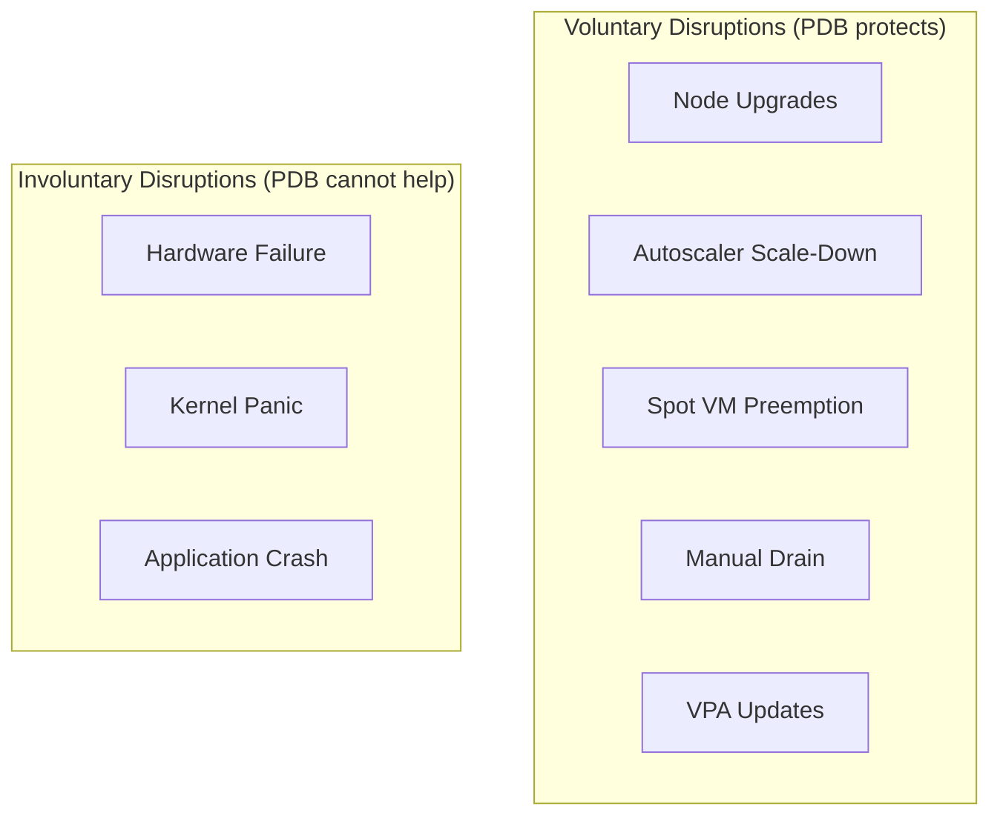
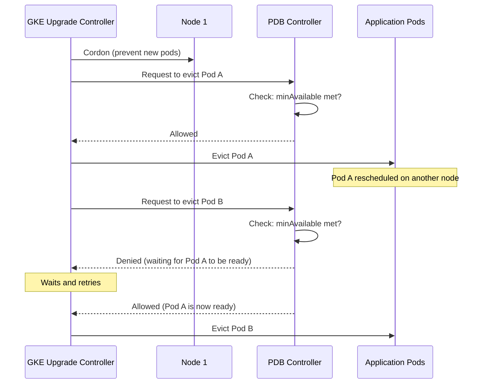

# How to Configure Pod Disruption Budgets in GKE to Maintain Availability During Upgrades

Author: [nawazdhandala](https://www.github.com/nawazdhandala)

Tags: GCP, GKE, Kubernetes, PDB, High Availability, Cluster Management

Description: A practical guide to configuring Pod Disruption Budgets in GKE to ensure your applications stay available during node upgrades, autoscaling events, and maintenance.

---

Kubernetes does not guarantee that your pods will not be terminated. Node upgrades, cluster autoscaler scale-downs, spot node preemptions, and manual maintenance all involve draining nodes and evicting pods. Without protection, all replicas of a service could be evicted simultaneously, causing an outage.

Pod Disruption Budgets (PDBs) are Kubernetes' answer to this. A PDB tells the system "you must keep at least N pods running at all times" or "you can disrupt at most N pods at a time." The eviction system respects these budgets, ensuring your application maintains availability through any voluntary disruption.

I consider PDBs a requirement for any production deployment on GKE. Let me show you how to configure them properly.

## What PDBs Protect Against

PDBs protect against voluntary disruptions - operations that can be delayed or throttled:

- Node pool upgrades
- Cluster autoscaler removing underutilized nodes
- Spot/preemptible node reclamation
- Manual `kubectl drain` operations
- VPA evicting pods to apply new resource requests

PDBs do NOT protect against involuntary disruptions:

- Node hardware failures
- Kernel crashes
- Pod crashes due to bugs



## Basic PDB: minAvailable

The simplest PDB specifies the minimum number of pods that must be available at all times.

```yaml
# pdb-min-available.yaml - At least 2 pods must be running at all times
apiVersion: policy/v1
kind: PodDisruptionBudget
metadata:
  name: web-app-pdb
  namespace: default
spec:
  minAvailable: 2
  selector:
    matchLabels:
      app: web-app
```

With this PDB and 3 replicas, Kubernetes will evict at most 1 pod at a time during voluntary disruptions. If only 2 pods are currently healthy, it will not evict any until a third pod becomes ready.

## Basic PDB: maxUnavailable

Alternatively, specify how many pods can be unavailable simultaneously.

```yaml
# pdb-max-unavailable.yaml - At most 1 pod can be unavailable at a time
apiVersion: policy/v1
kind: PodDisruptionBudget
metadata:
  name: web-app-pdb
  namespace: default
spec:
  maxUnavailable: 1
  selector:
    matchLabels:
      app: web-app
```

For most cases, `maxUnavailable` is easier to work with because it scales naturally. With `minAvailable: 2` and 5 replicas, you allow 3 simultaneous evictions. With `maxUnavailable: 1`, only 1 pod is evicted at a time regardless of replica count.

## Percentage-Based PDBs

You can use percentages instead of absolute numbers. This is useful when replica counts vary.

```yaml
# pdb-percentage.yaml - At least 80% of pods must be available
apiVersion: policy/v1
kind: PodDisruptionBudget
metadata:
  name: api-pdb
  namespace: default
spec:
  minAvailable: "80%"
  selector:
    matchLabels:
      app: api-service
```

With 10 replicas, this requires at least 8 pods to be available, allowing 2 simultaneous evictions. With 5 replicas, it requires 4 pods, allowing 1 eviction.

## PDB for StatefulSets

StatefulSets with ordered pod management need PDBs too, especially for databases and other stateful workloads.

```yaml
# pdb-statefulset.yaml - PDB for a database StatefulSet
apiVersion: policy/v1
kind: PodDisruptionBudget
metadata:
  name: postgres-pdb
  namespace: database
spec:
  # For a 3-node PostgreSQL cluster, ensure quorum (at least 2 of 3)
  maxUnavailable: 1
  selector:
    matchLabels:
      app: postgres
```

For databases, `maxUnavailable: 1` is almost always the right choice. You want exactly one node to be disrupted at a time to maintain quorum.

## How PDBs Interact with GKE Node Upgrades

When GKE upgrades node pools, it cordons and drains nodes one at a time (by default). The drain process evicts pods, and PDBs control how fast that happens.

Here is the timeline:



## Configuring GKE Surge Upgrades with PDBs

GKE surge upgrades create extra nodes before draining old ones, which works perfectly with PDBs.

```bash
# Configure surge upgrades on a node pool
gcloud container node-pools update default-pool \
  --cluster my-cluster \
  --region us-central1 \
  --max-surge-upgrade 2 \
  --max-unavailable-upgrade 0
```

With `--max-unavailable-upgrade 0`, GKE always creates new nodes before draining old ones. Combined with your PDB, this ensures zero-downtime upgrades.

## Real-World PDB Configuration

Here is a complete example for a typical microservices deployment.

```yaml
# Complete deployment with PDB
apiVersion: apps/v1
kind: Deployment
metadata:
  name: order-service
  namespace: production
spec:
  replicas: 4
  selector:
    matchLabels:
      app: order-service
  template:
    metadata:
      labels:
        app: order-service
    spec:
      # Spread pods across nodes for better fault tolerance
      topologySpreadConstraints:
        - maxSkew: 1
          topologyKey: kubernetes.io/hostname
          whenUnsatisfiable: DoNotSchedule
          labelSelector:
            matchLabels:
              app: order-service
      containers:
        - name: order-service
          image: order-service:v1.2.3
          ports:
            - containerPort: 8080
          # Readiness probe is critical - PDB counts only ready pods
          readinessProbe:
            httpGet:
              path: /healthz
              port: 8080
            initialDelaySeconds: 10
            periodSeconds: 5
          resources:
            requests:
              cpu: "250m"
              memory: "512Mi"
---
apiVersion: policy/v1
kind: PodDisruptionBudget
metadata:
  name: order-service-pdb
  namespace: production
spec:
  maxUnavailable: 1
  selector:
    matchLabels:
      app: order-service
```

## Common Mistakes

Some pitfalls I have seen teams fall into:

### Mistake 1: PDB with minAvailable equal to replicas

```yaml
# BAD: This blocks ALL voluntary disruptions
spec:
  minAvailable: 3  # Same as replica count
  selector:
    matchLabels:
      app: my-app
# With 3 replicas, no pod can ever be evicted
# Node upgrades will get stuck!
```

### Mistake 2: No readiness probe

PDBs count pods as available based on their readiness status. Without a readiness probe, a pod is considered ready as soon as its containers start, even if the application is not actually ready to serve traffic.

### Mistake 3: Mismatched selectors

```yaml
# BAD: Selector does not match the deployment's pods
spec:
  minAvailable: 2
  selector:
    matchLabels:
      app: my-app-typo  # Typo! Does not match any pods
# PDB has no effect because it selects zero pods
```

## Checking PDB Status

Monitor your PDBs to make sure they are configured correctly.

```bash
# List all PDBs and their status
kubectl get pdb --all-namespaces

# The output shows:
# NAME               MIN AVAILABLE   MAX UNAVAILABLE   ALLOWED DISRUPTIONS   AGE
# order-service-pdb  N/A             1                 3                     5d

# "ALLOWED DISRUPTIONS" shows how many pods can currently be evicted
# If this is 0, no voluntary disruptions can happen

# Get detailed status
kubectl describe pdb order-service-pdb
```

## PDBs for System Components

Do not forget about system components. If you run monitoring, logging, or other infrastructure services, they need PDBs too.

```yaml
# PDB for Prometheus
apiVersion: policy/v1
kind: PodDisruptionBudget
metadata:
  name: prometheus-pdb
  namespace: monitoring
spec:
  minAvailable: 1
  selector:
    matchLabels:
      app.kubernetes.io/name: prometheus
```

## Wrapping Up

Pod Disruption Budgets are one of those Kubernetes features that you do not appreciate until something goes wrong. A node upgrade without PDBs might evict all your replicas simultaneously, causing a brief outage. With PDBs, the same upgrade happens gracefully, one pod at a time, with replacement pods becoming ready before the next eviction happens. Create a PDB for every production deployment, set `maxUnavailable: 1` as a sensible default, and combine it with topology spread constraints and surge upgrades for truly zero-downtime operations on GKE.
