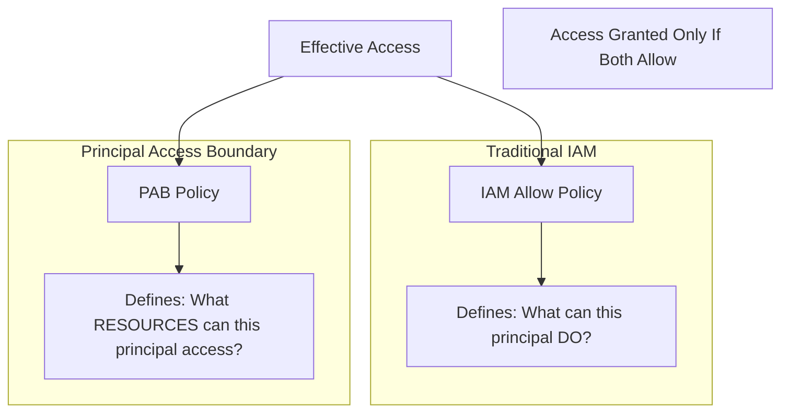

# How to Configure Principal Access Boundary Policies for Multi-Tenant GCP Environments

Author: [nawazdhandala](https://www.github.com/nawazdhandala)

Tags: GCP, Google Cloud, IAM, Principal Access Boundary, Multi-Tenant, Security, Access Control

Description: Learn how to configure Principal Access Boundary policies in Google Cloud to restrict what resources principals can access in multi-tenant environments.

---

In a multi-tenant GCP environment where different teams, business units, or customers share the same organization, you need strong boundaries between tenants. Traditional IAM controls which permissions a principal has, but Principal Access Boundary (PAB) policies add another dimension - they control which resources a principal is even allowed to access, regardless of what permissions they have been granted.

Think of it this way: IAM says "you can read Cloud Storage objects." PAB says "but only in these specific projects." Even if someone accidentally grants a tenant's service account access to another tenant's project, PAB blocks the access because that project is outside the principal's boundary.

## Understanding Principal Access Boundary

The difference between IAM allow/deny policies and PAB is subtle but important:



IAM allow policies are attached to resources and say "these principals can do these things here." PAB policies are attached to principals and say "this principal can only access resources in these boundaries." Both must permit the access for it to succeed.

## Prerequisites

- A Google Cloud organization
- Organization Administrator or IAM Admin role
- Multiple projects or folders representing different tenants
- The IAM API enabled

## Step 1: Plan Your Tenant Boundaries

Before creating PAB policies, map out which principals belong to which tenants and which resources each tenant should access:

```
Tenant A:
  - Principals: group:tenant-a-devs@example.com, sa:tenant-a-app@project-a.iam.gserviceaccount.com
  - Resources: projects/project-a-prod, projects/project-a-staging

Tenant B:
  - Principals: group:tenant-b-devs@example.com, sa:tenant-b-app@project-b.iam.gserviceaccount.com
  - Resources: projects/project-b-prod, projects/project-b-staging

Shared:
  - Resources: projects/shared-services (logging, monitoring)
  - Both tenants need read access
```

## Step 2: Create a Principal Access Boundary Policy

Create a PAB policy that defines the resource boundary for Tenant A:

```bash
# Create a PAB policy for Tenant A
# This defines the set of resources Tenant A principals can access
gcloud iam principal-access-boundary-policies create tenant-a-boundary \
    --organization=ORG_ID \
    --location=global \
    --display-name="Tenant A Resource Boundary" \
    --details-rules='[
      {
        "description": "Allow access to Tenant A projects",
        "resources": [
          "//cloudresourcemanager.googleapis.com/projects/project-a-prod",
          "//cloudresourcemanager.googleapis.com/projects/project-a-staging"
        ],
        "effect": "ALLOW"
      },
      {
        "description": "Allow access to shared services project",
        "resources": [
          "//cloudresourcemanager.googleapis.com/projects/shared-services"
        ],
        "effect": "ALLOW"
      }
    ]' \
    --details-enforcement-version="1"
```

Create a similar policy for Tenant B:

```bash
# Create a PAB policy for Tenant B
gcloud iam principal-access-boundary-policies create tenant-b-boundary \
    --organization=ORG_ID \
    --location=global \
    --display-name="Tenant B Resource Boundary" \
    --details-rules='[
      {
        "description": "Allow access to Tenant B projects",
        "resources": [
          "//cloudresourcemanager.googleapis.com/projects/project-b-prod",
          "//cloudresourcemanager.googleapis.com/projects/project-b-staging"
        ],
        "effect": "ALLOW"
      },
      {
        "description": "Allow access to shared services project",
        "resources": [
          "//cloudresourcemanager.googleapis.com/projects/shared-services"
        ],
        "effect": "ALLOW"
      }
    ]' \
    --details-enforcement-version="1"
```

## Step 3: Bind PAB Policies to Principals

Now bind the PAB policies to the principal sets that represent each tenant:

```bash
# Bind the Tenant A boundary to Tenant A's user group
gcloud iam principal-access-boundary-policies bindings create tenant-a-users-binding \
    --organization=ORG_ID \
    --location=global \
    --policy="organizations/ORG_ID/locations/global/principalAccessBoundaryPolicies/tenant-a-boundary" \
    --principal-set="//cloudidentity.googleapis.com/groups/TENANT_A_GROUP_ID" \
    --display-name="Bind Tenant A boundary to Tenant A users"

# Bind the Tenant A boundary to Tenant A's service accounts
gcloud iam principal-access-boundary-policies bindings create tenant-a-sa-binding \
    --organization=ORG_ID \
    --location=global \
    --policy="organizations/ORG_ID/locations/global/principalAccessBoundaryPolicies/tenant-a-boundary" \
    --principal-set="//iam.googleapis.com/projects/project-a-prod/serviceAccounts" \
    --display-name="Bind Tenant A boundary to project-a-prod service accounts"
```

Repeat for Tenant B:

```bash
# Bind the Tenant B boundary to Tenant B's user group
gcloud iam principal-access-boundary-policies bindings create tenant-b-users-binding \
    --organization=ORG_ID \
    --location=global \
    --policy="organizations/ORG_ID/locations/global/principalAccessBoundaryPolicies/tenant-b-boundary" \
    --principal-set="//cloudidentity.googleapis.com/groups/TENANT_B_GROUP_ID" \
    --display-name="Bind Tenant B boundary to Tenant B users"

# Bind to Tenant B service accounts
gcloud iam principal-access-boundary-policies bindings create tenant-b-sa-binding \
    --organization=ORG_ID \
    --location=global \
    --policy="organizations/ORG_ID/locations/global/principalAccessBoundaryPolicies/tenant-b-boundary" \
    --principal-set="//iam.googleapis.com/projects/project-b-prod/serviceAccounts" \
    --display-name="Bind Tenant B boundary to project-b-prod service accounts"
```

## Step 4: Verify the Boundaries

Test that the boundaries work correctly by attempting cross-tenant access:

```bash
# As a Tenant A user, try to access a Tenant A resource (should succeed)
gcloud storage ls gs://tenant-a-bucket/ \
    --project=project-a-prod
# Expected: Success

# As a Tenant A user, try to access a Tenant B resource (should fail)
gcloud storage ls gs://tenant-b-bucket/ \
    --project=project-b-prod
# Expected: Permission denied, even if IAM allows it

# As a Tenant A user, access shared services (should succeed)
gcloud logging read "resource.type=gce_instance" \
    --project=shared-services \
    --limit=5
# Expected: Success
```

## Step 5: Handle Shared Service Accounts

Some service accounts need to operate across tenant boundaries - for example, a centralized CI/CD service account or a monitoring service account. Create a broader PAB policy for these:

```bash
# Create a PAB policy for shared infrastructure service accounts
gcloud iam principal-access-boundary-policies create shared-infra-boundary \
    --organization=ORG_ID \
    --location=global \
    --display-name="Shared Infrastructure Boundary" \
    --details-rules='[
      {
        "description": "Allow access to all tenant projects for shared services",
        "resources": [
          "//cloudresourcemanager.googleapis.com/projects/project-a-prod",
          "//cloudresourcemanager.googleapis.com/projects/project-a-staging",
          "//cloudresourcemanager.googleapis.com/projects/project-b-prod",
          "//cloudresourcemanager.googleapis.com/projects/project-b-staging",
          "//cloudresourcemanager.googleapis.com/projects/shared-services"
        ],
        "effect": "ALLOW"
      }
    ]' \
    --details-enforcement-version="1"

# Bind to the shared infrastructure service accounts
gcloud iam principal-access-boundary-policies bindings create shared-infra-binding \
    --organization=ORG_ID \
    --location=global \
    --policy="organizations/ORG_ID/locations/global/principalAccessBoundaryPolicies/shared-infra-boundary" \
    --principal-set="//iam.googleapis.com/projects/shared-services/serviceAccounts" \
    --display-name="Bind shared infra boundary to shared service accounts"
```

## Step 6: Monitor PAB Policy Violations

Set up monitoring to track when PAB policies block access attempts:

```bash
# Search audit logs for PAB-related denials
gcloud logging read \
    'protoPayload.status.code=7 AND protoPayload.status.message:"principalAccessBoundary"' \
    --project=my-project \
    --limit=20 \
    --format="table(timestamp,protoPayload.authenticationInfo.principalEmail,protoPayload.methodName,protoPayload.resourceName)"
```

Create an alert for repeated PAB violations that might indicate a misconfiguration or an attack:

```bash
# Alert on PAB violations
gcloud monitoring policies create \
    --project=shared-services \
    --display-name="PAB Violation Alert" \
    --condition-display-name="Multiple PAB violations detected" \
    --condition-filter='resource.type="audited_resource" AND protoPayload.status.message:"principalAccessBoundary"' \
    --notification-channels=CHANNEL_ID
```

## Step 7: Automate PAB Policy Management

For organizations with many tenants, automate PAB policy creation with a script:

```python
# manage_pab_policies.py
# Automates PAB policy creation for new tenants

import subprocess
import json

def create_tenant_boundary(org_id, tenant_name, project_ids, shared_projects):
    """Create a PAB policy for a new tenant."""

    # Build the rules - tenant projects plus shared projects
    rules = []

    # Add tenant-specific projects
    tenant_resources = [
        f"//cloudresourcemanager.googleapis.com/projects/{pid}"
        for pid in project_ids
    ]
    rules.append({
        "description": f"Allow access to {tenant_name} projects",
        "resources": tenant_resources,
        "effect": "ALLOW"
    })

    # Add shared projects
    shared_resources = [
        f"//cloudresourcemanager.googleapis.com/projects/{pid}"
        for pid in shared_projects
    ]
    rules.append({
        "description": "Allow access to shared services",
        "resources": shared_resources,
        "effect": "ALLOW"
    })

    # Create the PAB policy using gcloud
    policy_id = f"{tenant_name}-boundary"
    rules_json = json.dumps(rules)

    subprocess.run([
        "gcloud", "iam", "principal-access-boundary-policies", "create",
        policy_id,
        f"--organization={org_id}",
        "--location=global",
        f"--display-name={tenant_name} Resource Boundary",
        f"--details-rules={rules_json}",
        "--details-enforcement-version=1"
    ], check=True)

    print(f"Created PAB policy: {policy_id}")
    return policy_id

# Example usage for onboarding a new tenant
create_tenant_boundary(
    org_id="123456789",
    tenant_name="tenant-c",
    project_ids=["project-c-prod", "project-c-staging"],
    shared_projects=["shared-services"]
)
```

## Best Practices

**Use folder-level resources in PAB rules**: Instead of listing individual projects, reference folders. When new projects are created under a tenant's folder, they are automatically within the boundary.

**Keep shared services minimal**: The more resources included in every tenant's boundary, the wider the potential blast radius. Only include truly shared services.

**Test in dry-run mode first**: Before enforcing PAB policies, run them in dry-run mode to identify any legitimate cross-tenant access that would be blocked.

**Combine with IAM deny policies**: PAB and deny policies complement each other. PAB restricts resource scope, deny policies restrict specific actions. Use both for defense in depth.

**Document tenant boundaries**: Maintain a registry of which tenants have access to which resources. This becomes critical for compliance audits and incident response.

## Summary

Principal Access Boundary policies add a resource-scope dimension to Google Cloud's access control that traditional IAM alone cannot provide. In multi-tenant environments, they ensure that even if IAM permissions are misconfigured, principals cannot access resources outside their designated boundary. The setup involves creating boundary policies for each tenant, binding them to the tenant's principals, and monitoring for violations. Combined with IAM allow policies, deny policies, and organization policies, PAB creates a robust multi-layered access control model that keeps tenants properly isolated.
