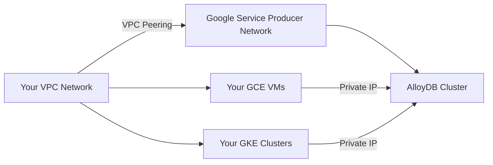

# How to Configure Private Service Access for AlloyDB Clusters

Author: [nawazdhandala](https://www.github.com/nawazdhandala)

Tags: GCP, AlloyDB, Private Service Access, VPC, Networking

Description: Learn how to set up Private Service Access for AlloyDB clusters so your database traffic stays on Google's private network and never traverses the public internet.

---

AlloyDB clusters do not get public IP addresses. Every AlloyDB instance communicates over private IP within your VPC network. This is great for security, but it means you need to configure Private Service Access (PSA) before you can create your first AlloyDB cluster. If you skip this step, cluster creation will fail with a networking error that can be confusing if you have not set up PSA before.

In this guide, I will walk through what Private Service Access is, how to configure it for AlloyDB, and how to troubleshoot common issues.

## What Is Private Service Access

Private Service Access is a VPC networking feature that creates a private connection between your VPC network and Google's service producer network. When you create an AlloyDB cluster, Google provisions the database instances in their own network and uses VPC peering to connect them to yours.

The flow looks like this:



The key thing to understand is that you need to allocate an IP address range from your VPC for Google to use. This range will be assigned to the peered network and used for AlloyDB instance IPs.

## Prerequisites

Before configuring PSA, make sure you have:

- A VPC network (custom mode recommended)
- The Service Networking API enabled
- Sufficient IP address space to allocate a range

Enable the required API:

```bash
# Enable the Service Networking API - required for Private Service Access
gcloud services enable servicenetworking.googleapis.com
```

## Step 1: Allocate an IP Address Range

You need to reserve a block of IP addresses that Google will use for AlloyDB and other managed services. The minimum recommended size is /20 (4,096 addresses), but /16 gives you plenty of room to grow.

```bash
# Allocate a /20 IP range for Google managed services
# This range must not overlap with any existing subnets in your VPC
gcloud compute addresses create google-managed-services-range \
  --global \
  --purpose=VPC_PEERING \
  --addresses=10.100.0.0 \
  --prefix-length=20 \
  --network=my-vpc \
  --description="IP range for Google managed services including AlloyDB"
```

A few important notes about the IP range:

- Choose a range that does not overlap with any existing subnets in your VPC or any networks you peer with.
- The range is used by all Google managed services in this VPC, not just AlloyDB. Cloud SQL, Memorystore, and other services share this pool.
- Once allocated, you cannot easily change the range. Plan ahead.

To verify the allocation:

```bash
# Verify the allocated IP range
gcloud compute addresses list \
  --global \
  --filter="purpose=VPC_PEERING AND network=my-vpc" \
  --format="table(name, address, prefixLength, status)"
```

## Step 2: Create the Private Service Connection

Now create the actual VPC peering connection to Google's service producer network:

```bash
# Create the private connection to Google's service network
# This establishes VPC peering with the allocated IP range
gcloud services vpc-peerings connect \
  --service=servicenetworking.googleapis.com \
  --ranges=google-managed-services-range \
  --network=my-vpc
```

This command can take a few minutes to complete. It creates a VPC peering connection between your network and Google's `servicenetworking` network.

Verify the connection:

```bash
# Check that the VPC peering is established
gcloud services vpc-peerings list \
  --network=my-vpc \
  --service=servicenetworking.googleapis.com
```

You should see the peering listed with the allocated range and status showing it is active.

## Step 3: Create Your AlloyDB Cluster

With PSA configured, you can now create AlloyDB clusters that use private IPs:

```bash
# Create an AlloyDB cluster - it will use the PSA connection automatically
gcloud alloydb clusters create my-cluster \
  --region=us-central1 \
  --network=projects/my-project/global/networks/my-vpc \
  --password=my-secure-password

# Create the primary instance
gcloud alloydb instances create my-primary \
  --cluster=my-cluster \
  --region=us-central1 \
  --instance-type=PRIMARY \
  --cpu-count=4
```

The primary instance will receive a private IP from the allocated range. You can find it with:

```bash
# Get the private IP address of the AlloyDB instance
gcloud alloydb instances describe my-primary \
  --cluster=my-cluster \
  --region=us-central1 \
  --format="value(ipAddress)"
```

## Connecting from Your Application

Since AlloyDB only exposes private IPs, your application must run within the same VPC (or a peered VPC) to connect. Here are common connectivity patterns.

### From a GCE VM in the Same VPC

This is the simplest case. Your VM can connect directly:

```bash
# From a VM in the same VPC, connect using the private IP
psql -h 10.100.0.2 -U postgres -d mydb
```

### From GKE

If your GKE cluster uses VPC-native networking (which it should), pods can reach AlloyDB directly:

```yaml
# Kubernetes deployment connecting to AlloyDB via private IP
apiVersion: apps/v1
kind: Deployment
metadata:
  name: my-app
spec:
  template:
    spec:
      containers:
      - name: app
        image: gcr.io/my-project/my-app:latest
        env:
        - name: DB_HOST
          value: "10.100.0.2"  # AlloyDB private IP
        - name: DB_NAME
          value: "mydb"
        - name: DB_USER
          valueFrom:
            secretKeyRef:
              name: db-credentials
              key: username
```

### From On-Premises via Cloud VPN or Interconnect

If you need to connect from on-premises, you need a Cloud VPN tunnel or Cloud Interconnect, plus a route that reaches the PSA range:

```bash
# Export custom routes to the peered network so on-prem traffic can reach AlloyDB
gcloud compute networks peerings update servicenetworking-googleapis-com \
  --network=my-vpc \
  --export-custom-routes \
  --import-custom-routes
```

## Adding More IP Ranges

If you run out of IP addresses in your initial allocation (common when running many managed services), you can add additional ranges:

```bash
# Allocate an additional IP range
gcloud compute addresses create google-managed-services-range-2 \
  --global \
  --purpose=VPC_PEERING \
  --addresses=10.101.0.0 \
  --prefix-length=20 \
  --network=my-vpc

# Update the peering connection to include the new range
gcloud services vpc-peerings update \
  --service=servicenetworking.googleapis.com \
  --ranges=google-managed-services-range,google-managed-services-range-2 \
  --network=my-vpc
```

## Troubleshooting Common Issues

### Cluster Creation Fails with Network Error

The most common error is trying to create an AlloyDB cluster before PSA is configured. The error usually mentions "Private services access connection" or "VPC peering." Go back and verify steps 1 and 2 completed successfully.

### Cannot Connect from VM

Check that the VM is in the same VPC network, or a network peered to it. Also verify there are no firewall rules blocking egress to the PSA range:

```bash
# Check if any firewall rules might be blocking traffic to the PSA range
gcloud compute firewall-rules list \
  --filter="network=my-vpc AND direction=EGRESS" \
  --format="table(name, direction, action, targetTags, destinationRanges)"
```

### Overlapping IP Ranges

If you get an error about overlapping ranges, your allocated PSA range conflicts with an existing subnet. List all subnets and peered ranges to find the conflict:

```bash
# List all subnets in the VPC to check for overlaps
gcloud compute networks subnets list \
  --network=my-vpc \
  --format="table(name, region, ipCidrRange)"
```

## Wrapping Up

Private Service Access is a prerequisite for AlloyDB, and getting it right from the start saves headaches down the road. The key decisions are choosing an IP range that is large enough and does not conflict with your existing network layout. Once configured, PSA provides a secure, private path between your workloads and AlloyDB without any traffic touching the public internet. Take the time to plan your IP allocation carefully - changing it later involves re-creating the peering connection, which can be disruptive.
