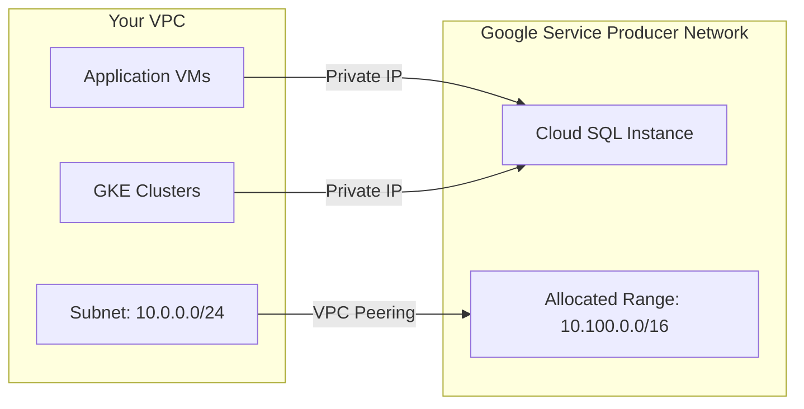

# How to Configure Private Service Access for Cloud SQL

Author: [nawazdhandala](https://www.github.com/nawazdhandala)

Tags: GCP, Cloud SQL, Private Service Access, VPC, Networking, Private IP

Description: A complete guide to configuring Private Service Access for Cloud SQL to enable private IP connectivity between your VPC and Google-managed database instances.

---

Private Service Access (PSA) is the networking foundation that enables Cloud SQL to have a private IP address on your VPC. Without it, Cloud SQL can only be accessed via public IP or the Auth Proxy over public endpoints. With PSA configured, your database gets an IP address on your network, and all traffic stays internal. This guide covers the setup in detail.

## What Private Service Access Does

Private Service Access creates a VPC peering connection between your VPC network and Google's service producer network. This peering allows Google-managed services like Cloud SQL to assign IP addresses from a range you allocate and communicate with resources in your VPC.



Key characteristics:

- Traffic between your VPC and Cloud SQL never leaves Google's network
- Cloud SQL gets an IP from the range you allocate
- The peering is managed by Google - you cannot modify it directly
- Multiple Google services (Cloud SQL, Memorystore, etc.) can share the same PSA configuration

## Prerequisites

You need:

- A VPC network (custom mode recommended for production)
- The Service Networking API enabled
- IAM permissions: `roles/compute.networkAdmin` and `roles/servicenetworking.networksAdmin`

```bash
# Enable the Service Networking API
gcloud services enable servicenetworking.googleapis.com
```

## Step 1: Plan Your IP Address Allocation

This is the most important step. The IP range you allocate:

- Must not overlap with any existing subnets in your VPC
- Must not overlap with any VPC peering ranges
- Should be large enough for current and future needs
- Cannot be changed after Cloud SQL instances are created in it

### Sizing Guidelines

Each Cloud SQL instance uses a small number of IPs from the allocated range. However, the allocated range also needs space for Google's internal infrastructure:

- **Minimum**: A `/24` (256 addresses) is the smallest recommended range
- **Recommended**: A `/20` (4,096 addresses) for medium deployments
- **Large deployments**: A `/16` (65,536 addresses) if you plan to have many instances

```bash
# Check what IP ranges are already in use in your VPC
gcloud compute networks subnets list \
    --network=my-vpc \
    --format="table(name, region, ipCidrRange)"

# Check existing peering ranges
gcloud compute addresses list --global --filter="purpose=VPC_PEERING"
```

Choose a range that does not conflict with any of these.

## Step 2: Allocate the IP Range

Allocate an IP address range for Google services:

```bash
# Allocate a /20 range for Google managed services
gcloud compute addresses create google-managed-services \
    --global \
    --purpose=VPC_PEERING \
    --addresses=10.100.0.0 \
    --prefix-length=20 \
    --network=my-vpc \
    --description="IP range for Google managed services (Cloud SQL, Memorystore, etc.)"
```

Verify the allocation:

```bash
# Verify the IP range was allocated
gcloud compute addresses describe google-managed-services \
    --global \
    --format="json(name, address, prefixLength, purpose, status, network)"
```

## Step 3: Create the Private Connection

Create the VPC peering connection between your network and Google's service producer network:

```bash
# Create the private service connection
gcloud services vpc-peerings connect \
    --service=servicenetworking.googleapis.com \
    --ranges=google-managed-services \
    --network=my-vpc
```

This operation can take 1-3 minutes. Check the status:

```bash
# Verify the peering connection
gcloud services vpc-peerings list --network=my-vpc

# Or check the VPC peering directly
gcloud compute networks peerings list --network=my-vpc
```

You should see a peering named something like `servicenetworking-googleapis-com`.

## Step 4: Verify the Configuration

Run a comprehensive check:

```bash
# Check the peering routes are imported
gcloud compute networks peerings list --network=my-vpc \
    --format="json(name, peerNetwork, importCustomRoutes, exportCustomRoutes, state)"
```

The state should be `ACTIVE`.

## Using Multiple IP Ranges

For larger deployments or when you need to separate IP ranges by service or region:

```bash
# Allocate a second IP range
gcloud compute addresses create google-services-eu \
    --global \
    --purpose=VPC_PEERING \
    --addresses=10.200.0.0 \
    --prefix-length=20 \
    --network=my-vpc

# Update the peering to include both ranges
gcloud services vpc-peerings update \
    --service=servicenetworking.googleapis.com \
    --ranges=google-managed-services,google-services-eu \
    --network=my-vpc
```

When creating a Cloud SQL instance, you can specify which range to use:

```bash
# Create an instance using a specific allocated range
gcloud sql instances create my-instance \
    --database-version=POSTGRES_15 \
    --tier=db-custom-4-16384 \
    --region=europe-west1 \
    --no-assign-ip \
    --network=projects/my-project/global/networks/my-vpc \
    --allocated-ip-range-name=google-services-eu
```

## Terraform Configuration

Here is the complete PSA setup in Terraform:

```hcl
# VPC Network
resource "google_compute_network" "vpc" {
  name                    = "my-vpc"
  auto_create_subnetworks = false
}

# Subnet for application resources
resource "google_compute_subnetwork" "app_subnet" {
  name          = "app-subnet"
  ip_cidr_range = "10.0.0.0/24"
  region        = "us-central1"
  network       = google_compute_network.vpc.id
}

# Allocate IP range for Private Service Access
resource "google_compute_global_address" "private_ip_range" {
  name          = "google-managed-services"
  purpose       = "VPC_PEERING"
  address_type  = "INTERNAL"
  prefix_length = 20
  address       = "10.100.0.0"
  network       = google_compute_network.vpc.id
}

# Create the private service connection
resource "google_service_networking_connection" "private_vpc_connection" {
  network                 = google_compute_network.vpc.id
  service                 = "servicenetworking.googleapis.com"
  reserved_peering_ranges = [google_compute_global_address.private_ip_range.name]
}

# Cloud SQL instance using private IP
resource "google_sql_database_instance" "main" {
  name             = "my-instance"
  database_version = "POSTGRES_15"
  region           = "us-central1"

  # Ensure the private connection is created first
  depends_on = [google_service_networking_connection.private_vpc_connection]

  settings {
    tier = "db-custom-4-16384"

    ip_configuration {
      ipv4_enabled                                  = false
      private_network                               = google_compute_network.vpc.id
      allocated_ip_range                            = google_compute_global_address.private_ip_range.name
      enable_private_path_for_google_cloud_services = true
    }
  }
}
```

The `depends_on` is crucial - without it, Terraform might try to create the Cloud SQL instance before the peering is ready.

## Route Export for On-Premises Connectivity

If you have Cloud VPN or Interconnect connecting on-premises to your VPC, you need to export the PSA routes so on-premises can reach Cloud SQL:

```bash
# Enable route export for the peering
gcloud compute networks peerings update servicenetworking-googleapis-com \
    --network=my-vpc \
    --export-custom-routes \
    --import-custom-routes
```

Without this, on-premises machines cannot reach Cloud SQL private IPs even if they have VPN connectivity to the VPC.

## Shared VPC Configuration

In a Shared VPC setup, PSA must be configured on the host project's VPC:

```bash
# All PSA operations happen on the host project's network
gcloud compute addresses create google-managed-services \
    --global \
    --purpose=VPC_PEERING \
    --addresses=10.100.0.0 \
    --prefix-length=20 \
    --network=projects/host-project/global/networks/shared-vpc \
    --project=host-project

gcloud services vpc-peerings connect \
    --service=servicenetworking.googleapis.com \
    --ranges=google-managed-services \
    --network=shared-vpc \
    --project=host-project
```

Service projects can then create Cloud SQL instances with private IP on the shared network:

```bash
# Create Cloud SQL in a service project using the host's VPC
gcloud sql instances create my-instance \
    --database-version=POSTGRES_15 \
    --tier=db-custom-4-16384 \
    --region=us-central1 \
    --no-assign-ip \
    --network=projects/host-project/global/networks/shared-vpc \
    --project=service-project
```

## DNS Configuration

Private IP instances are accessed by IP address. For easier management, set up Cloud DNS:

```bash
# Create a private DNS zone
gcloud dns managed-zones create db-internal \
    --dns-name=db.internal. \
    --visibility=private \
    --networks=my-vpc

# Add records for your Cloud SQL instances
gcloud dns record-sets create postgres-prod.db.internal. \
    --zone=db-internal \
    --type=A \
    --ttl=300 \
    --rrdatas=10.100.0.5

gcloud dns record-sets create postgres-staging.db.internal. \
    --zone=db-internal \
    --type=A \
    --ttl=300 \
    --rrdatas=10.100.0.10
```

## Troubleshooting PSA

### Cannot Create Cloud SQL with Private IP

```
Error: private service access not configured
```

Check that:

1. The IP range is allocated correctly:
```bash
gcloud compute addresses list --global --filter="purpose=VPC_PEERING"
```

2. The private connection exists:
```bash
gcloud services vpc-peerings list --network=my-vpc
```

3. The peering is active:
```bash
gcloud compute networks peerings list --network=my-vpc
```

### IP Range Exhaustion

If you run out of IPs in your allocated range:

```bash
# Allocate an additional range
gcloud compute addresses create google-services-extra \
    --global \
    --purpose=VPC_PEERING \
    --addresses=10.101.0.0 \
    --prefix-length=20 \
    --network=my-vpc

# Update the peering to include the new range
gcloud services vpc-peerings update \
    --service=servicenetworking.googleapis.com \
    --ranges=google-managed-services,google-services-extra \
    --network=my-vpc
```

### Connectivity Issues After Setup

If Cloud SQL has a private IP but you cannot connect:

```bash
# Verify the routes exist
gcloud compute routes list --filter="network=my-vpc AND destRange:10.100.0.0/20"

# Check firewall rules are not blocking egress
gcloud compute firewall-rules list \
    --filter="network=my-vpc AND direction=EGRESS" \
    --format="table(name, direction, action, destinationRanges)"

# Test connectivity from a VM in the VPC
gcloud compute ssh my-vm --command="nc -zv 10.100.0.5 5432"
```

## Summary

Private Service Access is the plumbing that enables private IP for Cloud SQL. The setup involves three steps: allocate an IP range, create the private connection, and then create Cloud SQL instances with `--no-assign-ip`. Plan your IP ranges carefully since they cannot be changed after instances are created. For Shared VPC environments, PSA is configured on the host project. Enable route export if you need on-premises connectivity to Cloud SQL via VPN or Interconnect.
