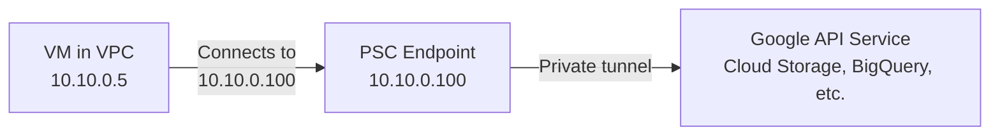

# How to Configure Private Service Connect Endpoints to Access Google APIs in GCP

Author: [nawazdhandala](https://www.github.com/nawazdhandala)

Tags: GCP, Private Service Connect, Google APIs, VPC, Networking

Description: Learn how to set up Private Service Connect endpoints to access Google APIs like Cloud Storage and BigQuery through private IP addresses within your VPC network.

---

Private Service Connect (PSC) for Google APIs gives you a private endpoint within your VPC that routes traffic to Google API services. Unlike Private Google Access, which uses Google's public API endpoints with special routing, PSC creates actual internal IP addresses in your VPC that map to Google APIs. This gives you more control over DNS, routing, and firewall rules for API traffic.

In this post, I will walk through setting up PSC endpoints for Google APIs, configuring DNS, and integrating with your existing network architecture.

## PSC vs. Private Google Access

Before diving into the setup, let me clarify how PSC differs from Private Google Access (PGA):

| Feature | Private Google Access | Private Service Connect |
|---------|----------------------|------------------------|
| Endpoint type | Google's public VIPs | Private IP in your VPC |
| DNS | Standard API domains | Custom or standard domains |
| IP control | No control | You choose the IP |
| Firewall rules | Hard to target (public ranges) | Easy to target (your VPC IP) |
| Per-service endpoints | No | Yes |
| Routing control | Limited | Full VPC routing |

PSC is the more advanced option. Use PGA for simple setups and PSC when you need fine-grained control.

## How PSC for Google APIs Works



When your VM sends traffic to the PSC endpoint IP (10.10.0.100 in this example), GCP routes it through a private tunnel to the Google API service. The traffic never touches the public internet and never uses Google's public IP addresses.

## Step 1: Reserve an Internal IP Address

Choose an IP address from your VPC subnet for the PSC endpoint:

```bash
# Reserve a static internal IP for the PSC endpoint
gcloud compute addresses create psc-google-apis-ip \
  --region=us-central1 \
  --subnet=production-subnet \
  --addresses=10.10.0.100 \
  --purpose=GCE_ENDPOINT
```

## Step 2: Create the PSC Endpoint

Create a forwarding rule that connects the reserved IP to the Google APIs service attachment:

```bash
# Create a PSC endpoint for all Google APIs
gcloud compute forwarding-rules create psc-google-apis \
  --region=us-central1 \
  --network=production-vpc \
  --subnet=production-subnet \
  --address=psc-google-apis-ip \
  --target-google-apis-bundle=all-apis \
  --load-balancing-scheme="" \
  --service-directory-registration=projects/my-project/locations/us-central1
```

The `--target-google-apis-bundle` flag accepts two values:
- `all-apis`: Access to all Google APIs (equivalent to `*.googleapis.com`)
- `vpc-sc`: Access only to APIs supported by VPC Service Controls (equivalent to the restricted VIP)

For most use cases, `all-apis` is what you want. Use `vpc-sc` if you have VPC Service Controls configured and want to enforce the service perimeter.

## Step 3: Verify the Endpoint

```bash
# Verify the PSC endpoint was created
gcloud compute forwarding-rules describe psc-google-apis \
  --region=us-central1 \
  --format="yaml(name, IPAddress, target, network)"
```

You should see the endpoint with your reserved IP address and the Google APIs target.

## Step 4: Configure DNS

For VMs to use the PSC endpoint, they need to resolve Google API domains to the PSC IP address. Create a private DNS zone:

```bash
# Create a private DNS zone for googleapis.com
gcloud dns managed-zones create psc-googleapis \
  --dns-name=googleapis.com. \
  --description="Route Google API traffic to PSC endpoint" \
  --visibility=private \
  --networks=production-vpc
```

Add DNS records that point API domains to the PSC endpoint IP:

```bash
# Create a wildcard CNAME for all Google APIs
gcloud dns record-sets create "*.googleapis.com." \
  --zone=psc-googleapis \
  --type=CNAME \
  --rrdatas="psc-endpoint.p.googleapis.com." \
  --ttl=300

# Create an A record for the PSC endpoint name
gcloud dns record-sets create "psc-endpoint.p.googleapis.com." \
  --zone=psc-googleapis \
  --type=A \
  --rrdatas="10.10.0.100" \
  --ttl=300
```

Alternatively, you can create A records for specific APIs:

```bash
# Create individual A records for each service you use
gcloud dns record-sets create "storage.googleapis.com." \
  --zone=psc-googleapis \
  --type=A \
  --rrdatas="10.10.0.100" \
  --ttl=300

gcloud dns record-sets create "bigquery.googleapis.com." \
  --zone=psc-googleapis \
  --type=A \
  --rrdatas="10.10.0.100" \
  --ttl=300

gcloud dns record-sets create "compute.googleapis.com." \
  --zone=psc-googleapis \
  --type=A \
  --rrdatas="10.10.0.100" \
  --ttl=300
```

## Step 5: Test the Endpoint

SSH into a VM and verify that DNS resolves to the PSC IP and API calls work:

```bash
# SSH into a test VM
gcloud compute ssh test-vm --zone=us-central1-a --tunnel-through-iap

# Verify DNS resolution points to the PSC endpoint
dig storage.googleapis.com
# Should return 10.10.0.100

# Test an API call through the PSC endpoint
curl -H "Authorization: Bearer $(gcloud auth print-access-token)" \
  "https://storage.googleapis.com/storage/v1/b?project=my-project"

# Test gsutil
gsutil ls gs://my-bucket/
```

## Setting Up PSC for On-Premises Access

If you have on-premises networks connected via VPN or Interconnect, they can also use the PSC endpoint. You need to:

1. Advertise the PSC endpoint IP through Cloud Router
2. Configure on-premises DNS to resolve Google API domains to the PSC IP

```bash
# Advertise the PSC endpoint IP from Cloud Router
gcloud compute routers update my-router \
  --region=us-central1 \
  --advertisement-mode=CUSTOM \
  --set-advertisement-ranges=10.10.0.100/32
```

On your on-premises DNS server, create conditional forwarders or override records for `*.googleapis.com` pointing to 10.10.0.100.

## Firewall Rules for PSC Traffic

One major advantage of PSC is that you can write firewall rules targeting the PSC endpoint IP:

```bash
# Allow egress only to the PSC endpoint for Google API access
gcloud compute firewall-rules create allow-egress-to-psc \
  --network=production-vpc \
  --direction=EGRESS \
  --action=ALLOW \
  --rules=tcp:443 \
  --destination-ranges=10.10.0.100/32 \
  --priority=1000 \
  --description="Allow HTTPS to Google APIs via PSC endpoint"
```

This is much cleaner than trying to allow traffic to Google's public IP ranges, which change frequently and span many CIDR blocks.

## Multiple PSC Endpoints

You can create separate endpoints for different API bundles or regions:

```bash
# Create a PSC endpoint for VPC-SC restricted APIs
gcloud compute addresses create psc-restricted-apis-ip \
  --region=us-central1 \
  --subnet=production-subnet \
  --addresses=10.10.0.101

gcloud compute forwarding-rules create psc-restricted-apis \
  --region=us-central1 \
  --network=production-vpc \
  --subnet=production-subnet \
  --address=psc-restricted-apis-ip \
  --target-google-apis-bundle=vpc-sc \
  --load-balancing-scheme=""
```

## Monitoring PSC Endpoints

Monitor PSC endpoint usage with Cloud Monitoring:

```bash
# View PSC metrics
gcloud monitoring metrics list \
  --filter='metric.type = starts_with("compute.googleapis.com/psc")'
```

You can also see PSC traffic in VPC Flow Logs. Since the traffic goes to a known internal IP, filtering flow logs for the PSC endpoint IP gives you a clear picture of Google API usage.

## Cleaning Up

To remove a PSC endpoint:

```bash
# Delete the forwarding rule
gcloud compute forwarding-rules delete psc-google-apis \
  --region=us-central1 --quiet

# Delete the reserved IP address
gcloud compute addresses delete psc-google-apis-ip \
  --region=us-central1 --quiet

# Delete the DNS zone (removes all records first)
gcloud dns record-sets delete "*.googleapis.com." \
  --zone=psc-googleapis --type=CNAME --quiet
gcloud dns managed-zones delete psc-googleapis --quiet
```

## Wrapping Up

Private Service Connect for Google APIs gives you enterprise-grade control over how your VPC traffic reaches Google services. The private endpoint IP makes firewall rules, routing, and monitoring straightforward - no more dealing with Google's public IP ranges. Combined with private DNS zones, your VMs seamlessly route API traffic through the PSC endpoint while using standard API client libraries and tools unchanged. If you are building a network architecture that needs tight control over data paths, PSC is the right choice over basic Private Google Access.
