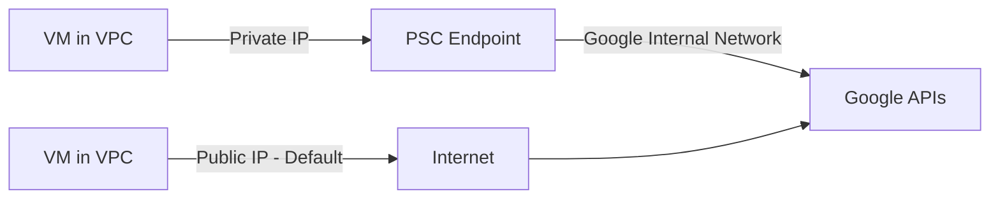

# How to Configure Private Service Connect for Consuming Google APIs Without Public Internet Access on GCP

Author: [nawazdhandala](https://www.github.com/nawazdhandala)

Tags: GCP, Private Service Connect, Networking, Security, VPC

Description: Step-by-step guide to configuring Private Service Connect on GCP so your workloads can consume Google APIs like BigQuery and Cloud Storage entirely over private networking.

---

When you call a Google API like BigQuery or Cloud Storage from a VM in your VPC, the traffic by default goes out to the public internet and back into Google's network. Even though the connection is encrypted with TLS, many organizations have compliance requirements that prohibit any traffic from touching the public internet. Private Service Connect (PSC) solves this by giving you a private endpoint inside your VPC that routes traffic directly to Google APIs over Google's internal backbone.

In this post, I will show you how to set up Private Service Connect for consuming Google APIs privately, step by step.

## How Private Service Connect Works

Private Service Connect creates a forwarding rule in your VPC that maps a private IP address to a Google API bundle. When your workloads send requests to this private IP (or a DNS name that resolves to it), the traffic stays entirely within Google's network - it never hits the public internet.



The top path shows PSC routing, while the bottom path shows the default behavior. With PSC, you get the private path with no public internet exposure.

## Prerequisites

Before you start, you need:

- A GCP project with billing enabled
- A VPC network with at least one subnet
- The Compute Engine API and Service Networking API enabled
- Sufficient IAM permissions (roles/compute.networkAdmin at minimum)

```bash
# Enable required APIs
gcloud services enable compute.googleapis.com
gcloud services enable servicenetworking.googleapis.com
gcloud services enable dns.googleapis.com
```

## Step 1 - Reserve a Static Internal IP Address

PSC needs a static internal IP address in your VPC to serve as the endpoint. This is the address your workloads will connect to.

```bash
# Reserve an internal IP address in your subnet for the PSC endpoint
gcloud compute addresses create psc-google-apis-ip \
    --region=us-central1 \
    --subnet=my-subnet \
    --addresses=10.0.1.100 \
    --purpose=GCE_ENDPOINT
```

Pick an IP address that is not already in use in your subnet. I am using 10.0.1.100 in this example, but you should choose one that fits your IP allocation scheme.

## Step 2 - Create the Forwarding Rule

The forwarding rule connects your internal IP to the Google APIs bundle. Google offers two bundles: `all-apis` (all supported Google APIs) and `vpc-sc` (APIs that support VPC Service Controls).

```bash
# Create a forwarding rule that maps the internal IP to all Google APIs
gcloud compute forwarding-rules create psc-google-apis \
    --region=us-central1 \
    --network=my-vpc \
    --address=psc-google-apis-ip \
    --target-google-apis-bundle=all-apis \
    --service-directory-registration=projects/my-project/locations/us-central1
```

If you are using VPC Service Controls and want to enforce that only VPC-SC compatible APIs are reachable, use `vpc-sc` instead of `all-apis` for the target bundle.

## Step 3 - Configure DNS to Route API Calls to the PSC Endpoint

By default, DNS for Google APIs (like storage.googleapis.com) resolves to public IP addresses. You need to create a private DNS zone that overrides these records to point at your PSC endpoint.

```bash
# Create a private DNS zone for googleapis.com
gcloud dns managed-zones create googleapis-psc \
    --dns-name="googleapis.com." \
    --visibility=private \
    --networks=my-vpc \
    --description="Private zone for routing Google APIs through PSC"

# Add a CNAME record that points all googleapis.com subdomains to the PSC endpoint
gcloud dns record-sets create "*.googleapis.com." \
    --zone=googleapis-psc \
    --type=CNAME \
    --ttl=300 \
    --rrdatas="psc-google-apis.p.googleapis.com."
```

You also need an A record for the PSC endpoint hostname:

```bash
# Create a DNS zone for the PSC endpoint resolution
gcloud dns managed-zones create psc-endpoint-zone \
    --dns-name="p.googleapis.com." \
    --visibility=private \
    --networks=my-vpc \
    --description="DNS zone for PSC endpoint hostname"

# Map the PSC endpoint hostname to the reserved internal IP
gcloud dns record-sets create "psc-google-apis.p.googleapis.com." \
    --zone=psc-endpoint-zone \
    --type=A \
    --ttl=300 \
    --rrdatas="10.0.1.100"
```

With these DNS records in place, any request to a Google API (like storage.googleapis.com) from a VM in your VPC will resolve to your internal PSC IP address.

## Step 4 - Verify the Setup

SSH into a VM in your VPC and verify that DNS resolution is working correctly.

```bash
# Check that googleapis.com resolves to your private IP
nslookup storage.googleapis.com

# You should see something like:
# Name: storage.googleapis.com
# Address: 10.0.1.100

# Test that you can actually reach Cloud Storage through the private endpoint
gsutil ls gs://my-bucket/
```

If nslookup still shows a public IP, wait a few minutes for DNS propagation, or check that the VM is in the correct VPC network.

## Step 5 - Configure Firewall Rules

Make sure your firewall rules allow traffic from your VMs to the PSC endpoint IP address.

```bash
# Allow egress to the PSC endpoint (if you have restrictive egress rules)
gcloud compute firewall-rules create allow-psc-egress \
    --network=my-vpc \
    --direction=EGRESS \
    --action=ALLOW \
    --rules=tcp:443 \
    --destination-ranges=10.0.1.100/32 \
    --priority=100
```

If your VPC has the default allow-all egress rule, you can skip this step. But in hardened environments where egress is denied by default, this rule is required.

## Handling Multiple Regions

If you have workloads in multiple regions, you can create PSC endpoints in each region. Each region gets its own forwarding rule and IP address. The DNS configuration remains the same - you just add multiple A records or use a routing policy.

```bash
# Create a PSC endpoint in a second region
gcloud compute addresses create psc-google-apis-ip-europe \
    --region=europe-west1 \
    --subnet=my-subnet-europe \
    --addresses=10.1.1.100 \
    --purpose=GCE_ENDPOINT

gcloud compute forwarding-rules create psc-google-apis-europe \
    --region=europe-west1 \
    --network=my-vpc \
    --address=psc-google-apis-ip-europe \
    --target-google-apis-bundle=all-apis
```

For multi-region DNS routing, consider using Cloud DNS routing policies to direct traffic to the nearest PSC endpoint.

## Using PSC with Shared VPC

In Shared VPC environments, the PSC endpoint must be created in the host project since the VPC lives there. Service projects that use the shared VPC will automatically be able to reach the PSC endpoint through the shared subnets.

```bash
# Create the PSC endpoint in the host project
gcloud compute forwarding-rules create psc-google-apis \
    --project=host-project-id \
    --region=us-central1 \
    --network=shared-vpc \
    --address=psc-google-apis-ip \
    --target-google-apis-bundle=all-apis
```

The DNS zone also needs to be in the host project and attached to the shared VPC network.

## Monitoring PSC Connections

You can monitor traffic flowing through your PSC endpoint using VPC Flow Logs and Cloud Monitoring.

```bash
# Check the status of your PSC forwarding rule
gcloud compute forwarding-rules describe psc-google-apis \
    --region=us-central1

# List all PSC endpoints in your project
gcloud compute forwarding-rules list \
    --filter="target~'googleapis'"
```

In Cloud Monitoring, you can create dashboards that track bytes sent and received through the PSC endpoint, which helps with capacity planning and detecting anomalies.

## Common Pitfalls

There are a few things that can trip you up with PSC:

- **DNS propagation delays**: After creating DNS records, it can take a few minutes for VMs to pick up the new resolution. If you are testing immediately, flush the DNS cache or restart the VM.
- **Forgetting the CNAME wildcard**: If you only create an A record for one specific API (like storage.googleapis.com), other APIs will still route through the public internet. The wildcard CNAME ensures all APIs are covered.
- **VPC Service Controls conflicts**: If you are using VPC-SC, make sure the PSC bundle matches your perimeter configuration. Using the `all-apis` bundle when you have VPC-SC enabled can cause unexpected access denials.
- **IP address exhaustion**: Each PSC endpoint consumes one IP address from your subnet. Plan your IP addressing accordingly, especially if you have endpoints in many regions.

## Wrapping Up

Private Service Connect gives you a clean way to keep all your Google API traffic on Google's private network. The setup involves reserving an IP, creating a forwarding rule, and configuring DNS - once it is done, all your workloads automatically use the private path without any code changes. For organizations with strict compliance requirements around data exfiltration and network isolation, PSC is essentially a must-have. Combined with VPC Service Controls, it provides a strong security boundary around your Google Cloud resources.
