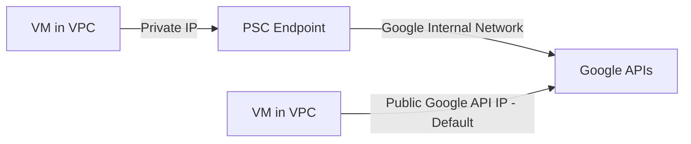

# How to Configure Private Service Connect for Consuming Google APIs Without

Author: [nawazdhandala](https://www.github.com/nawazdhandala)

Tags: GCP, Private Service Connect, Networking, Security, VPC

Description: Step-by-step guide to configuring Private Service Connect on GCP so your workloads can consume Google APIs like BigQuery and Cloud Storage entirely over private networking.

---

When you call a Google API like BigQuery or Cloud Storage from a VM in your VPC, the default DNS name resolves to publicly routable Google API IP addresses. Traffic from Google Cloud resources to those IP addresses stays within Google's network and is encrypted with TLS, but many organizations have compliance requirements that prefer privately addressed endpoints. Private Service Connect (PSC) solves this by giving you a private endpoint inside your VPC that routes traffic directly to Google APIs over Google's internal backbone.

In this post, I will show you how to set up Private Service Connect for consuming Google APIs privately, step by step.

## How Private Service Connect Works

Private Service Connect creates a global forwarding rule in your VPC that maps a private IP address to a Google API bundle. When your workloads send requests to this private IP (or a DNS name that resolves to it), the traffic stays entirely within Google's network and uses an internal address in your VPC.


```mermaid
flowchart LR
    A[VM in VPC] -->|Private IP| B[PSC Endpoint]
    B -->|Google Internal Network| C[Google APIs]
    D[VM in VPC] -->|Public Google API IP - Default| C
```

The top path shows PSC routing, while the bottom path shows the default behavior. With PSC, you get the private endpoint path with an internal IP address.

## Prerequisites

Before you start, you need:

- A GCP project with billing enabled
- A VPC network and a VM or workload that will call Google APIs
- Private Google Access enabled on the subnet if the VM has no external IP address
- The Compute Engine API, Service Directory API, and Cloud DNS API enabled
- Sufficient IAM permissions, including roles/compute.networkAdmin, roles/servicedirectory.editor, and roles/dns.admin

```bash
# Enable required APIs

gcloud services enable compute.googleapis.com
gcloud services enable servicedirectory.googleapis.com
gcloud services enable dns.googleapis.com
```

## Step 1 - Reserve a Static Internal IP Address

PSC needs a static global internal IP address in your VPC to serve as the endpoint. This is the address your workloads will connect to.

```bash
# Reserve a global internal IP address for the PSC endpoint
gcloud compute addresses create psc-google-apis-ip \
    --global \
    --purpose=PRIVATE_SERVICE_CONNECT \
    --addresses=10.3.0.5 \
    --network=my-vpc
```

Pick a single IPv4 address that is not already in use and is not inside any primary or secondary subnet range in your VPC. I am using 10.3.0.5 in this example, but you should choose one that fits your IP allocation scheme.

## Step 2 - Create the Forwarding Rule

The global forwarding rule connects your internal IP to the Google APIs bundle. Google offers two bundles: `all-apis` (most Google APIs, including all `*.googleapis.com` service endpoints) and `vpc-sc` (APIs that support VPC Service Controls).

```bash
# Create a forwarding rule that maps the internal IP to all Google APIs
gcloud compute forwarding-rules create psc-google-apis \
    --global \
    --network=my-vpc \
    --address=psc-google-apis-ip \
    --target-google-apis-bundle=all-apis \
    --service-directory-registration=projects/my-project/locations/us-central1
```

If you are using VPC Service Controls and want to enforce that only VPC-SC compatible APIs are reachable, use `vpc-sc` instead of `all-apis` for the target bundle.

## Step 3 - Configure DNS to Route API Calls to the PSC Endpoint

By default, DNS for Google APIs (like storage.googleapis.com) resolves to publicly routable Google API IP addresses. If your applications cannot use the automatically created `p.googleapis.com` names, create a private DNS zone that overrides the default names to point at your PSC endpoint.

```bash
# Create a private DNS zone for googleapis.com
gcloud dns managed-zones create googleapis-psc \
    --dns-name="googleapis.com." \
    --visibility=private \
    --networks=my-vpc \
    --description="Private zone for routing Google APIs through PSC"

# Add an A record for the zone apex that points to the PSC endpoint IP
gcloud dns record-sets create "googleapis.com." \
    --zone=googleapis-psc \
    --type=A \
    --ttl=300 \
    --rrdatas="10.3.0.5"

# Add a CNAME record that points all googleapis.com subdomains to the zone apex
gcloud dns record-sets create "*.googleapis.com." \
    --zone=googleapis-psc \
    --type=CNAME \
    --ttl=300 \
    --rrdatas="googleapis.com."
```

With these DNS records in place, any request to a Google API (like storage.googleapis.com) from a VM in your VPC will resolve to your internal PSC IP address.

## Step 4 - Verify the Setup

SSH into a VM in your VPC and verify that DNS resolution is working correctly.

```bash
# Check that storage.googleapis.com resolves to your private IP
nslookup storage.googleapis.com

# You should see something like:
# Name: storage.googleapis.com
# Address: 10.3.0.5

# Test that you can actually reach Cloud Storage through the private endpoint
gsutil ls gs://my-bucket/
```

If nslookup still shows a public IP, wait a few minutes for DNS propagation, or check that the VM is in the correct VPC network.

## Step 5 - Configure Firewall Rules

Make sure your firewall rules allow traffic from your VMs to the PSC endpoint IP address.

```bash
# Allow egress to the PSC endpoint (if you have restrictive egress rules)
gcloud compute firewall-rules create allow-psc-egress \
    --network=my-vpc \
    --direction=EGRESS \
    --action=ALLOW \
    --rules=tcp:443 \
    --destination-ranges=10.3.0.5/32 \
    --priority=100
```

If your VPC has the default allow-all egress rule, you can skip this step. But in hardened environments where egress is denied by default, this rule is required.

## Handling Multiple Regions

Endpoints for global Google APIs are global resources, so a single endpoint is reachable from workloads in any region in the VPC. You can still create multiple endpoints in the same VPC if you want different firewall controls, routing, or API bundles. Each endpoint gets its own global forwarding rule and IP address.

```bash
# Create a second PSC endpoint in the same VPC
gcloud compute addresses create psc-google-apis-ip-secondary \
    --global \
    --purpose=PRIVATE_SERVICE_CONNECT \
    --addresses=10.3.0.6 \
    --network=my-vpc

gcloud compute forwarding-rules create psc-google-apis-secondary \
    --global \
    --network=my-vpc \
    --address=psc-google-apis-ip-secondary \
    --target-google-apis-bundle=all-apis
```

If you use multiple endpoints, use DNS records or application configuration to direct specific workloads to the endpoint you want them to use.

## Using PSC with Shared VPC

In Shared VPC environments, you can create the PSC endpoint in the host project where the VPC is managed. Service projects that use the shared VPC will be able to reach the PSC endpoint through the shared network.

```bash
# Create the PSC endpoint in the host project
gcloud compute forwarding-rules create psc-google-apis \
    --project=host-project-id \
    --global \
    --network=shared-vpc \
    --address=psc-google-apis-ip \
    --target-google-apis-bundle=all-apis
```

The DNS zone also needs to be in the host project and attached to the shared VPC network.

## Monitoring PSC Connections

You can monitor traffic flowing through your PSC endpoint using VPC Flow Logs.

```bash
# Check the status of your PSC forwarding rule
gcloud compute forwarding-rules describe psc-google-apis \
    --global

# List all PSC endpoints in your project
gcloud compute forwarding-rules list \
    --filter='target="(all-apis OR vpc-sc)"' \
    --global
```

VPC Flow Logs annotate VM-to-Google API traffic that goes through a Private Service Connect endpoint, which helps with troubleshooting and detecting anomalies.

## Common Pitfalls

There are a few things that can trip you up with PSC:

- **DNS propagation delays**: After creating DNS records, it can take a few minutes for VMs to pick up the new resolution. If you are testing immediately, flush the DNS cache or restart the VM.
- **Forgetting the wildcard CNAME**: If you only create an A record for one specific API (like storage.googleapis.com), other APIs will still use their default DNS resolution. The wildcard CNAME ensures all `*.googleapis.com` names are covered.
- **VPC Service Controls conflicts**: If you are using VPC-SC, make sure the PSC bundle matches your perimeter configuration. Using the `all-apis` bundle when you have VPC-SC enabled can cause unexpected access denials.
- **IP address planning**: Each PSC endpoint consumes one global internal IP address from the VPC, and that address cannot be inside a subnet range. Plan your IP addressing accordingly, especially if you have multiple endpoints.

## Wrapping Up

Private Service Connect gives you a clean way to send Google API traffic through private endpoints in your VPC. The setup involves reserving an IP, creating a forwarding rule, and configuring DNS - once it is done, all your workloads automatically use the private endpoint path without any code changes. For organizations with strict compliance requirements around data exfiltration and network isolation, PSC is essentially a must-have. Combined with VPC Service Controls, it provides a strong security boundary around your Google Cloud resources.
