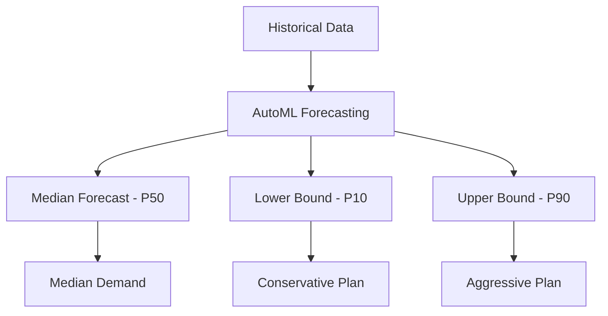

# How to Configure Probabilistic Inference for AutoML Tabular Forecasting

Author: [nawazdhandala](https://www.github.com/nawazdhandala)

Tags: GCP, Vertex AI, AutoML, Forecasting, Probabilistic Inference, Machine Learning, Google Cloud

Description: Configure probabilistic inference for AutoML Tabular Forecasting on Vertex AI to get prediction intervals and quantile estimates for better decision-making.

---

Point forecasts tell you what is most likely to happen. Probabilistic forecasts tell you the range of what could happen and how likely each outcome is. When you are making supply chain decisions, capacity planning, or financial projections, that range matters more than the single best guess. Vertex AI AutoML Forecasting supports probabilistic inference, giving you prediction intervals and quantile estimates alongside the standard point predictions. Here is how to configure it.

## Why Probabilistic Forecasting Matters

Consider a demand forecast that predicts 1,000 units. Is that plus or minus 50 units or plus or minus 500? The right inventory decision depends entirely on the uncertainty range. Probabilistic forecasting gives you:

- **Prediction intervals**: The range where actual values will fall with a given probability (e.g., 80% or 95%)
- **Quantile estimates**: Specific percentile predictions (e.g., P10, P50, P90)
- **Risk quantification**: The ability to plan for worst-case and best-case scenarios


```mermaid
graph TD
    A[Historical Data] --> B[AutoML Forecasting]
    B --> C[Median Forecast - P50]
    B --> D[Lower Bound - P10]
    B --> E[Upper Bound - P90]
    C --> F[Median Demand]
    D --> G[Conservative Plan]
    E --> H[Aggressive Plan]
```

## Step 1: Prepare Data for Forecasting

The data preparation is the same as for standard forecasting, but you should pay extra attention to capturing the variability in your historical data:

```python
import pandas as pd
from google.cloud import bigquery

bq_client = bigquery.Client(project="your-project-id")

# Query data with enough history to capture variability patterns

query = """
WITH daily_sales AS (
    SELECT
        sku_id,
        DATE(sale_date) AS date,
        SUM(units_sold) AS demand,
        AVG(unit_price) AS price,
        MAX(IF(promo_type IS NOT NULL, 1, 0)) AS is_promotion
    FROM `your-project.sales.transactions`
    WHERE sale_date >= '2023-01-01'
    GROUP BY sku_id, DATE(sale_date)
)
SELECT
    sku_id,
    date,
    demand,
    price,
    is_promotion,
    -- Include variance indicators when available
    STDDEV(demand) OVER (
        PARTITION BY sku_id
        ORDER BY date
        ROWS BETWEEN 7 PRECEDING AND CURRENT ROW
    ) AS rolling_demand_stddev
FROM daily_sales
ORDER BY sku_id, date
"""

df = bq_client.query(query).to_dataframe()

# Upload to BigQuery
df.to_gbq(
    destination_table="forecasting.probabilistic_training_data",
    project_id="your-project-id",
    if_exists="replace"
)

print(f"Prepared {len(df)} rows covering {df['sku_id'].nunique()} SKUs")
```

## Step 2: Train with Probabilistic Inference

Configure AutoML Forecasting to return a predictive distribution and the quantiles you need:

```python
from google.cloud import aiplatform

aiplatform.init(project="your-project-id", location="us-central1")

# Create the dataset
dataset = aiplatform.TimeSeriesDataset.create(
    display_name="probabilistic-forecast-dataset",
    bq_source="bq://your-project.forecasting.probabilistic_training_data",
)

# Configure the training job.
# Probabilistic inference cannot be combined with minimize-quantile-loss.
job = aiplatform.AutoMLForecastingTrainingJob(
    display_name="probabilistic-forecast-model",
    optimization_objective="minimize-rmse",
    column_specs={
        "date": "timestamp",
        "sku_id": "categorical",
        "price": "numeric",
        "is_promotion": "categorical",
        "rolling_demand_stddev": "numeric",
    },
)

# Specify which quantiles you want the model to predict
# Common choices: P10, P50 (median), P90 for decision-making
model = job.run(
    dataset=dataset,
    target_column="demand",
    time_column="date",
    time_series_identifier_column="sku_id",
    forecast_horizon=28,          # 4-week forecast
    data_granularity_unit="day",
    data_granularity_count=1,
    context_window=90,            # 3 months of lookback
    available_at_forecast_columns=["is_promotion"],
    unavailable_at_forecast_columns=["price", "rolling_demand_stddev"],
    enable_probabilistic_inference=True,
    quantiles=[0.1, 0.25, 0.5, 0.75, 0.9],  # Predict these quantiles
    budget_milli_node_hours=2000,
    model_display_name="probabilistic-forecast-v1",
)

print(f"Model trained: {model.resource_name}")
```

The `enable_probabilistic_inference` parameter tells Vertex AI to model the predictive distribution, and the `quantiles` parameter tells it which percentile estimates to return. Each quantile represents a percentile:

- **0.1 (P10)**: 10% chance actual demand is below this value
- **0.5 (P50)**: The median prediction, which is a useful central forecast
- **0.9 (P90)**: 90% chance actual demand is below this value

## Step 3: Generate Probabilistic Predictions

Run batch predictions to get quantile estimates:

```python
# Generate predictions with quantile outputs
batch_job = model.batch_predict(
    job_display_name="probabilistic-forecast-feb-2026",
    bigquery_source="bq://your-project.forecasting.prediction_input",
    bigquery_destination_prefix="bq://your-project.forecasting",
    instances_format="bigquery",
    predictions_format="bigquery",
)

batch_job.wait()
print("Probabilistic predictions complete")
```

The output table contains a `predicted_demand` record with `value`, `quantile_values`, and `quantile_predictions`. The quantile predictions array maps by position to the quantile values array:

```sql
-- Query the probabilistic forecast results
CREATE TEMP FUNCTION quantile_prediction(
    quantile_values ARRAY<FLOAT64>,
    quantile_predictions ARRAY<FLOAT64>,
    target_quantile FLOAT64
) AS (
    (
        SELECT quantile_predictions[OFFSET(offset)]
        FROM UNNEST(quantile_values) AS quantile WITH OFFSET offset
        WHERE quantile = target_quantile
        LIMIT 1
    )
);

SELECT
    sku_id,
    date AS predicted_date,
    quantile_prediction(predicted_demand.quantile_values, predicted_demand.quantile_predictions, 0.1) AS p10_demand,
    quantile_prediction(predicted_demand.quantile_values, predicted_demand.quantile_predictions, 0.25) AS p25_demand,
    quantile_prediction(predicted_demand.quantile_values, predicted_demand.quantile_predictions, 0.5) AS p50_demand,
    quantile_prediction(predicted_demand.quantile_values, predicted_demand.quantile_predictions, 0.75) AS p75_demand,
    quantile_prediction(predicted_demand.quantile_values, predicted_demand.quantile_predictions, 0.9) AS p90_demand,
    -- Calculate the prediction interval width
    quantile_prediction(predicted_demand.quantile_values, predicted_demand.quantile_predictions, 0.9)
        - quantile_prediction(predicted_demand.quantile_values, predicted_demand.quantile_predictions, 0.1)
        AS prediction_interval_80pct
FROM `your-project.forecasting.predictions`
ORDER BY sku_id, predicted_date;
```

## Step 4: Use Quantiles for Decision-Making

Different business decisions should use different quantiles. The examples below use the same `quantile_prediction` temporary function from the previous query:

```sql
-- Inventory ordering: use P90 to avoid stockouts
-- The higher quantile accounts for upside demand risk
WITH extracted_predictions AS (
    SELECT
        sku_id,
        date AS predicted_date,
        quantile_prediction(predicted_demand.quantile_values, predicted_demand.quantile_predictions, 0.5) AS p50_demand,
        quantile_prediction(predicted_demand.quantile_values, predicted_demand.quantile_predictions, 0.9) AS p90_demand
    FROM `your-project.forecasting.predictions`
)
SELECT
    sku_id,
    SUM(p90_demand) AS order_quantity_conservative,
    SUM(p50_demand) AS order_quantity_median,
    -- Safety stock based on the interval width
    SUM(p90_demand - p50_demand) AS safety_stock_needed
FROM extracted_predictions
WHERE predicted_date BETWEEN '2026-03-01' AND '2026-03-31'
GROUP BY sku_id
ORDER BY safety_stock_needed DESC;

-- Revenue projections: use P50 for median case, P10 for worst case
WITH extracted_predictions AS (
    SELECT
        sku_id,
        date AS predicted_date,
        quantile_prediction(predicted_demand.quantile_values, predicted_demand.quantile_predictions, 0.1) AS p10_demand,
        quantile_prediction(predicted_demand.quantile_values, predicted_demand.quantile_predictions, 0.5) AS p50_demand,
        quantile_prediction(predicted_demand.quantile_values, predicted_demand.quantile_predictions, 0.9) AS p90_demand
    FROM `your-project.forecasting.predictions`
)
SELECT
    DATE_TRUNC(predicted_date, MONTH) AS month,
    SUM(p50_demand * price) AS median_case_revenue,
    SUM(p10_demand * price) AS worst_case_revenue,
    SUM(p90_demand * price) AS best_case_revenue
FROM extracted_predictions p
JOIN `your-project.sales.products` prod USING (sku_id)
GROUP BY 1;
```

## Step 5: Evaluate Calibration

A well-calibrated probabilistic forecast should have the actual values fall within the predicted intervals at the expected rate. For example, 80% of actual values should fall between P10 and P90:

```sql
-- Check calibration: do actual values fall within predicted intervals at the right rate?
WITH forecast_vs_actual AS (
    SELECT
        f.sku_id,
        f.date AS predicted_date,
        quantile_prediction(f.predicted_demand.quantile_values, f.predicted_demand.quantile_predictions, 0.1) AS p10,
        quantile_prediction(f.predicted_demand.quantile_values, f.predicted_demand.quantile_predictions, 0.5) AS p50,
        quantile_prediction(f.predicted_demand.quantile_values, f.predicted_demand.quantile_predictions, 0.9) AS p90,
        a.actual_demand
    FROM `your-project.forecasting.predictions` f
    JOIN `your-project.sales.daily_demand` a
        ON f.sku_id = a.sku_id AND f.date = a.date
)
SELECT
    -- Ideal: 80% of actuals between P10 and P90
    ROUND(COUNTIF(actual_demand BETWEEN p10 AND p90) / COUNT(*) * 100, 1)
        AS pct_within_80_interval,
    -- Ideal: 50% of actuals above P50
    ROUND(COUNTIF(actual_demand > p50) / COUNT(*) * 100, 1)
        AS pct_above_median,
    COUNT(*) AS total_forecasts
FROM forecast_vs_actual;
```

If the actual coverage rate is much lower than 80%, your intervals are too narrow (the model is overconfident). If it is much higher, the intervals are too wide (the model is underconfident).

## Step 6: Visualize Prediction Intervals

Create a query that formats data for fan chart visualization:

```sql
-- Format data for a fan chart showing prediction intervals
SELECT
    sku_id,
    date AS predicted_date,
    quantile_prediction(predicted_demand.quantile_values, predicted_demand.quantile_predictions, 0.1) AS lower_90,
    quantile_prediction(predicted_demand.quantile_values, predicted_demand.quantile_predictions, 0.25) AS lower_50,
    quantile_prediction(predicted_demand.quantile_values, predicted_demand.quantile_predictions, 0.5) AS median,
    quantile_prediction(predicted_demand.quantile_values, predicted_demand.quantile_predictions, 0.75) AS upper_50,
    quantile_prediction(predicted_demand.quantile_values, predicted_demand.quantile_predictions, 0.9) AS upper_90
FROM `your-project.forecasting.predictions`
WHERE sku_id = 'SKU-001'
ORDER BY predicted_date;
```

This data can be plotted as a fan chart in Looker Studio, with the median as a line and the quantile ranges as shaded bands getting lighter as they widen.

## When to Use Which Quantile

Here is a practical reference:

- **P10**: Worst-case planning (budget scenarios, capacity lower bounds)
- **P25**: Conservative planning (staffing, minimum inventory levels)
- **P50**: Median case (standard reporting, performance targets)
- **P75**: Optimistic planning (sales targets, capacity upper estimates)
- **P90**: Safety planning (peak capacity, maximum inventory, SLA commitments)

The right choice depends on the cost asymmetry of your decision. If the cost of being short is much higher than the cost of having excess (like critical medical supplies), use a higher quantile. If holding costs dominate (like perishable goods), use a lower quantile.

## Monitoring

Monitor your forecast accuracy and calibration over time. Use OneUptime to track the batch prediction jobs and alert on failures. Also set up weekly calibration checks - if your prediction intervals start drifting, you need to retrain the model or adjust your quantile selections.

## Summary

Probabilistic inference on Vertex AI AutoML Forecasting gives you the uncertainty estimates that point forecasts miss. The setup is straightforward - enable `enable_probabilistic_inference` and specify your desired quantiles. The harder part is using those quantiles effectively in your business decisions, which requires understanding the cost asymmetry of over-predicting versus under-predicting for each specific use case.
