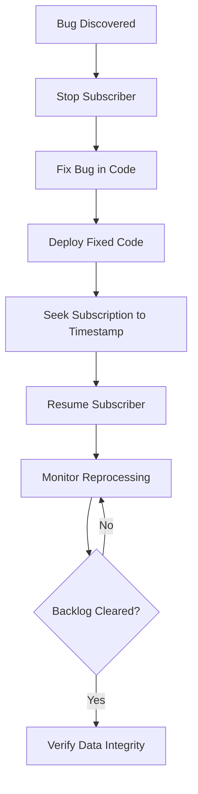

# How to Configure Pub/Sub Message Retention and Replay for Reprocessing

Author: [nawazdhandala](https://www.github.com/nawazdhandala)

Tags: GCP, Pub/Sub, Message Retention, Data Replay, Messaging

Description: Learn how to configure message retention and use the seek feature in Google Cloud Pub/Sub to replay messages for reprocessing after bugs, outages, or schema changes.

---

There comes a time in every engineering team's life when someone says "we need to reprocess all the messages from the last three days." Maybe a bug corrupted data. Maybe a new feature needs to backfill from existing events. Maybe an outage caused messages to be lost downstream. Whatever the reason, if you have not configured message retention in Pub/Sub, you are out of luck.

Message retention and the seek feature together give you the ability to replay messages. This is one of those capabilities you never think about until you desperately need it, so let me show you how to set it up before that day comes.

## Understanding Message Retention

By default, Pub/Sub retains messages in a subscription for 7 days. But this retention only applies to unacknowledged messages. Once a message is acknowledged, it is gone. You cannot get it back.

There are two levels of retention you can configure:

1. **Topic-level retention**: Keeps messages on the topic itself, regardless of whether any subscription has acknowledged them. This is the key to replay.

2. **Subscription-level retention of acknowledged messages**: Keeps messages in the subscription even after acknowledgement. Combined with the seek feature, this lets you reset a subscription to an earlier point in time.

## Configuring Topic-Level Retention

Topic-level retention is the foundation for replay. When enabled, Pub/Sub stores every published message for the configured duration, independent of subscriptions:

```bash
# Enable 7-day message retention on a topic
gcloud pubsub topics update order-events \
  --message-retention-duration=7d
```

The maximum retention duration is 31 days. Keep in mind that retained messages are billed based on storage, so longer retention means higher costs. For most use cases, 7 days strikes a good balance.

In Terraform:

```hcl
# Topic with 7-day message retention enabled
resource "google_pubsub_topic" "order_events" {
  name = "order-events"

  # Retain messages for 7 days (in seconds)
  message_retention_duration = "604800s"

  labels = {
    environment = "production"
  }
}
```

## Configuring Subscription-Level Retention

On the subscription side, you can retain acknowledged messages so they are available for replay:

```bash
# Update subscription to retain acknowledged messages for 3 days
gcloud pubsub subscriptions update order-processor-sub \
  --retain-acked-messages \
  --message-retention-duration=3d
```

The subscription's message retention duration cannot exceed the topic's retention duration. If the topic retains messages for 7 days, your subscription can retain acknowledged messages for up to 7 days.

In Terraform:

```hcl
# Subscription with acknowledged message retention
resource "google_pubsub_subscription" "order_processor" {
  name  = "order-processor-sub"
  topic = google_pubsub_topic.order_events.id

  # Retain acknowledged messages for 3 days
  retain_acked_messages      = true
  message_retention_duration = "259200s"  # 3 days in seconds

  ack_deadline_seconds = 60

  expiration_policy {
    ttl = ""
  }
}
```

## Using Seek to Replay Messages

The seek operation is what actually triggers the replay. You can seek a subscription to either a point in time or a snapshot.

### Seeking to a Timestamp

This is the most common replay scenario. You want to reprocess all messages from a specific point in time:

```bash
# Replay all messages published after a specific timestamp
gcloud pubsub subscriptions seek order-processor-sub \
  --time="2026-02-15T10:00:00Z"
```

This resets the subscription's acknowledgement state. All messages published after the specified timestamp become unacknowledged and will be redelivered to subscribers. Messages published before that time remain acknowledged.

Your subscriber code needs to handle receiving messages it may have already processed. This usually means your processing logic should be idempotent:

```python
# Idempotent message processor that safely handles replayed messages
from google.cloud import pubsub_v1, bigquery
import json

subscriber = pubsub_v1.SubscriberClient()
bq_client = bigquery.Client()

def process_message(message):
    """Process a message idempotently using message_id as dedup key."""
    data = json.loads(message.data.decode('utf-8'))
    message_id = message.message_id

    # Check if we already processed this message
    query = f"""
        SELECT COUNT(*) as cnt
        FROM `analytics.processed_events`
        WHERE message_id = '{message_id}'
    """
    result = list(bq_client.query(query).result())

    if result[0].cnt > 0:
        # Already processed, just acknowledge
        print(f"Skipping duplicate message {message_id}")
        message.ack()
        return

    # Process the message
    handle_order_event(data)

    # Record that we processed it
    bq_client.insert_rows_json(
        'analytics.processed_events',
        [{'message_id': message_id, 'processed_at': 'AUTO'}]
    )
    message.ack()
```

### Seeking to a Snapshot

Snapshots capture the acknowledgement state of a subscription at a specific moment. This is useful when you want a precise rollback point, like before a deployment:

```bash
# Create a snapshot before deploying new subscriber code
gcloud pubsub snapshots create pre-deploy-snapshot \
  --subscription=order-processor-sub

# If the deployment goes wrong, seek back to the snapshot
gcloud pubsub subscriptions seek order-processor-sub \
  --snapshot=pre-deploy-snapshot
```

Snapshots have a maximum lifetime equal to the subscription's message retention duration (or 7 days if retention of acknowledged messages is not enabled).

In Terraform:

```hcl
# Create a snapshot resource (useful for automated rollback points)
resource "google_pubsub_snapshot" "pre_migration" {
  name         = "pre-migration-snapshot"
  subscription = google_pubsub_subscription.order_processor.name
  topic        = google_pubsub_topic.order_events.id
}
```

## Building a Replay Workflow

Here is a practical workflow for replaying messages after discovering a data processing bug:



Step by step:

1. **Stop your subscriber** to prevent it from processing new messages with the buggy code.
2. **Fix and deploy** the corrected code.
3. **Seek the subscription** to a timestamp before the bug was introduced.
4. **Resume the subscriber** and let it reprocess messages.
5. **Monitor the backlog** until it clears.
6. **Verify** that the reprocessed data is correct.

## Automating Replay with a Script

For teams that need to replay frequently, automate the process:

```bash
#!/bin/bash
# replay.sh - Automated message replay script

SUBSCRIPTION=$1
REPLAY_FROM=$2

if [ -z "$SUBSCRIPTION" ] || [ -z "$REPLAY_FROM" ]; then
  echo "Usage: ./replay.sh <subscription-name> <timestamp>"
  echo "Example: ./replay.sh order-processor-sub 2026-02-15T10:00:00Z"
  exit 1
fi

echo "Creating pre-replay snapshot..."
SNAPSHOT_NAME="pre-replay-$(date +%Y%m%d-%H%M%S)"
gcloud pubsub snapshots create "$SNAPSHOT_NAME" \
  --subscription="$SUBSCRIPTION"

echo "Seeking subscription to $REPLAY_FROM..."
gcloud pubsub subscriptions seek "$SUBSCRIPTION" \
  --time="$REPLAY_FROM"

echo "Replay initiated. Monitoring backlog..."

# Poll until backlog is cleared
while true; do
  BACKLOG=$(gcloud monitoring read \
    "pubsub.googleapis.com/subscription/num_undelivered_messages" \
    --filter="resource.labels.subscription_id=$SUBSCRIPTION" \
    --format="value(points.value.int64Value)" 2>/dev/null | head -1)

  echo "Current backlog: ${BACKLOG:-unknown} messages"

  if [ "${BACKLOG:-1}" = "0" ]; then
    echo "Replay complete!"
    break
  fi
  sleep 30
done
```

## Cost Considerations

Message retention is not free. You pay for the storage of retained messages. The pricing is based on:

- **Topic retention**: Charged per GB of retained messages per month
- **Snapshot storage**: Charged per GB of snapshot size per month

For high-volume topics, this can add up. A topic publishing 1 GB per day with 7-day retention stores roughly 7 GB. At current pricing, that is manageable, but if you are publishing terabytes per day, you should carefully consider your retention window.

To estimate costs:

```
Daily message volume x retention days x storage price per GB = monthly cost
```

## Best Practices

1. **Enable topic-level retention from day one.** Adding it later does not retroactively retain messages that have already been published.

2. **Make your subscribers idempotent.** Replay means messages get delivered again. If processing the same message twice causes problems, you need deduplication logic.

3. **Create snapshots before risky operations.** Deploying new subscriber code, running migrations, or making schema changes are all good reasons to take a snapshot first.

4. **Set retention based on your recovery time needs.** How far back do you realistically need to replay? 24 hours covers most bugs caught quickly. 7 days covers weekend incidents. 31 days is for compliance-heavy environments.

5. **Monitor retention costs.** For high-volume topics, retention storage costs can surprise you. Set up budget alerts and review usage monthly.

## Wrapping Up

Message retention and replay in Pub/Sub is straightforward to configure but invaluable when you need it. Enable topic-level retention, configure subscription-level retention of acknowledged messages, and use the seek feature to replay when necessary. Make your subscribers idempotent, take snapshots before risky changes, and you will have a safety net that lets you recover from data processing failures without losing messages.
