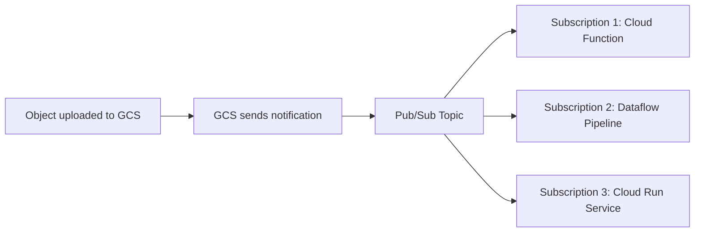

# How to Configure Pub/Sub Notifications for Google Cloud Storage Events

Author: [nawazdhandala](https://www.github.com/nawazdhandala)

Tags: GCP, Google Cloud Storage, Pub/Sub, Event-Driven Architecture, Cloud Notifications

Description: A hands-on guide to setting up Pub/Sub notifications for Google Cloud Storage events to build event-driven data pipelines and automated workflows.

---

When a file lands in a Cloud Storage bucket, you often want something to happen automatically - trigger a data pipeline, send a notification, update a database, or kick off a processing job. Google Cloud Pub/Sub notifications for Cloud Storage give you exactly this: real-time event delivery whenever objects are created, deleted, archived, or have their metadata updated.

This guide walks through setting up Pub/Sub notifications from scratch, handling the events, and building practical automated workflows.

## How It Works

When you configure a notification on a Cloud Storage bucket, GCS publishes a message to a Pub/Sub topic every time a matching event occurs. Subscribers to that topic receive the message and can process it however they need.



The notification message includes metadata about the event - the bucket name, object name, event type, size, content type, and more.

## Prerequisites

You need:
- A GCS bucket
- A Pub/Sub topic (or you can have the gcloud command create one)
- The Cloud Storage service account must have permission to publish to the topic

First, find your project's Cloud Storage service account:

```bash
# Get the Cloud Storage service account for your project
gcloud storage service-agent --project=my-project-id
```

This returns something like `service-PROJECT_NUMBER@gs-project-accounts.iam.gserviceaccount.com`.

## Creating the Pub/Sub Topic

```bash
# Create a Pub/Sub topic for storage notifications
gcloud pubsub topics create gcs-notifications
```

Grant the Cloud Storage service account permission to publish to the topic:

```bash
# Allow the GCS service account to publish to the topic
gcloud pubsub topics add-iam-policy-binding gcs-notifications \
  --member="serviceAccount:service-123456789@gs-project-accounts.iam.gserviceaccount.com" \
  --role="roles/pubsub.publisher"
```

Replace the service account email with the one from the previous step.

## Setting Up Notifications

Create a notification that fires for all events:

```bash
# Create a notification for all events in the bucket
gcloud storage buckets notifications create gs://my-data-bucket \
  --topic=gcs-notifications
```

To limit notifications to specific event types:

```bash
# Only notify on object creation (finalize) events
gcloud storage buckets notifications create gs://my-data-bucket \
  --topic=gcs-notifications \
  --event-types=OBJECT_FINALIZE
```

Available event types:

- `OBJECT_FINALIZE` - object created or overwritten
- `OBJECT_METADATA_UPDATE` - object metadata changed
- `OBJECT_DELETE` - object permanently deleted
- `OBJECT_ARCHIVE` - object became noncurrent (versioned bucket)

You can specify multiple event types:

```bash
# Notify on creation and deletion events
gcloud storage buckets notifications create gs://my-data-bucket \
  --topic=gcs-notifications \
  --event-types=OBJECT_FINALIZE,OBJECT_DELETE
```

## Filtering by Object Name Prefix

If you only want notifications for objects in a specific path:

```bash
# Only notify for objects uploaded to the uploads/ prefix
gcloud storage buckets notifications create gs://my-data-bucket \
  --topic=gcs-notifications \
  --event-types=OBJECT_FINALIZE \
  --object-prefix=uploads/
```

## Adding Custom Attributes

You can add custom attributes to notification messages for routing or filtering:

```bash
# Add custom attributes to notification messages
gcloud storage buckets notifications create gs://my-data-bucket \
  --topic=gcs-notifications \
  --custom-attributes=environment=production,source=upload-service
```

## Listing Active Notifications

```bash
# List all notification configurations on a bucket
gcloud storage buckets notifications list gs://my-data-bucket
```

## Deleting a Notification

```bash
# List notifications to get the notification ID
gcloud storage buckets notifications list gs://my-data-bucket

# Delete a specific notification by ID
gcloud storage buckets notifications delete \
  projects/_/buckets/my-data-bucket/notificationConfigs/1
```

## Understanding the Notification Message

When an event occurs, the Pub/Sub message looks like this:

```json
{
  "kind": "storage#object",
  "id": "my-data-bucket/uploads/data.csv/1706745600000000",
  "selfLink": "https://www.googleapis.com/storage/v1/b/my-data-bucket/o/uploads%2Fdata.csv",
  "name": "uploads/data.csv",
  "bucket": "my-data-bucket",
  "generation": "1706745600000000",
  "metageneration": "1",
  "contentType": "text/csv",
  "timeCreated": "2026-02-17T10:00:00.000Z",
  "updated": "2026-02-17T10:00:00.000Z",
  "size": "1048576",
  "md5Hash": "abc123...",
  "crc32c": "def456..."
}
```

The message attributes include:
- `eventType` - the type of event (e.g., `OBJECT_FINALIZE`)
- `bucketId` - the bucket name
- `objectId` - the object name
- `objectGeneration` - the generation number
- `payloadFormat` - `JSON_API_V1`

## Processing Notifications with Cloud Functions

Here is a Cloud Function that processes upload notifications:

```python
import json
import functions_framework
from google.cloud import storage

@functions_framework.cloud_event
def process_upload(cloud_event):
    """Process a Cloud Storage upload notification via Pub/Sub."""

    # Extract the notification data from the Pub/Sub message
    data = cloud_event.data
    message = data["message"]

    # Decode the message payload
    import base64
    payload = json.loads(base64.b64decode(message["data"]).decode("utf-8"))

    bucket_name = payload["bucket"]
    file_name = payload["name"]
    content_type = payload.get("contentType", "unknown")
    file_size = int(payload.get("size", 0))

    print(f"New file: gs://{bucket_name}/{file_name}")
    print(f"Type: {content_type}, Size: {file_size} bytes")

    # Process based on file type
    if file_name.endswith(".csv"):
        process_csv(bucket_name, file_name)
    elif file_name.endswith(".json"):
        process_json(bucket_name, file_name)
    else:
        print(f"Skipping unsupported file type: {content_type}")

def process_csv(bucket_name, file_name):
    """Handle CSV file uploads."""
    client = storage.Client()
    bucket = client.bucket(bucket_name)
    blob = bucket.blob(file_name)

    # Download and process the CSV
    content = blob.download_as_text()
    line_count = len(content.strip().split('\n'))
    print(f"CSV has {line_count} lines")
    # Add your processing logic here

def process_json(bucket_name, file_name):
    """Handle JSON file uploads."""
    client = storage.Client()
    bucket = client.bucket(bucket_name)
    blob = bucket.blob(file_name)

    content = blob.download_as_text()
    data = json.loads(content)
    print(f"JSON has {len(data)} top-level keys")
    # Add your processing logic here
```

Deploy it:

```bash
# Deploy the Cloud Function triggered by Pub/Sub
gcloud functions deploy process-upload \
  --gen2 \
  --runtime=python312 \
  --region=us-central1 \
  --source=. \
  --entry-point=process_upload \
  --trigger-topic=gcs-notifications
```

## Processing Notifications with Node.js

```javascript
const { Storage } = require('@google-cloud/storage');
const storage = new Storage();

/**
 * Process GCS notifications from Pub/Sub.
 * Triggered by a Pub/Sub push subscription.
 */
exports.processNotification = async (message, context) => {
  // Parse the notification payload
  const data = JSON.parse(
    Buffer.from(message.data, 'base64').toString()
  );

  const bucketName = data.bucket;
  const fileName = data.name;
  const eventType = message.attributes.eventType;

  console.log(`Event: ${eventType} on gs://${bucketName}/${fileName}`);

  // Only process new uploads
  if (eventType !== 'OBJECT_FINALIZE') {
    console.log('Skipping non-finalize event');
    return;
  }

  // Download and process the file
  const file = storage.bucket(bucketName).file(fileName);
  const [metadata] = await file.getMetadata();

  console.log(`Processing ${fileName} (${metadata.size} bytes)`);
  // Add your processing logic here
};
```

## Setting Up with Terraform

```hcl
# Create the Pub/Sub topic
resource "google_pubsub_topic" "gcs_notifications" {
  name = "gcs-file-notifications"
}

# Grant GCS permission to publish
data "google_storage_project_service_account" "gcs_account" {
}

resource "google_pubsub_topic_iam_binding" "gcs_publisher" {
  topic   = google_pubsub_topic.gcs_notifications.id
  role    = "roles/pubsub.publisher"
  members = ["serviceAccount:${data.google_storage_project_service_account.gcs_account.email_address}"]
}

# Create the notification configuration
resource "google_storage_notification" "upload_notification" {
  bucket         = google_storage_bucket.data_bucket.name
  payload_format = "JSON_API_V1"
  topic          = google_pubsub_topic.gcs_notifications.id
  event_types    = ["OBJECT_FINALIZE"]
  object_name_prefix = "uploads/"

  depends_on = [google_pubsub_topic_iam_binding.gcs_publisher]
}

# Create a subscription for processing
resource "google_pubsub_subscription" "process_uploads" {
  name  = "process-uploads-sub"
  topic = google_pubsub_topic.gcs_notifications.id

  ack_deadline_seconds = 60

  retry_policy {
    minimum_backoff = "10s"
    maximum_backoff = "600s"
  }
}
```

## Important Notes

**Notifications are at-least-once delivery.** Your processing logic should be idempotent because you might receive the same notification more than once.

**There is no guaranteed ordering.** If multiple objects are uploaded simultaneously, notifications might arrive in any order.

**You can have multiple notifications per bucket.** Each notification can have different event types, prefixes, and topics. This lets you route different types of events to different processing pipelines.

**Pub/Sub charges apply.** You pay for Pub/Sub message delivery in addition to Cloud Storage costs. For high-volume buckets, factor this into your cost estimates.

Pub/Sub notifications turn Cloud Storage from a passive file store into an active component of your event-driven architecture. Combined with Cloud Functions, Cloud Run, or Dataflow, they let you build powerful automated pipelines that respond to data as it arrives.
