# How to Configure Pub/Sub Retry Policies and Acknowledgement Deadlines

Author: [nawazdhandala](https://www.github.com/nawazdhandala)

Tags: GCP, Pub/Sub, Retry Policy, Message Delivery, Reliability

Description: Learn how to configure retry policies and acknowledgement deadlines in Google Cloud Pub/Sub to balance reliable message delivery with efficient resource usage.

---

When a Pub/Sub subscriber fails to acknowledge a message in time, Pub/Sub redelivers it. The question is: how quickly should it retry, and how long should it wait before concluding the subscriber has failed? These two settings - the retry policy and the acknowledgement deadline - have a big impact on your system's behavior under failure conditions.

Get them wrong, and you will either overwhelm a struggling subscriber with rapid redeliveries or wait too long to retry, causing unnecessary delays. This guide covers how to configure both settings and the tradeoffs involved.

## Understanding the Acknowledgement Deadline

The acknowledgement deadline (also called ack deadline) is the time window a subscriber has to process a message and send an acknowledgement. If the deadline passes without an ack, Pub/Sub considers the delivery failed and redelivers the message.

The default ack deadline is 10 seconds. You can set it between 10 and 600 seconds (10 minutes) at the subscription level.

```bash
# Set the acknowledgement deadline to 60 seconds
gcloud pubsub subscriptions create my-subscription \
  --topic=my-topic \
  --ack-deadline=60
```

In Terraform:

```hcl
# Subscription with a 60-second acknowledgement deadline
resource "google_pubsub_subscription" "processor" {
  name  = "event-processor-sub"
  topic = google_pubsub_topic.events.id

  ack_deadline_seconds = 60

  expiration_policy {
    ttl = ""
  }
}
```

### Choosing the Right Ack Deadline

The ack deadline should be longer than your typical message processing time, with some buffer for variability:

- **If processing takes 2 seconds on average**: Set the deadline to 30-60 seconds. This gives room for occasional slow processing.
- **If processing takes 30 seconds on average**: Set the deadline to 120-180 seconds.
- **If processing time varies wildly**: Use a longer static deadline or use deadline extension (more on this below).

Setting the deadline too short causes a common problem: the subscriber finishes processing and acks the message, but the deadline already expired and Pub/Sub has already redelivered it. Now you process the same message twice.

Setting it too long means that if a subscriber genuinely crashes mid-processing, the message sits idle until the deadline expires before being redelivered to another subscriber.

### Extending the Acknowledgement Deadline

The Pub/Sub client libraries can automatically extend the ack deadline while processing is in progress. This is called "lease management" and it happens transparently:

```python
# The client library automatically extends the ack deadline
from google.cloud import pubsub_v1

subscriber = pubsub_v1.SubscriberClient()
subscription_path = subscriber.subscription_path("my-project", "my-subscription")

def slow_processor(message):
    """Process a message that takes a long time.
    The client library extends the deadline automatically."""
    data = message.data.decode('utf-8')

    # This might take several minutes
    result = run_expensive_computation(data)

    # The ack deadline has been extended automatically during processing
    message.ack()

# Configure the subscriber with custom flow control
flow_control = pubsub_v1.types.FlowControl(
    max_messages=10,           # Process at most 10 messages concurrently
    max_lease_duration=3600,   # Maximum lease extension: 1 hour
)

streaming_pull = subscriber.subscribe(
    subscription_path,
    callback=slow_processor,
    flow_control=flow_control,
)

streaming_pull.result()
```

You can also extend the deadline manually if you need more control:

```python
# Manual deadline extension for fine-grained control
from google.cloud import pubsub_v1

subscriber = pubsub_v1.SubscriberClient()
subscription_path = subscriber.subscription_path("my-project", "my-subscription")

# Pull messages manually
response = subscriber.pull(
    request={"subscription": subscription_path, "max_messages": 1}
)

for received_message in response.received_messages:
    ack_id = received_message.ack_id

    # Extend the deadline by 120 seconds
    subscriber.modify_ack_deadline(
        request={
            "subscription": subscription_path,
            "ack_ids": [ack_id],
            "ack_deadline_seconds": 120,
        }
    )

    # Now we have 120 more seconds to process
    process(received_message.message.data)

    # Acknowledge when done
    subscriber.acknowledge(
        request={
            "subscription": subscription_path,
            "ack_ids": [ack_id],
        }
    )
```

## Understanding Retry Policies

The retry policy controls how Pub/Sub spaces out redeliveries when a subscriber fails to acknowledge a message. Without a retry policy, Pub/Sub uses its default behavior, which redelivers immediately (or nearly so).

A retry policy lets you configure exponential backoff:

```bash
# Configure a retry policy with exponential backoff
gcloud pubsub subscriptions update event-processor-sub \
  --min-retry-delay=10s \
  --max-retry-delay=600s
```

In Terraform:

```hcl
# Subscription with retry policy and exponential backoff
resource "google_pubsub_subscription" "processor" {
  name  = "event-processor-sub"
  topic = google_pubsub_topic.events.id

  ack_deadline_seconds = 60

  retry_policy {
    minimum_backoff = "10s"   # Start retrying after 10 seconds
    maximum_backoff = "600s"  # Cap backoff at 10 minutes
  }

  expiration_policy {
    ttl = ""
  }
}
```

### How Exponential Backoff Works

With a retry policy configured, the delay between redeliveries increases exponentially:

- First retry: ~10 seconds (minimum_backoff)
- Second retry: ~20 seconds
- Third retry: ~40 seconds
- Fourth retry: ~80 seconds
- ...continues doubling...
- Eventually caps at 600 seconds (maximum_backoff)

This pattern is beneficial because:

1. **Transient failures resolve quickly**: The first few retries happen relatively fast, so brief outages are handled promptly.
2. **Sustained failures do not overwhelm**: If something is seriously broken, the backoff prevents a storm of redeliveries that waste resources.
3. **Downstream services get breathing room**: If your subscriber depends on a service that is overloaded, backing off gives it time to recover.

### Retry Policy vs No Retry Policy

Without a retry policy, Pub/Sub redelivers messages as soon as the ack deadline expires. This is essentially immediate retry. For subscribers that process messages quickly and rarely fail, this is fine. For subscribers that depend on external services (databases, APIs, other microservices), a retry policy with backoff is strongly recommended.

Here is the difference visually:

```mermaid
gantt
    title Message Redelivery Timeline
    dateFormat X
    axisFormat %s

    section No Retry Policy
    Attempt 1    :a1, 0, 10
    Attempt 2    :a2, 10, 20
    Attempt 3    :a3, 20, 30
    Attempt 4    :a4, 30, 40

    section With Backoff
    Attempt 1    :b1, 0, 10
    Attempt 2    :b2, 20, 30
    Attempt 3    :b3, 50, 60
    Attempt 4    :b4, 110, 120
```



## Combining Retry Policy with Dead Letter Topics

Retry policies and dead letter topics work together naturally. The retry policy controls the spacing between attempts, and the dead letter policy limits the total number of attempts:

```hcl
# Complete subscription with retry policy and dead letter handling
resource "google_pubsub_subscription" "processor" {
  name  = "event-processor-sub"
  topic = google_pubsub_topic.events.id

  ack_deadline_seconds = 60

  # Exponential backoff for retries
  retry_policy {
    minimum_backoff = "10s"
    maximum_backoff = "600s"
  }

  # Give up after 10 attempts and send to DLQ
  dead_letter_policy {
    dead_letter_topic     = google_pubsub_topic.events_dlq.id
    max_delivery_attempts = 10
  }

  expiration_policy {
    ttl = ""
  }
}
```

With this configuration, a failing message goes through approximately this timeline:

1. Attempt 1: immediate
2. Attempt 2: +10s
3. Attempt 3: +20s
4. Attempt 4: +40s
5. Attempt 5: +80s
6. Attempt 6: +160s
7. Attempt 7: +320s
8. Attempt 8: +600s (capped)
9. Attempt 9: +600s
10. Attempt 10: +600s, then sent to DLQ

Total time before DLQ: roughly 40 minutes. This gives transient issues plenty of time to resolve while still moving permanently bad messages out of the way.

## Practical Recommendations

### For API-Dependent Subscribers

If your subscriber calls external APIs:

```hcl
resource "google_pubsub_subscription" "api_consumer" {
  name  = "api-consumer-sub"
  topic = google_pubsub_topic.events.id

  # API calls typically complete in under 30 seconds
  ack_deadline_seconds = 60

  retry_policy {
    minimum_backoff = "30s"   # Give the API time to recover
    maximum_backoff = "600s"
  }

  dead_letter_policy {
    dead_letter_topic     = google_pubsub_topic.events_dlq.id
    max_delivery_attempts = 15  # More attempts for transient API issues
  }
}
```

### For Database Writers

If your subscriber writes to a database:

```hcl
resource "google_pubsub_subscription" "db_writer" {
  name  = "db-writer-sub"
  topic = google_pubsub_topic.events.id

  # Database writes are usually fast
  ack_deadline_seconds = 30

  retry_policy {
    minimum_backoff = "10s"
    maximum_backoff = "300s"
  }

  dead_letter_policy {
    dead_letter_topic     = google_pubsub_topic.events_dlq.id
    max_delivery_attempts = 10
  }
}
```

### For Long-Running Processing

If your subscriber does heavy computation:

```hcl
resource "google_pubsub_subscription" "heavy_processor" {
  name  = "heavy-processor-sub"
  topic = google_pubsub_topic.events.id

  # Long processing time
  ack_deadline_seconds = 600  # 10 minutes

  retry_policy {
    minimum_backoff = "60s"    # No point retrying immediately
    maximum_backoff = "3600s"  # Wait up to 1 hour between retries
  }

  dead_letter_policy {
    dead_letter_topic     = google_pubsub_topic.events_dlq.id
    max_delivery_attempts = 5  # Fewer attempts for expensive operations
  }
}
```

## Monitoring Retry Behavior

Track these metrics to understand how retries are affecting your system:

- `pubsub.googleapis.com/subscription/num_undelivered_messages` - Growing backlog suggests processing cannot keep up
- `pubsub.googleapis.com/subscription/oldest_unacked_message_age` - High age means messages are stuck in retry loops
- `pubsub.googleapis.com/subscription/dead_letter_message_count` - Messages exhausting their retry budget

```bash
# Check the oldest unacknowledged message age
gcloud monitoring read \
  "pubsub.googleapis.com/subscription/oldest_unacked_message_age" \
  --filter="resource.labels.subscription_id=event-processor-sub" \
  --interval-start-time="$(date -u -v-1H +%Y-%m-%dT%H:%M:%SZ)"
```

## Wrapping Up

The acknowledgement deadline and retry policy are two sides of the same coin. The ack deadline determines when Pub/Sub considers a delivery failed, and the retry policy determines how it spaces out subsequent delivery attempts. Set the ack deadline based on your processing time with a generous buffer. Configure the retry policy with exponential backoff to handle transient failures gracefully. Combine both with dead letter topics for a complete failure handling strategy. The right configuration depends on your specific workload, but the patterns in this guide cover the vast majority of production use cases.
