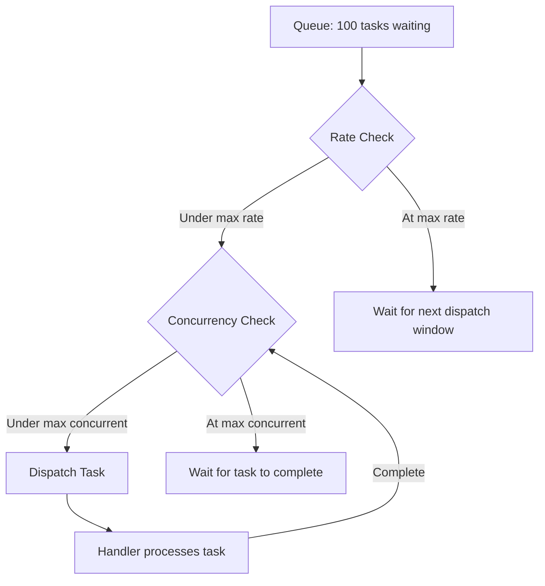

# How to Configure Rate Limiting and Concurrent Dispatch for Cloud Tasks Queues

Author: [nawazdhandala](https://www.github.com/nawazdhandala)

Tags: GCP, Cloud Tasks, Rate Limiting, Concurrency, Queue Management

Description: Learn how to configure rate limiting and concurrent dispatch settings in Google Cloud Tasks queues to protect your services and control task processing throughput.

---

One of the most valuable features of Cloud Tasks is its ability to control how fast tasks are dispatched to your handlers. Without rate limiting, a sudden spike in tasks could overwhelm your backend services, exhaust database connections, or blow through third-party API quotas. Configuring rate limiting and concurrent dispatch properly is the difference between a system that handles load gracefully and one that falls over under pressure.

In this post, I will explain how Cloud Tasks rate limiting works under the hood and show you how to configure it for different scenarios.

## Understanding the Rate Limiting Parameters

Cloud Tasks queues have three main rate limiting parameters:

### max-dispatches-per-second

This is the maximum rate at which tasks are dispatched from the queue. If set to 10, the queue will send at most 10 task requests per second to your handler.

### max-concurrent-dispatches

This controls how many tasks can be in-flight (dispatched but not yet completed) at the same time. If set to 5, the queue will not dispatch a 6th task until one of the 5 running tasks completes.

### max-burst-size

This allows the queue to temporarily exceed the dispatch rate to process a backlog. After the queue has been idle, it accumulates "burst capacity" that it can use to catch up quickly.

## How These Parameters Interact

These three settings work together. The effective dispatch rate is the minimum of:

1. `max-dispatches-per-second` (the configured rate)
2. The rate allowed by `max-concurrent-dispatches` (depends on task duration)

For example, if you set `max-dispatches-per-second=100` but `max-concurrent-dispatches=5`, and each task takes 1 second to complete, you will only achieve 5 dispatches per second because the concurrency limit is the bottleneck.



## Creating a Queue with Rate Limiting

Here is the basic syntax for creating a rate-limited queue.

```bash
# Create a queue with rate limiting
gcloud tasks queues create rate-limited-queue \
  --location=us-central1 \
  --max-dispatches-per-second=25 \
  --max-concurrent-dispatches=10 \
  --max-burst-size=50
```

## Configuration Profiles for Common Scenarios

### Profile 1: Third-Party API with Rate Limits

When your tasks call an external API that has rate limits, you need to stay under their limits.

```bash
# Example: Stripe API allows 100 requests per second
# Stay well under the limit to account for other traffic
gcloud tasks queues create stripe-tasks \
  --location=us-central1 \
  --max-dispatches-per-second=50 \
  --max-concurrent-dispatches=10 \
  --max-burst-size=50
```

Why 50 instead of 100? Because you might have other parts of your application also calling Stripe. Leave headroom for non-queued requests.

### Profile 2: Database-Heavy Operations

When tasks do heavy database work, you want to limit concurrency to avoid connection pool exhaustion.

```bash
# Database-intensive tasks - limit concurrency more than rate
gcloud tasks queues create db-heavy-tasks \
  --location=us-central1 \
  --max-dispatches-per-second=20 \
  --max-concurrent-dispatches=5 \
  --max-burst-size=10
```

With only 5 concurrent tasks, your database will not be hit with more than 5 simultaneous heavy queries.

### Profile 3: Lightweight Notification Tasks

For fast, lightweight tasks like sending push notifications, you can be more aggressive.

```bash
# Fast lightweight tasks - higher throughput
gcloud tasks queues create notification-tasks \
  --location=us-central1 \
  --max-dispatches-per-second=500 \
  --max-concurrent-dispatches=100 \
  --max-burst-size=500
```

### Profile 4: Single-Threaded Processing

Sometimes tasks must be processed strictly one at a time (sequential processing).

```bash
# Sequential processing - one task at a time
gcloud tasks queues create sequential-queue \
  --location=us-central1 \
  --max-dispatches-per-second=1 \
  --max-concurrent-dispatches=1 \
  --max-burst-size=1
```

## Understanding Burst Behavior

The burst mechanism lets Cloud Tasks temporarily exceed the configured rate. Here is how it works:

When the queue is idle, it accumulates "tokens" at the rate of `max-dispatches-per-second`, up to `max-burst-size`. When tasks arrive, the queue can use these accumulated tokens to dispatch faster than the normal rate.

For example, with `max-dispatches-per-second=10` and `max-burst-size=100`:

- Queue is idle for 10 seconds, accumulating 100 tokens
- 50 tasks arrive at once
- Queue can immediately dispatch all 50 tasks (using 50 tokens)
- After that, dispatching continues at 10 per second

This is useful for queues that have bursty traffic patterns. If your tasks arrive in batches every few minutes, burst capacity lets the queue drain quickly.

```bash
# Queue optimized for bursty traffic
gcloud tasks queues create bursty-queue \
  --location=us-central1 \
  --max-dispatches-per-second=10 \
  --max-concurrent-dispatches=20 \
  --max-burst-size=200
```

## Updating Rate Limits on Existing Queues

You can adjust rate limits without deleting and recreating the queue. Changes take effect immediately.

```bash
# Increase the dispatch rate during peak hours
gcloud tasks queues update rate-limited-queue \
  --location=us-central1 \
  --max-dispatches-per-second=100 \
  --max-concurrent-dispatches=50

# Decrease during off-peak to save resources
gcloud tasks queues update rate-limited-queue \
  --location=us-central1 \
  --max-dispatches-per-second=10 \
  --max-concurrent-dispatches=5
```

## Programmatic Rate Limit Configuration

You can also configure rate limits from your application code. Here is a Node.js example.

```javascript
// update-queue-rate.js
// Dynamically adjust queue rate limits based on current conditions
const { CloudTasksClient } = require("@google-cloud/tasks");

const client = new CloudTasksClient();

async function updateQueueRateLimit(queueName, maxDispatchesPerSecond, maxConcurrentDispatches) {
  const name = client.queuePath("my-project", "us-central1", queueName);

  const queue = {
    name,
    rateLimits: {
      maxDispatchesPerSecond: maxDispatchesPerSecond,
      maxConcurrentDispatches: maxConcurrentDispatches,
    },
  };

  // Specify which fields to update
  const updateMask = {
    paths: [
      "rate_limits.max_dispatches_per_second",
      "rate_limits.max_concurrent_dispatches",
    ],
  };

  const [updatedQueue] = await client.updateQueue({ queue, updateMask });
  console.log(`Updated queue rate limits:`, updatedQueue.rateLimits);
  return updatedQueue;
}

// Example: reduce rate during known high-traffic periods
updateQueueRateLimit("api-tasks", 25, 10);
```

## Monitoring Queue Throughput

Check how your rate limits are performing in practice.

```bash
# View queue configuration including rate limits
gcloud tasks queues describe rate-limited-queue \
  --location=us-central1 \
  --format="yaml(rateLimits, retryConfig)"

# Check how many tasks are in the queue
gcloud tasks list --queue=rate-limited-queue \
  --location=us-central1 \
  --format="table(name.basename(), scheduleTime, dispatchCount, responseCount)"
```

Use Cloud Monitoring to track queue metrics over time:

- `cloudtasks.googleapis.com/queue/depth` - Number of tasks in the queue
- `cloudtasks.googleapis.com/queue/task_attempt_count` - Dispatch attempts
- `cloudtasks.googleapis.com/queue/task_attempt_delays` - Time tasks wait before dispatch

## Calculating the Right Settings

To determine the right rate limit settings, consider these factors:

**1. Handler capacity**: How many requests per second can your handler process? If your Cloud Run service can handle 100 RPS before degrading, set your dispatch rate below that.

**2. Task duration**: If each task takes 2 seconds, and you want 50 concurrent tasks, you need a dispatch rate of at least 25 per second to keep 50 tasks in flight.

**3. Downstream limits**: If your tasks call an API with a 1000 RPM limit, that is about 16 per second. Set your dispatch rate to 15 or less.

**4. Resource constraints**: Each concurrent task uses a Cloud Run instance or function instance. Factor in your max-instances setting.

Here is a formula for estimating throughput:

```
Effective throughput = min(
  max_dispatches_per_second,
  max_concurrent_dispatches / average_task_duration_seconds
)

Example:
  max_dispatches_per_second = 50
  max_concurrent_dispatches = 20
  average_task_duration = 0.5 seconds

  Effective throughput = min(50, 20/0.5) = min(50, 40) = 40 tasks/second
```

## Pausing and Resuming for Maintenance

If you need to temporarily stop task processing (maybe your handler is being deployed), pause the queue.

```bash
# Pause the queue - tasks accumulate but are not dispatched
gcloud tasks queues pause rate-limited-queue --location=us-central1

# Resume - tasks start dispatching again with burst capacity
gcloud tasks queues resume rate-limited-queue --location=us-central1
```

When you resume, the queue may dispatch faster than normal briefly (using burst capacity) to work through the backlog.

## Wrapping Up

Rate limiting in Cloud Tasks is your throttle valve between task producers and handlers. The three knobs - dispatch rate, concurrent dispatches, and burst size - give you precise control over how fast work is done. Start conservative, monitor your handler's performance, and adjust upward as you gain confidence. Remember that the effective throughput is determined by the most restrictive limit, and that concurrency often matters more than raw rate when tasks involve database queries or external API calls.
