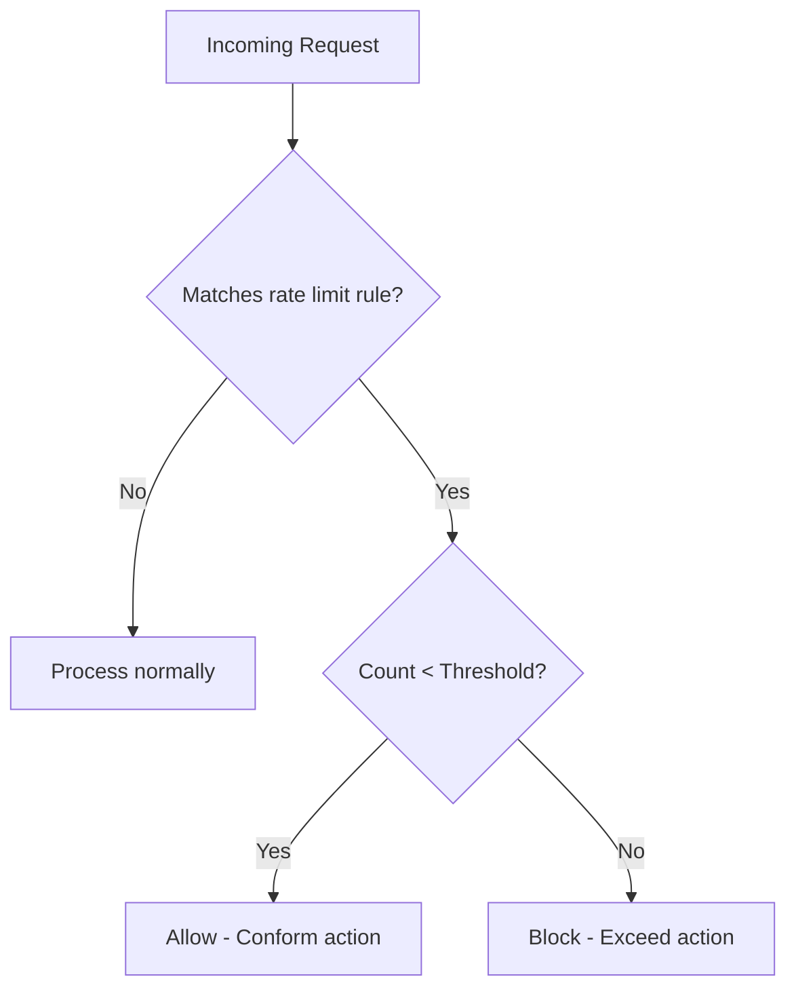

# How to Configure Rate Limiting Rules to Prevent Brute-Force Attacks in Google Cloud Armor

Author: [nawazdhandala](https://www.github.com/nawazdhandala)

Tags: GCP, Cloud Armor, Rate Limiting, Brute Force, Security

Description: Learn how to configure rate limiting rules in Google Cloud Armor to prevent brute-force attacks, credential stuffing, and API abuse on your applications.

---

Brute-force attacks are relentless. Attackers automate login attempts with thousands of username/password combinations, hoping to find valid credentials. Without rate limiting, your login endpoint processes every single attempt, wasting resources and putting user accounts at risk.

Cloud Armor's rate limiting lets you cap the number of requests from a single IP (or other key) over a time window. Exceed the limit and subsequent requests get blocked, throttled, or redirected. In this guide, I will show you how to set up rate limiting specifically tuned for preventing brute-force attacks.

## How Rate Limiting Works in Cloud Armor

Cloud Armor rate limiting works by counting requests that match a rule and comparing the count against a threshold. You configure:

- **Threshold**: How many requests to allow in the time window
- **Time window**: The counting interval (60 or 120 seconds)
- **Key**: What to count by (IP address, HTTP header, cookie, etc.)
- **Conform action**: What to do when traffic is under the limit
- **Exceed action**: What to do when traffic exceeds the limit
- **Enforce on key**: Whether to apply the limit per-IP, globally, or per custom key



## Step 1: Create a Security Policy

```bash
# Create a security policy for rate limiting
gcloud compute security-policies create rate-limit-policy \
    --description="Rate limiting policy for brute-force protection" \
    --project=my-project
```

## Step 2: Rate Limit Login Endpoints

The most critical endpoint to protect is your login page. Limit the number of login attempts per IP address.

```bash
# Rate limit login attempts to 10 requests per minute per IP
gcloud compute security-policies rules create 1000 \
    --security-policy=rate-limit-policy \
    --expression="request.path.matches('/login') || request.path.matches('/api/auth/login')" \
    --action=throttle \
    --rate-limit-threshold-count=10 \
    --rate-limit-threshold-interval-sec=60 \
    --conform-action=allow \
    --exceed-action=deny-429 \
    --enforce-on-key=IP \
    --description="Rate limit login attempts - 10 per minute per IP" \
    --project=my-project
```

This rule:
- Matches requests to `/login` or `/api/auth/login`
- Allows up to 10 requests per minute from each IP
- Returns 429 (Too Many Requests) when the limit is exceeded
- Counts requests per source IP address

## Step 3: Rate Limit Password Reset

Password reset endpoints are also common brute-force targets.

```bash
# Rate limit password reset to 5 requests per minute per IP
gcloud compute security-policies rules create 1100 \
    --security-policy=rate-limit-policy \
    --expression="request.path.matches('/forgot-password') || request.path.matches('/api/auth/reset')" \
    --action=throttle \
    --rate-limit-threshold-count=5 \
    --rate-limit-threshold-interval-sec=60 \
    --conform-action=allow \
    --exceed-action=deny-429 \
    --enforce-on-key=IP \
    --description="Rate limit password reset - 5 per minute per IP" \
    --project=my-project
```

## Step 4: Rate Limit API Endpoints

For API endpoints, you might want to rate limit based on an API key header instead of just IP address.

```bash
# Rate limit API calls to 100 per minute per API key
gcloud compute security-policies rules create 2000 \
    --security-policy=rate-limit-policy \
    --expression="request.path.startsWith('/api/')" \
    --action=throttle \
    --rate-limit-threshold-count=100 \
    --rate-limit-threshold-interval-sec=60 \
    --conform-action=allow \
    --exceed-action=deny-429 \
    --enforce-on-key=HTTP-HEADER \
    --enforce-on-key-name="X-API-Key" \
    --description="Rate limit API calls - 100 per minute per API key" \
    --project=my-project
```

When using `HTTP-HEADER` or `HTTP-COOKIE` as the key, Cloud Armor counts requests per unique value of that header or cookie.

## Step 5: Global Rate Limiting

For overall protection against traffic floods, add a global rate limit that applies regardless of the endpoint.

```bash
# Global rate limit - 1000 requests per minute per IP across all endpoints
gcloud compute security-policies rules create 5000 \
    --security-policy=rate-limit-policy \
    --src-ip-ranges="0.0.0.0/0" \
    --action=throttle \
    --rate-limit-threshold-count=1000 \
    --rate-limit-threshold-interval-sec=60 \
    --conform-action=allow \
    --exceed-action=deny-429 \
    --enforce-on-key=IP \
    --description="Global rate limit - 1000 per minute per IP" \
    --project=my-project
```

## Step 6: Rate Limit with Ban

For aggressive attackers, use the ban action instead of a simple deny. A ban blocks the offending IP for a specified duration, even after their request rate drops below the threshold.

```bash
# Ban IPs that exceed 50 login attempts per minute for 10 minutes
gcloud compute security-policies rules create 900 \
    --security-policy=rate-limit-policy \
    --expression="request.path.matches('/login')" \
    --action=rate-based-ban \
    --rate-limit-threshold-count=50 \
    --rate-limit-threshold-interval-sec=60 \
    --ban-threshold-count=50 \
    --ban-threshold-interval-sec=60 \
    --ban-duration-sec=600 \
    --conform-action=allow \
    --exceed-action=deny-403 \
    --enforce-on-key=IP \
    --description="Ban IPs doing aggressive brute-force (50+ req/min)" \
    --project=my-project
```

The ban parameters:
- `ban-threshold-count` / `ban-threshold-interval-sec`: The threshold that triggers a ban
- `ban-duration-sec`: How long the ban lasts (600 seconds = 10 minutes)

This is useful for escalating responses. A regular rate limit kicks in at 10 requests per minute (returning 429), but if an IP pushes past 50 requests per minute, they get banned for 10 minutes.

## Step 7: Rate Limit by Header for Distributed Attacks

Sophisticated attackers rotate IP addresses. Rate limiting by IP alone is not enough. You can rate limit by other request attributes.

```bash
# Rate limit by username header (for API-based login)
gcloud compute security-policies rules create 1200 \
    --security-policy=rate-limit-policy \
    --expression="request.path.matches('/api/auth/login')" \
    --action=throttle \
    --rate-limit-threshold-count=5 \
    --rate-limit-threshold-interval-sec=60 \
    --conform-action=allow \
    --exceed-action=deny-429 \
    --enforce-on-key=HTTP-HEADER \
    --enforce-on-key-name="X-Username" \
    --description="Rate limit per username - 5 attempts per minute" \
    --project=my-project

# Rate limit by session cookie
gcloud compute security-policies rules create 1300 \
    --security-policy=rate-limit-policy \
    --expression="request.path.startsWith('/api/')" \
    --action=throttle \
    --rate-limit-threshold-count=200 \
    --rate-limit-threshold-interval-sec=60 \
    --conform-action=allow \
    --exceed-action=deny-429 \
    --enforce-on-key=HTTP-COOKIE \
    --enforce-on-key-name="session" \
    --description="Rate limit per session - 200 per minute" \
    --project=my-project
```

## Step 8: Attach and Test

```bash
# Attach the policy to your backend service
gcloud compute backend-services update my-web-backend \
    --security-policy=rate-limit-policy \
    --global \
    --project=my-project
```

Test the rate limiting from a development machine.

```bash
# Send rapid requests to trigger the rate limit
for i in $(seq 1 20); do
    curl -s -o /dev/null -w "Request $i: HTTP %{http_code}\n" https://my-app.example.com/login
done

# After hitting the threshold, you should see 429 responses
```

## Terraform Configuration

```hcl
# Security policy with rate limiting rules
resource "google_compute_security_policy" "rate_limits" {
  name        = "rate-limit-policy"
  description = "Rate limiting for brute-force protection"

  # Default allow
  rule {
    action   = "allow"
    priority = 2147483647
    description = "Default allow"
    match {
      versioned_expr = "SRC_IPS_V1"
      config {
        src_ip_ranges = ["*"]
      }
    }
  }

  # Rate limit login - 10 per minute per IP
  rule {
    action   = "throttle"
    priority = 1000
    description = "Rate limit login attempts"

    match {
      expr {
        expression = "request.path.matches('/login')"
      }
    }

    rate_limit_options {
      rate_limit_threshold {
        count        = 10
        interval_sec = 60
      }
      conform_action = "allow"
      exceed_action  = "deny(429)"
      enforce_on_key = "IP"
    }
  }

  # Ban aggressive brute-force attackers
  rule {
    action   = "rate_based_ban"
    priority = 900
    description = "Ban aggressive brute-force IPs"

    match {
      expr {
        expression = "request.path.matches('/login')"
      }
    }

    rate_limit_options {
      rate_limit_threshold {
        count        = 50
        interval_sec = 60
      }
      ban_threshold {
        count        = 50
        interval_sec = 60
      }
      ban_duration_sec = 600
      conform_action   = "allow"
      exceed_action    = "deny(403)"
      enforce_on_key   = "IP"
    }
  }

  # Global rate limit
  rule {
    action   = "throttle"
    priority = 5000
    description = "Global rate limit per IP"

    match {
      versioned_expr = "SRC_IPS_V1"
      config {
        src_ip_ranges = ["*"]
      }
    }

    rate_limit_options {
      rate_limit_threshold {
        count        = 1000
        interval_sec = 60
      }
      conform_action = "allow"
      exceed_action  = "deny(429)"
      enforce_on_key = "IP"
    }
  }
}
```

## Monitoring Rate Limited Traffic

```bash
# View rate-limited requests
gcloud logging read \
    'resource.type="http_load_balancer" AND jsonPayload.enforcedSecurityPolicy.name="rate-limit-policy" AND jsonPayload.enforcedSecurityPolicy.outcome="DENY"' \
    --format="table(timestamp,httpRequest.remoteIp,httpRequest.requestUrl,httpRequest.status)" \
    --limit=30 \
    --project=my-project

# Count rate-limited IPs per hour
gcloud logging read \
    'resource.type="http_load_balancer" AND jsonPayload.enforcedSecurityPolicy.name="rate-limit-policy" AND httpRequest.status=429' \
    --format="value(httpRequest.remoteIp)" \
    --limit=5000 \
    --project=my-project | sort | uniq -c | sort -rn | head -20
```

## Choosing the Right Thresholds

**Login pages**: 5-10 requests per minute per IP. Legitimate users rarely need more than a few attempts.

**Password reset**: 3-5 per minute. Even fewer legitimate attempts expected.

**API endpoints**: Depends on your use case. Start with 100-500 per minute per API key and adjust based on actual usage.

**Global limit**: 500-2000 per minute per IP for typical web applications. Check your analytics for normal user behavior first.

**Ban duration**: 5-30 minutes for standard brute-force. Longer bans risk affecting legitimate users behind shared IPs (NAT, corporate proxies).

## Wrapping Up

Rate limiting in Cloud Armor is your best defense against brute-force attacks and credential stuffing. The combination of endpoint-specific rate limits and escalating bans gives you layered protection - normal users never notice the limits, but attackers hit the wall quickly. Start with conservative thresholds on your authentication endpoints, monitor the logs to understand traffic patterns, and adjust the numbers based on real data. Adding rate limiting takes minutes but can save you from significant security incidents.
