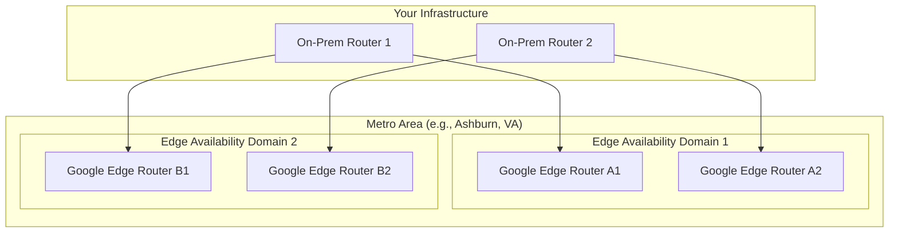
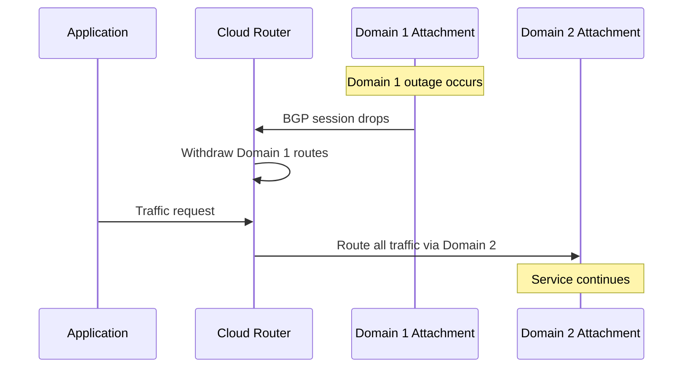

# How to Configure Redundant VLAN Attachments Across Different Edge Availability Domains in GCP

Author: [nawazdhandala](https://www.github.com/nawazdhandala)

Tags: GCP, Cloud Interconnect, VLAN, High Availability, Edge Availability Domain, Networking

Description: Learn how to configure redundant VLAN attachments across different Edge Availability Domains in GCP Cloud Interconnect for maximum availability.

---

If you are running production workloads over Cloud Interconnect in GCP, a single VLAN attachment is a single point of failure. Google designed the Interconnect infrastructure with Edge Availability Domains to provide physical redundancy, but you need to set up your VLAN attachments correctly to take advantage of it.

In this post, I will explain what Edge Availability Domains are, why they matter, and how to configure your VLAN attachments to get the full 99.99% availability SLA.

## What Are Edge Availability Domains?

Each Cloud Interconnect location has multiple Edge Availability Domains. These are physically separate failure domains within the same metro area. They have independent power, cooling, and networking infrastructure. If one domain has an outage, the other domain keeps running.

Think of them like availability zones for interconnect infrastructure. Google typically has two domains per metro (named `availability-domain-1` and `availability-domain-2`), though some metros may have more.



## SLA Requirements

Google defines clear rules for what qualifies for the 99.99% SLA:

| Configuration | SLA |
|--------------|-----|
| Single attachment, single domain | No SLA |
| Two attachments, same domain | 99.9% |
| Two attachments, different domains | 99.99% |
| Four attachments, two per domain | 99.99% (with on-prem redundancy) |

The critical point: **both Edge Availability Domains must have at least one active attachment** for the 99.99% SLA.

## Step 1: Identify Available Edge Availability Domains

First, check which domains are available at your Interconnect location:

```bash
# List interconnect locations with availability domain info
gcloud compute interconnects locations describe iad-zone1-1 \
    --format="yaml(name, availabilityZone, city, facilityProvider)"
```

The `availabilityZone` field tells you which Edge Availability Domain each location belongs to.

## Step 2: Set Up Dedicated Interconnects in Both Domains

For Dedicated Interconnect, you need separate physical connections in each domain:

```bash
# Interconnect in Edge Availability Domain 1
gcloud compute interconnects create ic-primary \
    --interconnect-type=DEDICATED \
    --link-type=LINK_TYPE_ETHERNET_10G_LR \
    --requested-link-count=1 \
    --location=iad-zone1-1 \
    --admin-enabled

# Interconnect in Edge Availability Domain 2
gcloud compute interconnects create ic-secondary \
    --interconnect-type=DEDICATED \
    --link-type=LINK_TYPE_ETHERNET_10G_LR \
    --requested-link-count=1 \
    --location=iad-zone2-1 \
    --admin-enabled
```

The location names typically indicate the domain. For example, `iad-zone1-1` is in domain 1 and `iad-zone2-1` is in domain 2.

## Step 3: Create Cloud Router

Create a single Cloud Router that both VLAN attachments will connect to. Using the same Cloud Router enables automatic failover through ECMP:

```bash
# Create Cloud Router for both attachments
gcloud compute routers create ic-router \
    --network=production-vpc \
    --region=us-east4 \
    --asn=16550
```

## Step 4: Create VLAN Attachments in Each Domain

Now create VLAN attachments, one on each Interconnect:

```bash
# VLAN attachment on Interconnect in Domain 1
gcloud compute interconnects attachments dedicated create attachment-domain1 \
    --interconnect=ic-primary \
    --router=ic-router \
    --region=us-east4 \
    --bandwidth=BPS_5G \
    --vlan=100 \
    --description="Primary attachment - Edge Domain 1"

# VLAN attachment on Interconnect in Domain 2
gcloud compute interconnects attachments dedicated create attachment-domain2 \
    --interconnect=ic-secondary \
    --router=ic-router \
    --region=us-east4 \
    --bandwidth=BPS_5G \
    --vlan=100 \
    --description="Redundant attachment - Edge Domain 2"
```

For Partner Interconnect, specify the domain explicitly:

```bash
# Partner attachment in Domain 1
gcloud compute interconnects attachments partner create partner-domain1 \
    --router=ic-router \
    --region=us-east4 \
    --edge-availability-domain=availability-domain-1

# Partner attachment in Domain 2
gcloud compute interconnects attachments partner create partner-domain2 \
    --router=ic-router \
    --region=us-east4 \
    --edge-availability-domain=availability-domain-2
```

## Step 5: Configure BGP Sessions

Each attachment needs its own BGP session:

```bash
# BGP for Domain 1 attachment
gcloud compute routers add-interface ic-router \
    --interface-name=if-domain1 \
    --interconnect-attachment=attachment-domain1 \
    --region=us-east4

gcloud compute routers add-bgp-peer ic-router \
    --peer-name=peer-domain1 \
    --interface=if-domain1 \
    --peer-ip-address=169.254.60.2 \
    --peer-asn=65001 \
    --region=us-east4

# BGP for Domain 2 attachment
gcloud compute routers add-interface ic-router \
    --interface-name=if-domain2 \
    --interconnect-attachment=attachment-domain2 \
    --region=us-east4

gcloud compute routers add-bgp-peer ic-router \
    --peer-name=peer-domain2 \
    --interface=if-domain2 \
    --peer-ip-address=169.254.61.2 \
    --peer-asn=65001 \
    --region=us-east4
```

## Step 6: Configure On-Premises Routers

On the on-premises side, configure BGP sessions for each VLAN attachment. Ideally, use two separate physical routers for maximum redundancy:

```text
! On-Prem Router 1 - connects to Domain 1
interface TenGigabitEthernet0/0.100
  encapsulation dot1Q 100
  ip address 169.254.60.2 255.255.255.248

router bgp 65001
  neighbor 169.254.60.1 remote-as 16550
  address-family ipv4
    neighbor 169.254.60.1 activate
    network 10.0.0.0 mask 255.255.0.0

! On-Prem Router 2 - connects to Domain 2
interface TenGigabitEthernet0/0.100
  encapsulation dot1Q 100
  ip address 169.254.61.2 255.255.255.248

router bgp 65001
  neighbor 169.254.61.1 remote-as 16550
  address-family ipv4
    neighbor 169.254.61.1 activate
    network 10.0.0.0 mask 255.255.0.0
```

## Step 7: Verify Redundancy Status

GCP provides a direct way to check if your configuration meets the SLA requirements:

```bash
# Check interconnect diagnostics
gcloud compute interconnects get-diagnostics ic-primary \
    --format="yaml(result)"

gcloud compute interconnects get-diagnostics ic-secondary \
    --format="yaml(result)"
```

Check BGP session health across both attachments:

```bash
# Verify both BGP sessions are up
gcloud compute routers get-status ic-router \
    --region=us-east4 \
    --format="table(result.bgpPeerStatus[].name, result.bgpPeerStatus[].status, result.bgpPeerStatus[].numLearnedRoutes)"
```

Both peers should show `UP` status.

## How Failover Works

When both attachments are active and connected to the same Cloud Router, traffic is distributed using ECMP (Equal-Cost Multi-Path routing). Here is what happens during different failure scenarios:

**Single attachment failure**: Cloud Router detects the BGP session drop within seconds. All traffic shifts to the remaining healthy attachment. No manual intervention needed.

**On-premises router failure**: If you have separate on-premises routers, the same BGP convergence happens. Traffic moves to the attachment connected through the surviving router.

**Full Edge Availability Domain outage**: All attachments in that domain go down. Traffic fails over to attachments in the other domain. This is why cross-domain redundancy matters.



## Controlling Traffic Distribution

By default, ECMP distributes traffic roughly equally across all attachments. If you want to prefer one attachment over the other (active/standby instead of active/active), you can use BGP route attributes.

On your on-premises router, advertise routes with different MED values:

```text
! Router 1 (preferred) - lower MED
route-map TO-GCP-PRIMARY permit 10
  set metric 100

! Router 2 (standby) - higher MED
route-map TO-GCP-STANDBY permit 10
  set metric 200
```

Cloud Router respects MED values, so traffic from GCP to on-premises will prefer the path with the lower MED. For traffic from on-premises to GCP, configure AS-path prepending or local-preference on your routers.

## Monitoring Redundancy Health

Set up alerts for BGP session drops so you know immediately when you lose redundancy:

```bash
# Create alert for BGP peer down
gcloud alpha monitoring policies create \
    --display-name="Interconnect BGP Down" \
    --condition-display-name="BGP peer not established" \
    --condition-filter='metric.type="compute.googleapis.com/interconnect/link/operational_status" AND resource.type="interconnect"' \
    --condition-comparison=COMPARISON_LT \
    --condition-threshold-value=1 \
    --condition-duration=60s \
    --notification-channels=projects/my-project/notificationChannels/12345
```

Also monitor bandwidth utilization on each attachment. If one attachment fails and all traffic moves to the other, you need to make sure the surviving attachment can handle the full load.

## Wrapping Up

Configuring redundant VLAN attachments across Edge Availability Domains is not optional for production Cloud Interconnect deployments. The setup requires attachments in at least two different domains, each with active BGP sessions. Cloud Router handles failover automatically through BGP convergence, typically within seconds. Always verify your redundancy status after initial setup and monitor BGP health continuously. Losing redundancy silently is worse than losing connectivity loudly - at least with the latter, you know there is a problem.
