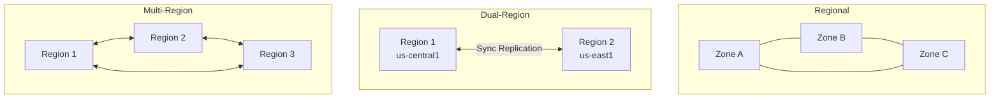

# How to Configure Regional and Multi-Regional Cloud Storage Buckets for Data Durability

Author: [nawazdhandala](https://www.github.com/nawazdhandala)

Tags: GCP, Cloud Storage, Data Durability, Multi-Regional, Storage Configuration

Description: Learn how to configure Google Cloud Storage buckets with regional and multi-regional storage classes for optimal data durability and availability.

---

Data durability is one of those things you do not think about until something goes wrong. Google Cloud Storage offers 99.999999999% (eleven nines) annual durability, which means if you store a million objects, you can statistically expect to lose one every 10 million years. But this durability guarantee depends on how you configure your buckets - the storage location, redundancy settings, and lifecycle policies all play a role.

This guide covers the practical decisions you need to make when configuring Cloud Storage buckets for different durability and availability requirements.

## Understanding Storage Locations

Cloud Storage offers three types of locations, and each provides different levels of geographic redundancy.

A regional bucket stores data in a single geographic region, like `us-central1`. Your data is replicated across multiple zones within that region, so it survives individual zone failures. This is the right choice when your data is consumed primarily by services in the same region.

A dual-region bucket stores data in two specific regions that you choose, like `us-central1` and `us-east1`. Data is replicated synchronously across both regions, giving you protection against a full regional outage.

A multi-region bucket stores data across a large geographic area - `US`, `EU`, or `ASIA`. Google automatically manages replication across multiple regions within that area. This gives you the highest availability for globally distributed workloads.



## Creating Regional Buckets

Regional buckets are the most common choice for application data that stays within one region.

```bash
# Create a regional bucket in us-central1
# The -l flag sets the location, -c sets the default storage class
gsutil mb -l us-central1 -c STANDARD gs://my-project-app-data

# Verify the bucket configuration
gsutil ls -L -b gs://my-project-app-data
```

You can also create buckets with the gcloud CLI, which gives you more configuration options.

```bash
# Create a regional bucket with uniform access control and versioning
gcloud storage buckets create gs://my-project-app-data \
  --location=us-central1 \
  --default-storage-class=STANDARD \
  --uniform-bucket-level-access \
  --enable-versioning \
  --public-access-prevention=enforced
```

Enabling versioning is important for durability. It means accidental overwrites or deletes do not destroy data - previous versions are preserved.

## Creating Multi-Regional Buckets

For data that needs to be highly available across a continent, use a multi-regional location.

```bash
# Create a multi-regional bucket covering the US
gcloud storage buckets create gs://my-project-global-assets \
  --location=US \
  --default-storage-class=STANDARD \
  --uniform-bucket-level-access \
  --enable-versioning
```

Multi-regional buckets have higher storage costs but provide automatic geo-redundancy and lower latency for geographically distributed consumers.

## Creating Dual-Region Buckets

Dual-region gives you a middle ground - you choose exactly which two regions hold your data.

```bash
# Create a dual-region bucket with turbo replication
gcloud storage buckets create gs://my-project-critical-data \
  --location=us-central1+us-east1 \
  --default-storage-class=STANDARD \
  --uniform-bucket-level-access \
  --enable-versioning \
  --placement=us-central1,us-east1
```

With turbo replication enabled, newly written objects reach both regions within 15 minutes (the Recovery Point Objective or RPO). Without turbo replication, the default RPO is 12 hours for dual-region and multi-region buckets.

```bash
# Enable turbo replication for faster cross-region sync
gcloud storage buckets update gs://my-project-critical-data \
  --rpo=ASYNC_TURBO
```

## Configuring Object Versioning

Versioning protects against accidental deletions and overwrites. When enabled, every overwrite creates a new version instead of replacing the object.

```bash
# Enable versioning on an existing bucket
gcloud storage buckets update gs://my-project-app-data --versioning

# List all versions of an object
gcloud storage ls --all-versions gs://my-project-app-data/config.json
```

Without cleanup, versions accumulate indefinitely. Set up a lifecycle rule to manage old versions.

```json
{
  "lifecycle": {
    "rule": [
      {
        "action": {
          "type": "Delete"
        },
        "condition": {
          "numNewerVersions": 5,
          "isLive": false
        }
      },
      {
        "action": {
          "type": "Delete"
        },
        "condition": {
          "daysSinceNoncurrentTime": 30,
          "isLive": false
        }
      }
    ]
  }
}
```

Apply the lifecycle configuration.

```bash
# Apply lifecycle rules to manage old object versions
gsutil lifecycle set lifecycle.json gs://my-project-app-data
```

This configuration keeps the 5 most recent non-current versions and deletes anything non-current older than 30 days.

## Storage Class Transitions

Not all data needs to stay in the most expensive storage class. Use lifecycle rules to automatically move data to cheaper tiers as it ages.

```json
{
  "lifecycle": {
    "rule": [
      {
        "action": {
          "type": "SetStorageClass",
          "storageClass": "NEARLINE"
        },
        "condition": {
          "age": 30,
          "matchesStorageClass": ["STANDARD"]
        }
      },
      {
        "action": {
          "type": "SetStorageClass",
          "storageClass": "COLDLINE"
        },
        "condition": {
          "age": 90,
          "matchesStorageClass": ["NEARLINE"]
        }
      },
      {
        "action": {
          "type": "SetStorageClass",
          "storageClass": "ARCHIVE"
        },
        "condition": {
          "age": 365,
          "matchesStorageClass": ["COLDLINE"]
        }
      }
    ]
  }
}
```

This moves objects through Standard to Nearline (30 days), Coldline (90 days), and Archive (365 days). The durability remains the same across all storage classes - only the access latency and pricing change.

## Object Retention and Holds

For compliance requirements, you can lock objects so they cannot be deleted or overwritten for a specified period.

```bash
# Set a retention policy of 7 years (in seconds)
gcloud storage buckets update gs://my-project-compliance-data \
  --retention-period=220752000

# Lock the retention policy (irreversible)
gcloud storage buckets update gs://my-project-compliance-data \
  --lock-retention-period
```

You can also place holds on individual objects.

```bash
# Place an event-based hold on a specific object
gcloud storage objects update gs://my-project-compliance-data/financial-report.pdf \
  --event-based-hold
```

## Monitoring Bucket Health

Set up monitoring to track your storage usage and detect potential issues.

```bash
# Create an alert for sudden drops in object count (potential mass deletion)
gcloud alpha monitoring policies create \
  --display-name="Storage Object Count Alert" \
  --condition-display-name="Object count dropped significantly" \
  --condition-filter='resource.type="gcs_bucket" AND metric.type="storage.googleapis.com/storage/object_count"' \
  --condition-threshold-value=1000 \
  --condition-threshold-comparison=COMPARISON_LT
```

## Choosing the Right Configuration

Here is a quick decision framework:

For application data consumed in one region, use a regional bucket with Standard storage. This gives the lowest latency and cost while still providing zone-level redundancy.

For backups and disaster recovery data, use a dual-region bucket with turbo replication. You get explicit control over which regions hold your data and fast cross-region sync.

For globally distributed static assets (images, videos, downloads), use a multi-regional bucket. The automatic geo-redundancy ensures users everywhere get fast access.

For archival and compliance data, use any location type with Archive storage class and retention policies. The location choice depends on where you need to access the data from, while the storage class optimizes for cost.

## Wrapping Up

Cloud Storage durability is excellent by default, but the choices you make around location, versioning, retention, and lifecycle management determine how well your data survives real-world scenarios like accidental deletions, regional outages, and compliance audits. The combination of multi-region or dual-region placement with versioning and lifecycle rules gives you a storage configuration that balances durability, availability, and cost effectively.
