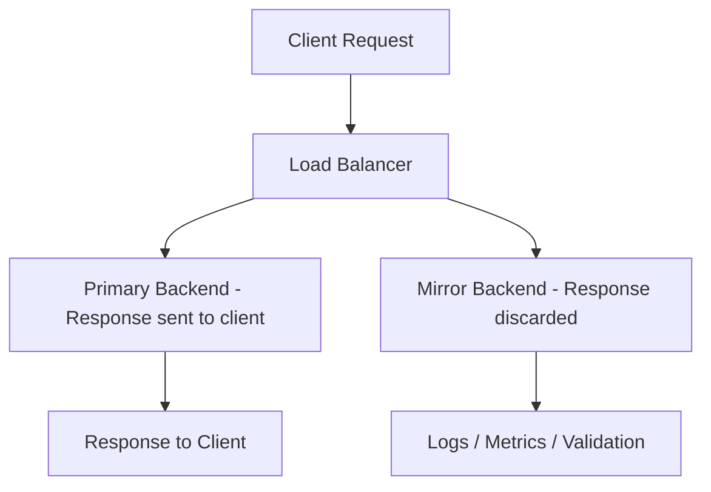

# How to Configure Request Mirroring for Shadow Testing on Google Cloud Load Balancer

Author: [nawazdhandala](https://www.github.com/nawazdhandala)

Tags: GCP, Load Balancer, Request Mirroring, Shadow Testing, Traffic Management

Description: Learn how to configure request mirroring on Google Cloud Load Balancer to send shadow traffic to a test backend for validation without affecting production users.

---

Shadow testing (also called traffic mirroring or dark launching) is a technique where you duplicate production traffic and send copies to a test backend. The test backend processes the requests, but its responses are discarded - only the primary backend's response goes back to the client. This gives you a way to validate new code against real production traffic patterns without any risk to users.

Google Cloud's Application Load Balancer supports request mirroring natively through URL map route rules. In this post, I will show you how to set it up and use it effectively.

## How Request Mirroring Works

When you enable request mirroring on a route rule, the load balancer sends every matching request to both the primary backend and the mirror backend. The client only sees the response from the primary backend. The mirror backend's response is ignored.



The mirror request is a fire-and-forget copy. It does not add latency to the client-facing request because the load balancer does not wait for the mirror backend to respond.

## When to Use Request Mirroring

Here are the scenarios where mirroring is valuable:

- **Pre-deployment validation**: Test a new version of your service with real traffic before switching users to it
- **Performance benchmarking**: Compare response times between the old and new version under realistic load
- **Data migration**: Verify that a new data store returns the same results as the old one
- **ML model comparison**: Send production inference requests to both the current model and a challenger model
- **Debugging**: Reproduce production issues in a test environment with real traffic

## Step 1 - Set Up the Primary and Mirror Backends

You need two separate backend services - one for production and one for the mirror.

```bash
# Create a health check
gcloud compute health-checks create http app-hc \
    --port=8080 \
    --request-path=/healthz

# Primary backend service (production)
gcloud compute backend-services create primary-backend \
    --global \
    --protocol=HTTP \
    --health-checks=app-hc \
    --port-name=http

# Mirror backend service (test/shadow)
gcloud compute backend-services create mirror-backend \
    --global \
    --protocol=HTTP \
    --health-checks=app-hc \
    --port-name=http

# Add instance groups to each backend service
gcloud compute backend-services add-backend primary-backend \
    --global \
    --instance-group=prod-mig \
    --instance-group-zone=us-central1-a \
    --balancing-mode=UTILIZATION \
    --max-utilization=0.8

gcloud compute backend-services add-backend mirror-backend \
    --global \
    --instance-group=shadow-mig \
    --instance-group-zone=us-central1-a \
    --balancing-mode=UTILIZATION \
    --max-utilization=0.8
```

## Step 2 - Configure the URL Map with Request Mirroring

The mirroring configuration goes in the route action of your URL map.

```bash
gcloud compute url-maps import app-url-map --source=- <<'EOF'
name: app-url-map
defaultService: projects/my-project/global/backendServices/primary-backend
hostRules:
  - hosts:
      - "*"
    pathMatcher: mirror-routes
pathMatchers:
  - name: mirror-routes
    defaultService: projects/my-project/global/backendServices/primary-backend
    routeRules:
      - priority: 1
        matchRules:
          - prefixMatch: "/"
        routeAction:
          weightedBackendServices:
            - backendService: projects/my-project/global/backendServices/primary-backend
              weight: 100
          requestMirrorPolicy:
            backendService: projects/my-project/global/backendServices/mirror-backend
EOF
```

That is it for the basic setup. Every request that matches the route rule now gets mirrored to the mirror backend.

## Step 3 - Mirror Only Specific Traffic

You probably do not want to mirror everything. You can scope the mirroring to specific paths, headers, or both.

```bash
gcloud compute url-maps import app-url-map --source=- <<'EOF'
name: app-url-map
defaultService: projects/my-project/global/backendServices/primary-backend
hostRules:
  - hosts:
      - "*"
    pathMatcher: selective-mirror
pathMatchers:
  - name: selective-mirror
    defaultService: projects/my-project/global/backendServices/primary-backend
    routeRules:
      # Mirror only API traffic
      - priority: 1
        matchRules:
          - prefixMatch: "/api/"
        routeAction:
          weightedBackendServices:
            - backendService: projects/my-project/global/backendServices/primary-backend
              weight: 100
          requestMirrorPolicy:
            backendService: projects/my-project/global/backendServices/mirror-backend
      # Do not mirror static assets or health checks
      - priority: 2
        matchRules:
          - prefixMatch: "/static/"
        service: projects/my-project/global/backendServices/primary-backend
      - priority: 3
        matchRules:
          - prefixMatch: "/healthz"
        service: projects/my-project/global/backendServices/primary-backend
EOF
```

## Step 4 - Build a Comparison Framework

The mirror backend's responses are not visible to users, so you need a way to capture and compare them. Here is an approach using a comparison proxy.

```python
# comparison_proxy.py - Captures both primary and mirror responses for comparison
from flask import Flask, request, jsonify
import hashlib
import json
import time
from google.cloud import bigquery

app = Flask(__name__)
bq_client = bigquery.Client()

# Table to store comparison results
TABLE_ID = "my-project.shadow_testing.comparisons"

@app.route("/", defaults={"path": ""}, methods=["GET", "POST", "PUT", "DELETE"])
@app.route("/<path:path>", methods=["GET", "POST", "PUT", "DELETE"])
def mirror_handler(path):
    """Handle mirrored requests and forward to the new version for comparison."""
    import requests as http_requests

    # Process the request with the new code
    start_time = time.time()
    try:
        # Your new version's logic goes here
        new_response = process_request_new_version(request)
        new_status = 200
        new_body = new_response
        new_latency = time.time() - start_time
    except Exception as e:
        new_status = 500
        new_body = str(e)
        new_latency = time.time() - start_time

    # Log the comparison data to BigQuery
    row = {
        "timestamp": time.time(),
        "path": f"/{path}",
        "method": request.method,
        "mirror_status": new_status,
        "mirror_latency_ms": new_latency * 1000,
        "request_hash": hashlib.md5(
            f"{request.method}:{path}:{request.get_data()}".encode()
        ).hexdigest()
    }

    # Insert into BigQuery for analysis
    errors = bq_client.insert_rows_json(TABLE_ID, [row])
    if errors:
        app.logger.error(f"BigQuery insert failed: {errors}")

    # Return 200 - the response is discarded anyway
    return jsonify({"status": "mirrored"}), 200

def process_request_new_version(req):
    """Process the request using the new version of your service."""
    # Implement your new version logic here
    pass

if __name__ == "__main__":
    app.run(host="0.0.0.0", port=8080)
```

## Step 5 - Analyze Shadow Test Results

Query the comparison data in BigQuery to understand how the new version behaves.

```sql
-- Compare error rates between shadow runs
SELECT
    DATE(TIMESTAMP_SECONDS(CAST(timestamp AS INT64))) AS date,
    COUNT(*) AS total_requests,
    COUNTIF(mirror_status = 200) AS successful,
    COUNTIF(mirror_status >= 500) AS errors,
    ROUND(COUNTIF(mirror_status >= 500) / COUNT(*) * 100, 2) AS error_rate_pct,
    ROUND(AVG(mirror_latency_ms), 2) AS avg_latency_ms,
    ROUND(APPROX_QUANTILES(mirror_latency_ms, 100)[OFFSET(99)], 2) AS p99_latency_ms
FROM
    `my-project.shadow_testing.comparisons`
WHERE
    timestamp > UNIX_SECONDS(TIMESTAMP_SUB(CURRENT_TIMESTAMP(), INTERVAL 24 HOUR))
GROUP BY
    date
ORDER BY
    date DESC;
```

Look at error rates per endpoint to find specific issues:

```sql
-- Find endpoints with high error rates in the mirror
SELECT
    path,
    method,
    COUNT(*) AS total_requests,
    COUNTIF(mirror_status >= 500) AS errors,
    ROUND(COUNTIF(mirror_status >= 500) / COUNT(*) * 100, 2) AS error_rate,
    ROUND(AVG(mirror_latency_ms), 2) AS avg_latency
FROM
    `my-project.shadow_testing.comparisons`
WHERE
    timestamp > UNIX_SECONDS(TIMESTAMP_SUB(CURRENT_TIMESTAMP(), INTERVAL 24 HOUR))
GROUP BY
    path, method
HAVING
    errors > 0
ORDER BY
    error_rate DESC;
```

## Important Considerations

There are a few things to watch out for with request mirroring:

**Write operations get duplicated**. If a mirrored POST request creates a record in a database, you will get duplicate writes. Your mirror backend should either use a separate database, have write operations disabled, or use dry-run mode.

```python
# Example: dry-run mode in the mirror backend
import os

DRY_RUN = os.environ.get("SHADOW_MODE", "false") == "true"

def create_user(user_data):
    if DRY_RUN:
        # Validate and process but do not persist
        validated = validate_user(user_data)
        log_shadow_result("create_user", validated)
        return {"status": "dry_run", "would_create": validated}
    else:
        # Normal operation
        return db.users.insert(user_data)
```

**Mirror traffic increases load on your network**. Every mirrored request doubles the inbound traffic from the load balancer's perspective. Size your mirror backend appropriately.

**Headers are modified**. The load balancer adds headers to mirrored requests to identify them. The `X-Mirrored-From` header contains the original backend service name. Your mirror backend can use this for logging.

**Authentication tokens travel to the mirror**. If your requests contain auth tokens in headers, they will be sent to the mirror backend. Make sure the mirror environment is secure and that you are comfortable with tokens being present there.

## Turning Off Mirroring

When your shadow testing is complete, remove the mirror policy from the URL map.

```bash
gcloud compute url-maps import app-url-map --source=- <<'EOF'
name: app-url-map
defaultService: projects/my-project/global/backendServices/primary-backend
hostRules:
  - hosts:
      - "*"
    pathMatcher: no-mirror
pathMatchers:
  - name: no-mirror
    defaultService: projects/my-project/global/backendServices/primary-backend
EOF
```

## Wrapping Up

Request mirroring on GCP's Application Load Balancer gives you a safe way to test new code with real production traffic. The setup is minimal - just add a `requestMirrorPolicy` to your URL map route rule. The hard part is building the comparison framework to actually validate the mirror backend's behavior. Focus on capturing response status codes and latency in a queryable store like BigQuery, and build dashboards that highlight differences between the primary and mirror backends. Once you are confident the mirror version handles traffic correctly, you can switch over using weighted routing for a gradual transition.
