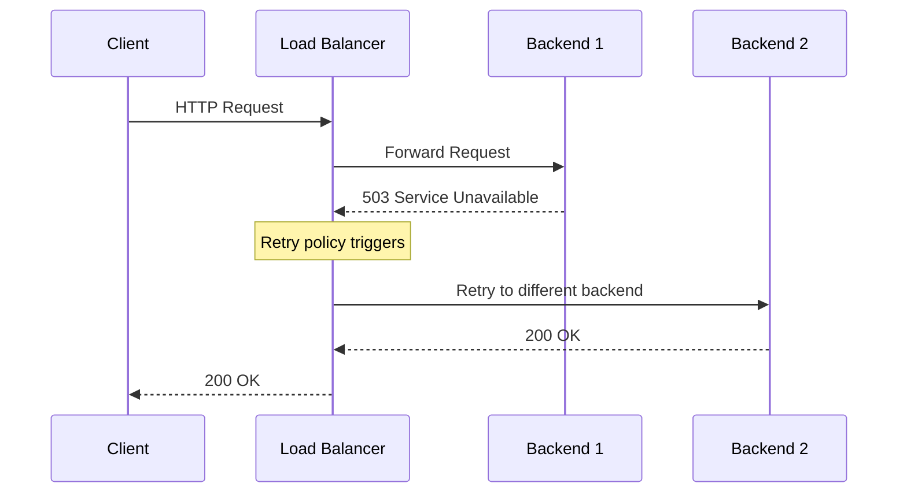
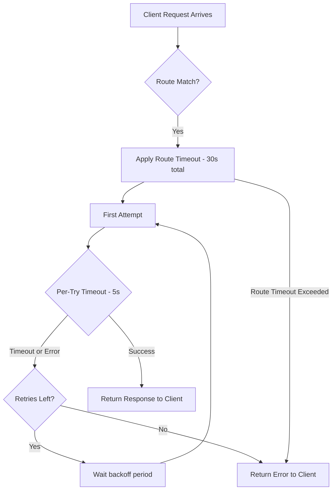

# How to Configure Retry Policies and Timeout Settings on Google Cloud Application Load Balancer

Author: [nawazdhandala](https://www.github.com/nawazdhandala)

Tags: GCP, Load Balancer, Retry Policies, Timeout Settings, Google Cloud Networking

Description: Learn how to configure retry policies and timeout settings on Google Cloud Application Load Balancer to improve reliability and handle transient failures gracefully.

---

When running production services behind a Google Cloud Application Load Balancer, transient failures are inevitable. Backend instances restart, network blips happen, and services occasionally return 503 errors during deployments. The difference between a frustrating user experience and a seamless one often comes down to how well you configure retry policies and timeout settings.

In this post, I will walk through the practical steps to set up retry logic and tune timeouts so your load balancer handles failures gracefully without causing cascading issues.

## Why Retry Policies and Timeouts Matter

Without proper retry configuration, a single failed request from a healthy backend during a rolling deployment means your user sees an error page. With retry policies, the load balancer can automatically resend that request to a different backend, and the user never notices a thing.

Timeouts are the other side of this coin. Set them too low and you cut off legitimate slow responses. Set them too high and a hung backend ties up connections and eventually brings everything down. Finding the right balance takes some thought about your application's behavior.

## Understanding the Retry Architecture

Google Cloud Application Load Balancer supports retries at the URL map level through route rules. Each route rule can have its own retry policy, which means you can be aggressive with retries on idempotent GET endpoints and conservative on POST endpoints that modify data.

Here is a diagram showing how the retry flow works:



## Configuring Retry Policies via gcloud

The retry policy is defined within the URL map resource. Let me show you how to set it up using a YAML configuration file.

First, create a URL map config file that includes retry settings:

```yaml
# url-map-config.yaml
# Defines the URL map with retry policies for the application load balancer
defaultService: projects/my-project/global/backendServices/my-backend-service
hostRules:
  - hosts:
      - "api.example.com"
    pathMatcher: api-matcher
pathMatchers:
  - name: api-matcher
    defaultService: projects/my-project/global/backendServices/my-backend-service
    routeRules:
      - priority: 1
        matchRules:
          - prefixMatch: /api/v1/
        routeAction:
          # Configure retry policy for API routes
          retryPolicy:
            retryConditions:
              - "5xx"           # Retry on server errors
              - "gateway-error" # Retry on 502, 503, 504
              - "connect-failure" # Retry on connection failures
              - "reset"         # Retry on connection resets
            numRetries: 3       # Maximum number of retry attempts
            perTryTimeout:
              seconds: 5        # Timeout for each individual attempt
          timeout:
            seconds: 30         # Overall timeout for the request including retries
          weightedBackendServices:
            - backendService: projects/my-project/global/backendServices/my-backend-service
              weight: 100
```

Now apply this configuration:

```bash
# Import the URL map configuration
gcloud compute url-maps import my-url-map \
    --source=url-map-config.yaml \
    --global
```

## Choosing the Right Retry Conditions

Google Cloud supports several retry conditions, and picking the right ones is critical. Here is what each one does:

- **5xx** - Retries when the backend returns any 5xx status code. Use this broadly for read-only endpoints.
- **gateway-error** - Retries specifically on 502, 503, and 504. This is more targeted than 5xx and is often the safest default.
- **connect-failure** - Retries when the load balancer cannot establish a connection to the backend. Almost always safe to enable.
- **reset** - Retries when the connection is reset before any response headers are received. Safe for idempotent requests.
- **refused-stream** - Retries when the backend refuses the HTTP/2 stream. Useful for gRPC services.
- **retriable-4xx** - Retries on HTTP 409 Conflict responses. Enable this only if your application logic supports it.

For most web applications, I recommend starting with this combination:

```yaml
# Safe default retry conditions for most web applications
retryConditions:
  - "gateway-error"
  - "connect-failure"
  - "reset"
```

## Configuring Backend Service Timeouts

Beyond the URL map retry settings, the backend service itself has timeout configurations that interact with your retry policy.

```bash
# Set the backend service timeout to 30 seconds
# This is the maximum time the load balancer waits for a response from the backend
gcloud compute backend-services update my-backend-service \
    --global \
    --timeout=30s
```

The backend service timeout sets the upper bound for how long the load balancer waits for a complete response. This is different from the per-try timeout in the retry policy. The per-try timeout controls each individual attempt, while the backend service timeout is the overall limit.

## Setting Up Connection Draining Timeouts

When backends are removed from the pool during scaling events or deployments, connection draining gives in-flight requests time to complete:

```bash
# Configure connection draining timeout to 300 seconds
# This allows existing connections to finish before the backend is fully removed
gcloud compute backend-services update my-backend-service \
    --global \
    --connection-draining-timeout=300s
```

## Timeout Interaction Model

Understanding how different timeouts interact prevents confusing behavior in production:



The key insight here is that the route-level timeout encompasses all retry attempts. If your route timeout is 30 seconds and your per-try timeout is 5 seconds with 3 retries, the worst case is about 15 seconds of actual waiting (3 tries at 5 seconds each) plus backoff time. But if the route timeout fires first, all retries stop immediately.

## Configuring via Terraform

If you manage your infrastructure with Terraform, here is the equivalent configuration:

```hcl
# Define the URL map with retry policies using Terraform
resource "google_compute_url_map" "app_lb" {
  name            = "app-load-balancer"
  default_service = google_compute_backend_service.default.id

  host_rule {
    hosts        = ["api.example.com"]
    path_matcher = "api-routes"
  }

  path_matcher {
    name            = "api-routes"
    default_service = google_compute_backend_service.default.id

    route_rules {
      priority = 1
      match_rules {
        prefix_match = "/api/"
      }
      route_action {
        # Retry configuration for API endpoints
        retry_policy {
          retry_conditions = [
            "gateway-error",
            "connect-failure",
            "reset",
          ]
          num_retries = 3
          per_try_timeout {
            seconds = 5
          }
        }
        # Overall request timeout including all retries
        timeout {
          seconds = 30
        }
        weighted_backend_services {
          backend_service = google_compute_backend_service.default.id
          weight          = 100
        }
      }
    }
  }
}

# Backend service with its own timeout settings
resource "google_compute_backend_service" "default" {
  name                  = "my-backend-service"
  protocol              = "HTTP"
  timeout_sec           = 30
  connection_draining_timeout_sec = 300

  backend {
    group = google_compute_instance_group_manager.default.instance_group
  }

  health_checks = [google_compute_health_check.default.id]
}
```

## Best Practices for Production

After running load balancers with retry policies across several projects, here are the patterns that have worked well:

**Start conservative with retries.** Begin with 1-2 retries and only increase if monitoring shows you need more. Too many retries can amplify load during outages.

**Always set per-try timeouts.** Without per-try timeouts, a single slow backend can consume the entire route timeout budget, leaving no room for retries.

**Use different policies for different endpoints.** Read endpoints can safely retry on most errors. Write endpoints should only retry on connection failures where you know the request never reached the backend.

**Monitor retry rates.** Google Cloud Monitoring exposes retry metrics. If your retry rate is consistently above 5%, that signals a backend health problem you should fix rather than mask with retries.

**Account for retry amplification.** If you have 3 retries configured and 100 requests per second hit a failing backend, your backends suddenly see up to 400 requests per second. Make sure your backends can handle the extra load.

## Monitoring Retry Behavior

Set up a monitoring dashboard to track retry effectiveness:

```bash
# Create an alerting policy for high retry rates
# This fires when more than 10% of requests require retries
gcloud monitoring policies create \
    --display-name="High LB Retry Rate" \
    --condition-display-name="Retry rate above 10%" \
    --condition-filter='resource.type="https_lb_rule" AND metric.type="loadbalancing.googleapis.com/https/request_count"' \
    --condition-threshold-value=0.1 \
    --notification-channels=projects/my-project/notificationChannels/12345
```

## Wrapping Up

Configuring retry policies and timeouts on Google Cloud Application Load Balancer is one of those things that takes 30 minutes to set up and saves you countless hours of debugging failed requests in production. The key is matching your retry behavior to your application's semantics - retry aggressively on safe reads, conservatively on writes, and always monitor the impact. Start with the gateway-error and connect-failure retry conditions, set reasonable timeouts, and adjust from there based on what your metrics tell you.
