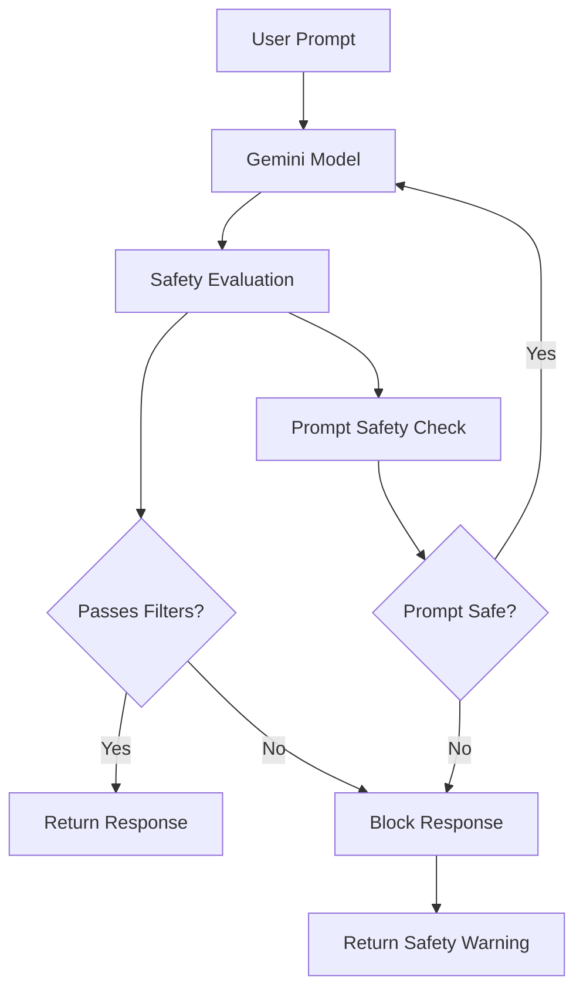

# How to Configure Safety Settings and Content Filtering for Gemini Models on Vertex AI

Author: [nawazdhandala](https://www.github.com/nawazdhandala)

Tags: GCP, Vertex AI, Gemini, Safety Settings, Content Filtering, AI Safety, Google Cloud

Description: Configure safety settings and content filtering for Gemini models on Vertex AI to control what content your application generates and blocks.

---

When you deploy Gemini in a production application, the default safety settings may not match your requirements. An internal code assistant needs different filtering than a customer-facing chatbot. A medical information system has different safety needs than a creative writing tool. Vertex AI lets you configure safety settings and content filtering at the API level, giving you control over what Gemini will and will not generate. Here is how to set it up properly.

## Understanding Gemini's Safety Categories

Gemini evaluates content across several harm categories:

- **Harassment**: Content that targets individuals or groups
- **Hate speech**: Content promoting discrimination based on identity
- **Sexually explicit**: Sexual content ranging from suggestive to graphic
- **Dangerous content**: Instructions for harmful activities

Each category has a configurable blocking threshold that determines how aggressively content is filtered.



## Step 1: Basic Safety Configuration

Configure safety settings when making API calls:

```python
import vertexai
from vertexai.generative_models import GenerativeModel, SafetySetting, HarmCategory, HarmBlockThreshold

vertexai.init(project="your-project-id", location="us-central1")

# Define safety settings for each harm category
# These control how aggressively content is filtered
safety_settings = [
    SafetySetting(
        category=HarmCategory.HARM_CATEGORY_HARASSMENT,
        threshold=HarmBlockThreshold.BLOCK_MEDIUM_AND_ABOVE,
    ),
    SafetySetting(
        category=HarmCategory.HARM_CATEGORY_HATE_SPEECH,
        threshold=HarmBlockThreshold.BLOCK_MEDIUM_AND_ABOVE,
    ),
    SafetySetting(
        category=HarmCategory.HARM_CATEGORY_SEXUALLY_EXPLICIT,
        threshold=HarmBlockThreshold.BLOCK_LOW_AND_ABOVE,  # Strictest for this category
    ),
    SafetySetting(
        category=HarmCategory.HARM_CATEGORY_DANGEROUS_CONTENT,
        threshold=HarmBlockThreshold.BLOCK_MEDIUM_AND_ABOVE,
    ),
]

model = GenerativeModel(
    model_name="gemini-2.0-flash",
    safety_settings=safety_settings,
)

response = model.generate_content("Write a product description for running shoes")
print(response.text)
```

## Step 2: Understanding Blocking Thresholds

The available thresholds from least to most restrictive:

```python
# Threshold options and what they mean
thresholds = {
    "BLOCK_NONE": "No content is blocked (maximum permissiveness)",
    "BLOCK_ONLY_HIGH": "Only blocks content with high probability of harm",
    "BLOCK_MEDIUM_AND_ABOVE": "Blocks medium and high probability (recommended default)",
    "BLOCK_LOW_AND_ABOVE": "Blocks low, medium, and high (most restrictive)",
}

# Example: Different configurations for different use cases
def get_safety_config(use_case):
    """Return appropriate safety settings based on the application type.
    Customer-facing apps need stricter filtering than internal tools."""

    configs = {
        "customer_chatbot": [
            SafetySetting(category=HarmCategory.HARM_CATEGORY_HARASSMENT,
                         threshold=HarmBlockThreshold.BLOCK_LOW_AND_ABOVE),
            SafetySetting(category=HarmCategory.HARM_CATEGORY_HATE_SPEECH,
                         threshold=HarmBlockThreshold.BLOCK_LOW_AND_ABOVE),
            SafetySetting(category=HarmCategory.HARM_CATEGORY_SEXUALLY_EXPLICIT,
                         threshold=HarmBlockThreshold.BLOCK_LOW_AND_ABOVE),
            SafetySetting(category=HarmCategory.HARM_CATEGORY_DANGEROUS_CONTENT,
                         threshold=HarmBlockThreshold.BLOCK_LOW_AND_ABOVE),
        ],
        "internal_code_assistant": [
            SafetySetting(category=HarmCategory.HARM_CATEGORY_HARASSMENT,
                         threshold=HarmBlockThreshold.BLOCK_MEDIUM_AND_ABOVE),
            SafetySetting(category=HarmCategory.HARM_CATEGORY_HATE_SPEECH,
                         threshold=HarmBlockThreshold.BLOCK_MEDIUM_AND_ABOVE),
            SafetySetting(category=HarmCategory.HARM_CATEGORY_SEXUALLY_EXPLICIT,
                         threshold=HarmBlockThreshold.BLOCK_MEDIUM_AND_ABOVE),
            SafetySetting(category=HarmCategory.HARM_CATEGORY_DANGEROUS_CONTENT,
                         threshold=HarmBlockThreshold.BLOCK_ONLY_HIGH),  # Less strict for technical content
        ],
        "content_moderation_tool": [
            # Moderation tools need to see the content they are moderating
            SafetySetting(category=HarmCategory.HARM_CATEGORY_HARASSMENT,
                         threshold=HarmBlockThreshold.BLOCK_ONLY_HIGH),
            SafetySetting(category=HarmCategory.HARM_CATEGORY_HATE_SPEECH,
                         threshold=HarmBlockThreshold.BLOCK_ONLY_HIGH),
            SafetySetting(category=HarmCategory.HARM_CATEGORY_SEXUALLY_EXPLICIT,
                         threshold=HarmBlockThreshold.BLOCK_ONLY_HIGH),
            SafetySetting(category=HarmCategory.HARM_CATEGORY_DANGEROUS_CONTENT,
                         threshold=HarmBlockThreshold.BLOCK_ONLY_HIGH),
        ],
    }

    return configs.get(use_case, configs["customer_chatbot"])
```

## Step 3: Handle Blocked Responses Gracefully

When content is blocked, your application should handle it properly rather than crashing:

```python
def safe_generate(model, prompt, fallback_message="I cannot help with that request."):
    """Generate content with proper handling for safety-blocked responses.
    Returns the generated text or a safe fallback message."""

    try:
        response = model.generate_content(prompt)

        # Check if the response was blocked by safety filters
        if not response.candidates:
            return {
                "text": fallback_message,
                "blocked": True,
                "reason": "No candidates returned - content may have been filtered",
            }

        candidate = response.candidates[0]

        # Check the finish reason
        if candidate.finish_reason.name == "SAFETY":
            # Content was blocked by safety filters
            safety_ratings = {}
            for rating in candidate.safety_ratings:
                safety_ratings[rating.category.name] = {
                    "probability": rating.probability.name,
                    "blocked": rating.blocked,
                }

            return {
                "text": fallback_message,
                "blocked": True,
                "reason": "Blocked by safety filters",
                "safety_ratings": safety_ratings,
            }

        return {
            "text": response.text,
            "blocked": False,
            "safety_ratings": {
                rating.category.name: rating.probability.name
                for rating in candidate.safety_ratings
            },
        }

    except Exception as e:
        return {
            "text": fallback_message,
            "blocked": True,
            "reason": f"Error: {str(e)}",
        }

# Usage
result = safe_generate(model, "Explain how to secure a web application against SQL injection")
if result["blocked"]:
    print(f"Content blocked: {result['reason']}")
else:
    print(result["text"])
```

## Step 4: Add Custom Content Filtering

Layer your own content filtering on top of Gemini's built-in safety:

```python
# custom_filter.py - Additional content filtering beyond Gemini's defaults
import re

class ContentFilter:
    """Custom content filter that runs before and after Gemini API calls.
    Catches domain-specific content that Gemini's general filters might miss."""

    def __init__(self):
        # Blocked topics specific to your application
        self.blocked_input_patterns = [
            r"(?i)competitor\s+internal\s+data",  # Block requests about competitor internals
            r"(?i)bypass\s+(security|auth|filter)",  # Block filter bypass attempts
            r"(?i)generate\s+fake\s+(id|credential)",  # Block fake document requests
        ]

        # Patterns to redact from outputs
        self.output_redaction_patterns = [
            r"\b\d{3}-\d{2}-\d{4}\b",  # SSN pattern
            r"\b\d{4}[\s-]?\d{4}[\s-]?\d{4}[\s-]?\d{4}\b",  # Credit card pattern
            r"\b[A-Za-z0-9._%+-]+@[A-Za-z0-9.-]+\.[A-Z|a-z]{2,}\b",  # Email addresses
        ]

        # Required disclaimers for certain topics
        self.disclaimer_triggers = {
            "medical": "Note: This is general information only and not medical advice. Consult a healthcare professional.",
            "legal": "Note: This is general information only and not legal advice. Consult a qualified attorney.",
            "financial": "Note: This is general information only and not financial advice. Consult a financial advisor.",
        }

    def filter_input(self, prompt):
        """Check the input prompt against custom blocked patterns.
        Returns (is_allowed, reason) tuple."""
        for pattern in self.blocked_input_patterns:
            if re.search(pattern, prompt):
                return False, f"Input matches blocked pattern"
        return True, "OK"

    def filter_output(self, response_text):
        """Redact sensitive patterns from the model's output."""
        filtered = response_text
        for pattern in self.output_redaction_patterns:
            filtered = re.sub(pattern, "[REDACTED]", filtered)
        return filtered

    def add_disclaimers(self, response_text, prompt):
        """Add required disclaimers based on the topic."""
        disclaimers = []
        prompt_lower = prompt.lower()
        for trigger, disclaimer in self.disclaimer_triggers.items():
            if trigger in prompt_lower:
                disclaimers.append(disclaimer)

        if disclaimers:
            return response_text + "\n\n" + "\n".join(disclaimers)
        return response_text
```

## Step 5: Integrate Everything into a Service

Build a complete content generation service with all safety layers:

```python
# safe_generation_service.py - Production content generation with full safety stack
from flask import Flask, request, jsonify
import vertexai
from vertexai.generative_models import GenerativeModel, SafetySetting, HarmCategory, HarmBlockThreshold

app = Flask(__name__)

vertexai.init(project="your-project-id", location="us-central1")
content_filter = ContentFilter()

# Initialize models with different safety configs per endpoint
models = {}

def get_model(use_case):
    """Get or create a model instance with appropriate safety settings."""
    if use_case not in models:
        safety_config = get_safety_config(use_case)
        models[use_case] = GenerativeModel(
            model_name="gemini-2.0-flash",
            safety_settings=safety_config,
        )
    return models[use_case]


@app.route("/generate", methods=["POST"])
def generate():
    """Generate content with full safety filtering pipeline."""
    data = request.get_json()
    prompt = data.get("prompt", "")
    use_case = data.get("use_case", "customer_chatbot")

    # Layer 1: Custom input filtering
    is_allowed, reason = content_filter.filter_input(prompt)
    if not is_allowed:
        return jsonify({
            "text": "I cannot process that request.",
            "blocked": True,
            "blocked_by": "input_filter",
        }), 200

    # Layer 2: Gemini with safety settings
    model = get_model(use_case)
    result = safe_generate(model, prompt)

    if result["blocked"]:
        return jsonify(result), 200

    # Layer 3: Custom output filtering
    filtered_text = content_filter.filter_output(result["text"])
    filtered_text = content_filter.add_disclaimers(filtered_text, prompt)

    return jsonify({
        "text": filtered_text,
        "blocked": False,
        "safety_ratings": result.get("safety_ratings", {}),
    }), 200
```

## Step 6: Log and Monitor Safety Events

Track when content is blocked to identify patterns and tune your filters:

```python
# Log safety events for analysis
from google.cloud import bigquery
from datetime import datetime

bq_client = bigquery.Client()

def log_safety_event(prompt_hash, use_case, blocked, blocked_by, safety_ratings):
    """Log blocked content events for monitoring and filter tuning."""
    record = {
        "timestamp": datetime.utcnow().isoformat(),
        "prompt_hash": prompt_hash,  # Hash, not the actual prompt, for privacy
        "use_case": use_case,
        "blocked": blocked,
        "blocked_by": blocked_by,
        "safety_ratings": json.dumps(safety_ratings),
    }

    table_ref = bq_client.dataset("ai_safety").table("filter_events")
    bq_client.insert_rows_json(table_ref, [record])
```

Query for safety monitoring dashboards:

```sql
-- Daily safety filter activity
SELECT
    DATE(timestamp) AS date,
    use_case,
    COUNTIF(blocked = TRUE) AS blocked_requests,
    COUNTIF(blocked = FALSE) AS passed_requests,
    ROUND(COUNTIF(blocked = TRUE) / COUNT(*) * 100, 2) AS block_rate_pct,
    -- Break down blocks by source
    COUNTIF(blocked_by = 'input_filter') AS blocked_by_input_filter,
    COUNTIF(blocked_by = 'gemini_safety') AS blocked_by_gemini,
    COUNTIF(blocked_by = 'output_filter') AS blocked_by_output_filter
FROM `your-project.ai_safety.filter_events`
WHERE timestamp > TIMESTAMP_SUB(CURRENT_TIMESTAMP(), INTERVAL 30 DAY)
GROUP BY 1, 2
ORDER BY 1 DESC;
```

## Tuning Your Safety Settings

Finding the right balance requires iteration:

1. Start with strict settings (BLOCK_LOW_AND_ABOVE for customer-facing)
2. Monitor the block rate - if it is above 5%, your filters might be too aggressive
3. Review blocked content samples (hashed for privacy) to identify false positives
4. Gradually relax specific categories where false positives are common
5. Never relax settings based on a single request - look for patterns

## Monitoring

Use OneUptime to monitor your content generation service availability, latency, and error rates. Set up alerts for sudden spikes in block rates, which could indicate either an attack or a filter misconfiguration. Also monitor for drops in block rates, which could signal that safety filters have been accidentally disabled.

## Summary

Configuring safety settings for Gemini on Vertex AI is about matching your filtering to your application's risk profile. Use Gemini's built-in safety categories as the foundation, layer custom filtering on top for domain-specific requirements, and monitor everything to catch issues early. The key is treating safety configuration as an ongoing process, not a one-time setup - your filters should evolve as you learn from production traffic patterns.
