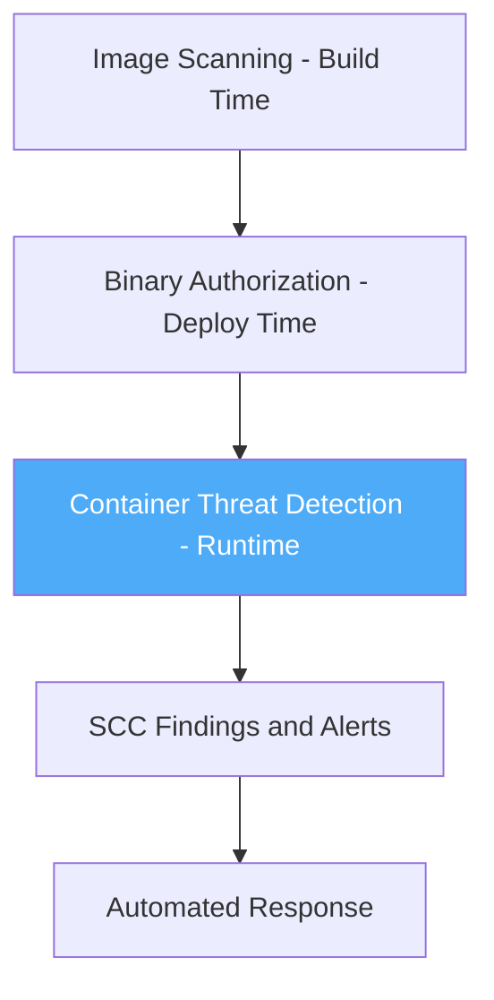

# How to Configure SCC Container Threat Detection for GKE Clusters

Author: [nawazdhandala](https://www.github.com/nawazdhandala)

Tags: GCP, Security Command Center, Container Threat Detection, GKE, Kubernetes Security

Description: Step-by-step guide to enabling and configuring Container Threat Detection in Security Command Center for monitoring GKE clusters against runtime threats.

---

Container Threat Detection (CTD) is one of the most practical security features available for GKE clusters in Google Cloud. It runs as part of Security Command Center and monitors your containers at runtime for suspicious behavior like reverse shells, cryptocurrency mining, and malicious binary execution. Unlike image scanning which catches known vulnerabilities before deployment, CTD watches what your containers actually do after they start running.

This guide walks through enabling CTD, understanding its detectors, fine-tuning detection, and responding to findings.

## What Container Threat Detection Monitors

CTD uses a lightweight agent (DaemonSet) deployed to your GKE nodes that monitors system calls and process activity. It detects several categories of threats:

- **Malicious scripts** - execution of known malicious scripts or interpreters
- **Reverse shells** - processes that redirect stdin/stdout to network sockets
- **Cryptocurrency miners** - processes matching known mining software signatures
- **Malicious binaries** - execution of binaries flagged by threat intelligence
- **Unexpected child processes** - anomalous process trees within containers
- **Added binary execution** - binaries dropped into a running container and executed

## Prerequisites

Before enabling CTD, verify your environment meets these requirements:

1. Security Command Center Premium or Enterprise tier is active at the organization level
2. GKE clusters are running version 1.24 or later
3. You have the `securitycenter.containerthreatdetectionsettings.update` permission
4. Container-Optimized OS (COS) is used on nodes (CTD does not support all node images)

## Enabling Container Threat Detection

CTD can be enabled at the organization, folder, or project level. Enabling at the organization level is the simplest approach for broad coverage.

This command enables CTD for your entire organization.

```bash
# Enable Container Threat Detection at the organization level
gcloud scc settings services enable \
  --organization=123456789 \
  --service=CONTAINER_THREAT_DETECTION
```

To enable it for a specific project instead, use the project flag.

```bash
# Enable CTD for a specific project containing GKE clusters
gcloud scc settings services enable \
  --project=my-gke-project \
  --service=CONTAINER_THREAT_DETECTION
```

## Verifying CTD Deployment on Clusters

After enabling CTD, verify that the detection agent is running on your GKE nodes. The agent deploys as a DaemonSet in the `kube-system` namespace.

```bash
# Check that the CTD DaemonSet is running on all nodes
kubectl get daemonset container-watcher -n kube-system

# Verify pods are running on each node
kubectl get pods -n kube-system -l app=container-watcher -o wide
```

If the DaemonSet is not present, check that your cluster meets the requirements. The most common issue is using Ubuntu nodes instead of COS.

## Enabling Individual Detectors

CTD has multiple detection modules that can be individually toggled. This is useful when you need to disable a specific detector that generates noise in your environment while keeping the rest active.

This command lists the current state of all CTD detectors.

```bash
# List all CTD detector states for your organization
gcloud scc settings services modules list \
  --organization=123456789 \
  --service=CONTAINER_THREAT_DETECTION \
  --format="table(name, moduleEnablementState)"
```

To disable a specific detector, use the update command.

```bash
# Disable the Added Binary Executed detector if it generates false positives
gcloud scc settings services modules enable-state-update \
  --organization=123456789 \
  --service=CONTAINER_THREAT_DETECTION \
  --module=ADDED_BINARY_EXECUTED \
  --enablement-state=DISABLED
```

## Configuring CTD with Terraform

For infrastructure-as-code management, Terraform can configure CTD settings alongside your cluster definitions.

```hcl
# Enable Container Threat Detection for a specific project
resource "google_scc_project_service" "ctd" {
  project = "my-gke-project"
  service = "CONTAINER_THREAT_DETECTION"
}

# GKE cluster with security features that complement CTD
resource "google_container_cluster" "secured_cluster" {
  name     = "secured-cluster"
  location = "us-central1"
  project  = "my-gke-project"

  # Use COS nodes which are required for CTD
  node_config {
    image_type = "COS_CONTAINERD"

    # Workload Identity for secure pod authentication
    workload_metadata_config {
      mode = "GKE_METADATA"
    }

    # Shielded nodes add boot integrity monitoring
    shielded_instance_config {
      enable_secure_boot          = true
      enable_integrity_monitoring = true
    }
  }

  # Enable Binary Authorization for image verification
  binary_authorization {
    evaluation_mode = "PROJECT_SINGLETON_POLICY_ENFORCE"
  }

  # Enable Security Posture for additional runtime security
  security_posture_config {
    mode               = "BASIC"
    vulnerability_mode = "VULNERABILITY_ENTERPRISE"
  }
}
```

## Understanding CTD Findings

When CTD detects a threat, it generates a finding in SCC with detailed context. Here is what a typical finding includes:

- **Category** - the type of threat (e.g., `REVERSE_SHELL`, `ADDED_BINARY_EXECUTED`)
- **Pod name and namespace** - which workload triggered the detection
- **Container name and image** - the specific container involved
- **Process details** - the command line, binary path, and parent process
- **Node information** - which GKE node the container runs on

This command retrieves recent CTD findings with their details.

```bash
# List active CTD findings with container context
gcloud scc findings list 123456789 \
  --source=CONTAINER_THREAT_DETECTION \
  --filter='state="ACTIVE"' \
  --format="table(resourceName, category, severity, sourceProperties.Pod_Name, sourceProperties.Container_Name, sourceProperties.Process_Binary)" \
  --limit=20
```

## Setting Up Real-Time Alerts

For critical CTD findings, you want immediate notification rather than periodic dashboard checks. Set up a notification config that pushes to Pub/Sub.

```bash
# Create notification for high-severity container threats
gcloud scc notifications create ctd-critical-alerts \
  --organization=123456789 \
  --pubsub-topic=projects/security-project/topics/ctd-alerts \
  --filter='source="CONTAINER_THREAT_DETECTION" AND (severity="CRITICAL" OR severity="HIGH") AND state="ACTIVE"'
```

Then wire up a Cloud Function to process these notifications and alert your team.

```python
# Cloud Function to process CTD alerts and notify via Slack
import json
import base64
import requests

# Slack webhook URL for security alerts channel
SLACK_WEBHOOK = "https://hooks.slack.com/services/YOUR/WEBHOOK/URL"

def process_ctd_alert(event, context):
    """Process CTD finding from Pub/Sub and send Slack alert."""
    # Decode the Pub/Sub message
    pubsub_message = base64.b64decode(event['data']).decode('utf-8')
    finding = json.loads(pubsub_message)

    # Extract relevant fields from the finding
    category = finding.get('category', 'Unknown')
    severity = finding.get('severity', 'Unknown')
    pod_name = finding.get('sourceProperties', {}).get('Pod_Name', 'Unknown')
    namespace = finding.get('sourceProperties', {}).get('Pod_Namespace', 'Unknown')
    container = finding.get('sourceProperties', {}).get('Container_Name', 'Unknown')
    process_binary = finding.get('sourceProperties', {}).get('Process_Binary', 'Unknown')

    # Build the Slack message
    slack_message = {
        "text": f"Container Threat Detected: {category}",
        "blocks": [
            {
                "type": "header",
                "text": {"type": "plain_text", "text": f"CTD Alert: {category}"}
            },
            {
                "type": "section",
                "fields": [
                    {"type": "mrkdwn", "text": f"*Severity:* {severity}"},
                    {"type": "mrkdwn", "text": f"*Pod:* {namespace}/{pod_name}"},
                    {"type": "mrkdwn", "text": f"*Container:* {container}"},
                    {"type": "mrkdwn", "text": f"*Process:* {process_binary}"}
                ]
            }
        ]
    }

    # Send to Slack
    requests.post(SLACK_WEBHOOK, json=slack_message)
```

## Responding to Common CTD Findings

Here is how to handle the most frequent CTD detection categories.

### Reverse Shell Detection

A reverse shell finding means a process inside your container has redirected I/O to a network socket. This is almost always malicious.

Immediate response steps:
1. Isolate the pod by applying a deny-all NetworkPolicy
2. Capture the pod logs and container state for forensics
3. Identify the entry point - check for known vulnerabilities in the container image
4. Terminate and replace the pod

```bash
# Isolate a compromised pod with a deny-all network policy
kubectl apply -f - <<EOF
apiVersion: networking.k8s.io/v1
kind: NetworkPolicy
metadata:
  name: isolate-compromised-pod
  namespace: affected-namespace
spec:
  podSelector:
    matchLabels:
      app: compromised-app
  policyTypes:
    - Ingress
    - Egress
EOF
```

### Added Binary Executed

This means a new binary was dropped into a running container and executed. If your containers are built from immutable images (as they should be), this is suspicious.

However, some legitimate tools like package managers or init scripts can trigger this. If you confirm it is expected, create a muting rule.

### Cryptocurrency Miner Detection

This finding indicates a known mining process was detected. Respond immediately by terminating the workload and investigating how the miner was introduced - either through a supply chain compromise in the container image or through a runtime exploit.

## Defense in Depth with CTD

CTD works best as part of a layered security approach for GKE.



Combine CTD with:
- **Artifact Analysis** for vulnerability scanning at build time
- **Binary Authorization** to ensure only trusted images deploy
- **GKE Security Posture** for configuration assessment
- **Network Policies** to limit blast radius

CTD fills the runtime gap that static analysis cannot cover. A container image might pass all scans and still be exploited through a zero-day or application-level vulnerability. CTD catches the resulting malicious behavior regardless of how the attacker got in.

Keep your GKE nodes on COS, enable CTD at the organization level, and set up alerting for critical findings. That combination gives you solid runtime protection for your containerized workloads.
