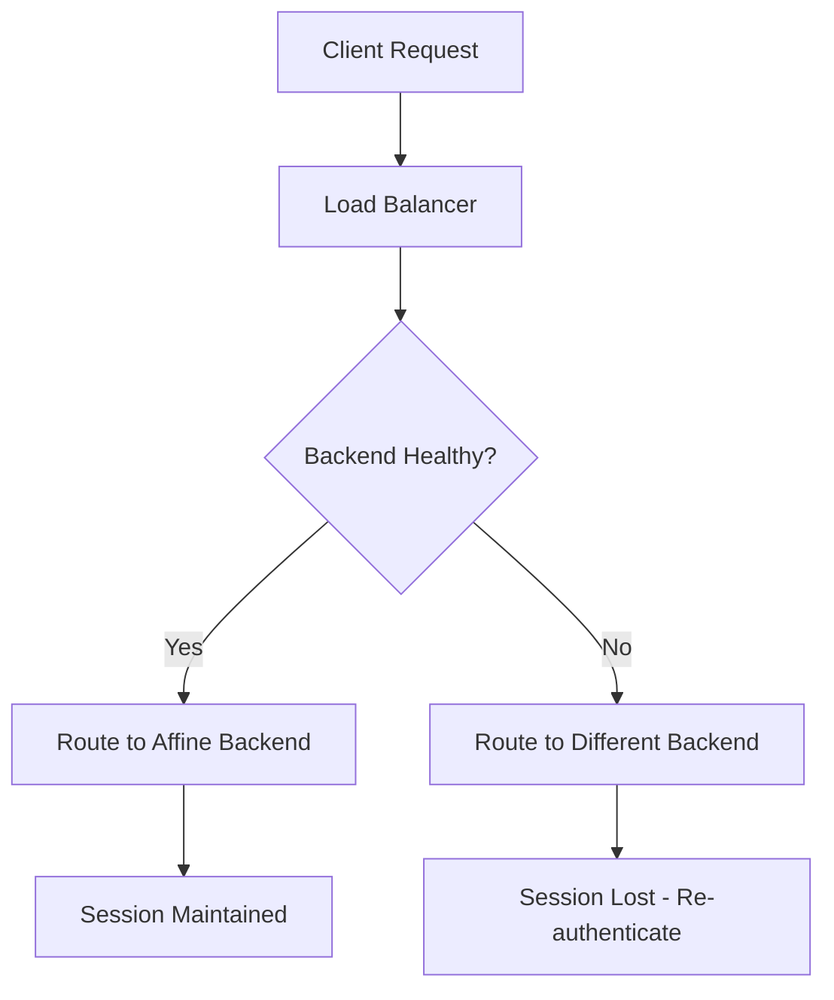

# How to Configure Session Affinity on a GCP Load Balancer for Stateful Applications

Author: [nawazdhandala](https://www.github.com/nawazdhandala)

Tags: GCP, Load Balancer, Session Affinity, Sticky Sessions, Stateful Apps

Description: Learn how to configure session affinity on GCP load balancers to ensure stateful application requests from the same client consistently reach the same backend instance.

---

Load balancers distribute traffic across multiple backends, but some applications need requests from the same client to consistently land on the same backend. Shopping carts stored in server memory, WebSocket connections, file upload sessions, and applications using server-side sessions all break if requests bounce between different backend instances. Session affinity (sometimes called sticky sessions) solves this by routing a client's requests to the same backend for the duration of their session.

This post covers the different session affinity options in GCP, how to configure each one, and when to use them.

## Session Affinity Options in GCP

GCP load balancers support several session affinity types:

| Type | How It Works | Best For |
|------|-------------|----------|
| NONE | No affinity, round-robin distribution | Stateless applications |
| CLIENT_IP | Hash of client IP address | Simple stickiness, L4 load balancers |
| CLIENT_IP_PROTO | Hash of client IP and protocol | Protocol-specific routing |
| CLIENT_IP_PORT_PROTO | Hash of client IP, port, and protocol | Fine-grained L4 affinity |
| GENERATED_COOKIE | Load balancer sets a cookie | HTTP(S) load balancers, most reliable |
| HEADER_FIELD | Hash of a specific HTTP header | Custom session identification |
| HTTP_COOKIE | Hash of an existing cookie | Application-managed sessions |

## Configuring Generated Cookie Affinity

Generated cookie affinity is the most reliable option for HTTP(S) load balancers. The load balancer sets a cookie on the first response, and subsequent requests with that cookie are routed to the same backend.

```bash
# Enable generated cookie session affinity on a backend service
gcloud compute backend-services update my-backend-service \
    --session-affinity=GENERATED_COOKIE \
    --affinity-cookie-ttl=3600 \
    --global
```

The `--affinity-cookie-ttl` sets how long the cookie is valid (in seconds). After this period, the client may be routed to a different backend. Set this based on your session duration.

How it works:
1. Client sends first request (no cookie)
2. Load balancer picks a backend and routes the request
3. Response includes a `GCLB` cookie identifying the backend
4. Client includes `GCLB` cookie in subsequent requests
5. Load balancer reads the cookie and routes to the same backend

```bash
# Verify the cookie is being set
curl -v https://app.example.com/ 2>&1 | grep -i set-cookie
# Expected: Set-Cookie: GCLB=...; Path=/; HttpOnly
```

## Configuring Client IP Affinity

Client IP affinity routes requests from the same source IP to the same backend. This works for both HTTP and non-HTTP load balancers.

```bash
# Enable client IP session affinity
gcloud compute backend-services update my-backend-service \
    --session-affinity=CLIENT_IP \
    --global
```

Limitations of client IP affinity:
- Multiple users behind the same NAT gateway appear as the same IP, so they all go to the same backend
- When a user's IP changes (mobile networks, VPN switches), they lose their session
- Less reliable than cookie-based affinity for HTTP workloads

## Configuring Header-Based Affinity

Header-based affinity hashes a specific HTTP header value to determine the backend. This is useful when you have a custom session identifier in a header.

```bash
# Enable header-based session affinity
gcloud compute backend-services update my-backend-service \
    --session-affinity=HEADER_FIELD \
    --custom-request-headers="" \
    --global
```

To configure the specific header name, use the API or Terraform:

```hcl
# Terraform configuration for header-based session affinity
resource "google_compute_backend_service" "default" {
  name                  = "my-backend-service"
  protocol              = "HTTP"
  health_checks         = [google_compute_health_check.default.id]
  load_balancing_scheme = "EXTERNAL_MANAGED"
  session_affinity      = "HEADER_FIELD"

  consistent_hash {
    http_header_name = "X-Session-ID"
  }
}
```

Clients must send the configured header with every request:

```bash
# Requests with the same X-Session-ID go to the same backend
curl -H "X-Session-ID: user-12345" https://app.example.com/api/data
```

## Configuring HTTP Cookie Affinity

HTTP cookie affinity uses an existing cookie set by your application (not the load balancer) to determine routing:

```hcl
# Terraform configuration for HTTP cookie session affinity
resource "google_compute_backend_service" "default" {
  name                  = "my-backend-service"
  protocol              = "HTTP"
  health_checks         = [google_compute_health_check.default.id]
  load_balancing_scheme = "EXTERNAL_MANAGED"
  session_affinity      = "HTTP_COOKIE"

  consistent_hash {
    http_cookie {
      name = "JSESSIONID"
      ttl {
        seconds = 3600
      }
    }
  }
}
```

This is useful when your application already sets a session cookie (like `JSESSIONID` for Java applications).

## Session Affinity with Consistent Hashing

For the `EXTERNAL_MANAGED` (global external application) load balancer, you can combine session affinity with consistent hashing for better distribution:

```hcl
# Terraform configuration with consistent hashing
resource "google_compute_backend_service" "default" {
  name                  = "my-backend-service"
  protocol              = "HTTP"
  health_checks         = [google_compute_health_check.default.id]
  load_balancing_scheme = "EXTERNAL_MANAGED"
  session_affinity      = "HTTP_COOKIE"

  locality_lb_policy = "RING_HASH"

  consistent_hash {
    minimum_ring_size = 1024

    http_cookie {
      name = "session"
      ttl {
        seconds = 1800
      }
    }
  }
}
```

Consistent hashing ensures that when backends are added or removed, only a fraction of sessions are redistributed rather than all of them.

## Session Affinity for Internal Load Balancers

Internal load balancers support the same affinity options:

```bash
# Enable session affinity on an internal backend service
gcloud compute backend-services update my-internal-backend \
    --session-affinity=CLIENT_IP \
    --region=us-central1
```

For internal HTTP(S) load balancers (Envoy-based):

```bash
# Enable generated cookie affinity on internal HTTP LB
gcloud compute backend-services update my-internal-backend \
    --session-affinity=GENERATED_COOKIE \
    --affinity-cookie-ttl=1800 \
    --region=us-central1
```

## Session Affinity for Network Load Balancers

Passthrough network load balancers support IP-based affinity:

```bash
# Configure session affinity for a passthrough network LB
gcloud compute backend-services update my-nlb-backend \
    --session-affinity=CLIENT_IP \
    --region=us-central1

# Or more granular affinity
gcloud compute backend-services update my-nlb-backend \
    --session-affinity=CLIENT_IP_PORT_PROTO \
    --region=us-central1
```

## What Happens When a Backend Goes Down

This is the critical question for stateful applications. When a backend that holds sessions becomes unhealthy:

1. The load balancer detects the backend as unhealthy via health checks
2. New requests from affected clients are rerouted to a healthy backend
3. The session data on the failed backend is lost

This means session affinity alone is not enough for true high availability of stateful applications. You also need:

- **External session storage**: Store sessions in Redis, Memcached, or Cloud Memorystore
- **Session replication**: Replicate sessions across backends
- **Graceful degradation**: Design your application to handle session loss



## Testing Session Affinity

Verify that session affinity is working:

```bash
# Send multiple requests and check which backend responds
for i in $(seq 1 10); do
    curl -s -b cookies.txt -c cookies.txt https://app.example.com/whoami
    echo ""
done
```

All responses should show the same backend instance identifier. If they show different backends, check that:
- The correct session affinity type is configured
- For cookie affinity, the client is actually sending the cookie back
- The backend service has the affinity setting applied

## Performance Considerations

Session affinity can cause uneven load distribution. If one client generates significantly more traffic than others, the backend handling that client becomes a hot spot.

Mitigations:
- Use appropriate affinity granularity (cookie-based rather than IP-based)
- Monitor per-backend load and adjust instance group sizes
- Set reasonable cookie TTLs so sessions eventually rebalance
- Consider connection draining when removing backends

## Wrapping Up

Session affinity is essential for stateful applications running behind load balancers. Generated cookie affinity is the best choice for HTTP(S) workloads because it works regardless of NAT or IP changes. For non-HTTP workloads, client IP affinity is the primary option. Whatever you choose, remember that session affinity is a best-effort mechanism - when backends fail, sessions will be disrupted. Design your application to handle this gracefully, ideally by externalizing session state to a shared store.
