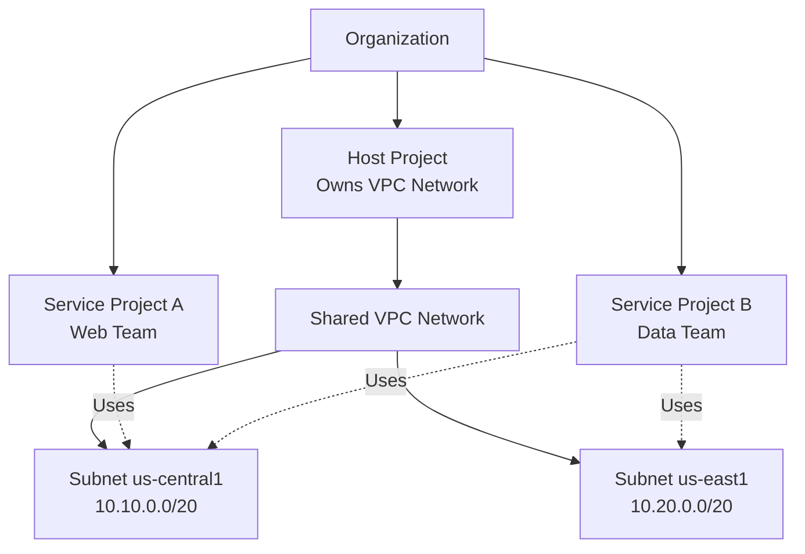

# How to Configure Shared VPC with Host and Service Projects in GCP

Author: [nawazdhandala](https://www.github.com/nawazdhandala)

Tags: GCP, Shared VPC, Networking, Host Project, Service Project

Description: A complete guide to setting up Shared VPC in GCP, including host project configuration, service project attachment, IAM roles, and subnet sharing between teams.

---

Shared VPC is one of GCP's most powerful networking features for organizations running multiple projects. It lets you centralize network management in a single "host" project while allowing other "service" projects to use its subnets. This means your networking team controls the VPC, firewall rules, and IP allocation, while application teams in service projects deploy their workloads into shared subnets without needing network admin permissions.

In this guide, I will walk through setting up Shared VPC from scratch, attaching service projects, and managing permissions.

## The Shared VPC Architecture



The host project owns the VPC network, subnets, firewall rules, and Cloud Routers. Service projects create resources (VMs, GKE clusters, Cloud Run, internal load balancers) that use the host project's subnets.

## Prerequisites

Shared VPC requires an organization. You cannot set it up with standalone projects. You also need the following:

- **Organization Admin** role or **Shared VPC Admin** role at the organization or folder level
- At least two projects: one for the host and one or more for services
- The Compute Engine API enabled in all projects

```bash
# Enable Compute Engine API in host and service projects
gcloud services enable compute.googleapis.com --project=host-project
gcloud services enable compute.googleapis.com --project=service-project-a
gcloud services enable compute.googleapis.com --project=service-project-b
```

## Step 1: Enable the Host Project

Designate one project as the Shared VPC host:

```bash
# Enable Shared VPC hosting on the designated project
gcloud compute shared-vpc enable host-project
```

This marks the project as a Shared VPC host. The VPC networks in this project can now be shared with other projects.

## Step 2: Create the Shared VPC Network

If you do not already have a VPC in the host project, create one:

```bash
# Create a custom mode VPC in the host project
gcloud compute networks create shared-vpc \
  --project=host-project \
  --subnet-mode=custom \
  --bgp-routing-mode=global
```

Create subnets in the regions your teams need:

```bash
# Create subnets for different regions
gcloud compute networks subnets create shared-us-central1 \
  --project=host-project \
  --network=shared-vpc \
  --region=us-central1 \
  --range=10.10.0.0/20 \
  --secondary-range=gke-pods=10.10.64.0/18,gke-services=10.10.128.0/20 \
  --enable-private-ip-google-access \
  --enable-flow-logs

gcloud compute networks subnets create shared-us-east1 \
  --project=host-project \
  --network=shared-vpc \
  --region=us-east1 \
  --range=10.20.0.0/20 \
  --secondary-range=gke-pods=10.20.64.0/18,gke-services=10.20.128.0/20 \
  --enable-private-ip-google-access \
  --enable-flow-logs
```

## Step 3: Attach Service Projects

Associate service projects with the host project:

```bash
# Attach service projects to the host project
gcloud compute shared-vpc associated-projects add service-project-a \
  --host-project=host-project

gcloud compute shared-vpc associated-projects add service-project-b \
  --host-project=host-project
```

Verify the association:

```bash
# List all associated service projects
gcloud compute shared-vpc list-associated-resources host-project \
  --format="table(id, type)"
```

## Step 4: Grant Subnet Access to Service Project Users

Service project users need permission to use specific subnets. You grant this through IAM at the subnet level:

```bash
# Grant the web team permission to use the us-central1 subnet
gcloud projects add-iam-policy-binding host-project \
  --member="group:web-team@mycompany.com" \
  --role="roles/compute.networkUser" \
  --condition='expression=resource.name.endsWith("shared-us-central1"),title=us-central1-subnet-only'
```

For simpler setups, you can grant access to all subnets in the host project:

```bash
# Grant network user role at the project level (access to all subnets)
gcloud projects add-iam-policy-binding host-project \
  --member="group:data-team@mycompany.com" \
  --role="roles/compute.networkUser"
```

For GKE clusters, the service project's GKE service account also needs the Host Service Agent User role:

```bash
# Get the GKE service account for service-project-a
# Format: service-PROJECT_NUMBER@container-engine-robot.iam.gserviceaccount.com

# Grant it the required role on the host project
gcloud projects add-iam-policy-binding host-project \
  --member="serviceAccount:service-123456789@container-engine-robot.iam.gserviceaccount.com" \
  --role="roles/container.hostServiceAgentUser"
```

## Step 5: Create Resources in Service Projects Using Shared Subnets

Now service project users can create VMs and other resources using the shared subnets:

```bash
# Create a VM in service-project-a using a shared subnet
gcloud compute instances create web-server \
  --project=service-project-a \
  --zone=us-central1-a \
  --machine-type=e2-medium \
  --subnet=projects/host-project/regions/us-central1/subnetworks/shared-us-central1 \
  --no-address
```

For GKE clusters:

```bash
# Create a GKE cluster in service-project-a using shared subnets
gcloud container clusters create web-cluster \
  --project=service-project-a \
  --region=us-central1 \
  --network=projects/host-project/global/networks/shared-vpc \
  --subnetwork=projects/host-project/regions/us-central1/subnetworks/shared-us-central1 \
  --cluster-secondary-range-name=gke-pods \
  --services-secondary-range-name=gke-services \
  --enable-ip-alias
```

## Setting Up Firewall Rules

Firewall rules are managed in the host project. The networking team creates rules that apply across all service projects:

```bash
# Allow internal traffic between all shared subnets
gcloud compute firewall-rules create shared-vpc-allow-internal \
  --project=host-project \
  --network=shared-vpc \
  --direction=INGRESS \
  --action=ALLOW \
  --rules=tcp,udp,icmp \
  --source-ranges=10.10.0.0/20,10.20.0.0/20 \
  --description="Allow internal traffic between shared subnets"

# Allow health checks for load balancers
gcloud compute firewall-rules create shared-vpc-allow-health-checks \
  --project=host-project \
  --network=shared-vpc \
  --direction=INGRESS \
  --action=ALLOW \
  --rules=tcp \
  --source-ranges=35.191.0.0/16,130.211.0.0/22 \
  --target-tags=allow-lb \
  --description="Allow Google health check probes"
```

## Managing the Shared VPC at Scale

As your organization grows, here are patterns that help:

### Use Folders for Service Project Groups

Organize service projects into folders by team or environment:

```bash
# Grant Shared VPC admin at the folder level
gcloud resource-manager folders add-iam-policy-binding FOLDER_ID \
  --member="group:network-admins@mycompany.com" \
  --role="roles/compute.xpnAdmin"
```

### Automate Service Project Attachment with Terraform

For organizations with many projects, Terraform is better than manual gcloud commands:

```hcl
# Terraform resource to attach a service project
resource "google_compute_shared_vpc_service_project" "service_a" {
  host_project    = "host-project"
  service_project = "service-project-a"
}
```

### Monitor Subnet Usage

Track IP utilization across shared subnets to prevent exhaustion:

```bash
# Check how many IPs are in use in each shared subnet
gcloud compute networks subnets describe shared-us-central1 \
  --project=host-project \
  --region=us-central1 \
  --format="yaml(ipCidrRange, secondaryIpRanges)"

# List all instances using this subnet across all projects
gcloud compute instances list \
  --filter="networkInterfaces[].subnetwork:shared-us-central1" \
  --format="table(name, zone, networkInterfaces[0].networkIP, project)"
```

## Detaching a Service Project

If a service project no longer needs access to the shared VPC:

```bash
# First, delete all resources in the service project that use shared subnets
# Then detach the service project
gcloud compute shared-vpc associated-projects remove service-project-b \
  --host-project=host-project
```

You must delete all resources using shared subnets before detaching. GCP will block the detachment if any resources still reference the shared network.

## Wrapping Up

Shared VPC gives you centralized network control with decentralized resource management. The networking team manages the VPC, subnets, and firewall rules in the host project, while application teams deploy their workloads through service projects. The key to making this work smoothly is clear IAM permissions at the subnet level and good communication between teams about IP allocation and firewall requirements. Start with a clean subnet plan, grant least-privilege access, and automate service project attachment as your organization scales.
