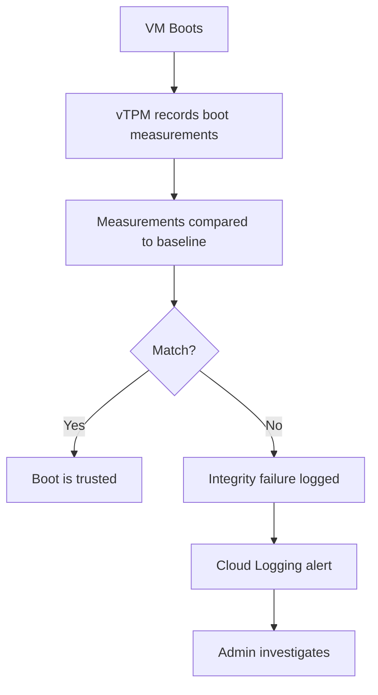

# How to Configure Shielded VM Options to Protect Against Rootkits on Compute Engine

Author: [nawazdhandala](https://www.github.com/nawazdhandala)

Tags: GCP, Compute Engine, Shielded VM, Security, Rootkit Protection

Description: Learn how to configure Shielded VM features on GCP Compute Engine to protect your instances against rootkits, bootkits, and other firmware-level threats.

---

Rootkits and bootkits are among the nastiest types of malware because they embed themselves into the boot process, loading before your operating system and security software. Traditional antivirus cannot detect them because the malware is already running by the time the OS comes up. Shielded VMs on GCP Compute Engine address this by verifying the integrity of the boot process, from firmware all the way through the kernel.

In this post, I will explain what Shielded VM features are, how to enable them, and how to use them to protect your Compute Engine instances.

## What Are Shielded VMs?

Shielded VMs provide three key security features:

1. **Secure Boot**: Ensures that the system only runs software that is signed by verified publishers. If a bootloader or kernel has been tampered with, the VM will not boot.

2. **vTPM (Virtual Trusted Platform Module)**: A virtualized TPM 2.0 chip that stores cryptographic keys and measurements. It creates a chain of trust from firmware through the OS.

3. **Integrity Monitoring**: Compares the current boot sequence against a known-good baseline. If anything changes (new kernel, modified bootloader, unauthorized firmware), it flags it.

Together, these features create a verified boot chain that makes it extremely difficult for rootkits to persist.

## Enabling Shielded VM During Instance Creation

When creating a new instance, enable all three Shielded VM features:

```bash
# Create a Shielded VM with all security features enabled
gcloud compute instances create secure-vm \
    --zone=us-central1-a \
    --machine-type=e2-medium \
    --image-family=debian-12 \
    --image-project=debian-cloud \
    --shielded-secure-boot \
    --shielded-vtpm \
    --shielded-integrity-monitoring
```

By default on newer GCP images, vTPM and Integrity Monitoring are already enabled. Secure Boot is disabled by default because it can interfere with custom kernel modules. I recommend enabling it unless you have a specific reason not to.

## Enabling Shielded VM on Existing Instances

You can enable Shielded VM features on existing instances, but the VM must be stopped first:

```bash
# Stop the VM
gcloud compute instances stop my-existing-vm --zone=us-central1-a

# Enable Shielded VM features
gcloud compute instances update my-existing-vm \
    --zone=us-central1-a \
    --shielded-secure-boot \
    --shielded-vtpm \
    --shielded-integrity-monitoring

# Start the VM
gcloud compute instances start my-existing-vm --zone=us-central1-a
```

## Instance Templates with Shielded VM

For managed instance groups, include Shielded VM settings in the instance template:

```bash
# Create an instance template with Shielded VM enabled
gcloud compute instance-templates create secure-template \
    --machine-type=e2-medium \
    --image-family=debian-12 \
    --image-project=debian-cloud \
    --shielded-secure-boot \
    --shielded-vtpm \
    --shielded-integrity-monitoring
```

## Terraform Configuration

Here is the Terraform setup for Shielded VMs.

```hcl
# Compute Engine instance with Shielded VM features
resource "google_compute_instance" "secure" {
  name         = "secure-vm"
  machine_type = "e2-medium"
  zone         = "us-central1-a"

  boot_disk {
    initialize_params {
      # Use a Shielded VM compatible image
      image = "debian-cloud/debian-12"
    }
  }

  network_interface {
    network = "default"
  }

  # Enable all Shielded VM features
  shielded_instance_config {
    enable_secure_boot          = true
    enable_vtpm                 = true
    enable_integrity_monitoring = true
  }
}

# Instance template with Shielded VM for MIGs
resource "google_compute_instance_template" "secure" {
  name_prefix  = "secure-"
  machine_type = "e2-medium"

  disk {
    source_image = "debian-cloud/debian-12"
    auto_delete  = true
    boot         = true
  }

  network_interface {
    network = "default"
  }

  shielded_instance_config {
    enable_secure_boot          = true
    enable_vtpm                 = true
    enable_integrity_monitoring = true
  }

  lifecycle {
    create_before_destroy = true
  }
}
```

## Understanding Each Feature in Detail

### Secure Boot

Secure Boot uses UEFI firmware to verify the digital signatures of all boot components - the bootloader, kernel, and kernel modules. If any component has been modified or is unsigned, the boot process stops.

When to enable it:
- Always, unless you need custom or unsigned kernel modules
- Standard GCP images (Debian, Ubuntu, CentOS, Windows) all support Secure Boot
- Third-party images may not have signed bootloaders

When it causes problems:
- Custom-compiled kernels without proper signing
- Third-party kernel modules (some monitoring agents, legacy drivers)
- Custom GRUB configurations

If Secure Boot prevents your VM from booting, you can disable it without losing data:

```bash
# Disable Secure Boot if it is blocking legitimate software
gcloud compute instances stop my-vm --zone=us-central1-a
gcloud compute instances update my-vm \
    --zone=us-central1-a \
    --no-shielded-secure-boot
gcloud compute instances start my-vm --zone=us-central1-a
```

### vTPM (Virtual Trusted Platform Module)

The vTPM stores measurements of each step in the boot process in its Platform Configuration Registers (PCRs). These measurements create an unforgeable record of exactly what software was loaded during boot.

Key uses of vTPM:
- Storing BitLocker/LUKS encryption keys
- Measured boot verification
- Remote attestation
- Generating and protecting cryptographic keys

You can read PCR values from inside the VM:

```bash
# Install the TPM tools
sudo apt-get install -y tpm2-tools

# Read the PCR values to see boot measurements
sudo tpm2_pcrread sha256
```

### Integrity Monitoring

Integrity Monitoring checks the boot sequence against a baseline stored in Cloud Logging. When the boot sequence changes, it generates an event.

The flow works like this:



## Checking Integrity Status

You can check whether an instance passed or failed its integrity verification:

```bash
# Check the integrity status of a Shielded VM
gcloud compute instances describe secure-vm \
    --zone=us-central1-a \
    --format="yaml(shieldedInstanceIntegrityPolicy)"
```

View integrity monitoring events in Cloud Logging:

```bash
# Query integrity monitoring logs
gcloud logging read 'resource.type="gce_instance" AND logName:"compute.googleapis.com%2Fshielded_vm_integrity"' \
    --limit=20 \
    --format=json
```

## Updating the Integrity Baseline

When you make legitimate changes to the boot configuration (kernel update, new boot parameters), the integrity check will fail. You need to update the baseline:

```bash
# Update the integrity baseline after a legitimate change
gcloud compute instances update my-vm \
    --zone=us-central1-a \
    --shielded-learn-integrity-policy
```

This tells the Shielded VM to learn the current boot configuration as the new baseline.

You should update the baseline after:
- Kernel updates
- GRUB configuration changes
- Boot partition modifications
- System firmware updates

## Setting Up Alerts for Integrity Failures

Create a Cloud Monitoring alert that fires when integrity verification fails:

```bash
# Create a log-based metric for integrity failures
gcloud logging metrics create shielded-vm-integrity-failure \
    --description="Shielded VM integrity verification failure" \
    --log-filter='resource.type="gce_instance" AND logName:"compute.googleapis.com%2Fshielded_vm_integrity" AND jsonPayload.earlyBootReportEvent.policyEvaluationPassed=false'
```

Then create an alerting policy based on this metric in Cloud Monitoring.

## Enforcing Shielded VM with Organization Policies

To ensure all VMs in your organization use Shielded VM features:

```bash
# Enforce Shielded VMs across the organization
gcloud resource-manager org-policies enable-enforce \
    compute.requireShieldedVm \
    --organization=ORGANIZATION_ID
```

This prevents anyone from creating VMs without Shielded VM features enabled.

## Compatible Images

Not all images support Shielded VM. Most modern GCP-provided images do:

- Debian 10+
- Ubuntu 18.04+
- CentOS 7+
- RHEL 7+
- Windows Server 2012+
- Container-Optimized OS

Check if an image supports Shielded VM:

```bash
# Check if an image family supports Shielded VM features
gcloud compute images describe-from-family debian-12 \
    --project=debian-cloud \
    --format="value(shieldedInstanceInitialState)"
```

## Best Practices

1. **Enable all three features** for production workloads. vTPM and Integrity Monitoring have no performance impact, and Secure Boot only causes issues with custom kernels.
2. **Set up integrity failure alerts** so you are notified immediately when boot measurements change unexpectedly.
3. **Use organization policies** to enforce Shielded VM across all projects.
4. **Update baselines promptly** after planned changes to avoid alert fatigue.
5. **Document your baseline update procedures** so your team knows when and how to update integrity baselines.
6. **Combine with OS Login and IAP** for defense in depth.

## Wrapping Up

Shielded VMs protect against a class of attacks that traditional security tools miss entirely. By verifying the integrity of the boot process, they ensure that rootkits and bootkits cannot persist on your instances. The setup is simple - just three flags when creating your instance - and the operational overhead is minimal. For any production workload, there is no good reason not to enable these features. The small effort of managing integrity baselines is far outweighed by the protection you get against some of the most difficult-to-detect threats.
