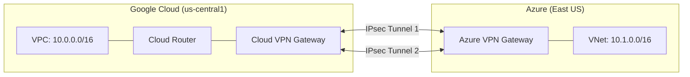

# How to Configure Site-to-Site VPN Between GCP and Azure for Hybrid Workloads

Author: [nawazdhandala](https://www.github.com/nawazdhandala)

Tags: GCP, Azure, VPN, Multi-Cloud, Hybrid Networking

Description: Step-by-step guide to configuring a site-to-site VPN tunnel between Google Cloud Platform and Microsoft Azure for secure multi-cloud connectivity.

---

Running workloads across both GCP and Azure is increasingly common. Maybe your company acquired another business that runs on Azure, or different teams chose different clouds for different services. Whatever the reason, those workloads need to communicate securely, and a site-to-site VPN is the most straightforward way to connect them.

In this post, I will walk through configuring an IPsec VPN tunnel between GCP and Azure, from both sides, with working configurations you can adapt for your environment.

## Architecture Overview

Here is what we are building - a pair of VPN tunnels between GCP Cloud VPN and an Azure VPN Gateway:



We use two tunnels for redundancy. If one tunnel goes down, traffic automatically fails over to the other.

## Step 1: Set Up the GCP Side

Start by creating the VPC, Cloud Router, and HA VPN Gateway on GCP:

```bash
# Create a VPC network
gcloud compute networks create gcp-azure-vpc \
  --subnet-mode=custom

# Create a subnet
gcloud compute networks subnets create gcp-subnet \
  --network=gcp-azure-vpc \
  --region=us-central1 \
  --range=10.0.0.0/16

# Create a Cloud Router for BGP
gcloud compute routers create gcp-azure-router \
  --network=gcp-azure-vpc \
  --region=us-central1 \
  --asn=65001

# Create an HA VPN Gateway (this gives you two external IPs for redundancy)
gcloud compute vpn-gateways create gcp-azure-vpn-gw \
  --network=gcp-azure-vpc \
  --region=us-central1
```

Get the external IP addresses of the GCP VPN gateway - you will need these for the Azure side:

```bash
# List the gateway interfaces and their IPs
gcloud compute vpn-gateways describe gcp-azure-vpn-gw \
  --region=us-central1 \
  --format="yaml(vpnInterfaces)"
```

## Step 2: Set Up the Azure Side

Now configure the Azure VNet, subnet, and VPN Gateway. You can use Azure CLI or Terraform. Here is the Azure CLI approach:

```bash
# Create a resource group
az group create \
  --name multi-cloud-rg \
  --location eastus

# Create a virtual network
az network vnet create \
  --resource-group multi-cloud-rg \
  --name azure-gcp-vnet \
  --address-prefix 10.1.0.0/16 \
  --subnet-name workload-subnet \
  --subnet-prefix 10.1.1.0/24

# Create the gateway subnet (required for VPN Gateway)
az network vnet subnet create \
  --resource-group multi-cloud-rg \
  --vnet-name azure-gcp-vnet \
  --name GatewaySubnet \
  --address-prefix 10.1.255.0/24

# Create a public IP for the VPN Gateway
az network public-ip create \
  --resource-group multi-cloud-rg \
  --name azure-vpn-ip-1 \
  --allocation-method Static \
  --sku Standard

az network public-ip create \
  --resource-group multi-cloud-rg \
  --name azure-vpn-ip-2 \
  --allocation-method Static \
  --sku Standard

# Create the VPN Gateway (this takes 30-45 minutes)
az network vnet-gateway create \
  --resource-group multi-cloud-rg \
  --name azure-gcp-vpn-gw \
  --vnet azure-gcp-vnet \
  --gateway-type Vpn \
  --vpn-type RouteBased \
  --sku VpnGw2 \
  --generation Generation2 \
  --public-ip-address azure-vpn-ip-1 azure-vpn-ip-2 \
  --asn 65002
```

Get the Azure VPN Gateway's public IPs:

```bash
# Get the public IPs assigned to the Azure VPN Gateway
az network public-ip show \
  --resource-group multi-cloud-rg \
  --name azure-vpn-ip-1 \
  --query ipAddress -o tsv

az network public-ip show \
  --resource-group multi-cloud-rg \
  --name azure-vpn-ip-2 \
  --query ipAddress -o tsv
```

## Step 3: Create the VPN Tunnels on GCP

With both gateways ready, create the VPN tunnels on the GCP side. You need to create an external VPN gateway resource first to represent the Azure gateway:

```bash
# Create an external VPN gateway representing Azure
# Replace with actual Azure VPN Gateway IPs
gcloud compute external-vpn-gateways create azure-vpn-gw \
  --interfaces \
    0=AZURE_VPN_IP_1,\
    1=AZURE_VPN_IP_2

# Create VPN tunnel 1
gcloud compute vpn-tunnels create gcp-to-azure-tunnel-1 \
  --vpn-gateway=gcp-azure-vpn-gw \
  --vpn-gateway-region=us-central1 \
  --peer-external-gateway=azure-vpn-gw \
  --peer-external-gateway-interface=0 \
  --interface=0 \
  --ike-version=2 \
  --shared-secret=YourSecureSharedKey123 \
  --router=gcp-azure-router \
  --region=us-central1

# Create VPN tunnel 2
gcloud compute vpn-tunnels create gcp-to-azure-tunnel-2 \
  --vpn-gateway=gcp-azure-vpn-gw \
  --vpn-gateway-region=us-central1 \
  --peer-external-gateway=azure-vpn-gw \
  --peer-external-gateway-interface=1 \
  --interface=1 \
  --ike-version=2 \
  --shared-secret=YourSecureSharedKey123 \
  --router=gcp-azure-router \
  --region=us-central1
```

## Step 4: Configure BGP on GCP Cloud Router

Add BGP interfaces and peers for each tunnel:

```bash
# Add router interface for tunnel 1
gcloud compute routers add-interface gcp-azure-router \
  --interface-name=azure-bgp-if-1 \
  --vpn-tunnel=gcp-to-azure-tunnel-1 \
  --ip-address=169.254.21.1 \
  --mask-length=30 \
  --region=us-central1

# Add BGP peer for tunnel 1
gcloud compute routers add-bgp-peer gcp-azure-router \
  --peer-name=azure-peer-1 \
  --peer-asn=65002 \
  --interface=azure-bgp-if-1 \
  --peer-ip-address=169.254.21.2 \
  --region=us-central1

# Add router interface for tunnel 2
gcloud compute routers add-interface gcp-azure-router \
  --interface-name=azure-bgp-if-2 \
  --vpn-tunnel=gcp-to-azure-tunnel-2 \
  --ip-address=169.254.22.1 \
  --mask-length=30 \
  --region=us-central1

# Add BGP peer for tunnel 2
gcloud compute routers add-bgp-peer gcp-azure-router \
  --peer-name=azure-peer-2 \
  --peer-asn=65002 \
  --interface=azure-bgp-if-2 \
  --peer-ip-address=169.254.22.2 \
  --region=us-central1
```

## Step 5: Create Connections on the Azure Side

Now create the corresponding local network gateway and connections on Azure:

```bash
# Create local network gateways representing GCP VPN interfaces
az network local-gateway create \
  --resource-group multi-cloud-rg \
  --name gcp-local-gw-1 \
  --gateway-ip-address GCP_VPN_IP_1 \
  --asn 65001 \
  --bgp-peering-address 169.254.21.1

az network local-gateway create \
  --resource-group multi-cloud-rg \
  --name gcp-local-gw-2 \
  --gateway-ip-address GCP_VPN_IP_2 \
  --asn 65001 \
  --bgp-peering-address 169.254.22.1

# Create VPN connections
az network vpn-connection create \
  --resource-group multi-cloud-rg \
  --name azure-to-gcp-conn-1 \
  --vnet-gateway1 azure-gcp-vpn-gw \
  --local-gateway2 gcp-local-gw-1 \
  --shared-key YourSecureSharedKey123 \
  --enable-bgp

az network vpn-connection create \
  --resource-group multi-cloud-rg \
  --name azure-to-gcp-conn-2 \
  --vnet-gateway1 azure-gcp-vpn-gw \
  --local-gateway2 gcp-local-gw-2 \
  --shared-key YourSecureSharedKey123 \
  --enable-bgp
```

## Step 6: Verify the Connection

Check the tunnel status from both sides:

```bash
# Check tunnel status on GCP
gcloud compute vpn-tunnels describe gcp-to-azure-tunnel-1 \
  --region=us-central1 \
  --format="yaml(status, detailedStatus)"

gcloud compute vpn-tunnels describe gcp-to-azure-tunnel-2 \
  --region=us-central1 \
  --format="yaml(status, detailedStatus)"

# Check BGP session status
gcloud compute routers get-status gcp-azure-router \
  --region=us-central1 \
  --format="yaml(result.bgpPeerStatus)"
```

On the Azure side:

```bash
# Check connection status on Azure
az network vpn-connection show \
  --resource-group multi-cloud-rg \
  --name azure-to-gcp-conn-1 \
  --query connectionStatus -o tsv
```

## Testing Connectivity

Once the tunnels are up and BGP routes are exchanged, test connectivity between instances:

```bash
# From a GCP VM in 10.0.0.0/16, ping an Azure VM in 10.1.0.0/16
ping 10.1.1.4

# Test TCP connectivity
nc -zv 10.1.1.4 443
```

## Monitoring and Alerting

Set up monitoring to catch tunnel failures quickly:

```bash
# Create an alert for VPN tunnel status
gcloud alpha monitoring policies create \
  --display-name="VPN Tunnel Down - Azure" \
  --condition-display-name="VPN tunnel to Azure not established" \
  --condition-filter='resource.type="vpn_gateway" AND metric.type="vpn.googleapis.com/tunnel_established"' \
  --condition-threshold-value=1 \
  --condition-threshold-comparison=COMPARISON_LT \
  --notification-channels=projects/my-project/notificationChannels/oncall
```

## Wrapping Up

A site-to-site VPN between GCP and Azure gives you encrypted, reliable connectivity for multi-cloud workloads. The setup involves configuring VPN gateways on both sides, establishing IPsec tunnels with a shared secret, and running BGP for dynamic route exchange. Two tunnels give you redundancy so a single tunnel failure does not disrupt traffic.

The whole setup can be done in about an hour (plus the 30-45 minutes Azure takes to provision its VPN gateway). Once it is running, your GCP and Azure workloads can communicate as if they are on the same private network.
