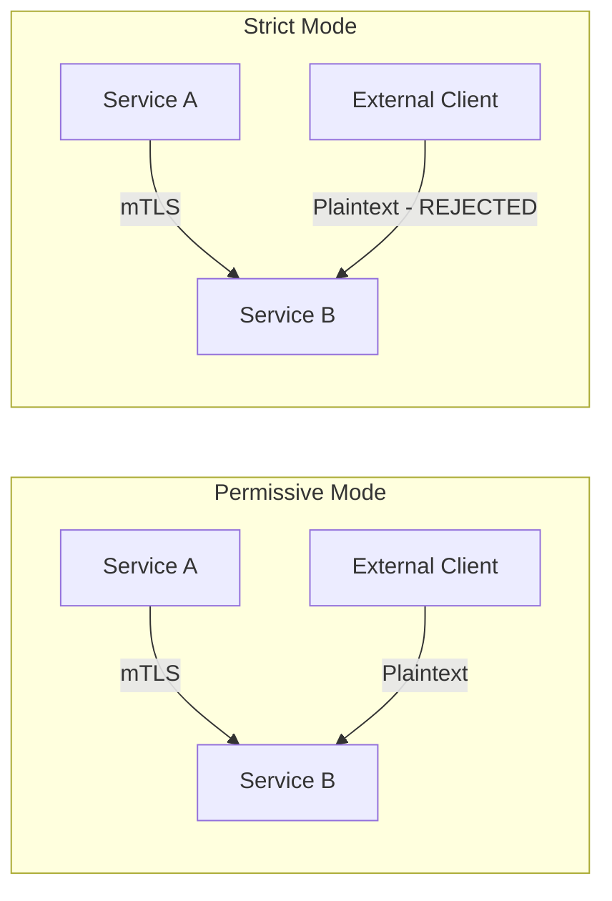

# How to Configure Strict mTLS Between Microservices in Anthos Service Mesh

Author: [nawazdhandala](https://www.github.com/nawazdhandala)

Tags: GCP, Anthos Service Mesh, mTLS, Microservices Security, Zero Trust

Description: Learn how to configure and enforce strict mutual TLS authentication between microservices in Anthos Service Mesh for zero-trust network security on GKE.

---

In a microservices architecture, every service-to-service call is an opportunity for an attacker to intercept or tamper with traffic. Mutual TLS (mTLS) solves this by encrypting all traffic between services and verifying both sides of every connection. Anthos Service Mesh (now Cloud Service Mesh) makes mTLS straightforward - the Envoy sidecar proxies handle all the certificate management and TLS handshakes automatically.

By default, the mesh runs in permissive mode, which accepts both mTLS and plaintext traffic. This guide covers how to move to strict mode, where only mTLS traffic is accepted, and how to handle the migration without breaking your services.

## Understanding mTLS Modes

Anthos Service Mesh supports three mTLS modes:

- **DISABLE** - No mTLS. All traffic is plaintext. You should never use this in production.
- **PERMISSIVE** - Accepts both mTLS and plaintext traffic. This is the default and is useful during migration.
- **STRICT** - Only accepts mTLS traffic. Plaintext connections are rejected.



## Step 1: Verify Current mTLS Status

Before changing anything, check the current mTLS configuration across your mesh.

```bash
# Check existing PeerAuthentication policies
kubectl get peerauthentication --all-namespaces

# Check the mesh-wide default
kubectl get peerauthentication -n istio-system
```

If no PeerAuthentication policies exist, the mesh is running with the default permissive mode.

You can also check which connections are currently using mTLS by looking at the mesh telemetry.

```bash
# Check if services are communicating with mTLS
# Look for the connection_security_policy label in metrics
kubectl exec -it deploy/my-app -c istio-proxy -- \
    pilot-agent request GET stats | grep ssl
```

## Step 2: Enable Strict mTLS Mesh-Wide

The cleanest approach is to set strict mTLS at the mesh level. This applies to all namespaces and services unless overridden by a more specific policy.

Create a mesh-wide PeerAuthentication policy in the `istio-system` namespace.

```yaml
# mesh-wide-strict-mtls.yaml
# Enforces strict mTLS across the entire service mesh
apiVersion: security.istio.io/v1beta1
kind: PeerAuthentication
metadata:
  name: default
  namespace: istio-system
spec:
  mtls:
    mode: STRICT
```

```bash
# Apply the mesh-wide strict mTLS policy
kubectl apply -f mesh-wide-strict-mtls.yaml
```

After applying, any service that sends plaintext traffic to a meshed service will get connection refused errors. This is by design - strict mode means strict.

## Step 3: Gradual Migration Strategy

Jumping straight to mesh-wide strict can break things if you have services that are not yet part of the mesh. A safer approach is to migrate namespace by namespace.

### Phase 1: Enforce Strict on Individual Namespaces

Start with namespaces where you know all services have sidecars.

```yaml
# namespace-strict-mtls.yaml
# Enforces strict mTLS for a specific namespace
apiVersion: security.istio.io/v1beta1
kind: PeerAuthentication
metadata:
  name: default
  namespace: my-app
spec:
  mtls:
    mode: STRICT
```

```bash
# Apply to the first namespace
kubectl apply -f namespace-strict-mtls.yaml
```

### Phase 2: Handle Services with External Clients

Some services receive traffic from outside the mesh (like ingress gateways, health checkers, or non-meshed services). For these, you can set strict mTLS with port-level exceptions.

```yaml
# service-with-exceptions.yaml
# Strict mTLS with a plaintext exception for the health check port
apiVersion: security.istio.io/v1beta1
kind: PeerAuthentication
metadata:
  name: api-gateway-auth
  namespace: my-app
spec:
  selector:
    matchLabels:
      app: api-gateway
  mtls:
    mode: STRICT
  portLevelMtls:
    8081:
      mode: PERMISSIVE
```

This enforces strict mTLS on all ports except port 8081, which accepts plaintext (for health checks from the load balancer).

### Phase 3: Roll Out Mesh-Wide

Once all namespaces have been individually verified, apply the mesh-wide policy.

```bash
# Apply mesh-wide strict mTLS
kubectl apply -f mesh-wide-strict-mtls.yaml

# Verify the policy is active
kubectl get peerauthentication -n istio-system
```

## Step 4: Configure Destination Rules

PeerAuthentication controls the server side (what incoming traffic to accept). You also need DestinationRules to configure the client side (what traffic to send).

Create a mesh-wide DestinationRule that tells all clients to use mTLS.

```yaml
# mesh-wide-destination-rule.yaml
# Configures all mesh clients to use mTLS for outbound connections
apiVersion: networking.istio.io/v1beta1
kind: DestinationRule
metadata:
  name: default
  namespace: istio-system
spec:
  host: "*.local"
  trafficPolicy:
    tls:
      mode: ISTIO_MUTUAL
```

```bash
# Apply the destination rule
kubectl apply -f mesh-wide-destination-rule.yaml
```

## Step 5: Verify mTLS Is Working

After enabling strict mode, verify that connections between services are actually encrypted.

### Method 1: Check Connection Security Policy

```bash
# Check that connections show mTLS
kubectl exec -it deploy/productpage -c istio-proxy -- \
    curl -s localhost:15000/stats | grep "ssl.handshake"
```

A non-zero `ssl.handshake` count means mTLS connections are being established.

### Method 2: Test Plaintext Connection (Should Fail)

Try to make a plaintext connection from a pod without a sidecar. This should fail in strict mode.

```bash
# Deploy a test pod without a sidecar
kubectl run test-pod --image=curlimages/curl --restart=Never \
    --annotations="sidecar.istio.io/inject=false" \
    -- sleep 3600

# Try to call a meshed service - this should fail
kubectl exec test-pod -- curl -s http://my-service.my-app.svc.cluster.local:8080
# Expected: Connection reset or refused
```

### Method 3: Check Certificates

Verify the certificates being used by the sidecar.

```bash
# Check the certificate chain
kubectl exec -it deploy/my-app -c istio-proxy -- \
    openssl s_client -connect localhost:15012 -showcerts 2>/dev/null | \
    openssl x509 -noout -text | grep -A1 "Subject:"
```

The certificate should be issued by the mesh CA and include the service identity in the SAN (Subject Alternative Name) field.

## Step 6: Handle Common Edge Cases

### External Services

Services that call external APIs (outside the mesh) need to be configured to not use mTLS for those connections.

```yaml
# external-service.yaml
# Allows plaintext for external service connections
apiVersion: networking.istio.io/v1beta1
kind: DestinationRule
metadata:
  name: external-api
  namespace: my-app
spec:
  host: api.external-service.com
  trafficPolicy:
    tls:
      mode: DISABLE
```

### Database Connections

Databases typically handle their own TLS and should be excluded from mesh mTLS.

```yaml
# database-destination.yaml
# Disables mesh mTLS for database connections
apiVersion: networking.istio.io/v1beta1
kind: DestinationRule
metadata:
  name: database
  namespace: my-app
spec:
  host: db.my-app.svc.cluster.local
  trafficPolicy:
    tls:
      mode: DISABLE
```

### Health Check Probes

Kubernetes liveness and readiness probes come from the kubelet, which does not participate in the mesh. Istio handles this automatically by rewriting probe paths to go through the sidecar. If you are having issues with probes after enabling strict mTLS, verify that probe rewriting is enabled.

```bash
# Check if probe rewriting is enabled in the mesh config
kubectl get configmap istio -n istio-system -o jsonpath='{.data.mesh}' | grep -i "rewriteAppHTTPProbers"
```

## Monitoring mTLS in Production

Set up monitoring to detect mTLS issues before they impact services.

### Cloud Monitoring Dashboard

Create a dashboard that tracks:

- mTLS handshake success and failure counts
- Certificate expiration dates
- Connection security policy distribution (how many connections are mTLS vs plaintext)

### Alert on Plaintext Connections

In strict mode, plaintext connections should not exist. Create an alert that fires if plaintext connections are detected.

```yaml
# This checks for connections without mTLS in the mesh metrics
# In Cloud Monitoring, create an alert on:
# metric: istio.io/service/server/request_count
# filter: connection_security_policy != "mutual_tls"
```

## Troubleshooting

**Services returning 503 after enabling strict**: The client service might not have a sidecar. Check that all pods in the request path have the istio-proxy container.

**Certificate errors in logs**: Check that the mesh CA is running and certificates are being issued. Look at istiod logs for certificate signing errors.

**High latency after enabling mTLS**: The TLS handshake adds latency to new connections. If you see persistent high latency, check if connection pooling is configured correctly. Envoy reuses TLS connections, so the handshake cost should only apply to new connections.

**External services failing**: Make sure you have DestinationRules that disable mTLS for external hosts. Without them, the sidecar will try to establish mTLS with services that do not support it.

Strict mTLS is a foundational building block of zero-trust architecture. Once it is in place, every service-to-service call is authenticated and encrypted, regardless of the network it traverses. Combined with authorization policies, it gives you fine-grained control over which services can talk to each other.
