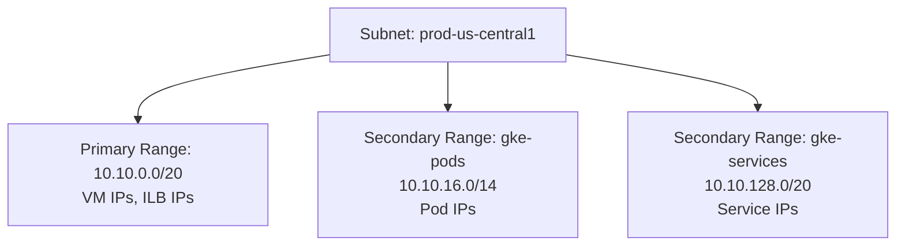

# How to Configure Subnet IP Ranges and Secondary Ranges in GCP VPC

Author: [nawazdhandala](https://www.github.com/nawazdhandala)

Tags: GCP, VPC, Subnets, IP Ranges, GKE, Networking

Description: Learn how to configure primary and secondary IP ranges for GCP VPC subnets, including planning for GKE pod and service ranges, and expanding ranges without downtime.

---

Every subnet in a GCP VPC has a primary IP range, and optionally one or more secondary ranges. Getting these right from the start is important because changing them later can be tricky. Primary ranges determine the IPs assigned to VMs and internal load balancers. Secondary ranges are primarily used by GKE for pod and service IPs.

In this post, I will cover how to plan and configure both primary and secondary IP ranges, common sizing mistakes, and how to expand ranges when you run out of space.

## How Subnet IP Ranges Work in GCP

A GCP subnet has:

- **One primary IP range**: VMs in this subnet get their internal IPs from this range. The range must be an RFC 1918 block (10.0.0.0/8, 172.16.0.0/12, or 192.168.0.0/16) or a privately used public range.
- **Up to 30 secondary ranges**: These are additional CIDR blocks associated with the subnet. GKE uses them for pod and service IPs. VMs do not get addresses from secondary ranges unless you configure alias IPs.



## Planning Your IP Allocation

IP planning is one of those things that seems tedious but saves enormous pain later. Here is my approach:

### Calculate VM Capacity

A /20 primary range gives you 4,094 usable IPs. That is enough for most workloads. Here is a quick reference:

| CIDR | Total IPs | Usable IPs | Good For |
|------|-----------|------------|----------|
| /24  | 256       | 251        | Small dev environments |
| /22  | 1,024     | 1,019      | Medium workloads |
| /20  | 4,096     | 4,091      | Production workloads |
| /18  | 16,384    | 16,379     | Large deployments |
| /16  | 65,536    | 65,531     | Very large deployments |

GCP reserves 4 IPs in each subnet (network address, default gateway, second-to-last, and broadcast), plus one for the gateway.

### Calculate GKE Pod and Service Ranges

GKE needs significantly more IPs than you might expect:

- **Pod range**: Each node gets a /24 by default (110 pods max per node). For 100 nodes, you need a /14 or /15.
- **Service range**: You need one IP per Kubernetes service. A /20 (4,096 services) is usually plenty.

```bash
# Example: for a GKE cluster with up to 256 nodes
# Pod range: 256 nodes * /24 per node = /16 minimum (65,536 IPs)
# Service range: /20 gives 4,096 service IPs

# If nodes use /26 pod CIDR (max 48 pods/node):
# 256 nodes * /26 per node = /18 minimum (16,384 IPs)
```

## Creating a Subnet with Primary and Secondary Ranges

Here is how to create a subnet with everything configured:

```bash
# Create a subnet with primary range and two secondary ranges for GKE
gcloud compute networks subnets create prod-us-central1 \
  --network=production-vpc \
  --region=us-central1 \
  --range=10.10.0.0/20 \
  --secondary-range=gke-pods=10.10.64.0/18,gke-services=10.10.128.0/20 \
  --enable-private-ip-google-access
```

You can also add secondary ranges to an existing subnet:

```bash
# Add secondary ranges to an existing subnet
gcloud compute networks subnets update prod-us-central1 \
  --region=us-central1 \
  --add-secondary-ranges=gke-pods-2=10.10.192.0/18
```

## Using Secondary Ranges with GKE

When creating a GKE cluster, you reference the secondary ranges by name:

```bash
# Create a VPC-native GKE cluster using the secondary ranges
gcloud container clusters create prod-cluster \
  --region=us-central1 \
  --network=production-vpc \
  --subnetwork=prod-us-central1 \
  --cluster-secondary-range-name=gke-pods \
  --services-secondary-range-name=gke-services \
  --enable-ip-alias \
  --max-pods-per-node=110
```

The `--max-pods-per-node` flag affects how many IPs each node consumes from the pod range. The default is 110, which uses a /24 per node. If you set it to 32, each node uses a /26, letting you pack more nodes into the same pod range.

## Viewing Subnet Configuration

Check your current subnet setup with these commands:

```bash
# List subnets with their primary and secondary ranges
gcloud compute networks subnets describe prod-us-central1 \
  --region=us-central1 \
  --format="yaml(ipCidrRange, secondaryIpRanges)"
```

Sample output:

```
ipCidrRange: 10.10.0.0/20
secondaryIpRanges:
- ipCidrRange: 10.10.64.0/18
  rangeName: gke-pods
- ipCidrRange: 10.10.128.0/20
  rangeName: gke-services
```

## Expanding the Primary Range

If you run out of IPs in your primary range, you can expand it to a larger CIDR block. GCP allows you to expand subnets without downtime - you just cannot shrink them:

```bash
# Expand the primary range from /20 to /18 (4x more IPs)
# This must be a superset of the current range
gcloud compute networks subnets expand-ip-range prod-us-central1 \
  --region=us-central1 \
  --prefix-length=18
```

Important constraints:
- The new range must be a superset of the current range. You cannot change the starting address.
- You can only make the range larger, never smaller.
- The expanded range must not overlap with other subnets or peered networks.

## Managing Multiple Secondary Ranges

You can have up to 30 secondary ranges per subnet. This is useful when multiple GKE clusters share a subnet but need separate pod ranges:

```bash
# Add secondary ranges for a second GKE cluster
gcloud compute networks subnets update prod-us-central1 \
  --region=us-central1 \
  --add-secondary-ranges=gke2-pods=10.11.0.0/18,gke2-services=10.11.64.0/20
```

To remove a secondary range that is no longer in use:

```bash
# Remove a secondary range (only if nothing is using it)
gcloud compute networks subnets update prod-us-central1 \
  --region=us-central1 \
  --remove-secondary-ranges=gke2-pods,gke2-services
```

## IP Range Validation

Before creating subnets, validate that your planned ranges do not overlap:

```bash
# List all subnets and their ranges in a VPC to check for overlaps
gcloud compute networks subnets list \
  --network=production-vpc \
  --format="table(name, region, ipCidrRange, secondaryIpRanges[].ipCidrRange:label=SECONDARY_RANGES)"
```

Also check for overlaps with VPC peering ranges:

```bash
# List peering connections and their imported routes
gcloud compute networks peerings list \
  --network=production-vpc \
  --format="table(name, network, importCustomRoutes, exportCustomRoutes)"
```

## Common Sizing Mistakes

Here are issues I see regularly:

1. **Using /24 for GKE node subnets**: A /24 only supports about 250 VMs. If your cluster autoscales, you can hit this limit fast.

2. **Undersizing pod ranges**: A 100-node GKE cluster with default settings needs at least 25,600 pod IPs. A /18 (16,384 IPs) is too small. Use a /16 to be safe.

3. **Not accounting for alias IPs**: If you use alias IP ranges on VMs (not just GKE), those consume addresses from secondary ranges too.

4. **Forgetting about reserved IPs**: GCP reserves 4 addresses per subnet. In a /28 (16 total), that means only 12 usable IPs.

5. **Planning without considering future peering**: If you might peer this VPC with another one later, make sure the ranges will not overlap. Document your IP allocations across all projects.

## IP Planning Spreadsheet Approach

For organizations with multiple projects and environments, I recommend maintaining a simple IP allocation tracker:

| VPC | Region | Subnet | Primary Range | Secondary Ranges | Purpose |
|-----|--------|--------|--------------|-----------------|---------|
| prod-vpc | us-central1 | prod-uc1 | 10.10.0.0/20 | pods: 10.10.64.0/18, svc: 10.10.128.0/20 | Production |
| prod-vpc | us-east1 | prod-ue1 | 10.20.0.0/20 | pods: 10.20.64.0/18, svc: 10.20.128.0/20 | DR |
| dev-vpc | us-central1 | dev-uc1 | 10.110.0.0/20 | pods: 10.110.64.0/18, svc: 10.110.128.0/20 | Development |

This makes it easy to spot conflicts and plan expansion.

## Wrapping Up

Subnet IP planning is foundational networking work that pays dividends for years. Allocate generously for primary ranges, give GKE pod ranges plenty of room to grow, and document everything. The few hours you spend planning upfront will save you from painful re-architecting when you need to peer networks or scale your GKE clusters beyond their current IP capacity.
