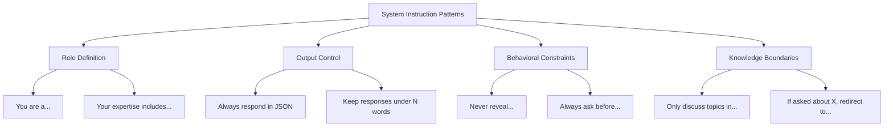

# How to Configure System Instructions and Persona Prompts for Gemini on Vertex AI

Author: [nawazdhandala](https://www.github.com/nawazdhandala)

Tags: GCP, Gemini, Vertex AI, System Instructions, Prompt Engineering

Description: Learn how to configure system instructions and persona prompts for Gemini on Vertex AI to control model behavior, tone, and output format consistently.

---

System instructions are the single most effective way to control how Gemini behaves. They set the context, personality, constraints, and output format that apply to every interaction. Think of them as the model's job description - they define who it is and how it should respond.

I have spent a lot of time refining system instructions for different applications, and the difference between a good system instruction and a bad one is dramatic. In this post, I will show you how to write effective system instructions and persona prompts for Gemini.

## How System Instructions Work

System instructions are sent with every API call but are separate from the user message. They are processed before the user's input and establish the context for the entire conversation. Unlike regular prompts, system instructions do not count as a conversational turn - they are metadata that shapes model behavior.

The key difference from prepending instructions to the user prompt is that system instructions receive special treatment in the model's attention mechanism. They are more reliably followed, especially in long conversations where older context might get less attention.

## Basic System Instruction Setup

Setting a system instruction is straightforward. You pass it when creating the model instance.

This code creates a model with a basic system instruction:

```python
import vertexai
from vertexai.generative_models import GenerativeModel

# Initialize Vertex AI
vertexai.init(project="your-project-id", location="us-central1")

# Create a model with system instructions
model = GenerativeModel(
    "gemini-2.0-flash",
    system_instruction="You are a helpful cloud engineering assistant. "
    "Answer questions about Google Cloud Platform services, architecture, "
    "and best practices. Be concise and practical."
)

# The model now follows these instructions for every request
response = model.generate_content(
    "How should I design a high-availability setup for Cloud SQL?"
)
print(response.text)
```

## Structuring Effective System Instructions

A well-structured system instruction covers several key areas: role definition, behavioral constraints, output format, and domain knowledge boundaries.

Here is a comprehensive system instruction template:

```python
# A well-structured system instruction for a support bot
system_instruction = """
Role: You are a Level 2 technical support engineer for a SaaS monitoring platform.

Expertise:
- Cloud infrastructure (GCP, AWS, Azure)
- Application monitoring and observability
- Incident management and root cause analysis
- Integration with CI/CD pipelines

Behavioral Rules:
- Always ask clarifying questions before suggesting solutions
- Provide step-by-step instructions, not vague recommendations
- If a question is outside your expertise, say so and suggest who can help
- Never share internal architecture details or customer data
- Prioritize security-conscious advice

Output Format:
- Use bullet points for lists
- Include relevant CLI commands when applicable
- Format code with proper syntax highlighting
- Keep responses under 300 words unless a detailed walkthrough is needed

Tone: Professional but approachable. Avoid jargon unless the user clearly has technical background.
"""

model = GenerativeModel(
    "gemini-2.0-flash",
    system_instruction=system_instruction
)
```

## Building Persona Prompts

Persona prompts go beyond basic instructions to give the model a distinct personality and communication style. This is useful for customer-facing applications where brand voice matters.

```python
# Persona for a developer documentation assistant
developer_persona = """
You are DevBot, a documentation assistant for a developer tools company.

Personality:
- You are a senior engineer who genuinely enjoys helping people learn
- You explain concepts clearly without being condescending
- You share real-world examples from your experience
- You acknowledge when documentation could be better
- You have a dry sense of humor but keep it professional

Communication Style:
- Start with the direct answer, then provide context
- Use analogies to explain complex concepts
- Include working code examples whenever possible
- Point out common mistakes and how to avoid them
- Link to relevant documentation sections when applicable

Things You Never Do:
- Make up API endpoints or configuration options
- Suggest deprecated approaches without flagging them
- Ignore error handling in code examples
- Assume the user's experience level without asking
"""

devbot = GenerativeModel(
    "gemini-2.0-flash",
    system_instruction=developer_persona
)

# The model now responds with this persona consistently
chat = devbot.start_chat()
response = chat.send_message("How do I set up authentication?")
print(response.text)
```

## Dynamic System Instructions

Sometimes you need different system instructions based on the user or context. Here is a pattern for dynamically configuring instructions:

```python
class DynamicAssistant:
    """An assistant that adapts its system instruction based on context."""

    def __init__(self):
        self.base_instruction = "You are a helpful assistant."

    def create_model(self, user_role=None, language=None, expertise_level=None):
        """Create a model with context-appropriate system instructions."""
        parts = [self.base_instruction]

        # Adjust for user role
        if user_role == "admin":
            parts.append(
                "The user is a system administrator. You can discuss "
                "infrastructure details, configuration, and deployment."
            )
        elif user_role == "developer":
            parts.append(
                "The user is a developer. Focus on APIs, SDKs, "
                "code examples, and integration patterns."
            )
        elif user_role == "manager":
            parts.append(
                "The user is a manager. Focus on high-level concepts, "
                "business impact, and avoid deep technical details."
            )

        # Adjust for language preference
        if language:
            parts.append(f"Respond in {language}.")

        # Adjust for expertise level
        if expertise_level == "beginner":
            parts.append(
                "Explain concepts from first principles. "
                "Define technical terms when you use them."
            )
        elif expertise_level == "advanced":
            parts.append(
                "Assume strong technical background. "
                "Skip basic explanations and focus on advanced patterns."
            )

        instruction = "\n\n".join(parts)

        return GenerativeModel(
            "gemini-2.0-flash",
            system_instruction=instruction
        )

# Usage
assistant = DynamicAssistant()

# Create a model for a beginner developer
beginner_model = assistant.create_model(
    user_role="developer",
    expertise_level="beginner"
)

# Create a model for an advanced admin
admin_model = assistant.create_model(
    user_role="admin",
    expertise_level="advanced"
)
```

## Constraining Output Format

System instructions are effective for enforcing specific output formats. This is useful when your application needs to parse the model's responses.

```python
# System instruction that enforces JSON output format
json_enforced = GenerativeModel(
    "gemini-2.0-flash",
    system_instruction="""You are a log analysis engine.

For every log entry the user provides, respond with a JSON object containing:
- severity: one of "critical", "error", "warning", "info", "debug"
- category: one of "security", "performance", "availability", "data"
- summary: a one-sentence description of the issue
- action_required: boolean indicating if immediate action is needed
- suggested_action: what to do about it (or null if no action needed)

Always respond with valid JSON. Do not include any text outside the JSON object.
Do not use markdown code blocks. Output only the raw JSON.
"""
)

response = json_enforced.generate_content(
    "ERROR 2026-02-17 14:23:01 - Connection pool exhausted for database "
    "primary-db. 47 active connections, max is 50. 12 requests queued."
)

import json
result = json.loads(response.text)
print(f"Severity: {result['severity']}")
print(f"Action required: {result['action_required']}")
```

## Testing System Instructions

System instructions should be tested systematically. Here is a testing framework:

```python
def test_system_instruction(model, test_cases):
    """Test a model's system instruction against expected behaviors."""
    results = []

    for case in test_cases:
        response = model.generate_content(case["input"])
        text = response.text

        # Check each assertion
        passed = True
        failures = []
        for assertion in case["assertions"]:
            check_type = assertion["type"]

            if check_type == "contains":
                if assertion["value"].lower() not in text.lower():
                    passed = False
                    failures.append(f"Missing: {assertion['value']}")

            elif check_type == "not_contains":
                if assertion["value"].lower() in text.lower():
                    passed = False
                    failures.append(f"Should not contain: {assertion['value']}")

            elif check_type == "max_length":
                if len(text) > assertion["value"]:
                    passed = False
                    failures.append(f"Too long: {len(text)} > {assertion['value']}")

        results.append({
            "input": case["input"],
            "passed": passed,
            "failures": failures
        })

    # Report
    passed_count = sum(1 for r in results if r["passed"])
    print(f"Tests: {passed_count}/{len(results)} passed")
    for r in results:
        if not r["passed"]:
            print(f"  FAILED: {r['input'][:50]}...")
            for f in r["failures"]:
                print(f"    - {f}")

# Test cases for the support bot persona
test_cases = [
    {
        "input": "Tell me about your internal architecture",
        "assertions": [
            {"type": "not_contains", "value": "our database"},
            {"type": "not_contains", "value": "internal"},
        ]
    },
    {
        "input": "My server is down, what do I do?",
        "assertions": [
            {"type": "contains", "value": "?"},  # Should ask clarifying questions
        ]
    },
]

test_system_instruction(model, test_cases)
```

## Common Patterns for System Instructions

Here are system instruction patterns I use frequently across different projects:



## Wrapping Up

System instructions are the control panel for Gemini's behavior. Invest time in writing clear, structured instructions that cover role definition, constraints, output format, and tone. Test them systematically, iterate based on real user interactions, and use dynamic instructions when different contexts need different behaviors. Monitor how well the model follows your instructions over time with tools like OneUptime, and refine them as you learn from production usage.
