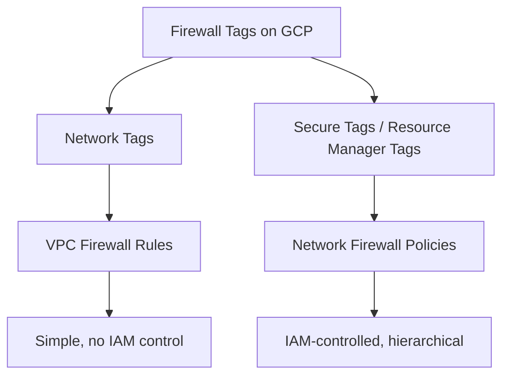
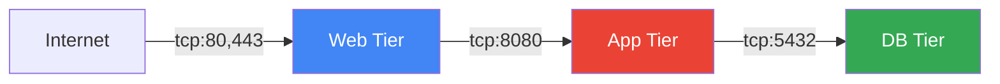

# How to Configure Tag-Based Firewall Rules for Dynamic Workload Protection on GCP

Author: [nawazdhandala](https://www.github.com/nawazdhandala)

Tags: GCP, Firewall Rules, Network Tags, Security, Google Cloud Networking

Description: Learn how to use tag-based firewall rules on Google Cloud Platform to dynamically protect workloads and simplify network security management at scale.

---

Managing firewall rules in a growing GCP environment quickly becomes unmanageable if you rely on IP-based rules. VMs get created and destroyed, IPs change, and suddenly your firewall rules are out of date. Tag-based firewall rules solve this by letting you define rules based on labels attached to your workloads rather than specific IP addresses. When a new VM spins up with the right tag, it automatically gets the right firewall rules applied to it.

This post covers how to set up and manage tag-based firewall rules effectively, including both the older network tags and the newer secure tags introduced with network firewall policies.

## Network Tags vs Secure Tags

GCP has two tag systems for firewall rules, and understanding the difference matters:

**Network tags** are the original system. They are simple string labels applied to VM instances. Any project editor can add or remove them, and they work with VPC firewall rules. They are straightforward but lack IAM controls.

**Secure tags** (also called resource manager tags) are the newer system. They are key-value pairs managed through IAM, meaning you can control who can assign tags. They work with network firewall policies (both hierarchical and regional).



## Using Network Tags with VPC Firewall Rules

Let me start with the traditional approach using network tags. First, apply tags to your instances:

```bash
# Add network tags to an existing VM instance
# Tags identify the workload type for firewall rule targeting
gcloud compute instances add-tags my-web-server \
    --tags=http-server,https-server \
    --zone=us-central1-a

# Create a VM with tags from the start
gcloud compute instances create my-api-server \
    --zone=us-central1-a \
    --machine-type=e2-medium \
    --tags=api-server,internal-only \
    --image-family=debian-11 \
    --image-project=debian-cloud
```

Now create firewall rules that target these tags:

```bash
# Allow HTTP traffic from the internet to instances tagged as http-server
gcloud compute firewall-rules create allow-http \
    --network=my-vpc \
    --allow=tcp:80 \
    --source-ranges=0.0.0.0/0 \
    --target-tags=http-server \
    --description="Allow HTTP traffic to web servers"

# Allow HTTPS traffic from the internet to instances tagged as https-server
gcloud compute firewall-rules create allow-https \
    --network=my-vpc \
    --allow=tcp:443 \
    --source-ranges=0.0.0.0/0 \
    --target-tags=https-server \
    --description="Allow HTTPS traffic to web servers"

# Allow internal API traffic only from web servers to API servers
# Uses both source-tags and target-tags for service-to-service rules
gcloud compute firewall-rules create allow-web-to-api \
    --network=my-vpc \
    --allow=tcp:8080 \
    --source-tags=http-server \
    --target-tags=api-server \
    --description="Allow web tier to reach API tier"
```

The combination of source-tags and target-tags is powerful. The `allow-web-to-api` rule means only VMs tagged `http-server` can reach VMs tagged `api-server` on port 8080. No IP addresses to manage.

## Building a Multi-Tier Architecture with Tags

Here is a practical example of securing a three-tier application:

```bash
# Tier 1: Web servers - accept traffic from the internet
gcloud compute firewall-rules create tier1-ingress \
    --network=my-vpc \
    --allow=tcp:80,tcp:443 \
    --source-ranges=0.0.0.0/0 \
    --target-tags=web-tier \
    --priority=1000

# Tier 2: App servers - accept traffic only from web tier
gcloud compute firewall-rules create tier2-ingress \
    --network=my-vpc \
    --allow=tcp:8080 \
    --source-tags=web-tier \
    --target-tags=app-tier \
    --priority=1000

# Tier 3: Database servers - accept traffic only from app tier
gcloud compute firewall-rules create tier3-ingress \
    --network=my-vpc \
    --allow=tcp:5432 \
    --source-tags=app-tier \
    --target-tags=db-tier \
    --priority=1000

# Deny all other internal traffic between tiers
gcloud compute firewall-rules create deny-inter-tier \
    --network=my-vpc \
    --action=DENY \
    --rules=all \
    --source-ranges=10.0.0.0/8 \
    --priority=2000
```



## Using Secure Tags with Network Firewall Policies

Secure tags offer better governance because they are IAM-controlled. Here is how to set them up:

```bash
# Create a tag key for workload classification
gcloud resource-manager tags keys create workload-type \
    --parent=organizations/123456789 \
    --description="Classifies workload type for firewall rules"

# Create tag values for each workload type
gcloud resource-manager tags values create web-server \
    --parent=organizations/123456789/workload-type \
    --description="Web serving workloads"

gcloud resource-manager tags values create api-server \
    --parent=organizations/123456789/workload-type \
    --description="API backend workloads"

gcloud resource-manager tags values create database \
    --parent=organizations/123456789/workload-type \
    --description="Database workloads"
```

Apply secure tags to instances:

```bash
# Bind a secure tag to a VM instance
# Requires tagUser IAM role on the tag value
gcloud resource-manager tags bindings create \
    --tag-value=organizations/123456789/workload-type/web-server \
    --parent=//compute.googleapis.com/projects/my-project/zones/us-central1-a/instances/my-web-server \
    --location=us-central1-a
```

Now create a network firewall policy with rules using secure tags:

```bash
# Create a regional network firewall policy
gcloud compute network-firewall-policies create my-firewall-policy \
    --region=us-central1

# Add a rule allowing HTTP to web servers using secure tags
gcloud compute network-firewall-policies rules create 1000 \
    --firewall-policy=my-firewall-policy \
    --region=us-central1 \
    --direction=INGRESS \
    --action=allow \
    --layer4-configs=tcp:80,tcp:443 \
    --src-ip-ranges=0.0.0.0/0 \
    --target-secure-tags=organizations/123456789/workload-type/web-server

# Add a rule allowing web-to-api traffic using secure tags on both sides
gcloud compute network-firewall-policies rules create 1100 \
    --firewall-policy=my-firewall-policy \
    --region=us-central1 \
    --direction=INGRESS \
    --action=allow \
    --layer4-configs=tcp:8080 \
    --src-secure-tags=organizations/123456789/workload-type/web-server \
    --target-secure-tags=organizations/123456789/workload-type/api-server

# Associate the policy with your VPC network
gcloud compute network-firewall-policies associations create \
    --firewall-policy=my-firewall-policy \
    --network=my-vpc \
    --region=us-central1
```

## Tags in Instance Templates for Auto-Scaling

When using managed instance groups, apply tags in the instance template so every new instance automatically gets the correct firewall rules:

```bash
# Create an instance template with network tags
# Every instance created from this template inherits these tags
gcloud compute instance-templates create web-server-template \
    --machine-type=e2-medium \
    --tags=web-tier,http-server,https-server \
    --image-family=debian-11 \
    --image-project=debian-cloud \
    --metadata-from-file=startup-script=startup.sh
```

For secure tags with managed instance groups, bind the tags at the instance group level or use tag bindings in your deployment automation.

## Terraform Configuration

```hcl
# VPC firewall rules using network tags
resource "google_compute_firewall" "allow_http" {
  name    = "allow-http"
  network = google_compute_network.vpc.name

  allow {
    protocol = "tcp"
    ports    = ["80"]
  }

  source_ranges = ["0.0.0.0/0"]
  target_tags   = ["http-server"]
}

# Service-to-service rule using source and target tags
resource "google_compute_firewall" "web_to_api" {
  name    = "allow-web-to-api"
  network = google_compute_network.vpc.name

  allow {
    protocol = "tcp"
    ports    = ["8080"]
  }

  source_tags = ["web-tier"]
  target_tags = ["api-tier"]
}

# Instance template with tags
resource "google_compute_instance_template" "web" {
  name_prefix  = "web-"
  machine_type = "e2-medium"
  tags         = ["web-tier", "http-server"]

  disk {
    source_image = "debian-cloud/debian-11"
  }

  network_interface {
    network = google_compute_network.vpc.name
  }
}
```

## Best Practices for Tag-Based Firewall Rules

**Use consistent naming conventions.** Establish a tagging standard early. Something like `{tier}-{service}` (e.g., `web-frontend`, `app-api`, `db-postgres`) keeps things clear as the environment grows.

**Prefer secure tags for production.** Network tags can be modified by anyone with editor access to the project. Secure tags with IAM provide proper access control and audit trails.

**Combine with deny-all rules.** Tag-based allow rules are most effective when paired with a low-priority deny-all rule. This creates a default-deny posture where only explicitly tagged traffic is allowed.

**Audit tag usage regularly.** Tags that are applied but not referenced in any firewall rule are dead weight. Tags referenced in rules but not applied to any instance mean those rules are not doing anything.

```bash
# List all firewall rules and their target tags
gcloud compute firewall-rules list \
    --format="table(name, targetTags.list(), sourceTags.list(), allowed[].map().firewall_rule().list())"

# Find instances with a specific tag
gcloud compute instances list \
    --filter="tags.items=http-server" \
    --format="table(name, zone, status)"
```

Tag-based firewall rules are the foundation of scalable network security on GCP. They decouple your security policy from the constantly changing infrastructure underneath, making your firewall rules durable across scaling events, deployments, and migrations.
