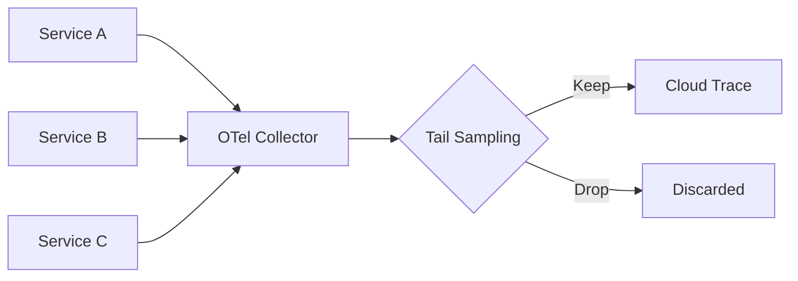

# How to Configure Tail-Based Sampling with OpenTelemetry Collector on Google Cloud

Author: [nawazdhandala](https://www.github.com/nawazdhandala)

Tags: GCP, OpenTelemetry, Sampling, Cloud Trace, Observability

Description: Learn how to set up tail-based sampling with the OpenTelemetry Collector on Google Cloud to keep important traces while reducing volume and costs.

---

Head-based sampling decides whether to keep a trace before it even starts. That means you might discard a trace that turns out to have a 30-second latency spike or an error deep in the call chain. Tail-based sampling fixes this by waiting until a trace is complete, then deciding whether to keep it based on the full picture - duration, error status, specific attributes, or any combination of criteria.

The tradeoff is complexity. Tail-based sampling requires the OpenTelemetry Collector to buffer complete traces in memory before making a decision. But for teams that need to catch every slow request and every error without storing millions of boring health check traces, it is worth the effort.

## Architecture Overview

Here is how tail-based sampling fits into a GCP architecture:



All services send their spans to a centralized OpenTelemetry Collector. The collector buffers spans, groups them by trace ID, waits for the trace to complete, evaluates the sampling policies, and then either forwards the trace to Cloud Trace or drops it.

## Deploying the Collector on GKE

First, deploy the OpenTelemetry Collector on your GKE cluster. Here is a Kubernetes deployment:

```yaml
# otel-collector-deployment.yaml
apiVersion: apps/v1
kind: Deployment
metadata:
  name: otel-collector
  namespace: observability
spec:
  replicas: 2
  selector:
    matchLabels:
      app: otel-collector
  template:
    metadata:
      labels:
        app: otel-collector
    spec:
      containers:
        - name: collector
          image: otel/opentelemetry-collector-contrib:latest
          args: ["--config=/conf/collector-config.yaml"]
          ports:
            - containerPort: 4317  # gRPC receiver
            - containerPort: 4318  # HTTP receiver
            - containerPort: 8888  # Metrics endpoint
          resources:
            requests:
              memory: "2Gi"
              cpu: "1000m"
            limits:
              memory: "4Gi"
              cpu: "2000m"
          volumeMounts:
            - name: config
              mountPath: /conf
      volumes:
        - name: config
          configMap:
            name: otel-collector-config
---
apiVersion: v1
kind: Service
metadata:
  name: otel-collector
  namespace: observability
spec:
  selector:
    app: otel-collector
  ports:
    - name: grpc
      port: 4317
      targetPort: 4317
    - name: http
      port: 4318
      targetPort: 4318
```

## Configuring Tail-Based Sampling

Here is the collector configuration with tail-based sampling policies:

```yaml
# collector-config.yaml
apiVersion: v1
kind: ConfigMap
metadata:
  name: otel-collector-config
  namespace: observability
data:
  collector-config.yaml: |
    receivers:
      otlp:
        protocols:
          grpc:
            endpoint: 0.0.0.0:4317
          http:
            endpoint: 0.0.0.0:4318

    processors:
      # Tail-based sampling processor
      tail_sampling:
        # How long to wait for a trace to complete before making a decision
        decision_wait: 30s
        # Maximum number of traces held in memory
        num_traces: 100000
        # Expected number of new traces per second (for memory allocation)
        expected_new_traces_per_sec: 1000
        # Sampling policies - evaluated in order
        policies:
          # Policy 1: Always keep error traces
          - name: errors-always
            type: status_code
            status_code:
              status_codes: [ERROR]

          # Policy 2: Always keep slow traces (over 5 seconds)
          - name: slow-traces
            type: latency
            latency:
              threshold_ms: 5000

          # Policy 3: Always keep traces from critical services
          - name: critical-services
            type: string_attribute
            string_attribute:
              key: service.name
              values: [payment-service, auth-service, checkout-service]

          # Policy 4: Keep traces that have specific attributes
          - name: high-value-transactions
            type: string_attribute
            string_attribute:
              key: transaction.type
              values: [purchase, refund, subscription]

          # Policy 5: Sample 10% of everything else
          - name: probabilistic-fallback
            type: probabilistic
            probabilistic:
              sampling_percentage: 10

      # Batch processor for efficient export
      batch:
        timeout: 5s
        send_batch_size: 512
        send_batch_max_size: 1024

      # Memory limiter to prevent OOM
      memory_limiter:
        check_interval: 1s
        limit_mib: 3072
        spike_limit_mib: 512

    exporters:
      googlecloud:
        project: my-project
        trace:
          # Use batch writing for efficiency
          batch:
            max_batch_items: 100

    service:
      pipelines:
        traces:
          receivers: [otlp]
          processors: [memory_limiter, tail_sampling, batch]
          exporters: [googlecloud]
```

## Understanding Sampling Policies

Let me break down the sampling policies in detail.

### Status Code Policy

This keeps all traces that contain at least one span with an error status:

```yaml
# Keep every trace that has an error
- name: errors-always
  type: status_code
  status_code:
    status_codes: [ERROR]
```

This is the most important policy. You never want to lose visibility into errors.

### Latency Policy

This keeps traces that exceed a duration threshold:

```yaml
# Keep traces that take longer than 5 seconds
- name: slow-traces
  type: latency
  latency:
    threshold_ms: 5000
```

Latency is measured as the duration of the root span. Adjust the threshold based on your SLAs.

### String Attribute Policy

This matches traces based on span attributes:

```yaml
# Keep traces from specific services
- name: critical-services
  type: string_attribute
  string_attribute:
    key: service.name
    values: [payment-service, auth-service]
```

### Composite Policy

For more complex rules, use a composite policy that combines multiple conditions:

```yaml
# Composite policy: keep traces from the API gateway that are also slow
- name: slow-api-requests
  type: composite
  composite:
    max_total_spans_per_second: 500
    policy_order: [slow-check, service-check]
    composite_sub_policy:
      - name: slow-check
        type: latency
        latency:
          threshold_ms: 2000
      - name: service-check
        type: string_attribute
        string_attribute:
          key: service.name
          values: [api-gateway]
    rate_allocation:
      - policy: slow-check
        percent: 60
      - policy: service-check
        percent: 40
```

### AND Policy

To require multiple conditions to be true:

```yaml
# Keep traces that are both slow AND from the payment service
- name: slow-payments
  type: and
  and:
    and_sub_policy:
      - name: latency-check
        type: latency
        latency:
          threshold_ms: 3000
      - name: service-check
        type: string_attribute
        string_attribute:
          key: service.name
          values: [payment-service]
```

## Scaling Considerations

Tail-based sampling has memory implications because the collector must buffer complete traces. Here is how to size your collector:

```python
# Calculate memory requirements for tail sampling
def estimate_memory(
    traces_per_second: int,
    avg_spans_per_trace: int,
    avg_span_size_bytes: int,
    decision_wait_seconds: int,
):
    """Estimate memory needed for tail-based sampling."""
    # Total spans buffered at any time
    buffered_spans = traces_per_second * avg_spans_per_trace * decision_wait_seconds

    # Memory for span data
    span_memory_mb = (buffered_spans * avg_span_size_bytes) / (1024 * 1024)

    # Add overhead for indexing and bookkeeping (roughly 2x)
    total_memory_mb = span_memory_mb * 2

    return {
        'buffered_spans': buffered_spans,
        'estimated_memory_mb': round(total_memory_mb),
    }

# Example: 500 traces/sec, 8 spans each, 1KB per span, 30s wait
result = estimate_memory(500, 8, 1024, 30)
print(f"Buffered spans: {result['buffered_spans']:,}")
print(f"Estimated memory: {result['estimated_memory_mb']} MB")
# Output: Buffered spans: 120,000
# Output: Estimated memory: 234 MB
```

## Handling Multi-Collector Deployments

If you run multiple collector replicas, all spans from the same trace must go to the same collector instance. Use a load balancer with trace-ID-based routing, or use the `groupbytrace` processor before tail sampling:

```yaml
processors:
  # Group spans by trace ID before sampling
  groupbytrace:
    wait_duration: 10s
    num_traces: 50000
    num_workers: 4

  tail_sampling:
    decision_wait: 30s
    # ... policies ...

service:
  pipelines:
    traces:
      receivers: [otlp]
      processors: [memory_limiter, groupbytrace, tail_sampling, batch]
      exporters: [googlecloud]
```

Alternatively, use a two-tier architecture: a lightweight collector per service (for batching and forwarding) and a centralized collector for tail sampling.

## Monitoring the Collector

The collector exposes metrics about its internal state. Monitor these to ensure tail sampling is working correctly:

```yaml
# Enable collector self-monitoring
service:
  telemetry:
    metrics:
      address: 0.0.0.0:8888
      level: detailed
```

Key metrics to watch:
- `otelcol_processor_tail_sampling_count_traces_sampled` - How many traces are kept
- `otelcol_processor_tail_sampling_count_traces_dropped` - How many are dropped
- `otelcol_processor_tail_sampling_sampling_trace_dropped_too_early` - Traces dropped before the decision wait (possible configuration issue)
- `otelcol_processor_tail_sampling_global_count_traces_sampled` - Global counters

Set up monitoring in OneUptime to alert on unusual changes in these metrics. If the dropped-too-early count spikes, your `decision_wait` is too short, and you are losing incomplete traces before making a proper decision.

## Practical Tips

1. **Start with a generous decision_wait.** 30 seconds covers most synchronous request chains. Increase it if your traces involve async processing.

2. **Set the probabilistic fallback last.** Policies are evaluated in order, and a trace only needs to match one policy. Put your targeted policies first and the catch-all probabilistic sampler last.

3. **Monitor memory usage closely.** Tail sampling can cause memory spikes during traffic bursts. The `memory_limiter` processor is your safety net.

4. **Test with realistic traffic.** Tail sampling behavior changes with traffic volume. Test your configuration under production-like load before deploying.

Tail-based sampling gives you the best of both worlds - low costs from aggressive sampling, with 100% visibility into the traces that matter. It takes more setup than head-based sampling, but for production systems on GCP, it is the right approach.
