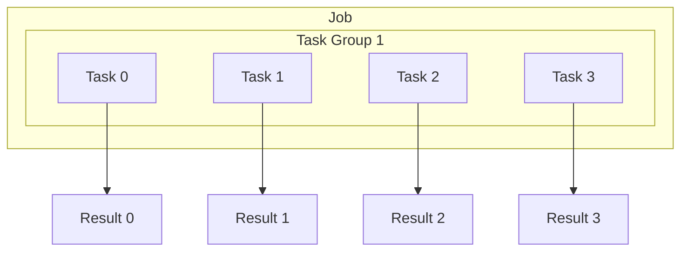

# How to Configure Task Parallelism and Ordering Policies in Google Cloud Batch Jobs

Author: [nawazdhandala](https://www.github.com/nawazdhandala)

Tags: GCP, Cloud Batch, Task Parallelism, Batch Processing, HPC

Description: Configure task parallelism and ordering policies in Google Cloud Batch to optimize job execution for various batch processing workloads.

---

Google Cloud Batch lets you run hundreds or thousands of tasks within a single job. But not all tasks should run the same way. Some workloads need maximum parallelism to finish quickly. Others need sequential execution because tasks depend on each other. And some need a mix - groups of parallel tasks that run in sequence.

This guide covers the different parallelism configurations and task ordering policies in Cloud Batch, with practical examples for each pattern.

## Understanding Task Groups

A Batch job is organized into task groups. Each task group has its own task specification, count, and parallelism setting. Tasks within a group all run the same code but receive a unique task index through the `BATCH_TASK_INDEX` environment variable.



## Maximum Parallelism

When all tasks are independent and you want the job to finish as fast as possible, set parallelism equal to the task count.

```python
# max_parallel_job.py - All tasks run simultaneously
from google.cloud import batch_v1

def create_fully_parallel_job(project_id, region):
    """Create a batch job where all tasks run at the same time."""
    client = batch_v1.BatchServiceClient()
    parent = f"projects/{project_id}/locations/{region}"

    job = batch_v1.Job()

    # Define the task
    task_spec = batch_v1.TaskSpec()
    runnable = batch_v1.Runnable()
    script = batch_v1.Runnable.Script()

    # Each task processes one chunk of data based on its index
    script.text = """#!/bin/bash
    echo "Task ${BATCH_TASK_INDEX} of ${BATCH_TASK_COUNT} starting"
    echo "Processing chunk ${BATCH_TASK_INDEX}..."

    # Download the specific data chunk for this task
    gsutil cp gs://input-data/chunks/chunk_${BATCH_TASK_INDEX}.csv /tmp/input.csv

    # Process the data
    python3 /app/process_chunk.py --input /tmp/input.csv --output /tmp/output.csv

    # Upload results
    gsutil cp /tmp/output.csv gs://output-data/results/result_${BATCH_TASK_INDEX}.csv

    echo "Task ${BATCH_TASK_INDEX} completed"
    """

    runnable.script = script
    task_spec.runnables = [runnable]

    # Compute resources per task
    resources = batch_v1.ComputeResource()
    resources.cpu_milli = 2000  # 2 vCPUs
    resources.memory_mib = 4096  # 4 GB RAM
    task_spec.compute_resource = resources
    task_spec.max_retry_count = 2
    task_spec.max_run_duration = "1800s"  # 30 minutes per task

    # Task group with maximum parallelism
    task_group = batch_v1.TaskGroup()
    task_group.task_spec = task_spec
    task_group.task_count = 100   # 100 tasks
    task_group.parallelism = 100  # All 100 run at once

    job.task_groups = [task_group]

    # Allocation policy
    allocation = batch_v1.AllocationPolicy()
    instance = batch_v1.AllocationPolicy.InstancePolicyOrTemplate()
    policy = batch_v1.AllocationPolicy.InstancePolicy()
    policy.machine_type = "e2-standard-4"
    instance.policy = policy
    allocation.instances = [instance]
    job.allocation_policy = allocation

    # Logging
    job.logs_policy = batch_v1.LogsPolicy(
        destination=batch_v1.LogsPolicy.Destination.CLOUD_LOGGING
    )

    created_job = client.create_job(
        parent=parent, job=job, job_id="fully-parallel-job"
    )

    print(f"Created job with 100 parallel tasks: {created_job.name}")
    return created_job
```

## Limited Parallelism

When your downstream services have rate limits or you want to control resource usage, set parallelism lower than the task count. Batch will queue tasks and start new ones as running tasks complete.

```python
# limited_parallel_job.py - Run tasks with controlled concurrency
from google.cloud import batch_v1

def create_rate_limited_job(project_id, region):
    """Create a job that limits concurrent tasks to avoid overloading resources."""
    client = batch_v1.BatchServiceClient()
    parent = f"projects/{project_id}/locations/{region}"

    job = batch_v1.Job()

    task_spec = batch_v1.TaskSpec()
    runnable = batch_v1.Runnable()
    container = batch_v1.Runnable.Container()

    # Container that calls an API with rate limits
    container.image_uri = "us-central1-docker.pkg.dev/YOUR_PROJECT/batch/api-caller:latest"
    container.commands = ["python", "call_api.py"]

    runnable.container = container
    task_spec.runnables = [runnable]

    resources = batch_v1.ComputeResource()
    resources.cpu_milli = 1000
    resources.memory_mib = 2048
    task_spec.compute_resource = resources

    # 500 API calls to make, but only 10 at a time
    # to stay within the API rate limit
    task_group = batch_v1.TaskGroup()
    task_group.task_spec = task_spec
    task_group.task_count = 500    # Total tasks
    task_group.parallelism = 10    # Max 10 concurrent

    job.task_groups = [task_group]

    allocation = batch_v1.AllocationPolicy()
    instance = batch_v1.AllocationPolicy.InstancePolicyOrTemplate()
    policy = batch_v1.AllocationPolicy.InstancePolicy()
    policy.machine_type = "e2-small"
    instance.policy = policy
    allocation.instances = [instance]
    job.allocation_policy = allocation

    job.logs_policy = batch_v1.LogsPolicy(
        destination=batch_v1.LogsPolicy.Destination.CLOUD_LOGGING
    )

    created_job = client.create_job(
        parent=parent, job=job, job_id="rate-limited-job"
    )

    print(f"Created job: 500 tasks, max 10 concurrent")
    return created_job
```

## Sequential Execution

When tasks must run one after another, set parallelism to 1. Each task completes before the next one starts.

```python
# sequential_job.py - Tasks run one at a time in order
from google.cloud import batch_v1

def create_sequential_job(project_id, region):
    """Create a job where tasks run sequentially."""
    client = batch_v1.BatchServiceClient()
    parent = f"projects/{project_id}/locations/{region}"

    job = batch_v1.Job()

    task_spec = batch_v1.TaskSpec()
    runnable = batch_v1.Runnable()
    script = batch_v1.Runnable.Script()

    # Each step builds on the output of the previous step
    script.text = """#!/bin/bash
    echo "Running pipeline step ${BATCH_TASK_INDEX}"

    case ${BATCH_TASK_INDEX} in
        0)
            echo "Step 0: Extract raw data"
            python3 /app/extract.py --output /mnt/shared/raw_data.parquet
            ;;
        1)
            echo "Step 1: Clean and validate data"
            python3 /app/clean.py --input /mnt/shared/raw_data.parquet --output /mnt/shared/clean_data.parquet
            ;;
        2)
            echo "Step 2: Transform and aggregate"
            python3 /app/transform.py --input /mnt/shared/clean_data.parquet --output /mnt/shared/final_data.parquet
            ;;
        3)
            echo "Step 3: Load into BigQuery"
            python3 /app/load.py --input /mnt/shared/final_data.parquet
            ;;
    esac
    """

    runnable.script = script
    task_spec.runnables = [runnable]

    resources = batch_v1.ComputeResource()
    resources.cpu_milli = 4000
    resources.memory_mib = 16384
    task_spec.compute_resource = resources

    # GCS volume for sharing data between sequential tasks
    gcs_volume = batch_v1.Volume()
    gcs = batch_v1.GCS()
    gcs.remote_path = "pipeline-workspace/"
    gcs_volume.gcs = gcs
    gcs_volume.mount_path = "/mnt/shared"
    task_spec.volumes = [gcs_volume]

    # Sequential execution: parallelism = 1
    task_group = batch_v1.TaskGroup()
    task_group.task_spec = task_spec
    task_group.task_count = 4      # 4 pipeline steps
    task_group.parallelism = 1     # Run one at a time, in order

    job.task_groups = [task_group]

    allocation = batch_v1.AllocationPolicy()
    instance = batch_v1.AllocationPolicy.InstancePolicyOrTemplate()
    policy = batch_v1.AllocationPolicy.InstancePolicy()
    policy.machine_type = "e2-standard-4"
    instance.policy = policy
    allocation.instances = [instance]
    job.allocation_policy = allocation

    job.logs_policy = batch_v1.LogsPolicy(
        destination=batch_v1.LogsPolicy.Destination.CLOUD_LOGGING
    )

    created_job = client.create_job(
        parent=parent, job=job, job_id="sequential-pipeline"
    )

    print(f"Created sequential pipeline job: {created_job.name}")
    return created_job
```

## Multiple Runnables for Task Ordering Within a Task

Within a single task, you can define multiple runnables that execute sequentially. This is useful when each task needs a setup, processing, and cleanup phase.

```python
# multi_runnable_job.py - Multiple sequential steps within each parallel task
from google.cloud import batch_v1

def create_multi_step_task_job(project_id, region):
    """Each task runs multiple runnables in sequence."""
    client = batch_v1.BatchServiceClient()
    parent = f"projects/{project_id}/locations/{region}"

    job = batch_v1.Job()
    task_spec = batch_v1.TaskSpec()

    # Step 1: Download data (runs first within each task)
    download_step = batch_v1.Runnable()
    download_script = batch_v1.Runnable.Script()
    download_script.text = """#!/bin/bash
    echo "Downloading data for task ${BATCH_TASK_INDEX}"
    gsutil cp gs://input-bucket/data_${BATCH_TASK_INDEX}.tar.gz /tmp/data.tar.gz
    tar xzf /tmp/data.tar.gz -C /tmp/data/
    """
    download_step.script = download_script

    # Step 2: Process data (runs after download completes)
    process_step = batch_v1.Runnable()
    process_container = batch_v1.Runnable.Container()
    process_container.image_uri = "us-central1-docker.pkg.dev/YOUR_PROJECT/batch/processor:latest"
    process_container.commands = ["python", "process.py", "--input", "/tmp/data/", "--output", "/tmp/results/"]
    process_step.container = process_container

    # Step 3: Upload results (runs after processing completes)
    upload_step = batch_v1.Runnable()
    upload_script = batch_v1.Runnable.Script()
    upload_script.text = """#!/bin/bash
    echo "Uploading results for task ${BATCH_TASK_INDEX}"
    gsutil -m cp -r /tmp/results/ gs://output-bucket/results_${BATCH_TASK_INDEX}/
    """
    upload_step.script = upload_script

    # Runnables execute in order within each task
    task_spec.runnables = [download_step, process_step, upload_step]

    resources = batch_v1.ComputeResource()
    resources.cpu_milli = 4000
    resources.memory_mib = 8192
    task_spec.compute_resource = resources

    # All tasks run in parallel, but each task's steps run sequentially
    task_group = batch_v1.TaskGroup()
    task_group.task_spec = task_spec
    task_group.task_count = 50
    task_group.parallelism = 50

    job.task_groups = [task_group]

    allocation = batch_v1.AllocationPolicy()
    instance = batch_v1.AllocationPolicy.InstancePolicyOrTemplate()
    policy = batch_v1.AllocationPolicy.InstancePolicy()
    policy.machine_type = "e2-standard-4"
    instance.policy = policy
    allocation.instances = [instance]
    job.allocation_policy = allocation

    job.logs_policy = batch_v1.LogsPolicy(
        destination=batch_v1.LogsPolicy.Destination.CLOUD_LOGGING
    )

    created_job = client.create_job(
        parent=parent, job=job, job_id="multi-step-parallel"
    )

    print(f"Created job: 50 parallel tasks, each with 3 sequential steps")
    return created_job
```

## Choosing the Right Parallelism Level

The optimal parallelism depends on several factors:

- **CPU-bound workloads**: Match parallelism to available vCPUs across your allocated VMs
- **Memory-bound workloads**: Calculate how many tasks fit in memory per VM, then set parallelism accordingly
- **I/O-bound workloads**: Higher parallelism than CPU count can help since tasks spend time waiting on I/O
- **External API calls**: Match parallelism to the API rate limit to avoid throttling
- **Shared storage access**: Consider the IOPS limits of your storage when setting parallelism

A good approach is to start with moderate parallelism and increase it while monitoring for bottlenecks.

## Wrapping Up

Google Cloud Batch gives you fine-grained control over how tasks execute within a job. Full parallelism gets jobs done fastest, limited parallelism respects rate limits and resource constraints, and sequential execution handles dependent pipeline steps. The multiple runnables feature adds another dimension by letting each parallel task have its own internal sequence of steps. Understanding these patterns lets you model most batch processing workflows without external orchestration tools.
