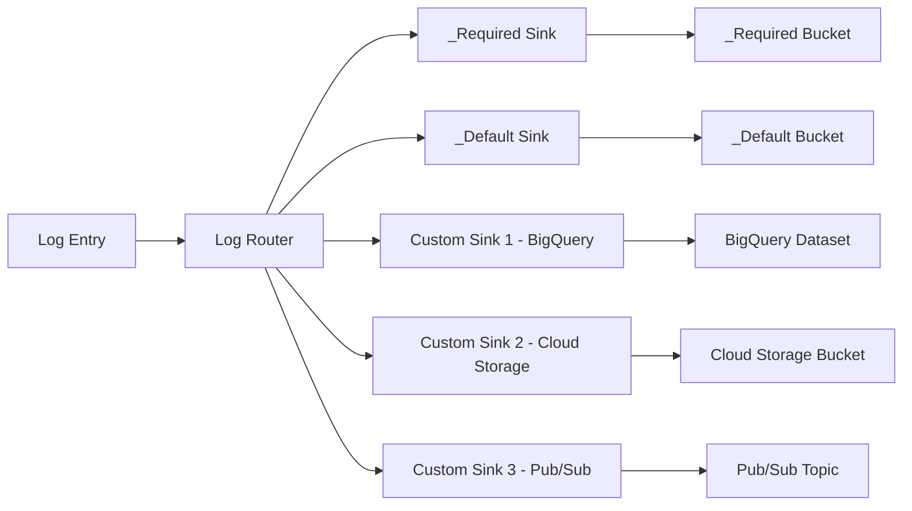

# How to Configure the Log Router in Cloud Logging to Route Logs to Multiple Destinations

Author: [nawazdhandala](https://www.github.com/nawazdhandala)

Tags: GCP, Cloud Logging, Log Router, Log Sinks, Log Management

Description: Learn how to configure the Cloud Logging Log Router to route logs to multiple destinations including BigQuery, Cloud Storage, and Pub/Sub.

---

Every log entry that enters Cloud Logging passes through the Log Router. The Log Router decides where each log entry goes - whether it stays in Cloud Logging, gets exported to BigQuery for analysis, goes to Cloud Storage for archival, or is forwarded to Pub/Sub for real-time processing. Understanding how to configure the Log Router is essential for managing costs, compliance, and operational workflows in GCP.

In this post, I will explain how the Log Router works and show you how to set up routing to multiple destinations.

## How the Log Router Works

The Log Router processes every log entry using sinks. Each sink has:

1. **A filter**: Determines which log entries the sink captures
2. **A destination**: Where matching log entries are sent
3. **An inclusion or exclusion type**: Whether the sink routes matching logs or excludes them

Every project comes with two default sinks:

- **`_Required`**: Routes audit logs and certain system logs to the `_Required` log bucket. This sink cannot be modified or disabled.
- **`_Default`**: Routes all other logs to the `_Default` log bucket. You can modify the filter on this sink but cannot delete it.

You can create additional sinks to route logs to other destinations alongside the defaults.

Here is a visual overview of how log routing works:



## Creating Sinks for Multiple Destinations

### Sink to BigQuery

BigQuery is ideal for log analytics. You can run SQL queries on your logs, join them with other datasets, and build dashboards.

First, create a BigQuery dataset:

```bash
# Create a BigQuery dataset for log storage
bq mk --dataset --location=US my-project:application_logs
```

Then create the sink:

```bash
# Create a log sink that routes application logs to BigQuery
gcloud logging sinks create bigquery-app-logs \
  bigquery.googleapis.com/projects/my-project/datasets/application_logs \
  --log-filter='resource.type="gce_instance" OR resource.type="cloud_run_revision"' \
  --project=my-project
```

After creating the sink, grant the sink's service account write access to the BigQuery dataset:

```bash
# Get the sink's writer identity
gcloud logging sinks describe bigquery-app-logs --project=my-project --format='value(writerIdentity)'

# Grant the BigQuery Data Editor role to the sink's service account
bq add-iam-policy-binding \
  --member="serviceAccount:p123456-123456@gcp-sa-logging.iam.gserviceaccount.com" \
  --role="roles/bigquery.dataEditor" \
  my-project:application_logs
```

### Sink to Cloud Storage

Cloud Storage is the best option for long-term archival of logs, especially when you need to retain logs for compliance but do not need to query them frequently:

```bash
# Create a Cloud Storage bucket for log archival
gcloud storage buckets create gs://my-project-log-archive \
  --location=US \
  --uniform-bucket-level-access

# Create a log sink that routes all logs to Cloud Storage
gcloud logging sinks create storage-all-logs \
  storage.googleapis.com/my-project-log-archive \
  --log-filter='severity>=WARNING' \
  --project=my-project
```

Grant write access:

```bash
# Grant the sink's service account access to the storage bucket
gcloud storage buckets add-iam-policy-binding gs://my-project-log-archive \
  --member="serviceAccount:p123456-123456@gcp-sa-logging.iam.gserviceaccount.com" \
  --role="roles/storage.objectCreator"
```

### Sink to Pub/Sub

Pub/Sub sinks are useful for real-time log processing - feeding logs to a custom application, sending them to a third-party SIEM, or triggering automated responses:

```bash
# Create a Pub/Sub topic for log streaming
gcloud pubsub topics create log-stream --project=my-project

# Create a log sink that routes error logs to Pub/Sub
gcloud logging sinks create pubsub-error-logs \
  pubsub.googleapis.com/projects/my-project/topics/log-stream \
  --log-filter='severity>=ERROR' \
  --project=my-project
```

Grant publish access:

```bash
# Grant the sink's service account Pub/Sub publisher role
gcloud pubsub topics add-iam-policy-binding log-stream \
  --member="serviceAccount:p123456-123456@gcp-sa-logging.iam.gserviceaccount.com" \
  --role="roles/pubsub.publisher" \
  --project=my-project
```

## Writing Effective Log Filters

The filter determines which logs a sink captures. Here are some common patterns:

### Filter by Resource Type

```
# Only Compute Engine instance logs
resource.type="gce_instance"
```

### Filter by Severity

```
# Only warning and above
severity>=WARNING
```

### Filter by Log Name

```
# Only Cloud Audit logs
logName:"cloudaudit.googleapis.com"
```

### Combining Filters

```
# Application errors from Cloud Run services
resource.type="cloud_run_revision" AND severity>=ERROR
```

### Excluding Specific Logs

```
# All logs except health check requests
NOT httpRequest.requestUrl="/healthz"
```

## Routing the Same Logs to Multiple Destinations

A single log entry can match multiple sinks and be routed to all of them. For example, you might want:

- All logs go to Cloud Storage for archival (7-year retention)
- Application logs go to BigQuery for analysis (90-day retention)
- Error logs go to Pub/Sub for real-time alerting

Here is how to set this up:

```bash
# Sink 1: All logs to Cloud Storage for long-term archival
gcloud logging sinks create archive-all-logs \
  storage.googleapis.com/my-project-log-archive \
  --log-filter='' \
  --project=my-project

# Sink 2: Application logs to BigQuery for analytics
gcloud logging sinks create analytics-app-logs \
  bigquery.googleapis.com/projects/my-project/datasets/app_logs \
  --log-filter='resource.type="cloud_run_revision" OR resource.type="gce_instance" OR resource.type="k8s_container"' \
  --project=my-project

# Sink 3: Error logs to Pub/Sub for real-time processing
gcloud logging sinks create realtime-error-logs \
  pubsub.googleapis.com/projects/my-project/topics/error-logs \
  --log-filter='severity>=ERROR' \
  --project=my-project
```

## Terraform Configuration

For infrastructure-as-code management, here is a Terraform setup:

```hcl
# BigQuery dataset for logs
resource "google_bigquery_dataset" "logs" {
  dataset_id = "application_logs"
  location   = "US"
}

# Cloud Storage bucket for log archival
resource "google_storage_bucket" "log_archive" {
  name     = "${var.project_id}-log-archive"
  location = "US"

  uniform_bucket_level_access = true

  lifecycle_rule {
    action {
      type = "Delete"
    }
    condition {
      age = 2555  # 7 years
    }
  }
}

# Sink to BigQuery
resource "google_logging_project_sink" "bigquery_sink" {
  name        = "bigquery-app-logs"
  destination = "bigquery.googleapis.com/projects/${var.project_id}/datasets/${google_bigquery_dataset.logs.dataset_id}"
  filter      = "resource.type=\"cloud_run_revision\" OR resource.type=\"gce_instance\""

  bigquery_options {
    use_partitioned_tables = true
  }
}

# Sink to Cloud Storage
resource "google_logging_project_sink" "storage_sink" {
  name        = "storage-all-logs"
  destination = "storage.googleapis.com/${google_storage_bucket.log_archive.name}"
  filter      = ""
}

# Grant BigQuery access to the sink's service account
resource "google_bigquery_dataset_iam_member" "log_writer" {
  dataset_id = google_bigquery_dataset.logs.dataset_id
  role       = "roles/bigquery.dataEditor"
  member     = google_logging_project_sink.bigquery_sink.writer_identity
}

# Grant Cloud Storage access to the sink's service account
resource "google_storage_bucket_iam_member" "log_writer" {
  bucket = google_storage_bucket.log_archive.name
  role   = "roles/storage.objectCreator"
  member = google_logging_project_sink.storage_sink.writer_identity
}
```

## Cost Considerations

Log routing impacts your Cloud Logging costs. Here are the key points:

- **Ingestion charges still apply**: Even if you route logs to an external destination, you are still charged for log ingestion unless you also create an exclusion filter.
- **Destination storage costs**: BigQuery, Cloud Storage, and Pub/Sub have their own pricing. BigQuery is the most expensive for storage, Cloud Storage is the cheapest.
- **Use exclusions with routing**: If you are routing logs to BigQuery and do not need them in Cloud Logging, add an exclusion filter for those logs on the `_Default` sink to avoid double storage charges.

## Wrapping Up

The Log Router is the control plane for all log data in your GCP project. By creating multiple sinks with targeted filters, you can send the right logs to the right place - BigQuery for analytics, Cloud Storage for compliance archival, and Pub/Sub for real-time processing. The key is designing your filters carefully so each destination gets the logs it needs without unnecessary duplication that drives up costs.
