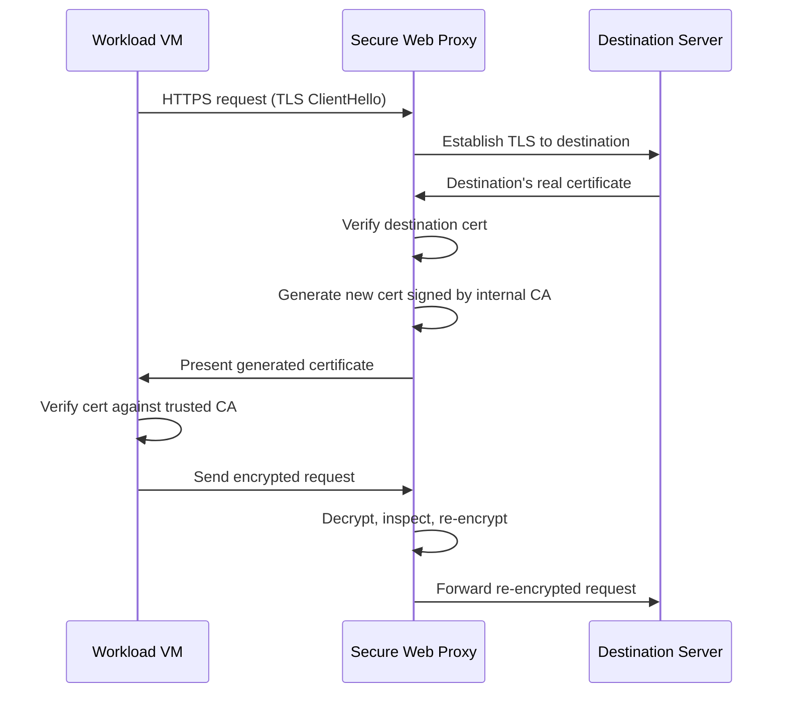

# How to Configure TLS Inspection with Certificate Authority Service and Secure Web Proxy on GCP

Author: [nawazdhandala](https://www.github.com/nawazdhandala)

Tags: GCP, TLS Inspection, Certificate Authority, Secure Web Proxy, Network Security

Description: Learn how to configure TLS inspection on GCP using Certificate Authority Service and Secure Web Proxy to inspect encrypted egress traffic for threats and data loss.

---

Over 90% of web traffic is encrypted with TLS. This is great for privacy, but it also means that malware, data exfiltration, and command-and-control traffic can hide inside encrypted connections. Without TLS inspection, your proxy can see the destination hostname (from the SNI extension) but not the actual content being transferred. TLS inspection decrypts the traffic at the proxy, inspects it, and re-encrypts it before forwarding - giving you visibility into the actual content of HTTPS connections.

On Google Cloud, TLS inspection combines Secure Web Proxy with Certificate Authority Service (CAS). In this post, I will walk through the complete setup.

## How TLS Inspection Works

The proxy performs a man-in-the-middle decryption of HTTPS traffic. Here is the flow:



The workload VM trusts the internal CA, so it accepts the proxy-generated certificate. The proxy can then see the plaintext HTTP request and response for inspection.

## Prerequisites

You need:

- Certificate Authority Service API enabled
- Secure Web Proxy already deployed (see the egress proxy setup guide)
- Administrative access to manage CAs and TLS policies

```bash
# Enable required APIs
gcloud services enable privateca.googleapis.com
gcloud services enable networksecurity.googleapis.com
gcloud services enable certificatemanager.googleapis.com
```

## Step 1 - Create a Certificate Authority

You need a private CA that the proxy uses to sign certificates for intercepted connections. Use Certificate Authority Service to create a root CA and a subordinate CA.

```bash
# Create a CA pool for the root CA
gcloud privateca pools create tls-inspection-root-pool \
    --location=us-central1 \
    --tier=enterprise

# Create the root CA
gcloud privateca roots create tls-inspection-root-ca \
    --pool=tls-inspection-root-pool \
    --location=us-central1 \
    --subject="CN=TLS Inspection Root CA, O=My Organization" \
    --key-algorithm=ec-p256-sha256 \
    --max-chain-length=1 \
    --validity=P10Y
```

Now create a subordinate CA that the proxy will use to sign certificates:

```bash
# Create a CA pool for the subordinate CA
gcloud privateca pools create tls-inspection-sub-pool \
    --location=us-central1 \
    --tier=devops

# Create the subordinate CA signed by the root
gcloud privateca subordinates create tls-inspection-sub-ca \
    --pool=tls-inspection-sub-pool \
    --location=us-central1 \
    --issuer-pool=tls-inspection-root-pool \
    --issuer-location=us-central1 \
    --subject="CN=TLS Inspection Subordinate CA, O=My Organization" \
    --key-algorithm=ec-p256-sha256 \
    --validity=P3Y
```

Using a subordinate CA is a best practice. If the sub CA is compromised, you can revoke it and create a new one without changing the root CA trust on all your workloads.

## Step 2 - Configure IAM for the Proxy

The Secure Web Proxy needs permission to request certificates from the CA pool.

```bash
# Get the SWP service account
# The format is: service-PROJECT_NUMBER@gcp-sa-networksecurity.iam.gserviceaccount.com
PROJECT_NUMBER=$(gcloud projects describe my-project --format="value(projectNumber)")
SWP_SA="service-${PROJECT_NUMBER}@gcp-sa-networksecurity.iam.gserviceaccount.com"

# Grant certificate requester role on the subordinate CA pool
gcloud privateca pools add-iam-policy-binding tls-inspection-sub-pool \
    --location=us-central1 \
    --member="serviceAccount:${SWP_SA}" \
    --role="roles/privateca.certificateRequester"

# Grant the ability to use the CA pool for TLS inspection
gcloud privateca pools add-iam-policy-binding tls-inspection-sub-pool \
    --location=us-central1 \
    --member="serviceAccount:${SWP_SA}" \
    --role="roles/privateca.workloadCertificateRequester"
```

## Step 3 - Create a TLS Inspection Policy

The TLS inspection policy tells the proxy which CA pool to use and which traffic to inspect.

```bash
# Create a TLS inspection policy
gcloud network-security tls-inspection-policies create tls-policy \
    --location=us-central1 \
    --ca-pool=projects/my-project/locations/us-central1/caPools/tls-inspection-sub-pool \
    --description="TLS inspection policy for egress traffic"
```

## Step 4 - Update the Secure Web Proxy with TLS Inspection

Update your existing Secure Web Proxy to use the TLS inspection policy.

```bash
# Update the firewall endpoint association to include TLS inspection
gcloud network-security firewall-endpoint-associations update ngfw-assoc-us \
    --zone=us-central1-a \
    --tls-inspection-policy=projects/my-project/locations/us-central1/tlsInspectionPolicies/tls-policy \
    --project=my-project
```

Or if you are using Secure Web Proxy directly:

```bash
# Update the gateway to enable TLS inspection
gcloud network-security gateways update egress-proxy \
    --location=us-central1 \
    --tls-inspection-policy=projects/my-project/locations/us-central1/tlsInspectionPolicies/tls-policy
```

## Step 5 - Create Policy Rules with TLS Inspection

Update your gateway security policy rules to enable TLS inspection on specific traffic.

```bash
# Create a rule that inspects HTTPS traffic to external destinations
gcloud network-security gateway-security-policies rules create inspect-https-traffic \
    --gateway-security-policy=egress-policy \
    --location=us-central1 \
    --priority=50 \
    --basic-profile=ALLOW \
    --session-matcher='true' \
    --tls-inspection-enabled \
    --description="Inspect all HTTPS egress traffic"

# You can also selectively inspect only certain domains
gcloud network-security gateway-security-policies rules create inspect-sensitive-destinations \
    --gateway-security-policy=egress-policy \
    --location=us-central1 \
    --priority=60 \
    --basic-profile=ALLOW \
    --session-matcher='host().endsWith("pastebin.com") || host().endsWith("file-sharing.example.com")' \
    --tls-inspection-enabled \
    --description="Inspect traffic to known data sharing sites"
```

## Step 6 - Distribute the CA Certificate to Workloads

Your workloads need to trust the internal CA so they accept the proxy-generated certificates. Export the root CA certificate and install it on your VMs and containers.

```bash
# Export the root CA certificate
gcloud privateca roots describe tls-inspection-root-ca \
    --pool=tls-inspection-root-pool \
    --location=us-central1 \
    --format="value(pemCaCertificates[0])" > /tmp/tls-inspection-root-ca.pem
```

Install the certificate on Debian/Ubuntu VMs:

```bash
# Copy the CA cert to the VM and install it
# On each VM (or through a startup script):
sudo cp /tmp/tls-inspection-root-ca.pem /usr/local/share/ca-certificates/tls-inspection-root-ca.crt
sudo update-ca-certificates

# Verify the certificate was added
openssl verify -CAfile /etc/ssl/certs/ca-certificates.crt /usr/local/share/ca-certificates/tls-inspection-root-ca.crt
```

For GKE workloads, mount the CA certificate as a ConfigMap:

```yaml
# configmap.yaml - CA certificate ConfigMap
apiVersion: v1
kind: ConfigMap
metadata:
  name: tls-inspection-ca
data:
  ca.crt: |
    -----BEGIN CERTIFICATE-----
    # Paste the root CA certificate here
    -----END CERTIFICATE-----
---
# deployment.yaml - Mount the CA cert in your pods
apiVersion: apps/v1
kind: Deployment
metadata:
  name: my-app
spec:
  template:
    spec:
      containers:
        - name: app
          image: my-app:latest
          env:
            - name: SSL_CERT_FILE
              value: "/etc/tls-inspection/ca.crt"
            - name: REQUESTS_CA_BUNDLE
              value: "/etc/tls-inspection/ca.crt"
          volumeMounts:
            - name: ca-cert
              mountPath: /etc/tls-inspection
              readOnly: true
      volumes:
        - name: ca-cert
          configMap:
            name: tls-inspection-ca
```

## Step 7 - Configure Exemptions

Some traffic should not be TLS inspected. Certificate pinning, mutual TLS, and privacy-sensitive traffic like banking sites should bypass inspection.

```bash
# Create rules that bypass TLS inspection for specific destinations
gcloud network-security gateway-security-policies rules create bypass-banking \
    --gateway-security-policy=egress-policy \
    --location=us-central1 \
    --priority=30 \
    --basic-profile=ALLOW \
    --session-matcher='host().endsWith("bank.com") || host().endsWith("paypal.com")' \
    --description="Bypass TLS inspection for financial services"
    # Note: no --tls-inspection-enabled flag means no inspection

# Bypass for services that use certificate pinning
gcloud network-security gateway-security-policies rules create bypass-cert-pinning \
    --gateway-security-policy=egress-policy \
    --location=us-central1 \
    --priority=31 \
    --basic-profile=ALLOW \
    --session-matcher='host().endsWith("apple.com") || host().endsWith("microsoft.com")' \
    --description="Bypass for services with certificate pinning"
```

## Step 8 - Monitor TLS Inspection

Monitor the TLS inspection to verify it is working and catch any issues.

```bash
# Check for TLS inspection errors
gcloud logging read \
    'resource.type="networksecurity.googleapis.com/Gateway" AND jsonPayload.tlsInspection:*' \
    --format="table(timestamp, jsonPayload.httpRequest.requestUrl, jsonPayload.tlsInspection.status)" \
    --limit=20

# Find failed inspections (cert pinning issues, etc.)
gcloud logging read \
    'resource.type="networksecurity.googleapis.com/Gateway" AND jsonPayload.tlsInspection.status!="SUCCESS"' \
    --format=json \
    --limit=10
```

## Security Considerations

TLS inspection raises important security and privacy concerns:

- **Certificate security**: The subordinate CA's private key is managed by CAS and never leaves Google's infrastructure. Treat the root CA certificate as highly sensitive.
- **Data visibility**: Once traffic is decrypted, the proxy and anyone with access to the logs can see the plaintext content. Ensure log access is tightly controlled with IAM.
- **Compliance**: Some regulations require that certain types of traffic (healthcare, financial) are not intercepted. Configure exemptions for these categories.
- **CA rotation**: Plan for CA certificate rotation. The subordinate CA has a limited validity period, and you need to deploy the new certificate to all workloads before the old one expires.

## Wrapping Up

TLS inspection with Certificate Authority Service and Secure Web Proxy gives you visibility into encrypted egress traffic. The setup involves creating a private CA hierarchy, configuring the proxy to use it for certificate generation, and distributing the root CA certificate to your workloads. Be thoughtful about what you inspect - not all traffic needs to be decrypted, and some should explicitly be exempted. The combination of domain-based filtering (without TLS inspection) and content-based filtering (with TLS inspection) gives you a layered approach to egress security that balances visibility with privacy and performance.
