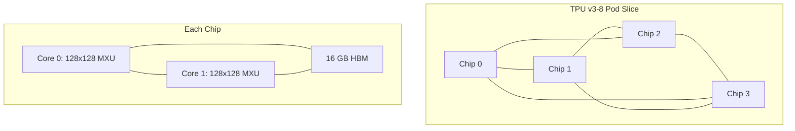

# How to Configure TPU Training for Custom Models on Vertex AI

Author: [nawazdhandala](https://www.github.com/nawazdhandala)

Tags: GCP, Vertex AI, TPU, Training, Deep Learning

Description: A step-by-step guide to configuring and running custom model training on TPUs using Vertex AI for maximum throughput on large-scale workloads.

---

TPUs (Tensor Processing Units) are Google's custom-designed accelerators built specifically for matrix operations that dominate neural network training. When configured properly, TPUs can deliver significantly higher throughput than GPUs for certain workloads - particularly large batch training with models that are heavy on matrix multiplications like Transformers and CNNs.

Vertex AI lets you submit training jobs to TPU pods without managing the TPU infrastructure yourself. But TPU training is not a drop-in replacement for GPU training. Your code needs specific adjustments to run efficiently on TPUs.

## Understanding TPU Architecture

A single TPU v3 chip has two cores, each with a 128x128 matrix multiply unit. TPUs come in configurations called "pods" where multiple chips are connected through a high-bandwidth interconnect. A TPU v3-8 has 4 chips (8 cores), while a TPU v3-32 has 16 chips (32 cores).

The key difference from GPUs is that TPUs require static shapes. Every tensor flowing through your computation graph must have a known shape at compile time. Dynamic shapes cause recompilation, which kills performance.



## Adapting Your TensorFlow Code for TPUs

TensorFlow has the best TPU support on Vertex AI. The main changes are using `TPUStrategy` and ensuring your data pipeline is TPU-compatible.

This training script is adapted for TPU execution:

```python
# tpu_train.py - TensorFlow training on TPU

import os
import tensorflow as tf

def create_model():
    """Build a model that works well on TPU.

    Key considerations:
    - Use batch normalization instead of layer normalization when possible
    - Avoid operations that require dynamic shapes
    - Use powers of 128 for layer sizes (matches TPU MXU dimensions)
    """
    model = tf.keras.Sequential([
        tf.keras.layers.Dense(1024, activation="relu", input_shape=(512,)),
        tf.keras.layers.BatchNormalization(),
        tf.keras.layers.Dense(512, activation="relu"),
        tf.keras.layers.BatchNormalization(),
        tf.keras.layers.Dense(256, activation="relu"),
        tf.keras.layers.Dense(10, activation="softmax")
    ])
    return model

def create_dataset(file_pattern, batch_size):
    """Create a tf.data pipeline optimized for TPU.

    TPU data pipelines should:
    - Use TFRecord format for best performance
    - Avoid operations that produce variable-length outputs
    - Drop remainders to ensure consistent batch sizes
    """
    def parse_example(serialized):
        features = tf.io.parse_single_example(serialized, {
            "features": tf.io.FixedLenFeature([512], tf.float32),
            "label": tf.io.FixedLenFeature([], tf.int64)
        })
        return features["features"], features["label"]

    files = tf.data.Dataset.list_files(file_pattern)
    dataset = files.interleave(
        tf.data.TFRecordDataset,
        num_parallel_calls=tf.data.AUTOTUNE,
        cycle_length=16
    )
    dataset = dataset.map(parse_example, num_parallel_calls=tf.data.AUTOTUNE)
    dataset = dataset.shuffle(10000)
    dataset = dataset.batch(batch_size, drop_remainder=True)  # Must drop remainder
    dataset = dataset.prefetch(tf.data.AUTOTUNE)

    return dataset

def main():
    # Detect TPU and create strategy
    try:
        tpu = tf.distribute.cluster_resolver.TPUClusterResolver()
        tf.config.experimental_connect_to_cluster(tpu)
        tf.tpu.experimental.initialize_tpu_system(tpu)
        strategy = tf.distribute.TPUStrategy(tpu)
        print(f"Running on TPU with {strategy.num_replicas_in_sync} cores")
    except ValueError:
        # Fall back to GPU/CPU if no TPU available
        strategy = tf.distribute.MirroredStrategy()
        print(f"No TPU found, using {strategy.num_replicas_in_sync} GPU(s)")

    # Scale batch size by number of cores
    per_core_batch = 128  # Use multiples of 128 for TPU efficiency
    global_batch_size = per_core_batch * strategy.num_replicas_in_sync

    # Create datasets
    train_dataset = create_dataset("gs://your-bucket/data/train*.tfrecord", global_batch_size)
    eval_dataset = create_dataset("gs://your-bucket/data/eval*.tfrecord", global_batch_size)

    # Build and compile within strategy scope
    with strategy.scope():
        model = create_model()
        model.compile(
            optimizer=tf.keras.optimizers.Adam(0.001),
            loss="sparse_categorical_crossentropy",
            metrics=["accuracy"]
        )

    # Train
    model.fit(
        train_dataset,
        epochs=50,
        validation_data=eval_dataset,
        steps_per_epoch=1000,
        validation_steps=100
    )

    # Save the model
    model_dir = os.environ.get("AIP_MODEL_DIR", "gs://your-bucket/models/tpu/")
    model.save(model_dir)

if __name__ == "__main__":
    main()
```

## Submitting a TPU Training Job

Configure and submit the TPU training job to Vertex AI.

This code submits a job using TPU v3-8:

```python
from google.cloud import aiplatform

aiplatform.init(project="your-project-id", location="us-central1")

# Create a custom job targeting TPU
job = aiplatform.CustomJob(
    display_name="tpu-training-job",
    worker_pool_specs=[
        {
            "machine_spec": {
                "machine_type": "cloud-tpu",
                "accelerator_type": "TPU_V3",
                "accelerator_count": 8  # TPU v3-8 (4 chips, 8 cores)
            },
            "replica_count": 1,
            "python_package_spec": {
                "executor_image_uri": "us-docker.pkg.dev/vertex-ai/training/tf-tpu.2-13:latest",
                "package_uris": ["gs://your-bucket/packages/trainer-0.1.tar.gz"],
                "python_module": "trainer.tpu_train",
                "args": []
            }
        }
    ]
)

job.run(
    sync=False,
    service_account="your-sa@your-project-id.iam.gserviceaccount.com"
)

print(f"TPU job submitted: {job.resource_name}")
```

## PyTorch on TPU with XLA

PyTorch can also run on TPUs through the torch_xla library, which compiles PyTorch operations to XLA (Accelerated Linear Algebra) that TPUs execute.

This PyTorch script runs on TPU:

```python
# pytorch_tpu_train.py - PyTorch training on TPU via XLA

import torch
import torch_xla
import torch_xla.core.xla_model as xm
import torch_xla.distributed.parallel_loader as pl
import torch_xla.distributed.xla_multiprocessing as xmp

def train_fn(index):
    """Training function that runs on each TPU core."""

    # Get the XLA device for this core
    device = xm.xla_device()

    # Create model and move to TPU
    model = torch.nn.Sequential(
        torch.nn.Linear(512, 1024),
        torch.nn.ReLU(),
        torch.nn.Linear(1024, 512),
        torch.nn.ReLU(),
        torch.nn.Linear(512, 10)
    ).to(device)

    optimizer = torch.optim.Adam(model.parameters(), lr=0.001)
    criterion = torch.nn.CrossEntropyLoss()

    # Create data loader with TPU-compatible sampler
    dataset = create_dataset()
    sampler = torch.utils.data.distributed.DistributedSampler(
        dataset,
        num_replicas=xm.xrt_world_size(),
        rank=xm.get_ordinal(),
        shuffle=True
    )
    loader = torch.utils.data.DataLoader(
        dataset, batch_size=128, sampler=sampler, drop_last=True
    )

    # Wrap with ParallelLoader for TPU prefetching
    para_loader = pl.ParallelLoader(loader, [device])

    for epoch in range(50):
        sampler.set_epoch(epoch)

        for batch_x, batch_y in para_loader.per_device_loader(device):
            optimizer.zero_grad()
            output = model(batch_x)
            loss = criterion(output, batch_y)
            loss.backward()

            # Use xm.optimizer_step for synchronized gradient updates
            xm.optimizer_step(optimizer)

        # Print loss from the main process only
        if xm.is_master_ordinal():
            print(f"Epoch {epoch}: loss = {loss.item():.4f}")

    # Save model from main process
    if xm.is_master_ordinal():
        xm.save(model.state_dict(), "model.pt")

# Launch training across all TPU cores
if __name__ == "__main__":
    xmp.spawn(train_fn, args=(), nprocs=8)  # 8 cores for TPU v3-8
```

## TPU Performance Optimization Tips

Batch size is the single most important factor for TPU efficiency. TPUs achieve their peak throughput when the batch size is large enough to fully utilize the 128x128 matrix multiply units. Use per-core batch sizes of 128 or higher when possible. If your model does not converge with large batches, use learning rate warmup and the LARS optimizer.

Avoid Python-level control flow during training. TPU executes a compiled computation graph. Every time you use a Python if statement that depends on a tensor value, the graph needs to be retraced. Use `tf.cond` or `torch.where` instead.

Data loading can become the bottleneck. Store your training data in TFRecord format on GCS in the same region as your TPU. Use parallel interleaving and prefetching to keep data flowing.

Profile your training with TensorBoard's TPU profiler. It shows you exactly where time is being spent and highlights operations that are not TPU-compatible.

Mixed precision is less critical on TPUs than GPUs. TPU v3 and later versions handle bfloat16 natively, and TensorFlow's TPUStrategy automatically uses bfloat16 for matrix multiplications while keeping float32 for accumulations.

## When to Choose TPU Over GPU

TPUs excel at large-batch training of Transformer models, CNNs, and other architectures that are dominated by matrix multiplications. If your training job runs for hours on multiple GPUs, try it on a TPU - you might see 2-3x speedup for the same cost.

TPUs are not the best choice for models with lots of custom operations, dynamic shapes, or heavy use of operations outside the standard neural network toolkit. Sparse operations, certain types of attention mechanisms, and models that need frequent host-device communication are better suited for GPUs.

The decision often comes down to running a quick benchmark. Train for 100 steps on both a TPU v3-8 and 4x V100 GPUs, compare the throughput (samples per second), and factor in the hourly cost of each option.
