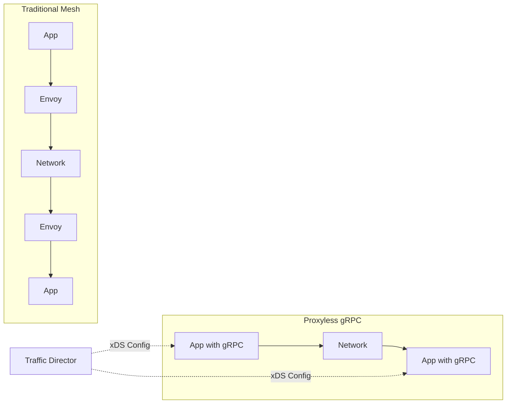

# How to Configure Traffic Director for gRPC Services Without Sidecar Proxies on Google Cloud

Author: [nawazdhandala](https://www.github.com/nawazdhandala)

Tags: GCP, Traffic Director, gRPC, Service Mesh, Proxyless

Description: Learn how to configure Traffic Director for gRPC services without sidecar proxies, using gRPC's native xDS support for service mesh capabilities directly in your application.

---

The traditional service mesh approach puts an Envoy sidecar next to every service instance. This works, but it adds latency (every request goes through an extra network hop), increases resource consumption (each sidecar uses CPU and memory), and adds operational complexity (you need to manage sidecar injection and lifecycle). For gRPC services, there is a better option: proxyless service mesh.

gRPC natively supports the xDS protocol, which means your gRPC application can talk directly to Traffic Director and get routing configuration, load balancing policies, and health check information - without any sidecar proxy in between. In this post, I will show you how to set this up.

## How Proxyless gRPC Works

In a traditional mesh, the data path looks like this: App -> Envoy Sidecar -> Network -> Envoy Sidecar -> App. With proxyless gRPC, the data path is simply: App -> Network -> App. The gRPC library itself acts as the data plane, receiving configuration from Traffic Director through the xDS API.



## Prerequisites

You need gRPC version 1.41 or later for xDS support. The feature is available in Go, Java, C++, and Python.

```bash
# Enable the required APIs
gcloud services enable trafficdirector.googleapis.com
gcloud services enable compute.googleapis.com
```

## Step 1 - Create the GCP Networking Resources

Traffic Director uses standard GCP networking primitives. You need a health check, backend service, URL map, and forwarding rule.

```bash
# Create a health check for your gRPC service
gcloud compute health-checks create grpc td-grpc-health-check \
    --port=50051

# Create a backend service for the gRPC service
gcloud compute backend-services create grpc-echo-service \
    --global \
    --protocol=GRPC \
    --health-checks=td-grpc-health-check \
    --load-balancing-scheme=INTERNAL_SELF_MANAGED

# Create a URL map
gcloud compute url-maps create td-grpc-url-map \
    --default-service=grpc-echo-service

# Create a target gRPC proxy (not HTTP proxy - this is important)
gcloud compute target-grpc-proxies create td-grpc-proxy \
    --url-map=td-grpc-url-map \
    --validate-for-proxyless

# Create a forwarding rule
gcloud compute forwarding-rules create td-grpc-forwarding-rule \
    --global \
    --load-balancing-scheme=INTERNAL_SELF_MANAGED \
    --network=my-vpc \
    --target-grpc-proxy=td-grpc-proxy \
    --address=0.0.0.0 \
    --ports=50051
```

The `--validate-for-proxyless` flag on the target gRPC proxy ensures that the configuration is compatible with proxyless gRPC clients.

## Step 2 - Set Up the Backend VMs

Create VMs that run your gRPC server and register them with Traffic Director.

```bash
# Create an instance template for the gRPC server
gcloud compute instance-templates create grpc-server-template \
    --machine-type=e2-medium \
    --network=my-vpc \
    --subnet=my-subnet \
    --scopes=cloud-platform \
    --image-family=debian-11 \
    --image-project=debian-cloud \
    --metadata=startup-script='#!/bin/bash
# Install dependencies and start the gRPC server
apt-get update && apt-get install -y python3 python3-pip
pip3 install grpcio grpcio-health-checking grpcio-reflection
# Start your gRPC server on port 50051
python3 /opt/app/server.py &'

# Create a managed instance group
gcloud compute instance-groups managed create grpc-server-mig \
    --template=grpc-server-template \
    --size=3 \
    --zone=us-central1-a

# Set named ports
gcloud compute instance-groups managed set-named-ports grpc-server-mig \
    --named-ports=grpc:50051 \
    --zone=us-central1-a

# Add the MIG to the backend service
gcloud compute backend-services add-backend grpc-echo-service \
    --global \
    --instance-group=grpc-server-mig \
    --instance-group-zone=us-central1-a \
    --balancing-mode=UTILIZATION \
    --max-utilization=0.8
```

## Step 3 - Generate the xDS Bootstrap Configuration

The gRPC client needs a bootstrap file that tells it how to connect to Traffic Director. Google provides a generator tool for this.

```bash
# Download the bootstrap generator
wget https://storage.googleapis.com/traffic-director/td-grpc-bootstrap-0.16.0.tar.gz
tar xzf td-grpc-bootstrap-0.16.0.tar.gz

# Generate the bootstrap configuration
# This creates a JSON file with Traffic Director connection details
./td-grpc-bootstrap \
    --gcp-project-number=$(gcloud projects describe my-project --format="value(projectNumber)") \
    --output=/tmp/td-grpc-bootstrap.json

# Set the environment variable that gRPC clients look for
export GRPC_XDS_BOOTSTRAP=/tmp/td-grpc-bootstrap.json
```

The generated bootstrap file looks something like this:

```json
{
  "xds_servers": [
    {
      "server_uri": "trafficdirector.googleapis.com:443",
      "channel_creds": [
        {
          "type": "google_default"
        }
      ],
      "server_features": ["xds_v3"]
    }
  ],
  "node": {
    "id": "projects/123456789/networks/my-vpc/nodes/abc123",
    "metadata": {
      "TRAFFICDIRECTOR_NETWORK_NAME": "my-vpc",
      "TRAFFICDIRECTOR_GCP_PROJECT_NUMBER": "123456789"
    },
    "locality": {
      "zone": "us-central1-a"
    }
  }
}
```

## Step 4 - Write the gRPC Server with Health Checking

Your gRPC server needs to implement the standard gRPC health checking protocol so Traffic Director can monitor it.

```python
# server.py - gRPC server with health checking support
import grpc
from concurrent import futures
from grpc_health.v1 import health
from grpc_health.v1 import health_pb2
from grpc_health.v1 import health_pb2_grpc

# Import your generated protobuf code
import echo_pb2
import echo_pb2_grpc

class EchoServicer(echo_pb2_grpc.EchoServiceServicer):
    """Simple echo service for demonstration."""
    def Echo(self, request, context):
        return echo_pb2.EchoResponse(message=f"Echo: {request.message}")

def serve():
    # Create a gRPC server
    server = grpc.server(futures.ThreadPoolExecutor(max_workers=10))

    # Register the echo service
    echo_pb2_grpc.add_EchoServiceServicer_to_server(EchoServicer(), server)

    # Set up health checking
    health_servicer = health.HealthServicer()
    health_pb2_grpc.add_HealthServicer_to_server(health_servicer, server)

    # Mark the service as serving
    health_servicer.set(
        "echo.EchoService",
        health_pb2.HealthCheckResponse.SERVING
    )

    # Listen on port 50051
    server.add_insecure_port("[::]:50051")
    server.start()
    print("gRPC server started on port 50051")
    server.wait_for_termination()

if __name__ == "__main__":
    serve()
```

## Step 5 - Write the Proxyless gRPC Client

The client uses the `xds:///` URI scheme to tell the gRPC library to use xDS for service resolution instead of DNS.

```python
# client.py - Proxyless gRPC client using xDS
import grpc
import echo_pb2
import echo_pb2_grpc

def main():
    # Use the xds:/// scheme to resolve through Traffic Director
    # The service name must match the host in your URL map
    target = "xds:///grpc-echo-service"

    # Create the channel - gRPC will contact Traffic Director
    # to get the backend addresses and load balancing config
    channel = grpc.insecure_channel(target)

    # Create a stub and make an RPC call
    stub = echo_pb2_grpc.EchoServiceStub(channel)
    response = stub.Echo(echo_pb2.EchoRequest(message="Hello from proxyless gRPC"))
    print(f"Response: {response.message}")

if __name__ == "__main__":
    main()
```

The key difference from a regular gRPC client is the `xds:///` prefix on the target. Everything else stays the same - same stubs, same protobuf messages, same API.

## Step 6 - Add Route-Level Configuration

You can add sophisticated routing through the URL map, and gRPC clients will automatically pick up the configuration.

```bash
# Update URL map with routing based on gRPC service and method
gcloud compute url-maps import td-grpc-url-map --source=- <<EOF
name: td-grpc-url-map
defaultService: projects/my-project/global/backendServices/grpc-echo-service
hostRules:
  - hosts:
      - "grpc-echo-service"
    pathMatcher: grpc-routes
pathMatchers:
  - name: grpc-routes
    defaultService: projects/my-project/global/backendServices/grpc-echo-service
    routeRules:
      - priority: 1
        matchRules:
          - fullPathMatch: "/echo.EchoService/Echo"
            headerMatches:
              - headerName: "x-route-to"
                exactMatch: "canary"
        routeAction:
          weightedBackendServices:
            - backendService: projects/my-project/global/backendServices/grpc-echo-canary
              weight: 100
      - priority: 2
        matchRules:
          - prefixMatch: "/"
        service: projects/my-project/global/backendServices/grpc-echo-service
EOF
```

## Performance Benefits

The proxyless approach has measurable benefits. In benchmarks, removing the Envoy sidecar reduces p99 latency by 20-40% and eliminates the resource overhead of running sidecar containers. For high-throughput gRPC services, this adds up quickly.

However, there are tradeoffs. Proxyless gRPC only works with gRPC - if your services also handle REST or other protocols, you still need Envoy for those. Additionally, advanced features like mTLS and observability are more mature in the Envoy-based approach.

## Wrapping Up

Proxyless gRPC with Traffic Director gives you service mesh capabilities - traffic management, load balancing, health checking - without the overhead of sidecar proxies. The setup involves creating standard GCP networking resources, generating a bootstrap file, and changing your gRPC target from `dns:///` to `xds:///`. For pure gRPC workloads where latency and resource efficiency matter, this is a compelling alternative to the traditional sidecar approach.
