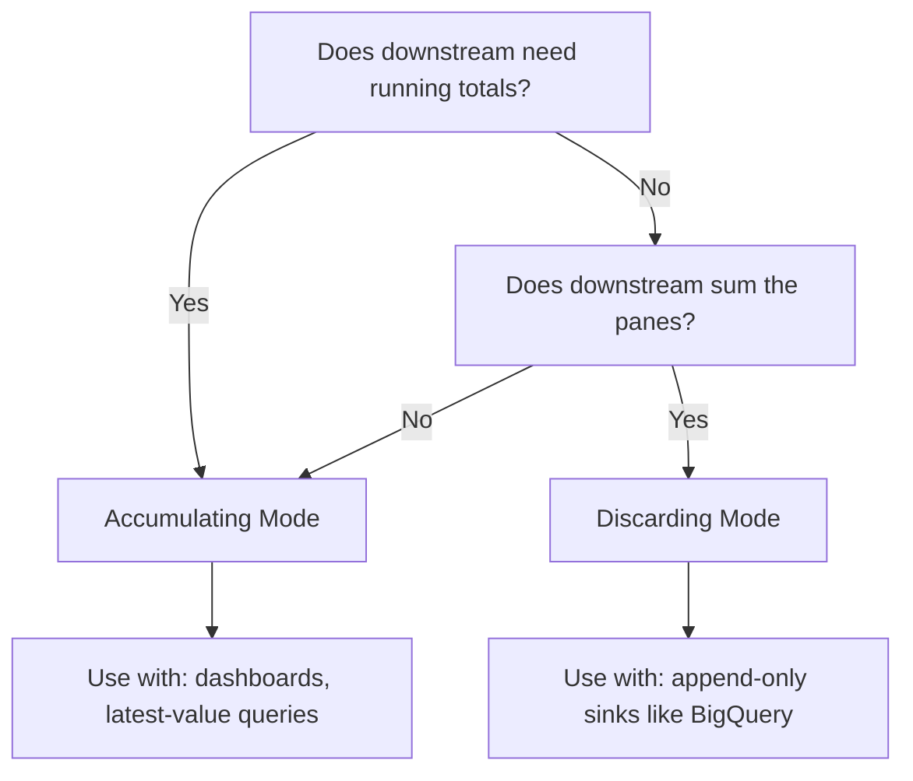

# How to Configure Triggers and Accumulation Modes in Dataflow Streaming

Author: [nawazdhandala](https://www.github.com/nawazdhandala)

Tags: GCP, Google Cloud Dataflow, Apache Beam, Streaming, Triggers

Description: Learn how to configure triggers and accumulation modes in Google Cloud Dataflow streaming pipelines to control when results are emitted and how pane data is managed.

---

Windows define how data is grouped in a streaming pipeline, but triggers define when results are actually produced. Without triggers, Dataflow waits until the watermark passes the end of a window before emitting results. That might mean waiting minutes or even hours for a result. Triggers give you control over this timing, letting you balance latency against completeness.

I have found that triggers are one of the most misunderstood parts of Apache Beam. People set up windows correctly and then wonder why their results look wrong - usually because the default trigger behavior does not match their expectations. Let me break down how triggers and accumulation modes work together.

## The Default Trigger

Every windowed PCollection has a trigger, even if you do not set one explicitly. The default trigger fires once when the watermark passes the end of the window. For a 5-minute fixed window ending at 2:05, the default trigger fires when Dataflow believes all data with timestamps before 2:05 has arrived.

```java
// This is what the default trigger looks like explicitly
PCollection<String> windowed = events
    .apply("Window", Window.<String>into(
        FixedWindows.of(Duration.standardMinutes(5)))
        // This is the implicit default trigger
        .triggering(DefaultTrigger.of())
        .withAllowedLateness(Duration.ZERO)
        .discardingFiredPanes());
```

The default trigger works fine for batch pipelines and for streaming pipelines where you can tolerate the latency of waiting for the watermark. But in many real-time scenarios, you need results sooner.

## Event Time Triggers

The `AfterWatermark` trigger is the most commonly used event-time trigger. It fires when the watermark passes the end of the window, just like the default. But you can enhance it with early and late firings.

```java
// Fire early results every 30 seconds, then fire again for late data
PCollection<KV<String, Long>> counts = events
    .apply("ExtractKeys", ParDo.of(new ExtractKeyFn()))
    .apply("Window", Window.<KV<String, Long>>into(
        FixedWindows.of(Duration.standardMinutes(10)))
        .triggering(AfterWatermark.pastEndOfWindow()
            // Emit speculative results every 30 seconds before window closes
            .withEarlyFirings(
                AfterProcessingTime.pastFirstElementInPane()
                    .plusDelayOf(Duration.standardSeconds(30)))
            // Emit updated results for late-arriving data
            .withLateFirings(
                AfterProcessingTime.pastFirstElementInPane()
                    .plusDelayOf(Duration.standardMinutes(1))))
        .withAllowedLateness(Duration.standardHours(1))
        .accumulatingFiredPanes())
    .apply("Sum", Sum.longsPerKey());
```

This configuration produces three types of output panes:

- Early panes: speculative results emitted every 30 seconds before the window closes
- On-time pane: the main result when the watermark passes
- Late panes: updated results incorporating late data, checked every minute

## Processing Time Triggers

Processing time triggers fire based on wall clock time rather than event time. They are useful when you care more about output cadence than event-time correctness.

```java
// Fire every 60 seconds of processing time
PCollection<KV<String, Long>> periodicCounts = events
    .apply("Window", Window.<KV<String, Long>>into(
        FixedWindows.of(Duration.standardMinutes(5)))
        .triggering(Repeatedly.forever(
            AfterProcessingTime.pastFirstElementInPane()
                .plusDelayOf(Duration.standardSeconds(60))
        ))
        .withAllowedLateness(Duration.standardMinutes(30))
        .discardingFiredPanes())
    .apply("Count", Count.perKey());
```

This fires every 60 seconds regardless of where the watermark is. You get regular output updates, which is great for dashboards that need consistent refresh rates.

## Element Count Triggers

Sometimes you want to fire based on how many elements have accumulated rather than time.

```java
// Fire after every 100 elements in a pane
PCollection<KV<String, Long>> batchedCounts = events
    .apply("Window", Window.<KV<String, Long>>into(
        FixedWindows.of(Duration.standardMinutes(5)))
        .triggering(Repeatedly.forever(
            AfterPane.elementCountAtLeast(100)
        ))
        .withAllowedLateness(Duration.ZERO)
        .discardingFiredPanes())
    .apply("Count", Count.perKey());
```

Element count triggers are handy for micro-batching scenarios where you want to write to a sink in reasonable batch sizes.

## Composite Triggers

You can combine triggers using `AfterFirst`, `AfterAll`, and `AfterEach` to create sophisticated firing conditions.

```java
// Fire after 100 elements OR 30 seconds, whichever comes first
PCollection<String> compositeTriggered = events
    .apply("Window", Window.<String>into(
        FixedWindows.of(Duration.standardMinutes(5)))
        .triggering(Repeatedly.forever(
            AfterFirst.of(
                AfterPane.elementCountAtLeast(100),
                AfterProcessingTime.pastFirstElementInPane()
                    .plusDelayOf(Duration.standardSeconds(30))
            )
        ))
        .withAllowedLateness(Duration.standardMinutes(10))
        .discardingFiredPanes());
```

This ensures you get output within 30 seconds even if traffic is low, but during high traffic you get output more frequently based on element count.

## Accumulation Modes: Discarding vs. Accumulating

This is where many people get confused. The accumulation mode determines what happens to data when a trigger fires multiple times for the same window.

**Discarding mode** clears the pane after each firing. Each output contains only the new elements since the last firing.

**Accumulating mode** keeps all elements in the pane. Each output contains all elements seen so far in the window.

Here is a concrete example showing the difference.

```java
// Discarding mode - each pane only has new elements
PCollection<KV<String, Long>> discardingCounts = events
    .apply("WindowDiscard", Window.<KV<String, Long>>into(
        FixedWindows.of(Duration.standardMinutes(5)))
        .triggering(Repeatedly.forever(
            AfterProcessingTime.pastFirstElementInPane()
                .plusDelayOf(Duration.standardSeconds(10))))
        .withAllowedLateness(Duration.ZERO)
        .discardingFiredPanes())  // Each pane is independent
    .apply("Sum", Sum.longsPerKey());

// Accumulating mode - each pane has all elements since window start
PCollection<KV<String, Long>> accumulatingCounts = events
    .apply("WindowAccum", Window.<KV<String, Long>>into(
        FixedWindows.of(Duration.standardMinutes(5)))
        .triggering(Repeatedly.forever(
            AfterProcessingTime.pastFirstElementInPane()
                .plusDelayOf(Duration.standardSeconds(10))))
        .withAllowedLateness(Duration.ZERO)
        .accumulatingFiredPanes())  // Each pane includes all prior data
    .apply("Sum", Sum.longsPerKey());
```

Suppose your window receives values 3, 5, 2, 7 over time, with the trigger firing after each pair.

With **discarding** mode:
- First pane: sum = 8 (3 + 5)
- Second pane: sum = 9 (2 + 7)

With **accumulating** mode:
- First pane: sum = 8 (3 + 5)
- Second pane: sum = 17 (3 + 5 + 2 + 7)

## Choosing the Right Combination

The right choice depends on your downstream consumer.



Use discarding mode when writing to append-only sinks like BigQuery or Cloud Storage. Each pane represents a delta, and you sum them later. Accumulating mode would cause double-counting.

Use accumulating mode when the downstream system overwrites previous results, like updating a row in Bigtable or refreshing a dashboard. The last pane for a window contains the complete result.

## Accumulating and Retracting Mode

There is a third option called accumulating and retracting. When a new pane fires, it also emits a retraction of the previous pane. This allows downstream aggregations to subtract the old value and add the new one. This mode is not yet fully supported in all runners but is part of the Beam model.

## Practical Recommendations

Start with the default trigger and only add complexity when you have a specific latency or completeness requirement.

When using early firings, make sure your sink can handle multiple outputs per window. BigQuery append works well. File writes need careful naming to avoid overwrites.

Set allowed lateness based on your data characteristics. If your mobile app data can arrive hours late due to connectivity issues, set lateness accordingly. But be aware that longer lateness means more state that Dataflow has to maintain.

Always test your trigger and accumulation configuration with a small amount of data first. Send known values through the pipeline and verify the output panes contain what you expect. Trigger bugs are subtle and can cause incorrect aggregations that are hard to detect in production.

Triggers and accumulation modes give you fine-grained control over the tradeoff between latency and completeness in streaming pipelines. Getting them right requires understanding how they interact with your windowing strategy and your downstream data consumers.
