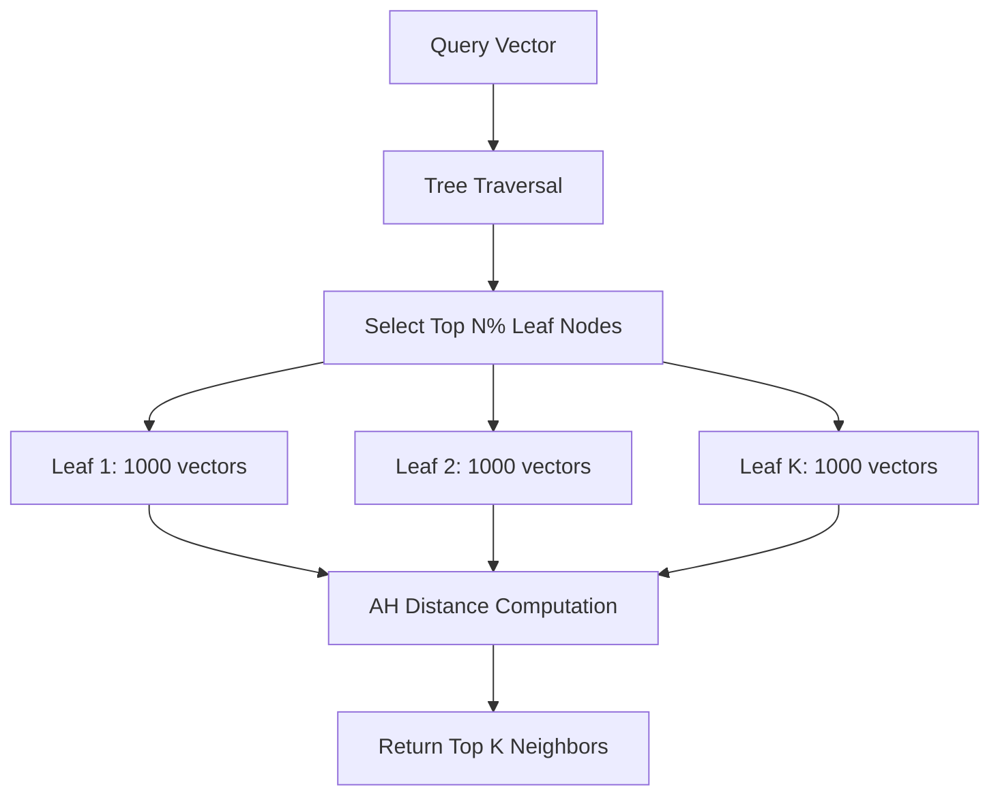

# How to Configure Vertex AI Vector Search Indexes for Billion-Scale Similarity Search

Author: [nawazdhandala](https://www.github.com/nawazdhandala)

Tags: GCP, Vertex AI, Vector Search, Similarity Search, Embeddings

Description: A practical guide to configuring Vertex AI Vector Search indexes for performing fast similarity search at billion-scale with low latency.

---

Searching through a billion vectors to find the nearest neighbors in milliseconds sounds like it should be impossible. Brute force comparison would take minutes. But with the right index configuration, Vertex AI Vector Search uses approximate nearest neighbor (ANN) algorithms to return highly accurate results in single-digit millisecond latency. The catch is that you need to understand the configuration parameters and tune them for your specific use case.

This guide walks through the full process of setting up, configuring, and deploying a Vector Search index on Vertex AI that can handle billion-scale datasets.

## Understanding the Index Types

Vertex AI Vector Search supports two index types: tree-AH (Asymmetric Hashing with tree structure) and brute force. Tree-AH is the one you want for large-scale production use because it provides fast approximate results. Brute force gives exact results but is only practical for small datasets or ground truth evaluation.

The tree-AH algorithm works by partitioning the vector space into regions using a tree structure, then using asymmetric hashing within each region for fast distance computation. You control the trade-off between speed and recall through configuration parameters.

## Preparing Your Vector Data

Before creating an index, your embeddings need to be in a specific format. Vertex AI accepts JSONL files where each line contains a vector ID and the embedding values.

This code generates the required JSONL format from your embeddings:

```python
import json
import numpy as np

def prepare_vectors_for_index(embeddings, ids, output_path):
    """Convert embeddings to JSONL format for Vertex AI Vector Search.

    Args:
        embeddings: numpy array of shape (n_vectors, dimensions)
        ids: list of string IDs for each vector
        output_path: path to write the JSONL file
    """
    with open(output_path, "w") as f:
        for vector_id, embedding in zip(ids, embeddings):
            record = {
                "id": str(vector_id),
                "embedding": embedding.tolist()
            }
            f.write(json.dumps(record) + "\n")

    print(f"Wrote {len(ids)} vectors to {output_path}")

# Example: prepare 1 million 768-dimensional embeddings
embeddings = np.random.randn(1_000_000, 768).astype(np.float32)
ids = [f"doc_{i}" for i in range(1_000_000)]

prepare_vectors_for_index(embeddings, ids, "vectors.jsonl")
```

Upload the JSONL file to GCS before creating the index:

```bash
# Upload to GCS
gsutil -m cp vectors.jsonl gs://your-bucket/vector-data/vectors.jsonl
```

## Creating a Tree-AH Index

The index configuration determines the quality and speed of your searches. Here are the key parameters and what they control.

This code creates an index with carefully tuned parameters:

```python
from google.cloud import aiplatform

aiplatform.init(project="your-project-id", location="us-central1")

# Create the Vector Search index
index = aiplatform.MatchingEngineIndex.create_tree_ah_index(
    display_name="product-embeddings-index",
    contents_delta_uri="gs://your-bucket/vector-data/",  # Directory with JSONL files
    dimensions=768,  # Must match your embedding dimensions
    approximate_neighbors_count=150,  # Candidates to consider during search
    distance_measure_type="DOT_PRODUCT_DISTANCE",  # Or COSINE_DISTANCE, L2_DISTANCE

    # Tree-AH specific parameters
    leaf_node_embedding_count=1000,  # Vectors per leaf node
    leaf_nodes_to_search_percent=7,  # Percentage of leaves to search

    # Shard configuration for large datasets
    shard_size="SHARD_SIZE_MEDIUM",  # SMALL, MEDIUM, or LARGE

    description="Product embedding index for recommendation system"
)

print(f"Index created: {index.resource_name}")
print(f"Index state: {index.update_time}")
```

## Understanding the Key Parameters

The `approximate_neighbors_count` sets how many candidate neighbors the algorithm considers before returning the final results. Higher values improve recall but slow down queries. For most use cases, 100-200 works well.

The `leaf_node_embedding_count` controls how many vectors are stored in each leaf of the tree. Smaller leaf nodes mean more granular partitioning but a larger tree. For billion-scale datasets, values between 500 and 5000 are typical.

The `leaf_nodes_to_search_percent` is the most impactful parameter for the speed-recall trade-off. Searching more leaf nodes improves recall at the cost of latency. Start with 5-10% and adjust based on your recall requirements.

Here is how these parameters interact:



## Deploying the Index to an Endpoint

A created index needs to be deployed to an index endpoint before you can query it. The endpoint configuration determines the serving capacity.

This code deploys the index:

```python
# Create an index endpoint
index_endpoint = aiplatform.MatchingEngineIndexEndpoint.create(
    display_name="product-search-endpoint",
    public_endpoint_enabled=True  # Set to False for VPC-only access
)

# Deploy the index to the endpoint
index_endpoint.deploy_index(
    index=index,
    deployed_index_id="product_index_v1",
    display_name="Product Index v1",
    machine_type="e2-standard-16",  # Choose based on QPS requirements
    min_replica_count=1,
    max_replica_count=5  # Autoscale based on traffic
)

print(f"Index endpoint: {index_endpoint.resource_name}")
```

## Querying the Index

Once deployed, you can send similarity search queries to find nearest neighbors.

This code performs a vector search query:

```python
# Generate a query embedding (in practice this comes from your embedding model)
import numpy as np
query_embedding = np.random.randn(768).astype(np.float32).tolist()

# Search for the 10 nearest neighbors
response = index_endpoint.find_neighbors(
    deployed_index_id="product_index_v1",
    queries=[query_embedding],
    num_neighbors=10
)

# Process results
for neighbor_list in response:
    for neighbor in neighbor_list:
        print(f"ID: {neighbor.id}, Distance: {neighbor.distance:.4f}")
```

## Filtering with Restricts

Vector Search supports filtering results based on metadata tags, which lets you combine semantic similarity with attribute-based filtering.

This code creates vectors with restricts and queries with filters:

```python
# When preparing data, add restricts (filters) to each vector
import json

records = [
    {
        "id": "product_001",
        "embedding": [0.1, 0.2, ...],  # 768 dimensions
        "restricts": [
            {"namespace": "category", "allow_list": ["electronics"]},
            {"namespace": "price_range", "allow_list": ["mid"]}
        ]
    },
    {
        "id": "product_002",
        "embedding": [0.3, 0.4, ...],
        "restricts": [
            {"namespace": "category", "allow_list": ["clothing"]},
            {"namespace": "price_range", "allow_list": ["low"]}
        ]
    }
]

# Write to JSONL
with open("vectors_with_restricts.jsonl", "w") as f:
    for record in records:
        f.write(json.dumps(record) + "\n")

# Query with filtering - only return electronics
from google.cloud.aiplatform.matching_engine.matching_engine_index_endpoint import (
    Namespace
)

response = index_endpoint.find_neighbors(
    deployed_index_id="product_index_v1",
    queries=[query_embedding],
    num_neighbors=10,
    filter=[
        Namespace(name="category", allow_tokens=["electronics"]),
        Namespace(name="price_range", allow_tokens=["mid", "low"])
    ]
)
```

## Tuning for Billion-Scale Datasets

When your dataset grows past 100 million vectors, the configuration becomes more critical. Here are the adjustments that matter at scale.

Use `SHARD_SIZE_LARGE` for datasets over 500 million vectors. This distributes the index across more shards for parallel query processing.

Increase the machine type for the deployed index. At billion scale, `e2-highmem-16` or `n2-standard-32` machines provide the memory needed to hold the index shards in RAM.

Set `leaf_node_embedding_count` higher (2000-5000) to reduce tree depth. A deeper tree means more traversal time per query.

Reduce `leaf_nodes_to_search_percent` to 3-5% at billion scale. Even 3% of a billion-vector index searches millions of candidates, which is usually enough for high recall.

```python
# Billion-scale configuration
large_index = aiplatform.MatchingEngineIndex.create_tree_ah_index(
    display_name="billion-scale-index",
    contents_delta_uri="gs://your-bucket/billion-vectors/",
    dimensions=768,
    approximate_neighbors_count=200,
    distance_measure_type="DOT_PRODUCT_DISTANCE",
    leaf_node_embedding_count=3000,
    leaf_nodes_to_search_percent=4,
    shard_size="SHARD_SIZE_LARGE",
    description="Billion-scale product embedding index"
)
```

## Measuring Recall

To verify your index configuration is delivering good results, measure recall against brute force search on a sample of your data.

```python
def measure_recall(index_endpoint, brute_force_results, query_embeddings, k=10):
    """Compare ANN results against brute force ground truth."""
    recalls = []

    for i, query in enumerate(query_embeddings):
        # Get ANN results
        ann_results = index_endpoint.find_neighbors(
            deployed_index_id="product_index_v1",
            queries=[query.tolist()],
            num_neighbors=k
        )
        ann_ids = set(n.id for n in ann_results[0])

        # Ground truth from brute force
        true_ids = set(brute_force_results[i][:k])

        # Calculate recall for this query
        recall = len(ann_ids.intersection(true_ids)) / k
        recalls.append(recall)

    avg_recall = sum(recalls) / len(recalls)
    print(f"Average recall@{k}: {avg_recall:.4f}")
    return avg_recall
```

For most production use cases, you want recall above 0.95. If you are below that threshold, increase `leaf_nodes_to_search_percent` or `approximate_neighbors_count` until you hit your target, keeping an eye on the latency impact.

The combination of tree-AH indexing with the right parameters lets Vertex AI Vector Search handle billion-scale datasets with single-digit millisecond query latency. The key is understanding the trade-offs and measuring recall against your specific data distribution.
