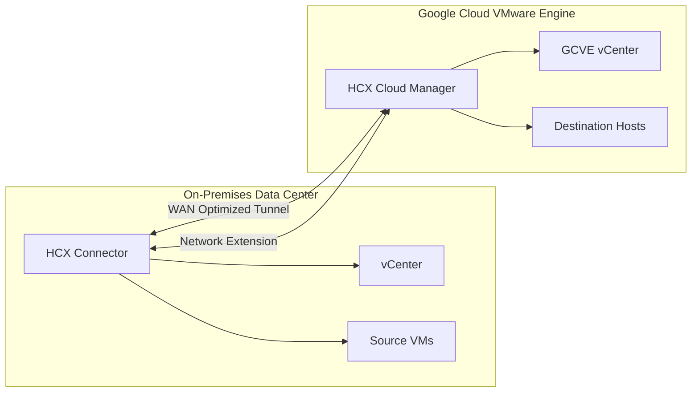

# How to Configure VMware HCX for Workload Migration to Google Cloud VMware Engine

Author: [nawazdhandala](https://www.github.com/nawazdhandala)

Tags: GCP, Google Cloud, VMware Engine, VMware HCX, Migration, vSphere, Workload Migration

Description: Step-by-step guide to configuring VMware HCX for seamless live migration of virtual machines from on-premises vSphere to Google Cloud VMware Engine.

---

Migrating VMs from an on-premises vSphere environment to Google Cloud VMware Engine is one of the most common use cases for GCVE, and VMware HCX is the tool that makes it practical. HCX provides live migration capabilities, meaning you can move running VMs from on-premises to the cloud without downtime. No re-IP, no reconfiguration, no application changes - the VM just keeps running as it moves from one infrastructure to another.

HCX works by creating a network fabric between your source (on-premises) and destination (GCVE) environments. It handles the network extension, WAN optimization, and data replication behind the scenes. Let me walk through the full setup.

## HCX Architecture Overview



There are two HCX components:

- **HCX Cloud Manager**: Pre-deployed in your GCVE private cloud by Google
- **HCX Connector**: Deployed by you in your on-premises vSphere environment

The two components establish encrypted tunnels between the environments for migration traffic and optional network extension.

## Prerequisites

You will need:

- A GCVE private cloud already created and running
- An on-premises vSphere environment (6.5 or later)
- Network connectivity between on-premises and GCP (Cloud Interconnect or Cloud VPN)
- An HCX license key (included with GCVE)
- A range of IP addresses for HCX appliances on both sides

## Step 1: Activate HCX in GCVE

HCX Cloud Manager is automatically available in your GCVE private cloud, but you need to activate it:

```bash
# Activate HCX on your GCVE private cloud
gcloud vmware private-clouds hcx activate \
    --project=my-project \
    --private-cloud=my-private-cloud \
    --location=us-central1-a
```

Once activated, get the HCX Cloud Manager URL and credentials:

```bash
# Get HCX Cloud Manager details
gcloud vmware private-clouds hcx describe \
    --project=my-project \
    --private-cloud=my-private-cloud \
    --location=us-central1-a
```

Note the HCX Cloud Manager URL and retrieve the admin credentials from the GCVE portal.

## Step 2: Download and Deploy HCX Connector On-Premises

From the HCX Cloud Manager web interface:

1. Log into the HCX Cloud Manager URL using the admin credentials
2. Navigate to Administration and then System Updates
3. Download the HCX Connector OVA file
4. Also generate an activation key - you will need this to link the connector to your cloud instance

Deploy the OVA in your on-premises vSphere environment:

```
In your on-premises vCenter:
1. Right-click your target cluster and select "Deploy OVF Template"
2. Point to the downloaded HCX Connector OVA
3. Configure the network settings:
   - Management network: Your vSphere management network
   - IP address: A static IP from your management subnet
   - Default gateway, DNS servers, NTP servers
4. Power on the appliance
```

## Step 3: Configure the HCX Connector

Access the HCX Connector management interface at `https://<connector-ip>:9443` and complete the initial setup:

```
1. Enter the activation key you generated in Step 2
2. Configure the HCX site name (e.g., "on-premises-datacenter")
3. Register with your on-premises vCenter:
   - vCenter URL: https://vcenter.local
   - Username and password with admin privileges
4. Register with your on-premises NSX-T or vDS:
   - If using NSX-T: provide the NSX Manager URL and credentials
   - If using vDS: the connector will detect the distributed switches
5. Configure the location information for the site
```

## Step 4: Create a Site Pairing

Site pairing establishes the connection between your on-premises HCX Connector and the GCVE HCX Cloud Manager.

In the HCX Connector web interface:

```
1. Navigate to Infrastructure > Interconnect > Site Pairing
2. Click "Add Site Pairing"
3. Enter the HCX Cloud Manager URL from your GCVE private cloud
4. Enter the admin credentials for the HCX Cloud Manager
5. Accept the certificate and complete the pairing
```

The pairing process establishes an encrypted control channel between the two HCX instances.

## Step 5: Create Network Profiles

Network profiles define the IP pools that HCX uses for its service appliances. You need profiles for both management and motion traffic.

On the on-premises HCX Connector:

```
Management Network Profile:
- IP pool: 10.0.10.20 - 10.0.10.30  (static IPs for HCX appliances)
- Subnet mask: 255.255.255.0
- Gateway: 10.0.10.1
- DNS: 10.0.1.10

vMotion Network Profile:
- IP pool: 10.0.20.20 - 10.0.20.30
- Subnet mask: 255.255.255.0
- Gateway: 10.0.20.1

Uplink Network Profile:
- IP pool: 192.168.100.20 - 192.168.100.30
- Subnet mask: 255.255.255.0
- Gateway: 192.168.100.1
- This network needs to reach the GCVE environment
```

## Step 6: Create a Service Mesh

The service mesh deploys the HCX service appliances that handle migration traffic. This is where the actual tunnel infrastructure gets created.

```
1. In the HCX Connector, go to Infrastructure > Interconnect > Service Mesh
2. Click "Create Service Mesh"
3. Select the source site (on-premises) and destination site (GCVE)
4. Select the compute profiles for both sites
5. Select services to activate:
   - Interconnect: Required for all migrations
   - WAN Optimization: Recommended for better throughput
   - Network Extension: Required if you need to extend L2 networks
6. Select the network profiles created in Step 5
7. Review and create the service mesh
```

The service mesh deployment takes 15-20 minutes. It creates tunnel appliances on both sides that form the migration fabric.

```bash
# Verify the service mesh status from the CLI
# The tunnel status should show UP
gcloud vmware private-clouds hcx describe \
    --project=my-project \
    --private-cloud=my-private-cloud \
    --location=us-central1-a \
    --format="yaml(hcxActivationKeys,state)"
```

## Step 7: Extend Networks (Optional)

If your VMs need to keep their IP addresses during migration, extend the on-premises network segments to GCVE:

```
1. In HCX Connector, go to Services > Network Extension
2. Click "Create Network Extension"
3. Select the source network (on-premises port group or segment)
4. Select the destination gateway (GCVE Tier-1 gateway)
5. Set the gateway IP for the extended segment in GCVE
6. Click "Submit"
```

Network extension creates a Layer 2 bridge between the on-premises segment and a corresponding segment in GCVE. VMs migrated to GCVE can keep their original IP addresses and continue communicating with on-premises resources as if they had not moved.

## Step 8: Migrate VMs

With everything configured, you can start migrating VMs. HCX offers several migration types:

**vMotion**: Live migration with zero downtime. The VM stays running throughout the migration. Best for individual VMs where downtime is not acceptable.

**Bulk Migration**: Moves many VMs in parallel with a brief switchover window (typically a few seconds). Best for migrating large numbers of VMs efficiently.

**Cold Migration**: Powers off the VM, migrates it, and powers it back on. Simplest approach for VMs that can tolerate downtime.

To perform a migration:

```
1. In HCX Connector, go to Services > Migration
2. Click "Migrate"
3. Select the VMs to migrate
4. Choose the migration type (vMotion, Bulk, or Cold)
5. Select the destination:
   - Destination cluster in GCVE
   - Destination datastore (vSAN)
   - Destination network segment
6. Set the switchover schedule (immediate or scheduled)
7. Validate and start the migration
```

## Step 9: Monitor Migration Progress

Track migration progress from the HCX dashboard:

```
1. Go to Services > Migration > Dashboard
2. Monitor active migrations:
   - Data transferred
   - Estimated time remaining
   - Current phase (initial sync, delta sync, switchover)
3. Check for any errors or warnings
```

For bulk migrations, HCX performs an initial full sync, then tracks changes. During the switchover window, it performs a final delta sync and switches the VM over to the destination. The actual cutover typically takes only a few seconds.

## Post-Migration Tasks

After migrating VMs to GCVE:

- Verify application connectivity and performance
- Update DNS records if VMs got new IP addresses
- Reconfigure monitoring to point to the new environment
- Remove network extensions once all VMs in a segment have migrated
- Update backup plans to cover the migrated VMs in GCVE

## Summary

VMware HCX makes migrating workloads to Google Cloud VMware Engine about as smooth as it gets. The setup involves deploying the HCX Connector on-premises, pairing it with the HCX Cloud Manager in GCVE, creating a service mesh for tunnel infrastructure, and optionally extending networks to preserve IP addresses. Once configured, you can migrate VMs live using vMotion or in bulk with minimal downtime. The biggest investment is in the initial setup - once the HCX fabric is established, individual VM migrations are straightforward operations that your VMware team already knows how to handle.
