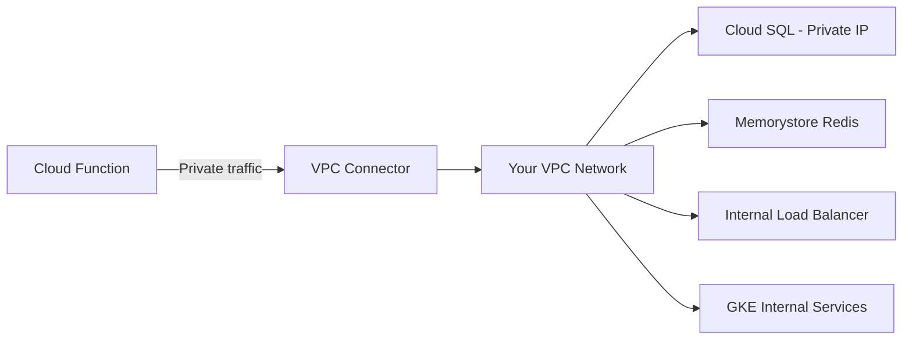

# How to Configure VPC Connector Access for Cloud Functions to Reach Private Resources

Author: [nawazdhandala](https://www.github.com/nawazdhandala)

Tags: GCP, Cloud Functions, VPC, Networking, Serverless

Description: Step-by-step guide to configuring Serverless VPC Access connectors for Google Cloud Functions to securely reach private resources like Cloud SQL, Memorystore, and internal APIs.

---

Cloud Functions run in a Google-managed environment that is isolated from your VPC network by default. This is great for security and simplicity, but it becomes a problem when your function needs to reach private resources - a Cloud SQL instance with no public IP, a Memorystore Redis cache, an internal load balancer, or any other resource that only has a private IP address.

Serverless VPC Access connectors bridge this gap. They create a connection between the serverless environment and your VPC, allowing your Cloud Functions to route traffic through your network. Let me show you how to set this up correctly.

## Understanding VPC Connectors

A VPC connector is a managed resource that sits between your Cloud Function and your VPC. When your function makes a network request to a private IP, the connector routes that traffic through your VPC network, giving it access to resources that would otherwise be unreachable.



The connector uses a subnet in your VPC and provisions small VM instances (e2-micro by default) to handle the traffic. You pay for these instances, but the cost is minimal for most workloads.

## Step 1: Create the VPC Connector

First, enable the Serverless VPC Access API:

```bash
# Enable the required API
gcloud services enable vpcaccess.googleapis.com
```

Now create the connector. You need to specify a subnet (recommended) or an IP range:

### Option A: Using an Existing Subnet (Recommended)

```bash
# Create a subnet specifically for the VPC connector
gcloud compute networks subnets create vpc-connector-subnet \
  --network=default \
  --region=us-central1 \
  --range=10.8.0.0/28

# Create the VPC connector using this subnet
gcloud compute networks vpc-access connectors create my-connector \
  --region=us-central1 \
  --subnet=vpc-connector-subnet \
  --min-instances=2 \
  --max-instances=3 \
  --machine-type=e2-micro
```

The subnet needs to be a /28 range at minimum. This gives the connector 16 IP addresses to work with.

### Option B: Auto-created Subnet

```bash
# Create with an auto-assigned IP range (simpler but less control)
gcloud compute networks vpc-access connectors create my-connector \
  --region=us-central1 \
  --network=default \
  --range=10.8.0.0/28 \
  --min-instances=2 \
  --max-instances=3
```

### Verify the Connector

```bash
# Check the connector status
gcloud compute networks vpc-access connectors describe my-connector \
  --region=us-central1
```

Wait until the state shows `READY` before proceeding.

## Step 2: Deploy Cloud Function with the Connector

### Gen 2 Functions

```bash
# Deploy a Gen 2 function with VPC connector
gcloud functions deploy my-private-function \
  --gen2 \
  --runtime=nodejs20 \
  --region=us-central1 \
  --source=. \
  --entry-point=handler \
  --trigger-http \
  --vpc-connector=my-connector \
  --egress-settings=private-ranges-only \
  --memory=256Mi
```

### Gen 1 Functions

```bash
# Deploy a Gen 1 function with VPC connector
gcloud functions deploy my-private-function \
  --runtime=nodejs20 \
  --region=us-central1 \
  --source=. \
  --entry-point=handler \
  --trigger-http \
  --vpc-connector=my-connector \
  --egress-settings=private-ranges-only
```

## Understanding Egress Settings

The `--egress-settings` flag controls which traffic goes through the VPC connector:

- **`private-ranges-only`** (Recommended): Only traffic to private IP ranges (10.0.0.0/8, 172.16.0.0/12, 192.168.0.0/16) goes through the connector. Public internet traffic goes directly.
- **`all-traffic`**: All outbound traffic goes through the connector, including public internet traffic. Use this when you need a static IP (via Cloud NAT) or need to route all traffic through your network's firewall.

For most use cases, `private-ranges-only` is the right choice because it is faster (public traffic does not go through the connector) and cheaper (less connector throughput).

## Connecting to Cloud SQL (Private IP)

The most common reason to use a VPC connector is to connect to Cloud SQL without a public IP. Here is a complete example:

```javascript
// index.js - Connect to Cloud SQL via private IP through VPC connector
const functions = require('@google-cloud/functions-framework');
const { Pool } = require('pg');

// Create the connection pool using the Cloud SQL private IP
// The VPC connector allows us to reach this private IP
const pool = new Pool({
  host: process.env.DB_HOST,       // Private IP: e.g., 10.0.0.5
  port: 5432,
  user: process.env.DB_USER,
  password: process.env.DB_PASSWORD,
  database: process.env.DB_NAME,
  max: 5,                            // Keep connection pool small for serverless
  idleTimeoutMillis: 10000,
  connectionTimeoutMillis: 5000
});

functions.http('queryDatabase', async (req, res) => {
  try {
    const result = await pool.query('SELECT NOW() as current_time');
    res.json({
      time: result.rows[0].current_time,
      status: 'connected'
    });
  } catch (error) {
    console.error('Database connection failed:', error.message);
    res.status(500).json({ error: 'Database connection failed' });
  }
});
```

Deploy with the database connection details:

```bash
# Deploy with VPC connector and database env vars
gcloud functions deploy query-database \
  --gen2 \
  --runtime=nodejs20 \
  --region=us-central1 \
  --source=. \
  --entry-point=queryDatabase \
  --trigger-http \
  --vpc-connector=my-connector \
  --egress-settings=private-ranges-only \
  --set-env-vars="DB_HOST=10.0.0.5,DB_USER=appuser,DB_NAME=mydb" \
  --set-secrets="DB_PASSWORD=db-password:latest" \
  --memory=256Mi
```

## Connecting to Memorystore Redis

Memorystore Redis instances only have private IPs. Here is how to connect through the VPC connector:

```javascript
// index.js - Connect to Memorystore Redis through VPC connector
const functions = require('@google-cloud/functions-framework');
const redis = require('redis');

let redisClient;

async function getRedisClient() {
  if (!redisClient) {
    // Connect to Memorystore Redis using its private IP
    redisClient = redis.createClient({
      socket: {
        host: process.env.REDIS_HOST,  // Private IP from Memorystore
        port: parseInt(process.env.REDIS_PORT || '6379')
      }
    });
    await redisClient.connect();
    console.log('Connected to Redis');
  }
  return redisClient;
}

functions.http('cacheHandler', async (req, res) => {
  const client = await getRedisClient();

  if (req.method === 'GET') {
    const key = req.query.key;
    const value = await client.get(key);
    res.json({ key, value, cached: value !== null });
  } else if (req.method === 'POST') {
    const { key, value, ttl } = req.body;
    await client.set(key, value, { EX: ttl || 3600 });
    res.json({ key, stored: true });
  }
});
```

## Connecting to Internal Load Balancers

If you have internal services behind an internal load balancer, the VPC connector lets your function reach them:

```javascript
// Connect to an internal API behind an internal load balancer
const axios = require('axios');

functions.http('callInternalApi', async (req, res) => {
  try {
    // The internal LB has a private IP that is reachable through the VPC connector
    const response = await axios.get('http://10.0.1.100:8080/api/health', {
      timeout: 5000
    });
    res.json({ internalApiResponse: response.data });
  } catch (error) {
    console.error('Failed to reach internal API:', error.message);
    res.status(502).json({ error: 'Internal API unreachable' });
  }
});
```

## Firewall Rules

Make sure your VPC firewall rules allow traffic from the connector's subnet to your private resources:

```bash
# Allow traffic from the VPC connector subnet to Cloud SQL
gcloud compute firewall-rules create allow-connector-to-sql \
  --network=default \
  --direction=INGRESS \
  --action=ALLOW \
  --rules=tcp:5432 \
  --source-ranges=10.8.0.0/28 \
  --target-tags=cloudsql

# Allow traffic from the VPC connector to Memorystore
gcloud compute firewall-rules create allow-connector-to-redis \
  --network=default \
  --direction=INGRESS \
  --action=ALLOW \
  --rules=tcp:6379 \
  --source-ranges=10.8.0.0/28
```

## Terraform Configuration

Here is the complete setup in Terraform:

```hcl
# Create the VPC connector
resource "google_vpc_access_connector" "connector" {
  name          = "my-connector"
  region        = "us-central1"
  ip_cidr_range = "10.8.0.0/28"
  network       = "default"

  min_instances = 2
  max_instances = 3
  machine_type  = "e2-micro"
}

# Deploy the Cloud Function with the connector
resource "google_cloudfunctions2_function" "private_function" {
  name     = "query-database"
  location = "us-central1"

  build_config {
    runtime     = "nodejs20"
    entry_point = "queryDatabase"
    source {
      storage_source {
        bucket = google_storage_bucket.source.name
        object = google_storage_bucket_object.source.name
      }
    }
  }

  service_config {
    available_memory = "256Mi"
    timeout_seconds  = 60

    # VPC connector configuration
    vpc_connector                 = google_vpc_access_connector.connector.id
    vpc_connector_egress_settings = "PRIVATE_RANGES_ONLY"

    environment_variables = {
      DB_HOST = google_sql_database_instance.main.private_ip_address
      DB_USER = "appuser"
      DB_NAME = "mydb"
    }

    service_account_email = google_service_account.function_sa.email
  }
}
```

## Troubleshooting

**"VPC connector not found" error**: Make sure the connector is in the same region as your function. Cross-region connectors are not supported.

**Connection timeouts**: Check your firewall rules. The connector subnet needs to be allowed through the firewall to reach your target resource.

**High latency**: If you see latency spikes, your connector might be underscaled. Increase `max-instances` to handle more concurrent connections.

**Connector in ERROR state**: This usually means the subnet is too small or conflicts with existing resources. Delete and recreate with a different IP range.

## Monitoring

Monitor your VPC connector throughput and the function's network latency using OneUptime. A healthy connector should show consistent throughput without throttling. If you see connection errors or increased latency, it may be time to scale up the connector or check for firewall rule changes.

VPC connectors are a small but critical piece of infrastructure when your serverless functions need to talk to private resources. Get them right, and your Cloud Functions can securely access anything in your VPC without exposing those resources to the public internet.
