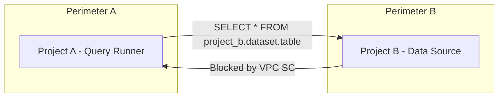

# How to Configure VPC Service Controls for BigQuery Cross-Project Access

Author: [nawazdhandala](https://www.github.com/nawazdhandala)

Tags: GCP, VPC Service Controls, BigQuery, Cross-Project Access, Data Security

Description: Learn how to configure VPC Service Controls to allow BigQuery cross-project queries while maintaining data exfiltration protection across your GCP organization.

---

BigQuery cross-project access is one of the most common things that breaks when you enable VPC Service Controls. And it makes sense - VPC SC is designed to prevent data from moving between projects, and cross-project queries are literally moving data between projects. The challenge is allowing legitimate cross-project analysis while still blocking unauthorized data exfiltration.

In this post, I will cover the different scenarios for BigQuery cross-project access and how to configure VPC SC for each one.

## Why BigQuery Cross-Project Access Gets Blocked

When you run a BigQuery query that references tables in another project, several API calls happen behind the scenes:

1. The query job runs in your project
2. BigQuery reads table data from the other project
3. Results are written back to your project

If the two projects are in different perimeters (or one is outside any perimeter), VPC SC blocks step 2 because data would cross a perimeter boundary.



## Scenario 1: Both Projects in the Same Perimeter

The simplest case. If both projects are in the same perimeter, cross-project queries work with no additional configuration.

```bash
# Verify both projects are in the same perimeter
gcloud access-context-manager perimeters describe my-perimeter \
  --policy=$ACCESS_POLICY_ID \
  --format="value(status.resources)"
```

Make sure both `projects/PROJECT_NUMBER_A` and `projects/PROJECT_NUMBER_B` are listed.

If one is missing, add it:

```bash
# Add a project to the perimeter
gcloud access-context-manager perimeters update my-perimeter \
  --add-resources="projects/MISSING_PROJECT_NUMBER" \
  --policy=$ACCESS_POLICY_ID
```

## Scenario 2: Projects in Different Perimeters

If the projects must be in separate perimeters (common for different business units), you need both egress and ingress rules.

The query runner project needs an egress rule to read from the data source project:

```yaml
# egress-for-bq.yaml - Allow Project A to read BigQuery data from Project B
- egressFrom:
    identities:
      - serviceAccount:bq-analyst@project-a.iam.gserviceaccount.com
      - user:analyst@example.com
  egressTo:
    operations:
      - serviceName: bigquery.googleapis.com
        methodSelectors:
          - method: google.cloud.bigquery.v2.TableService.GetTable
          - method: google.cloud.bigquery.v2.TableDataService.List
          - method: google.cloud.bigquery.v2.JobService.InsertJob
          - method: google.cloud.bigquery.v2.JobService.GetQueryResults
    resources:
      - projects/PROJECT_B_NUMBER
```

The data source project needs an ingress rule to accept the read:

```yaml
# ingress-for-bq.yaml - Allow Project A identities to read BigQuery data
- ingressFrom:
    identities:
      - serviceAccount:bq-analyst@project-a.iam.gserviceaccount.com
      - user:analyst@example.com
    sources:
      - resource: projects/PROJECT_A_NUMBER
  ingressTo:
    operations:
      - serviceName: bigquery.googleapis.com
        methodSelectors:
          - method: google.cloud.bigquery.v2.TableService.GetTable
          - method: google.cloud.bigquery.v2.TableDataService.List
          - method: google.cloud.bigquery.v2.JobService.InsertJob
          - method: google.cloud.bigquery.v2.JobService.GetQueryResults
    resources:
      - projects/PROJECT_B_NUMBER
```

Apply both rules:

```bash
# Apply egress rule to Perimeter A
gcloud access-context-manager perimeters update perimeter-a \
  --set-egress-policies=egress-for-bq.yaml \
  --policy=$ACCESS_POLICY_ID

# Apply ingress rule to Perimeter B
gcloud access-context-manager perimeters update perimeter-b \
  --set-ingress-policies=ingress-for-bq.yaml \
  --policy=$ACCESS_POLICY_ID
```

## Scenario 3: Querying Public Datasets

BigQuery public datasets live in Google-managed projects. To query them from inside a perimeter, you need an egress rule.

```yaml
# public-datasets-egress.yaml - Allow querying BigQuery public datasets
- egressFrom:
    identityType: ANY_IDENTITY
  egressTo:
    operations:
      - serviceName: bigquery.googleapis.com
        methodSelectors:
          - method: google.cloud.bigquery.v2.TableService.GetTable
          - method: google.cloud.bigquery.v2.TableDataService.List
          - method: google.cloud.bigquery.v2.JobService.InsertJob
    resources:
      - projects/bigquery-public-data
```

Note: You need the project number for `bigquery-public-data`. You can find it with:

```bash
# Get the project number for the public datasets project
gcloud projects describe bigquery-public-data --format="value(projectNumber)"
```

## Scenario 4: Authorized Datasets and Views

BigQuery authorized views and authorized datasets let you share data without granting direct table access. However, VPC SC still applies. The BigQuery service account needs the appropriate permissions.

```yaml
# authorized-view-egress.yaml
- egressFrom:
    identityType: ANY_IDENTITY
  egressTo:
    operations:
      - serviceName: bigquery.googleapis.com
        methodSelectors:
          - method: "*"
    resources:
      - projects/DATA_SOURCE_PROJECT_NUMBER
```

## Scenario 5: BigQuery Data Transfer Service

If you use the BigQuery Data Transfer Service to move data between projects:

```yaml
# data-transfer-egress.yaml
- egressFrom:
    identities:
      - serviceAccount:service-PROJECT_NUMBER@gcp-sa-bigquerydatatransfer.iam.gserviceaccount.com
  egressTo:
    operations:
      - serviceName: bigquery.googleapis.com
        methodSelectors:
          - method: "*"
      - serviceName: storage.googleapis.com
        methodSelectors:
          - method: "*"
    resources:
      - projects/DESTINATION_PROJECT_NUMBER
```

## Scenario 6: Scheduled Queries Across Projects

Scheduled queries that reference tables in other projects also need ingress/egress rules. The tricky part is that scheduled queries run under the BigQuery service account.

```yaml
# scheduled-query-egress.yaml
- egressFrom:
    identities:
      - serviceAccount:service-PROJECT_A_NUMBER@gcp-sa-bigquerydts.iam.gserviceaccount.com
  egressTo:
    operations:
      - serviceName: bigquery.googleapis.com
        methodSelectors:
          - method: "*"
    resources:
      - projects/PROJECT_B_NUMBER
```

## Testing Your Configuration

After applying the rules, test cross-project queries.

```bash
# Run a cross-project query
bq query --use_legacy_sql=false \
  'SELECT COUNT(*) FROM `project-b.dataset.table`'
```

If it fails, check the audit logs:

```bash
# Check for VPC SC violations related to BigQuery
gcloud logging read \
  'protoPayload.metadata.@type="type.googleapis.com/google.cloud.audit.VpcServiceControlAuditMetadata" AND protoPayload.serviceName="bigquery.googleapis.com" AND protoPayload.metadata.violationReason!=""' \
  --limit=10 \
  --format="table(timestamp, protoPayload.authenticationInfo.principalEmail, protoPayload.methodName, protoPayload.metadata.violationReason)" \
  --project=my-project-id
```

## Common Method Selectors for BigQuery

Here is a reference of the methods you might need in your ingress/egress rules:

| Method | Description |
|---|---|
| `google.cloud.bigquery.v2.JobService.InsertJob` | Run queries, load data, export data |
| `google.cloud.bigquery.v2.JobService.GetQueryResults` | Get results of a query |
| `google.cloud.bigquery.v2.TableService.GetTable` | Read table metadata |
| `google.cloud.bigquery.v2.TableDataService.List` | Read table data |
| `google.cloud.bigquery.v2.DatasetService.GetDataset` | Read dataset metadata |
| `google.cloud.bigquery.v2.TableService.InsertTable` | Create a table |

When in doubt, use `method: "*"` for BigQuery and tighten it later based on audit logs.

## Best Practices

1. Prefer putting related projects in the same perimeter over creating cross-perimeter rules. It is simpler and more secure.

2. If you must use cross-perimeter access, be specific about which identities can perform cross-project queries. Do not use `ANY_IDENTITY` for egress rules unless absolutely necessary.

3. Use dry-run mode to test BigQuery cross-project access before enforcing. Run your typical queries and check for violations.

4. Remember that BigQuery uses service agents for some operations. Check if the service agent needs to be included in your rules.

5. Document which cross-project query patterns are approved and which are not. This helps during audits and when onboarding new team members.

## Conclusion

BigQuery cross-project access with VPC Service Controls requires careful configuration of ingress and egress rules. The simplest approach is to keep related projects in the same perimeter. When that is not possible, create precise rules that specify exactly which identities can query which data across perimeter boundaries. Always test with dry-run mode first, and use audit logs to verify that your rules work correctly and do not create unintended access paths.
