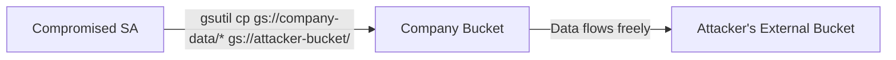
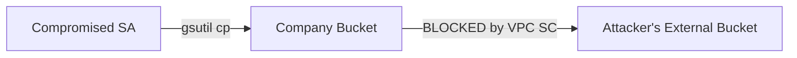

# How to Configure VPC Service Controls for Cloud Storage Data Exfiltration Prevention

Author: [nawazdhandala](https://www.github.com/nawazdhandala)

Tags: GCP, VPC Service Controls, Cloud Storage, Data Exfiltration, Data Protection

Description: Learn how to configure VPC Service Controls to prevent Cloud Storage data exfiltration, blocking unauthorized copying of objects to external projects or accounts.

---

Cloud Storage is the most common target for data exfiltration in GCP environments. The attack is simple: a compromised service account or malicious insider uses `gsutil cp` to copy sensitive objects to a bucket in a project they control. Without VPC Service Controls, there is nothing stopping this as long as the account has read access to the source bucket.

VPC Service Controls solves this by creating a boundary that prevents Cloud Storage API calls from moving data outside the perimeter. Even if an attacker has valid credentials with read access, they cannot copy objects to a destination outside the boundary.

In this guide, I will walk through configuring VPC SC specifically to protect Cloud Storage.

## The Threat Model

Without VPC SC:



With VPC SC:



## Prerequisites

- An organization-level GCP setup
- VPC Service Controls enabled
- The `roles/accesscontextmanager.policyAdmin` role
- Projects containing sensitive Cloud Storage buckets

## Step 1: Create the Service Perimeter

Start by creating a perimeter that includes your projects with sensitive data.

```bash
# Get the access policy
ACCESS_POLICY_ID=$(gcloud access-context-manager policies list \
  --organization=ORGANIZATION_ID \
  --format="value(name)")

# Get project numbers
PROJECT_NUMBER=$(gcloud projects describe my-data-project --format="value(projectNumber)")

# Create the perimeter with Cloud Storage restricted
gcloud access-context-manager perimeters create data-protection \
  --perimeter-type=regular \
  --resources="projects/$PROJECT_NUMBER" \
  --restricted-services="storage.googleapis.com" \
  --title="Cloud Storage Data Protection" \
  --policy=$ACCESS_POLICY_ID
```

## Step 2: Add All Related Projects

Any project that legitimately needs to access the protected buckets should be inside the perimeter.

```bash
# Add your application projects
gcloud access-context-manager perimeters update data-protection \
  --add-resources="projects/APP_PROJECT_NUMBER,projects/ETL_PROJECT_NUMBER,projects/ANALYTICS_PROJECT_NUMBER" \
  --policy=$ACCESS_POLICY_ID
```

Projects inside the same perimeter can freely access each other's Cloud Storage buckets.

## Step 3: Restrict Additional Services

Cloud Storage data can be accessed through other services too. Restrict those as well.

```bash
# Restrict services that can access or transfer Cloud Storage data
gcloud access-context-manager perimeters update data-protection \
  --add-restricted-services="bigquery.googleapis.com,dataflow.googleapis.com,dataproc.googleapis.com,composer.googleapis.com,cloudfunctions.googleapis.com" \
  --policy=$ACCESS_POLICY_ID
```

Why these services?

- **BigQuery**: Can read from and export to Cloud Storage
- **Dataflow**: Can read/write Cloud Storage objects
- **Dataproc**: Can access Cloud Storage as HDFS
- **Composer**: Orchestrates data pipelines that touch Storage
- **Cloud Functions**: Can be used to exfiltrate data programmatically

## Step 4: Block gsutil and API Access From Outside

With the perimeter enforced, attempts to copy objects from outside the perimeter will fail:

```bash
# This will be blocked if run from outside the perimeter
gsutil cp gs://protected-bucket/sensitive-data.csv gs://external-bucket/

# Error: VPC Service Controls: Request is prohibited by organization's policy.
```

Even the storage JSON API will be blocked:

```bash
# This API call will also be blocked from outside the perimeter
curl -H "Authorization: Bearer $(gcloud auth print-access-token)" \
  "https://storage.googleapis.com/storage/v1/b/protected-bucket/o/sensitive-data.csv?alt=media"
```

## Step 5: Allow Legitimate External Access

Create precise ingress and egress rules for legitimate use cases.

Allow a backup service to write to an external backup bucket:

```yaml
# backup-egress.yaml - Allow backup to external bucket
- egressFrom:
    identities:
      - serviceAccount:backup-agent@my-data-project.iam.gserviceaccount.com
  egressTo:
    operations:
      - serviceName: storage.googleapis.com
        methodSelectors:
          - method: google.storage.objects.create
    resources:
      - projects/BACKUP_PROJECT_NUMBER
```

Note that the backup service account can only create objects (write), not read or delete. This prevents the backup path from being used for exfiltration.

```bash
# Apply the egress rule
gcloud access-context-manager perimeters update data-protection \
  --set-egress-policies=backup-egress.yaml \
  --policy=$ACCESS_POLICY_ID
```

## Step 6: Allow Console and Developer Access

Developers need to browse buckets from the Console.

```yaml
# dev-ingress.yaml - Allow Console access from corporate network
- ingressFrom:
    identityType: ANY_USER_ACCOUNT
    sources:
      - accessLevel: accessPolicies/POLICY_ID/accessLevels/corporate-network
  ingressTo:
    operations:
      - serviceName: storage.googleapis.com
        methodSelectors:
          - method: "*"
    resources:
      - "*"
```

```bash
# Apply the ingress rule
gcloud access-context-manager perimeters update data-protection \
  --set-ingress-policies=dev-ingress.yaml \
  --policy=$ACCESS_POLICY_ID
```

## Step 7: Test the Protection

Verify the perimeter blocks unauthorized access.

From outside the perimeter:

```bash
# This should fail
gsutil ls gs://protected-bucket/

# This should also fail
gsutil cp gs://protected-bucket/data.csv /tmp/data.csv
```

From inside the perimeter (e.g., a VM in an included project):

```bash
# This should succeed
gsutil ls gs://protected-bucket/

# Copy within the perimeter should succeed
gsutil cp gs://protected-bucket/data.csv gs://another-protected-bucket/data.csv

# Copy outside the perimeter should fail (unless there is an egress rule)
gsutil cp gs://protected-bucket/data.csv gs://external-bucket/data.csv
```

## Step 8: Protect Against Signed URL Exfiltration

A common bypass attempt is generating signed URLs for objects and sharing them externally. VPC SC handles this too - signed URL access is still subject to perimeter checks.

However, if you want to be extra cautious, restrict who can generate signed URLs:

```bash
# Remove the iam.serviceAccountTokenCreator role from non-essential accounts
gcloud projects remove-iam-policy-binding my-data-project \
  --member="user:untrusted-user@example.com" \
  --role="roles/iam.serviceAccountTokenCreator"
```

## Step 9: Monitor for Exfiltration Attempts

Set up alerts for blocked storage operations.

```bash
# Create a log-based metric for blocked storage operations
gcloud logging metrics create storage_exfiltration_attempts \
  --description="Cloud Storage operations blocked by VPC SC" \
  --filter='protoPayload.metadata.@type="type.googleapis.com/google.cloud.audit.VpcServiceControlAuditMetadata" AND protoPayload.serviceName="storage.googleapis.com" AND protoPayload.metadata.violationReason!="" AND protoPayload.metadata.dryRun=false' \
  --project=my-data-project

# Create an alert policy for the metric
gcloud monitoring policies create \
  --display-name="Storage Exfiltration Attempt Alert" \
  --condition-display-name="Blocked storage operations" \
  --condition-filter='metric.type="logging.googleapis.com/user/storage_exfiltration_attempts"' \
  --condition-threshold-value=1 \
  --condition-threshold-duration=60s \
  --notification-channels=CHANNEL_ID \
  --project=my-data-project
```

## Step 10: Additional Layers of Protection

VPC SC is the primary defense, but add these complementary controls:

Prevent public bucket creation with Organization Policies:

```bash
# Prevent users from making buckets public
gcloud resource-manager org-policies enable-enforce \
  constraints/storage.publicAccessPrevention \
  --organization=ORGANIZATION_ID
```

Enforce uniform bucket-level access:

```bash
# Require uniform bucket-level access across the org
gcloud resource-manager org-policies enable-enforce \
  constraints/storage.uniformBucketLevelAccess \
  --organization=ORGANIZATION_ID
```

## VPC SC Perimeter vs Bucket-Level Policies

It is worth understanding the difference between VPC SC and bucket policies:

| Feature | VPC Service Controls | Bucket Policies/ACLs |
|---|---|---|
| Scope | Project/org level | Individual bucket |
| Protection against stolen creds | Yes | No |
| Cross-project exfiltration prevention | Yes | Limited |
| Network-based access control | Yes | No |
| Complexity | Higher | Lower |

Use both together for defense in depth.

## Conclusion

VPC Service Controls is the strongest tool Google Cloud offers for preventing Cloud Storage data exfiltration. It operates at the API level, blocking unauthorized data movement regardless of IAM permissions. The key is to include all related projects in the perimeter, restrict all services that can touch Cloud Storage, create precise egress rules for legitimate outbound flows, and monitor for blocked attempts. Combined with organization policies and proper IAM, you create a multi-layered defense that makes data exfiltration extremely difficult.
