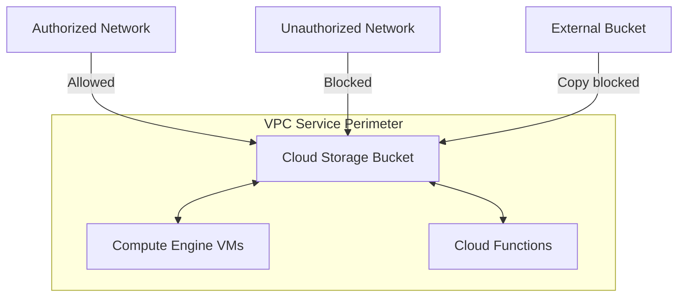

# How to Configure VPC Service Controls for Google Cloud Storage

Author: [nawazdhandala](https://www.github.com/nawazdhandala)

Tags: GCP, Google Cloud Storage, VPC Service Controls, Security, Network Security

Description: A step-by-step guide to configuring VPC Service Controls for Google Cloud Storage to prevent data exfiltration and enforce network-level security boundaries.

---

IAM controls who can access your Cloud Storage data. VPC Service Controls add another layer by controlling where requests can come from and where data can flow. Even if someone has the right IAM permissions, VPC Service Controls can block their access if the request does not originate from an approved network or project. This is your defense against data exfiltration - preventing authorized users from copying data to unauthorized destinations.

This guide covers how to set up VPC Service Controls for Cloud Storage, from creating service perimeters to configuring access levels and handling common scenarios.

## What VPC Service Controls Do

VPC Service Controls create a security perimeter around GCP services. For Cloud Storage, this means:

- Requests from outside the perimeter are blocked, even with valid IAM credentials
- Data cannot be copied to buckets outside the perimeter
- API calls must originate from approved networks, IP ranges, or projects
- You get protection against both external threats and insider data exfiltration



## Prerequisites

Before setting up VPC Service Controls:

1. You need an organization - VPC Service Controls require a GCP organization
2. You need the Access Context Manager Admin role
3. You need to enable the Access Context Manager API

```bash
# Enable the Access Context Manager API
gcloud services enable accesscontextmanager.googleapis.com

# Verify your organization ID
gcloud organizations list
```

## Step 1: Create an Access Policy

An access policy is the top-level container for your VPC Service Controls configuration. Most organizations have one policy:

```bash
# Create an access policy for your organization
gcloud access-context-manager policies create \
  --organization=ORGANIZATION_ID \
  --title="My Organization Policy"
```

List existing policies:

```bash
# List access policies
gcloud access-context-manager policies list \
  --organization=ORGANIZATION_ID
```

## Step 2: Create Access Levels

Access levels define the conditions under which requests are allowed through the perimeter. Common conditions include IP ranges, device attributes, and identity.

### IP-Based Access Level

Allow access from your corporate network:

```bash
# Create an access level that allows requests from specific IP ranges
gcloud access-context-manager levels create corp-network \
  --title="Corporate Network" \
  --basic-level-spec=corp-network.yaml \
  --policy=POLICY_ID
```

The `corp-network.yaml` file:

```yaml
- ipSubnetworks:
    - 203.0.113.0/24
    - 198.51.100.0/24
```

### Identity-Based Access Level

Allow specific service accounts regardless of network:

```yaml
# identity-access.yaml
- members:
    - serviceAccount:ci-cd@my-project.iam.gserviceaccount.com
    - user:admin@mycompany.com
```

```bash
# Create an identity-based access level
gcloud access-context-manager levels create trusted-identities \
  --title="Trusted Service Accounts" \
  --basic-level-spec=identity-access.yaml \
  --policy=POLICY_ID
```

### Combined Access Level

You can combine conditions with AND/OR logic:

```yaml
# combined-access.yaml
- ipSubnetworks:
    - 203.0.113.0/24
  members:
    - serviceAccount:app@my-project.iam.gserviceaccount.com
```

## Step 3: Create a Service Perimeter

The service perimeter defines which projects and services are protected:

```bash
# Create a service perimeter that protects Cloud Storage
gcloud access-context-manager perimeters create my-storage-perimeter \
  --title="Storage Security Perimeter" \
  --resources="projects/PROJECT_NUMBER" \
  --restricted-services="storage.googleapis.com" \
  --access-levels="accessPolicies/POLICY_ID/accessLevels/corp-network" \
  --policy=POLICY_ID
```

### Protecting Multiple Services

In practice, you usually protect multiple services together:

```bash
# Create a perimeter protecting storage and related services
gcloud access-context-manager perimeters create data-perimeter \
  --title="Data Security Perimeter" \
  --resources="projects/PROJECT_NUMBER_1,projects/PROJECT_NUMBER_2" \
  --restricted-services="storage.googleapis.com,bigquery.googleapis.com,pubsub.googleapis.com" \
  --access-levels="accessPolicies/POLICY_ID/accessLevels/corp-network,accessPolicies/POLICY_ID/accessLevels/trusted-identities" \
  --policy=POLICY_ID
```

### Including Multiple Projects

```bash
# Update a perimeter to include additional projects
gcloud access-context-manager perimeters update my-storage-perimeter \
  --add-resources="projects/ANOTHER_PROJECT_NUMBER" \
  --policy=POLICY_ID
```

## Step 4: Test with Dry Run Mode

Before enforcing the perimeter, use dry run mode to see what would be blocked:

```bash
# Create a perimeter in dry run mode first
gcloud access-context-manager perimeters dry-run create my-storage-perimeter \
  --title="Storage Security Perimeter (Dry Run)" \
  --resources="projects/PROJECT_NUMBER" \
  --restricted-services="storage.googleapis.com" \
  --access-levels="accessPolicies/POLICY_ID/accessLevels/corp-network" \
  --policy=POLICY_ID
```

Monitor the audit logs for dry run violations:

```bash
# Query audit logs for VPC Service Controls dry run violations
gcloud logging read \
  'protoPayload.metadata.@type="type.googleapis.com/google.cloud.audit.VpcServiceControlAuditMetadata" AND protoPayload.metadata.dryRun=true' \
  --limit=50 \
  --format="table(timestamp, protoPayload.metadata.violationReason, protoPayload.methodName)"
```

Once you are satisfied with the dry run results, enforce the perimeter:

```bash
# Convert dry run perimeter to enforced
gcloud access-context-manager perimeters dry-run enforce my-storage-perimeter \
  --policy=POLICY_ID
```

## Configuring Ingress Rules

Ingress rules define how external clients can access services inside the perimeter:

```bash
# Create a perimeter with ingress rules
gcloud access-context-manager perimeters update my-storage-perimeter \
  --set-ingress-policies=ingress-policy.yaml \
  --policy=POLICY_ID
```

The ingress policy YAML:

```yaml
- ingressFrom:
    identityType: ANY_IDENTITY
    sources:
      - accessLevel: accessPolicies/POLICY_ID/accessLevels/corp-network
  ingressTo:
    operations:
      - serviceName: storage.googleapis.com
        methodSelectors:
          - method: google.storage.objects.get
          - method: google.storage.objects.list
    resources:
      - projects/PROJECT_NUMBER
```

This allows read-only access to Cloud Storage from the corporate network.

## Configuring Egress Rules

Egress rules control how data can flow out of the perimeter:

```yaml
# egress-policy.yaml
- egressFrom:
    identityType: ANY_IDENTITY
  egressTo:
    operations:
      - serviceName: storage.googleapis.com
        methodSelectors:
          - method: google.storage.objects.create
    resources:
      - projects/BACKUP_PROJECT_NUMBER
```

```bash
# Apply egress rules
gcloud access-context-manager perimeters update my-storage-perimeter \
  --set-egress-policies=egress-policy.yaml \
  --policy=POLICY_ID
```

This allows data to be copied only to a specific backup project's bucket.

## Perimeter Bridges

When two perimeters need to share data, create a perimeter bridge:

```bash
# Create a bridge between two perimeters
gcloud access-context-manager perimeters create bridge-prod-analytics \
  --title="Production to Analytics Bridge" \
  --perimeter-type=bridge \
  --resources="projects/PROD_PROJECT_NUMBER,projects/ANALYTICS_PROJECT_NUMBER" \
  --policy=POLICY_ID
```

## Terraform Configuration

```hcl
# Access policy (usually already exists for the org)
resource "google_access_context_manager_access_policy" "policy" {
  parent = "organizations/${var.org_id}"
  title  = "Organization Security Policy"
}

# Access level for corporate network
resource "google_access_context_manager_access_level" "corp_network" {
  parent = "accessPolicies/${google_access_context_manager_access_policy.policy.name}"
  name   = "accessPolicies/${google_access_context_manager_access_policy.policy.name}/accessLevels/corp_network"
  title  = "Corporate Network"

  basic {
    conditions {
      ip_subnetworks = [
        "203.0.113.0/24",
        "198.51.100.0/24",
      ]
    }
  }
}

# Service perimeter
resource "google_access_context_manager_service_perimeter" "storage_perimeter" {
  parent = "accessPolicies/${google_access_context_manager_access_policy.policy.name}"
  name   = "accessPolicies/${google_access_context_manager_access_policy.policy.name}/servicePerimeters/storage_perimeter"
  title  = "Storage Security Perimeter"

  status {
    restricted_services = ["storage.googleapis.com"]

    resources = [
      "projects/${var.project_number}",
    ]

    access_levels = [
      google_access_context_manager_access_level.corp_network.name,
    ]

    ingress_policies {
      ingress_from {
        sources {
          access_level = google_access_context_manager_access_level.corp_network.name
        }
        identity_type = "ANY_IDENTITY"
      }
      ingress_to {
        resources = ["*"]
        operations {
          service_name = "storage.googleapis.com"
          method_selectors {
            method = "google.storage.objects.get"
          }
          method_selectors {
            method = "google.storage.objects.list"
          }
        }
      }
    }
  }
}
```

## Troubleshooting

### Checking Why a Request Was Blocked

```bash
# Query VPC Service Controls audit logs
gcloud logging read \
  'protoPayload.metadata.@type="type.googleapis.com/google.cloud.audit.VpcServiceControlAuditMetadata"' \
  --limit=20 \
  --format="json(timestamp, protoPayload.metadata.violationReason, protoPayload.authenticationInfo.principalEmail, protoPayload.methodName)"
```

Common violation reasons:

- `RESOURCES_NOT_IN_SAME_SERVICE_PERIMETER` - trying to copy data between perimeters
- `ACCESS_LEVEL_VIOLATION` - request does not meet access level conditions
- `SERVICE_NOT_ALLOWED` - the service is restricted by the perimeter

### Common Issues

**Cloud Console access blocked.** The Cloud Console makes API calls from Google's infrastructure, not your corporate network. You need to create an access level that includes the Console's identity.

**CI/CD pipeline failures.** Add your CI/CD service accounts to an access level or ingress rule.

**Cross-project access broken.** Both projects must be in the same perimeter or connected via a bridge.

VPC Service Controls are one of the strongest security mechanisms available on GCP. They turn your Cloud Storage buckets from "accessible with the right credentials" to "accessible with the right credentials from the right network." For any organization handling sensitive data, they should be part of your security baseline.
