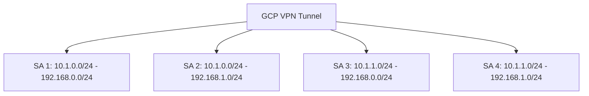

# How to Configure VPN Traffic Selectors for Specific Subnet Routing in GCP Classic VPN

Author: [nawazdhandala](https://www.github.com/nawazdhandala)

Tags: GCP, Classic VPN, Traffic Selectors, Networking, IPsec, Routing

Description: Learn how to configure traffic selectors in GCP Classic VPN to route specific subnets through your VPN tunnel instead of sending all traffic.

---

When setting up a Classic VPN in GCP, one of the decisions you need to make is which traffic should flow through the tunnel. By default, if you are using route-based VPN, the traffic selectors are set to `0.0.0.0/0`, meaning all traffic. But there are plenty of situations where you only want specific subnets to traverse the encrypted tunnel.

This post covers how to properly configure traffic selectors in GCP Classic VPN for targeted subnet routing, common pitfalls, and how to get them working with various peer devices.

## What Are Traffic Selectors?

Traffic selectors (also called proxy IDs or encryption domains) are CIDR ranges that define which traffic should be encrypted and sent through the VPN tunnel. Each tunnel has two traffic selectors:

- **Local traffic selector**: The CIDR ranges on the GCP side
- **Remote traffic selector**: The CIDR ranges on the peer (on-premises) side

Only packets with a source IP matching the local selector and a destination IP matching the remote selector will go through the tunnel. Everything else takes a different route.

## When to Use Specific Traffic Selectors

There are several reasons you might want narrow traffic selectors instead of the default `0.0.0.0/0`:

- **Policy-based peer devices**: Many on-premises firewalls (Cisco ASA, Palo Alto, Fortinet) use policy-based VPN. They require specific traffic selectors that match exactly on both sides.
- **Split tunneling**: You only want certain subnets to communicate over the VPN, while other traffic goes directly to the internet.
- **Multiple tunnels to different destinations**: Each tunnel handles traffic for different subnets.
- **Compliance requirements**: Some regulations require that only specific data flows through the encrypted channel.

## Creating a Classic VPN with Specific Traffic Selectors

First, create the VPN gateway and forwarding rules:

```bash
# Reserve a static external IP for the VPN gateway
gcloud compute addresses create vpn-static-ip \
    --region=us-central1

# Create the Classic VPN gateway
gcloud compute target-vpn-gateways create classic-vpn-gw \
    --network=my-vpc \
    --region=us-central1

# Get the reserved IP address
VPN_IP=$(gcloud compute addresses describe vpn-static-ip \
    --region=us-central1 --format="value(address)")

# Create forwarding rules for ESP, UDP 500, and UDP 4500
gcloud compute forwarding-rules create fr-esp \
    --ip-protocol=ESP \
    --address=$VPN_IP \
    --target-vpn-gateway=classic-vpn-gw \
    --region=us-central1

gcloud compute forwarding-rules create fr-udp500 \
    --ip-protocol=UDP \
    --ports=500 \
    --address=$VPN_IP \
    --target-vpn-gateway=classic-vpn-gw \
    --region=us-central1

gcloud compute forwarding-rules create fr-udp4500 \
    --ip-protocol=UDP \
    --ports=4500 \
    --address=$VPN_IP \
    --target-vpn-gateway=classic-vpn-gw \
    --region=us-central1
```

Now create the tunnel with specific traffic selectors:

```bash
# Create VPN tunnel with specific local and remote subnets
gcloud compute vpn-tunnels create my-tunnel \
    --peer-address=203.0.113.1 \
    --ike-version=2 \
    --shared-secret=my-secret-key \
    --target-vpn-gateway=classic-vpn-gw \
    --local-traffic-selector=10.1.0.0/24,10.1.1.0/24 \
    --remote-traffic-selector=192.168.0.0/24,192.168.1.0/24 \
    --region=us-central1
```

This tells GCP to only encrypt traffic from `10.1.0.0/24` and `10.1.1.0/24` going to `192.168.0.0/24` and `192.168.1.0/24`, and vice versa.

## Adding Routes for the Remote Subnets

With Classic VPN using specific traffic selectors, you also need routes so GCP knows to send traffic destined for the remote subnets through the VPN tunnel:

```bash
# Create a route for each remote subnet pointing to the VPN tunnel
gcloud compute routes create route-to-remote-1 \
    --destination-range=192.168.0.0/24 \
    --next-hop-vpn-tunnel=my-tunnel \
    --next-hop-vpn-tunnel-region=us-central1 \
    --network=my-vpc \
    --priority=1000

gcloud compute routes create route-to-remote-2 \
    --destination-range=192.168.1.0/24 \
    --next-hop-vpn-tunnel=my-tunnel \
    --next-hop-vpn-tunnel-region=us-central1 \
    --network=my-vpc \
    --priority=1000
```

## Matching Traffic Selectors on the Peer Device

This is where most problems happen. The traffic selectors must match precisely between GCP and your peer device. Here is what "matching" means:

- What GCP calls "local", the peer device calls "remote" (and vice versa)
- The CIDR ranges must be identical - not overlapping, not supernets, but exactly the same ranges

For example, if GCP has:
- Local: `10.1.0.0/24, 10.1.1.0/24`
- Remote: `192.168.0.0/24, 192.168.1.0/24`

Then the peer device must have:
- Local: `192.168.0.0/24, 192.168.1.0/24`
- Remote: `10.1.0.0/24, 10.1.1.0/24`

Here is what this looks like on a Cisco ASA:

```text
! Define the interesting traffic on the Cisco ASA
access-list vpn-to-gcp extended permit ip 192.168.0.0 255.255.255.0 10.1.0.0 255.255.255.0
access-list vpn-to-gcp extended permit ip 192.168.0.0 255.255.255.0 10.1.1.0 255.255.255.0
access-list vpn-to-gcp extended permit ip 192.168.1.0 255.255.255.0 10.1.0.0 255.255.255.0
access-list vpn-to-gcp extended permit ip 192.168.1.0 255.255.255.0 10.1.1.0 255.255.255.0
```

## The Multiple SA Problem

Here is an important detail that catches people off guard: when you specify multiple CIDR ranges in traffic selectors, GCP can negotiate multiple Child SAs (one for each combination of local and remote CIDR). Some peer devices do not handle this well.

With the example above (2 local ranges and 2 remote ranges), GCP might create up to 4 Child SAs:



If your peer device only supports a single SA per tunnel, you have two options:

1. **Use summarized CIDR ranges**: Instead of `10.1.0.0/24` and `10.1.1.0/24`, use `10.1.0.0/23` if your addressing allows it.
2. **Create multiple tunnels**: One tunnel per subnet pair, each with a single local and single remote traffic selector.

## Modifying Traffic Selectors on an Existing Tunnel

Unfortunately, you cannot modify traffic selectors on an existing Classic VPN tunnel. You need to delete and recreate it:

```bash
# Delete the existing tunnel
gcloud compute vpn-tunnels delete my-tunnel \
    --region=us-central1

# Recreate with updated traffic selectors
gcloud compute vpn-tunnels create my-tunnel \
    --peer-address=203.0.113.1 \
    --ike-version=2 \
    --shared-secret=my-secret-key \
    --target-vpn-gateway=classic-vpn-gw \
    --local-traffic-selector=10.1.0.0/24,10.1.1.0/24,10.1.2.0/24 \
    --remote-traffic-selector=192.168.0.0/24,192.168.1.0/24 \
    --region=us-central1
```

This will cause downtime. Plan accordingly and coordinate with whoever manages the peer device.

## Verifying Traffic Selector Configuration

After creating the tunnel, verify the traffic selectors are set correctly:

```bash
# Check the traffic selectors on the tunnel
gcloud compute vpn-tunnels describe my-tunnel \
    --region=us-central1 \
    --format="yaml(localTrafficSelector, remoteTrafficSelector)"
```

Expected output:

```yaml
localTrafficSelector:
- 10.1.0.0/24
- 10.1.1.0/24
remoteTrafficSelector:
- 192.168.0.0/24
- 192.168.1.0/24
```

## Troubleshooting Traffic Selector Issues

If your tunnel establishes but traffic does not flow:

1. **Check for TS_UNACCEPTABLE errors** in Cloud VPN logs - this means the peer is proposing different selectors than what GCP expects.
2. **Verify routes exist** for each remote subnet pointing at the tunnel.
3. **Check firewall rules** on both the GCP VPC and the peer network to allow traffic between the specified subnets.
4. **Watch for asymmetric routing** - make sure return traffic also goes through the tunnel.

## Consider HA VPN Instead

Classic VPN is still supported, but Google recommends HA VPN for new deployments. HA VPN uses dynamic routing with BGP, which eliminates most traffic selector headaches. The traffic selectors are always `0.0.0.0/0`, and BGP handles which routes go through the tunnel.

If you are starting fresh and your peer device supports BGP, save yourself the trouble and go with HA VPN.

## Wrapping Up

Traffic selectors in Classic VPN are straightforward in concept but tricky in practice. The key rule is that both sides must agree exactly on what traffic the tunnel carries. When connecting to policy-based devices, pay close attention to how they handle multiple SAs and consider using summarized CIDR ranges to keep things simple. And whenever possible, use HA VPN with BGP to avoid the traffic selector dance entirely.
