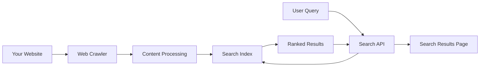

# How to Configure Website Search with Vertex AI Search and Custom Ranking

Author: [nawazdhandala](https://www.github.com/nawazdhandala)

Tags: GCP, Vertex AI Search, Website Search, Custom Ranking, Search Configuration

Description: Set up Vertex AI Search for website indexing with custom ranking rules, boosting, and filtering to deliver relevant search results for your web properties.

---

If your website has grown beyond what a basic search box can handle, Vertex AI Search offers a significant upgrade. It crawls and indexes your website content, understands natural language queries, and returns results ranked by relevance. But the real power comes from customization - you can boost certain pages, filter by metadata, and create ranking rules that match your specific content strategy.

This guide covers setting up website search with Vertex AI Search, configuring the crawler, and implementing custom ranking to ensure the most important content surfaces first.

## How Website Search Works

Vertex AI Search for websites works in three phases:

1. **Crawling** - A web crawler visits your site and downloads pages
2. **Indexing** - Content is processed, chunked, and indexed for search
3. **Serving** - User queries are matched against the index using semantic understanding



## Prerequisites

- Google Cloud project with Vertex AI Search API enabled
- A publicly accessible website to index
- Verified site ownership (recommended for advanced features)

```bash
# Enable the Discovery Engine API
gcloud services enable discoveryengine.googleapis.com --project=your-project-id
```

## Step 1: Create a Website Data Store

```python
from google.cloud import discoveryengine_v1 as discoveryengine

def create_website_data_store(
    project_id: str,
    location: str,
    data_store_id: str,
):
    """Create a data store configured for website content."""
    client = discoveryengine.DataStoreServiceClient()

    data_store = discoveryengine.DataStore(
        display_name="Website Search",
        industry_vertical=discoveryengine.IndustryVertical.GENERIC,
        content_config=discoveryengine.DataStore.ContentConfig.PUBLIC_WEBSITE,
        solution_types=[discoveryengine.SolutionType.SOLUTION_TYPE_SEARCH],
    )

    parent = f"projects/{project_id}/locations/{location}/collections/default_collection"

    operation = client.create_data_store(
        parent=parent,
        data_store=data_store,
        data_store_id=data_store_id,
    )

    result = operation.result(timeout=300)
    print(f"Website data store created: {result.name}")
    return result

create_website_data_store(
    project_id="your-project-id",
    location="global",
    data_store_id="website-search",
)
```

## Step 2: Configure Site URLs

Tell the crawler which parts of your website to index.

```python
def add_site_urls(
    project_id: str,
    location: str,
    data_store_id: str,
    urls: list,
):
    """Configure the URLs that the crawler should index."""
    client = discoveryengine.SiteSearchEngineServiceClient()

    parent = (
        f"projects/{project_id}/locations/{location}"
        f"/collections/default_collection/dataStores/{data_store_id}"
        f"/siteSearchEngine"
    )

    # Create target sites for crawling
    target_sites = []
    for url in urls:
        target_site = discoveryengine.TargetSite(
            provided_uri_pattern=url,
            type_=discoveryengine.TargetSite.Type.INCLUDE,
        )
        target_sites.append(target_site)

    # Add each target site
    for site in target_sites:
        operation = client.create_target_site(
            parent=parent,
            target_site=site,
        )
        result = operation.result(timeout=120)
        print(f"Added target site: {result.provided_uri_pattern}")

# Add URLs to crawl
add_site_urls(
    project_id="your-project-id",
    location="global",
    data_store_id="website-search",
    urls=[
        "https://docs.yoursite.com/*",     # Documentation pages
        "https://blog.yoursite.com/*",      # Blog posts
        "https://yoursite.com/products/*",  # Product pages
    ],
)
```

### Excluding URLs

You can also exclude certain URL patterns from indexing.

```python
def exclude_urls(
    project_id: str,
    location: str,
    data_store_id: str,
    exclude_patterns: list,
):
    """Exclude specific URL patterns from crawling."""
    client = discoveryengine.SiteSearchEngineServiceClient()

    parent = (
        f"projects/{project_id}/locations/{location}"
        f"/collections/default_collection/dataStores/{data_store_id}"
        f"/siteSearchEngine"
    )

    for pattern in exclude_patterns:
        target_site = discoveryengine.TargetSite(
            provided_uri_pattern=pattern,
            type_=discoveryengine.TargetSite.Type.EXCLUDE,
        )
        operation = client.create_target_site(
            parent=parent,
            target_site=target_site,
        )
        result = operation.result(timeout=120)
        print(f"Excluded: {result.provided_uri_pattern}")

# Exclude login pages and admin areas
exclude_urls(
    project_id="your-project-id",
    location="global",
    data_store_id="website-search",
    exclude_patterns=[
        "https://yoursite.com/admin/*",
        "https://yoursite.com/login",
        "https://yoursite.com/internal/*",
    ],
)
```

## Step 3: Create the Search Engine

```python
def create_website_search_engine(
    project_id: str,
    location: str,
    engine_id: str,
    data_store_id: str,
):
    """Create a search engine for website search."""
    client = discoveryengine.EngineServiceClient()

    engine = discoveryengine.Engine(
        display_name="Website Search Engine",
        solution_type=discoveryengine.SolutionType.SOLUTION_TYPE_SEARCH,
        search_engine_config=discoveryengine.Engine.SearchEngineConfig(
            search_tier=discoveryengine.SearchTier.SEARCH_TIER_ENTERPRISE,
            search_add_ons=[discoveryengine.SearchAddOn.SEARCH_ADD_ON_LLM],
        ),
        data_store_ids=[data_store_id],
    )

    parent = f"projects/{project_id}/locations/{location}/collections/default_collection"

    operation = client.create_engine(
        parent=parent,
        engine=engine,
        engine_id=engine_id,
    )

    result = operation.result(timeout=300)
    print(f"Search engine created: {result.name}")
    return result

create_website_search_engine(
    project_id="your-project-id",
    location="global",
    engine_id="website-search-engine",
    data_store_id="website-search",
)
```

## Step 4: Implement Custom Ranking

Custom ranking lets you control which results appear first. You can boost pages based on URL patterns, page freshness, or custom attributes.

### Boost by URL Pattern

```python
def search_with_boost(
    project_id: str,
    location: str,
    engine_id: str,
    query: str,
):
    """Search with custom boosting rules to prioritize certain pages."""
    client = discoveryengine.SearchServiceClient()

    serving_config = (
        f"projects/{project_id}/locations/{location}"
        f"/collections/default_collection/engines/{engine_id}"
        f"/servingConfigs/default_search"
    )

    # Define boost rules
    boost_spec = discoveryengine.SearchRequest.BoostSpec(
        condition_boost_specs=[
            # Boost documentation pages higher in results
            discoveryengine.SearchRequest.BoostSpec.ConditionBoostSpec(
                condition='link: ANY("docs.yoursite.com")',
                boost=0.5,  # Positive value boosts, negative buries
            ),
            # Boost recently updated pages
            discoveryengine.SearchRequest.BoostSpec.ConditionBoostSpec(
                condition='update_time > "2025-01-01T00:00:00Z"',
                boost=0.3,
            ),
            # Demote archived content
            discoveryengine.SearchRequest.BoostSpec.ConditionBoostSpec(
                condition='link: ANY("yoursite.com/archive")',
                boost=-0.5,
            ),
        ],
    )

    request = discoveryengine.SearchRequest(
        serving_config=serving_config,
        query=query,
        page_size=10,
        boost_spec=boost_spec,
        content_search_spec=discoveryengine.SearchRequest.ContentSearchSpec(
            snippet_spec=discoveryengine.SearchRequest.ContentSearchSpec.SnippetSpec(
                return_snippet=True,
            ),
        ),
    )

    response = client.search(request)

    for result in response.results:
        doc_data = result.document.derived_struct_data
        print(f"Title: {doc_data.get('title', 'N/A')}")
        print(f"Link: {doc_data.get('link', 'N/A')}")
        snippets = doc_data.get("snippets", [])
        if snippets:
            print(f"Snippet: {snippets[0].get('snippet', '')}")
        print()

    return response

results = search_with_boost(
    project_id="your-project-id",
    location="global",
    engine_id="website-search-engine",
    query="getting started guide",
)
```

### Filtering Results

```python
def search_with_filter(
    project_id: str,
    location: str,
    engine_id: str,
    query: str,
    filter_expression: str,
):
    """Search with a filter to narrow results to specific pages."""
    client = discoveryengine.SearchServiceClient()

    serving_config = (
        f"projects/{project_id}/locations/{location}"
        f"/collections/default_collection/engines/{engine_id}"
        f"/servingConfigs/default_search"
    )

    request = discoveryengine.SearchRequest(
        serving_config=serving_config,
        query=query,
        page_size=10,
        filter=filter_expression,
    )

    response = client.search(request)

    print(f"Filtered results: {response.total_size}")
    for result in response.results:
        doc_data = result.document.derived_struct_data
        print(f"  {doc_data.get('title', 'N/A')} - {doc_data.get('link', 'N/A')}")

    return response

# Only return results from the documentation section
search_with_filter(
    project_id="your-project-id",
    location="global",
    engine_id="website-search-engine",
    query="API authentication",
    filter_expression='link: ANY("docs.yoursite.com")',
)
```

## Step 5: Trigger Recrawling

When you update your website, trigger a recrawl to keep the index fresh.

```python
def recrawl_site(
    project_id: str,
    location: str,
    data_store_id: str,
    uris: list,
):
    """Trigger a recrawl of specific URIs."""
    client = discoveryengine.SiteSearchEngineServiceClient()

    site_search_engine = (
        f"projects/{project_id}/locations/{location}"
        f"/collections/default_collection/dataStores/{data_store_id}"
        f"/siteSearchEngine"
    )

    operation = client.recrawl_uris(
        site_search_engine=site_search_engine,
        uris=uris,
    )

    print(f"Recrawl initiated for {len(uris)} URIs")
    return operation

# Recrawl specific pages after updates
recrawl_site(
    project_id="your-project-id",
    location="global",
    data_store_id="website-search",
    uris=[
        "https://docs.yoursite.com/getting-started",
        "https://docs.yoursite.com/api-reference",
    ],
)
```

## Implementing the Search Frontend

Here is a simple search page using the Vertex AI Search widget.

```html
<!DOCTYPE html>
<html>
<head>
    <title>Site Search</title>
    <style>
        .search-container {
            max-width: 700px;
            margin: 50px auto;
            font-family: sans-serif;
        }
        #search-input {
            width: 100%;
            padding: 12px;
            font-size: 16px;
            border: 1px solid #ddd;
            border-radius: 4px;
        }
    </style>
</head>
<body>
    <div class="search-container">
        <h1>Search Our Documentation</h1>
        <input type="text" id="search-input" placeholder="Search..." />
        <div id="results"></div>
    </div>

    <!-- Vertex AI Search Widget -->
    <script src="https://cloud.google.com/ai/gen-app-builder/client?hl=en_US"></script>
    <gen-search-widget
        configId="your-widget-config-id"
        triggerId="search-input">
    </gen-search-widget>
</body>
</html>
```

## Summary

Vertex AI Search for websites gives you Google-quality search for your own web properties without building and maintaining a search infrastructure. The custom ranking features let you control what surfaces first, which is critical for directing users to the most relevant content. Start by indexing your most important pages, set up boost rules for your documentation and product pages, and use the built-in widget for a quick deployment. As you learn your users' search patterns, refine the ranking rules and add more content to the index.
