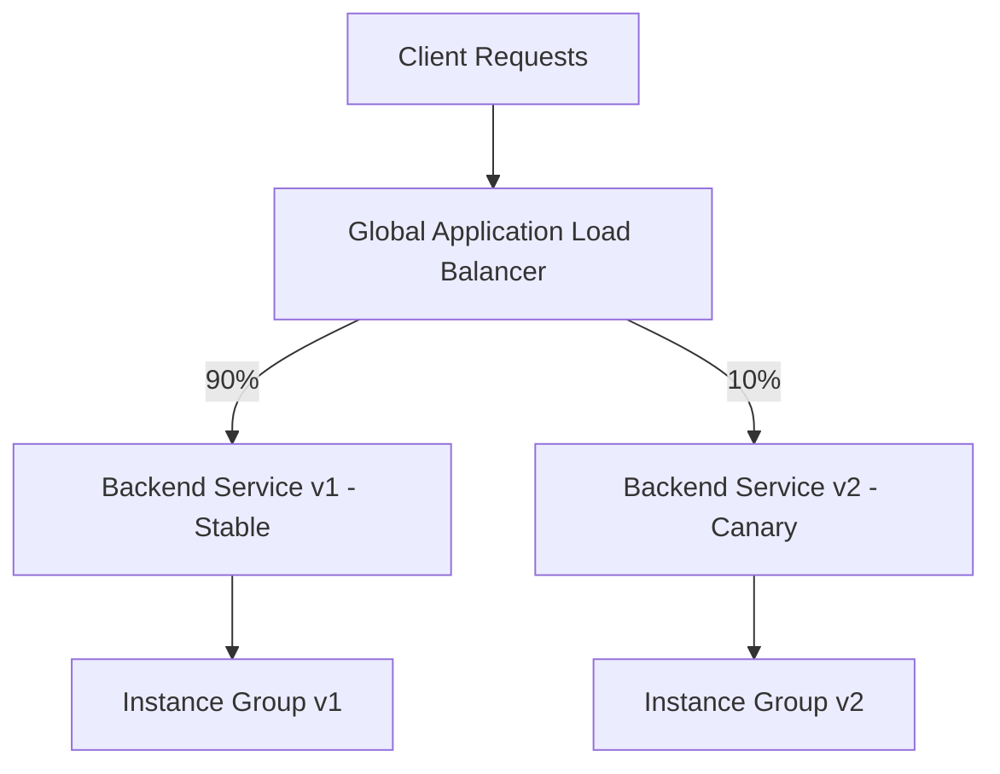

# How to Configure Weighted Traffic Distribution Across Backend Services on GCP Load Balancer

Author: [nawazdhandala](https://www.github.com/nawazdhandala)

Tags: GCP, Load Balancer, Traffic Management, Canary Deployment, Weighted Routing

Description: Step-by-step guide to configuring weighted traffic distribution across backend services on Google Cloud Load Balancer for canary deployments and gradual rollouts.

---

When you deploy a new version of your service, sending all traffic to it immediately is risky. A bug in the new version could affect every user at once. Weighted traffic distribution lets you split traffic between multiple backend services based on percentages. You might send 95% of traffic to the stable version and 5% to the canary, then gradually increase the canary's weight as you gain confidence.

Google Cloud's Application Load Balancer supports weighted traffic splitting through URL map route rules. In this post, I will show you how to set it up, adjust weights, and monitor the split.

## How Weighted Routing Works

The URL map's route rules support a `weightedBackendServices` action. Each backend service gets a weight, and the load balancer distributes requests proportionally. A backend with weight 90 receives 9 times as many requests as one with weight 10.



## Prerequisites

You need two separate backend services - one for each version of your application.

```bash
# Create health checks
gcloud compute health-checks create http app-health-check \
    --port=8080 \
    --request-path=/healthz

# Create the stable backend service (v1)
gcloud compute backend-services create app-v1-backend \
    --global \
    --protocol=HTTP \
    --health-checks=app-health-check \
    --port-name=http

# Create the canary backend service (v2)
gcloud compute backend-services create app-v2-backend \
    --global \
    --protocol=HTTP \
    --health-checks=app-health-check \
    --port-name=http
```

Set up the instance groups and add them as backends:

```bash
# Instance group for v1
gcloud compute instance-groups managed create app-v1-mig \
    --template=app-v1-template \
    --size=4 \
    --zone=us-central1-a

gcloud compute instance-groups managed set-named-ports app-v1-mig \
    --named-ports=http:8080 \
    --zone=us-central1-a

gcloud compute backend-services add-backend app-v1-backend \
    --global \
    --instance-group=app-v1-mig \
    --instance-group-zone=us-central1-a \
    --balancing-mode=RATE \
    --max-rate-per-instance=100

# Instance group for v2
gcloud compute instance-groups managed create app-v2-mig \
    --template=app-v2-template \
    --size=2 \
    --zone=us-central1-a

gcloud compute instance-groups managed set-named-ports app-v2-mig \
    --named-ports=http:8080 \
    --zone=us-central1-a

gcloud compute backend-services add-backend app-v2-backend \
    --global \
    --instance-group=app-v2-mig \
    --instance-group-zone=us-central1-a \
    --balancing-mode=RATE \
    --max-rate-per-instance=100
```

## Step 1 - Create the URL Map with Weighted Routing

The URL map defines how traffic is split between backend services.

```bash
# Create the URL map with weighted traffic split
gcloud compute url-maps create app-url-map \
    --default-service=app-v1-backend

# Now import a more detailed configuration with weighted routing
gcloud compute url-maps import app-url-map --source=- <<'EOF'
name: app-url-map
defaultService: projects/my-project/global/backendServices/app-v1-backend
hostRules:
  - hosts:
      - "app.example.com"
      - "*"
    pathMatcher: app-routes
pathMatchers:
  - name: app-routes
    defaultRouteAction:
      weightedBackendServices:
        - backendService: projects/my-project/global/backendServices/app-v1-backend
          weight: 90
        - backendService: projects/my-project/global/backendServices/app-v2-backend
          weight: 10
EOF
```

With this configuration, 90% of traffic goes to v1 and 10% goes to v2.

## Step 2 - Create the Frontend

Set up the target proxy, SSL certificate, and forwarding rule.

```bash
# Create a managed SSL certificate
gcloud compute ssl-certificates create app-cert \
    --domains=app.example.com \
    --global

# Create the target HTTPS proxy
gcloud compute target-https-proxies create app-https-proxy \
    --url-map=app-url-map \
    --ssl-certificates=app-cert

# Reserve a global IP
gcloud compute addresses create app-global-ip --global

# Create the forwarding rule
gcloud compute forwarding-rules create app-https-rule \
    --global \
    --address=app-global-ip \
    --target-https-proxy=app-https-proxy \
    --ports=443
```

## Step 3 - Gradually Adjust Weights

As your canary version proves stable, increase its weight. You can script this as a gradual rollout.

```bash
# Function to update traffic weights
update_weights() {
    local v1_weight=$1
    local v2_weight=$2

    gcloud compute url-maps import app-url-map --source=- <<EOF
name: app-url-map
defaultService: projects/my-project/global/backendServices/app-v1-backend
hostRules:
  - hosts:
      - "app.example.com"
      - "*"
    pathMatcher: app-routes
pathMatchers:
  - name: app-routes
    defaultRouteAction:
      weightedBackendServices:
        - backendService: projects/my-project/global/backendServices/app-v1-backend
          weight: ${v1_weight}
        - backendService: projects/my-project/global/backendServices/app-v2-backend
          weight: ${v2_weight}
EOF
    echo "Updated weights: v1=${v1_weight}%, v2=${v2_weight}%"
}

# Gradual rollout steps
update_weights 95 5     # Start with 5% canary
# Wait, monitor, then increase
update_weights 80 20    # Increase to 20%
# Wait, monitor, then increase
update_weights 50 50    # 50/50 split
# Wait, monitor, then complete
update_weights 0 100    # Full rollout to v2
```

## Step 4 - Add Header-Based Overrides

Sometimes you want internal testers to always hit the canary, regardless of the weight distribution. You can add header-based routing that takes priority.

```bash
# URL map with both weighted routing and header-based override
gcloud compute url-maps import app-url-map --source=- <<'EOF'
name: app-url-map
defaultService: projects/my-project/global/backendServices/app-v1-backend
hostRules:
  - hosts:
      - "app.example.com"
      - "*"
    pathMatcher: app-routes
pathMatchers:
  - name: app-routes
    routeRules:
      - priority: 1
        matchRules:
          - headerMatches:
              - headerName: "x-force-canary"
                exactMatch: "true"
        service: projects/my-project/global/backendServices/app-v2-backend
      - priority: 2
        matchRules:
          - prefixMatch: "/"
        routeAction:
          weightedBackendServices:
            - backendService: projects/my-project/global/backendServices/app-v1-backend
              weight: 90
            - backendService: projects/my-project/global/backendServices/app-v2-backend
              weight: 10
EOF
```

Now requests with the header `x-force-canary: true` always go to v2, while everything else follows the 90/10 split.

## Step 5 - Monitor the Traffic Split

Use Cloud Monitoring to verify the traffic distribution and compare error rates between versions.

```bash
# Check request counts per backend service
gcloud logging read 'resource.type="http_load_balancer"' \
    --format="table(httpRequest.requestUrl, resource.labels.backend_service_name)" \
    --limit=100
```

For a more detailed view, create a monitoring dashboard:

```python
# Python script to compare error rates between v1 and v2
from google.cloud import monitoring_v3
import time

client = monitoring_v3.MetricServiceClient()
project_name = f"projects/my-project"

# Query error rate for each backend
for backend in ["app-v1-backend", "app-v2-backend"]:
    interval = monitoring_v3.TimeInterval(
        end_time={"seconds": int(time.time())},
        start_time={"seconds": int(time.time()) - 3600}  # Last hour
    )

    results = client.list_time_series(
        request={
            "name": project_name,
            "filter": f'metric.type="loadbalancing.googleapis.com/https/request_count" '
                      f'AND resource.labels.backend_service_name="{backend}"',
            "interval": interval,
            "view": monitoring_v3.ListTimeSeriesRequest.TimeSeriesView.FULL,
        }
    )

    for series in results:
        print(f"Backend: {backend}")
        for point in series.points:
            print(f"  {point.interval.end_time}: {point.value.int64_value} requests")
```

## Weighted Routing with Path-Based Splits

You can also apply different weights to different URL paths. For example, you might want to canary your API endpoints separately from your frontend.

```bash
gcloud compute url-maps import app-url-map --source=- <<'EOF'
name: app-url-map
defaultService: projects/my-project/global/backendServices/app-v1-backend
hostRules:
  - hosts:
      - "*"
    pathMatcher: app-routes
pathMatchers:
  - name: app-routes
    routeRules:
      - priority: 1
        matchRules:
          - prefixMatch: "/api/"
        routeAction:
          weightedBackendServices:
            - backendService: projects/my-project/global/backendServices/app-v1-backend
              weight: 95
            - backendService: projects/my-project/global/backendServices/app-v2-backend
              weight: 5
      - priority: 2
        matchRules:
          - prefixMatch: "/"
        routeAction:
          weightedBackendServices:
            - backendService: projects/my-project/global/backendServices/app-v1-backend
              weight: 80
            - backendService: projects/my-project/global/backendServices/app-v2-backend
              weight: 20
EOF
```

This routes API traffic with a conservative 95/5 split while being more aggressive with the frontend at 80/20.

## Wrapping Up

Weighted traffic distribution on GCP's Application Load Balancer is a straightforward way to do canary deployments and gradual rollouts. The URL map configuration is declarative, weights can be updated in seconds, and the load balancer handles the proportional distribution automatically. Combine it with header-based overrides for internal testing and Cloud Monitoring for observability, and you have a solid deployment strategy that minimizes the blast radius of any issues with new releases.
