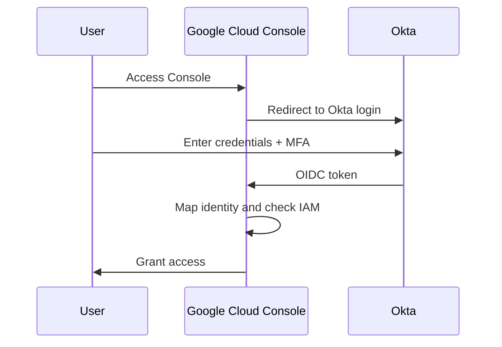

# How to Configure Workforce Identity Federation with Okta for Google Cloud Console Access

Author: [nawazdhandala](https://www.github.com/nawazdhandala)

Tags: GCP, Workforce Identity Federation, Okta, Identity Management, Single Sign-On

Description: A step-by-step guide to configuring Workforce Identity Federation with Okta so your employees can access Google Cloud Console and APIs using their Okta credentials.

---

Workforce Identity Federation lets your employees access Google Cloud resources using credentials from an external identity provider like Okta. Instead of creating and managing Google Cloud identities for each employee, your users authenticate through Okta and Google Cloud maps those identities to IAM permissions. This eliminates the need for separate Google accounts and keeps your identity management centralized in Okta.

This guide walks through the complete setup process, from configuring Okta as an identity provider to granting IAM permissions and testing access.

## How Workforce Identity Federation Works

The flow is straightforward:

1. A user navigates to the Google Cloud Console with the workforce provider URL
2. Google Cloud redirects to Okta for authentication
3. The user logs in with their Okta credentials (including MFA if configured)
4. Okta sends an OIDC token to Google Cloud
5. Google Cloud maps the token attributes to a workforce identity
6. The user gets access based on IAM policies bound to their workforce identity



## Prerequisites

Before starting:

1. You need an Okta account with admin access
2. Organization-level access to Google Cloud with `iam.workforcePoolAdmin` role
3. The Workforce Identity Federation API must be enabled

```bash
# Enable the required APIs
gcloud services enable iam.googleapis.com \
  --project=my-admin-project
```

## Step 1: Create a Workforce Identity Pool

A workforce pool is a container for your external identities. Create one at the organization level.

```bash
# Create a workforce identity pool
gcloud iam workforce-pools create okta-workforce-pool \
  --organization=123456789 \
  --location=global \
  --display-name="Okta Workforce Pool" \
  --description="Workforce pool for Okta-authenticated employees" \
  --session-duration=28800s
```

The `--session-duration` controls how long a session lasts before the user needs to re-authenticate. 28800 seconds is 8 hours, which aligns with a typical workday.

## Step 2: Configure Okta Application

In Okta, you need to create an OIDC application that Google Cloud will use for authentication.

1. In the Okta Admin Console, go to Applications and create a new Web Application
2. Set the Sign-in redirect URI to: `https://auth.cloud.google/signin-callback/locations/global/workforcePools/okta-workforce-pool/providers/okta-oidc-provider`
3. Set the Sign-out redirect URI to: `https://console.cloud.google`
4. Note the Client ID and Client Secret
5. Under the Assignments tab, assign the users and groups that should have Google Cloud access

Make sure the Okta application is configured to include these claims in the ID token:
- `sub` (subject - unique user identifier)
- `email` (user's email address)
- `groups` (user's group memberships - optional but useful for group-based IAM)

## Step 3: Create the Workforce Provider

Now create the provider that links your workforce pool to Okta.

```bash
# Create an OIDC workforce provider connected to Okta
gcloud iam workforce-pools providers create-oidc okta-oidc-provider \
  --workforce-pool=okta-workforce-pool \
  --location=global \
  --display-name="Okta OIDC Provider" \
  --description="OIDC provider connected to corporate Okta" \
  --issuer-uri="https://your-company.okta.com/oauth2/default" \
  --client-id="YOUR_OKTA_CLIENT_ID" \
  --client-secret-value="YOUR_OKTA_CLIENT_SECRET" \
  --web-sso-response-type="code" \
  --web-sso-assertion-claims-behavior="MERGE_USER_INFO_OVER_ID_TOKEN_CLAIMS" \
  --web-sso-additional-scopes="email,profile,groups" \
  --attribute-mapping="google.subject=assertion.sub,google.display_name=assertion.name,google.groups=assertion.groups" \
  --attribute-condition="assertion.email.endsWith('@yourcompany.com')"
```

Let me break down the important flags:

- `--issuer-uri` is your Okta authorization server URL
- `--client-id` and `--client-secret-value` come from the Okta application you created
- `--attribute-mapping` maps Okta claims to Google Cloud identity attributes
- `--attribute-condition` restricts which Okta users can access Google Cloud (only users with your company email domain)

## Step 4: Grant IAM Permissions

With the provider configured, grant IAM permissions to your workforce identities. You can grant permissions to specific users or to groups.

### Grant Access to a Specific User

```bash
# Grant a specific Okta user the Viewer role on a project
gcloud projects add-iam-policy-binding my-project \
  --member="principal://iam.googleapis.com/locations/global/workforcePools/okta-workforce-pool/subject/00u1234567890abcdef" \
  --role="roles/viewer"
```

The subject value is the Okta user's unique identifier (the `sub` claim from the OIDC token).

### Grant Access to a Group

This is the preferred approach - manage access through Okta groups rather than individual users.

```bash
# Grant all members of the Okta "gcp-admins" group the Editor role
gcloud projects add-iam-policy-binding my-project \
  --member="principalSet://iam.googleapis.com/locations/global/workforcePools/okta-workforce-pool/group/gcp-admins" \
  --role="roles/editor"

# Grant the "gcp-viewers" group read-only access
gcloud projects add-iam-policy-binding my-project \
  --member="principalSet://iam.googleapis.com/locations/global/workforcePools/okta-workforce-pool/group/gcp-viewers" \
  --role="roles/viewer"
```

### Grant Organization-Level Access

```bash
# Grant the security team access at the organization level
gcloud organizations add-iam-policy-binding 123456789 \
  --member="principalSet://iam.googleapis.com/locations/global/workforcePools/okta-workforce-pool/group/security-team" \
  --role="roles/securitycenter.admin"
```

## Step 5: Configure Console Access

Generate the workforce provider console URL that your users will use to access Google Cloud.

```bash
# Generate the console access URL
echo "https://console.cloud.google/workforce?provider=locations/global/workforcePools/okta-workforce-pool/providers/okta-oidc-provider"
```

Share this URL with your users or add it to your company's application portal. When users click it, they are redirected to Okta for authentication before accessing the console.

## Terraform Configuration

Here is the complete setup in Terraform.

```hcl
# Workforce identity pool
resource "google_iam_workforce_pool" "okta" {
  workforce_pool_id = "okta-workforce-pool"
  parent            = "organizations/123456789"
  location          = "global"
  display_name      = "Okta Workforce Pool"
  description       = "Workforce pool for Okta-authenticated employees"
  session_duration  = "28800s"
}

# OIDC provider connected to Okta
resource "google_iam_workforce_pool_provider" "okta_oidc" {
  workforce_pool_id = google_iam_workforce_pool.okta.workforce_pool_id
  location          = google_iam_workforce_pool.okta.location
  provider_id       = "okta-oidc-provider"
  display_name      = "Okta OIDC Provider"

  attribute_mapping = {
    "google.subject"      = "assertion.sub"
    "google.display_name" = "assertion.name"
    "google.groups"       = "assertion.groups"
  }

  # Only allow users with company email domain
  attribute_condition = "assertion.email.endsWith('@yourcompany.com')"

  oidc {
    issuer_uri = "https://your-company.okta.com/oauth2/default"
    client_id  = var.okta_client_id

    client_secret {
      value = var.okta_client_secret
    }

    web_sso_config {
      response_type             = "CODE"
      assertion_claims_behavior = "MERGE_USER_INFO_OVER_ID_TOKEN_CLAIMS"
      additional_scopes         = ["email", "profile", "groups"]
    }
  }
}

# IAM bindings for Okta groups
resource "google_project_iam_member" "gcp_admins" {
  project = "my-project"
  role    = "roles/editor"
  member  = "principalSet://iam.googleapis.com/${google_iam_workforce_pool.okta.name}/group/gcp-admins"
}

resource "google_project_iam_member" "gcp_viewers" {
  project = "my-project"
  role    = "roles/viewer"
  member  = "principalSet://iam.googleapis.com/${google_iam_workforce_pool.okta.name}/group/gcp-viewers"
}
```

## Testing the Configuration

Test the setup by accessing the console URL in an incognito browser window.

```bash
# Verify the workforce pool and provider are active
gcloud iam workforce-pools describe okta-workforce-pool \
  --location=global \
  --format="yaml(state)"

gcloud iam workforce-pools providers describe okta-oidc-provider \
  --workforce-pool=okta-workforce-pool \
  --location=global \
  --format="yaml(state)"
```

## Troubleshooting Common Issues

If authentication fails, check these common problems:

1. **Redirect URI mismatch** - the redirect URI in Okta must exactly match what Google Cloud expects
2. **Missing claims** - verify the Okta application sends the required claims (sub, email, groups)
3. **Attribute condition blocking** - if the email domain check is too restrictive, temporarily remove it to test
4. **Group names** - group names in IAM bindings must exactly match the group names in the OIDC token

Check the audit logs for authentication attempts.

```bash
# View workforce authentication events
gcloud logging read 'resource.type="audited_resource" AND protoPayload.serviceName="sts.googleapis.com"' \
  --project=my-admin-project \
  --limit=10 \
  --format="table(timestamp, protoPayload.authenticationInfo.principalEmail, protoPayload.status)"
```

Workforce Identity Federation with Okta gives you centralized identity management for Google Cloud access. Your security team manages access through Okta groups, users get single sign-on with their existing credentials, and you avoid the overhead of maintaining separate Google identities. The initial setup takes about an hour, and from that point on, onboarding and offboarding Google Cloud access is just an Okta group membership change.
