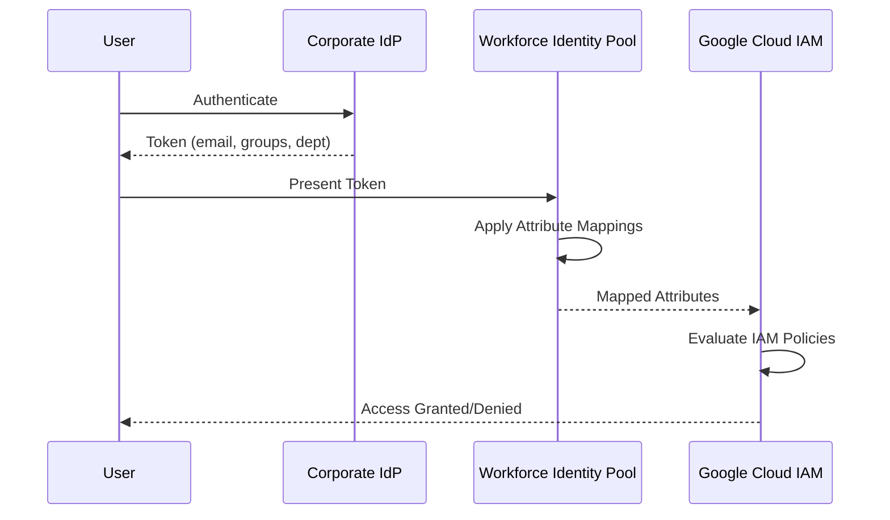

# How to Configure Workforce Identity Pool Attribute Mappings for Fine-Grained Access

Author: [nawazdhandala](https://www.github.com/nawazdhandala)

Tags: GCP, Workforce Identity, IAM, Identity Federation, Google Cloud Security

Description: A detailed guide to configuring workforce identity pool attribute mappings on Google Cloud for fine-grained access control using external identity providers.

---

Workforce Identity Federation lets your organization's employees access Google Cloud resources using their existing corporate identity provider (IdP) - like Okta, Azure AD, or Ping Identity - without creating Google accounts. The key to making this work well is attribute mappings: the rules that translate claims from your IdP's tokens into Google Cloud attributes that IAM policies can reference.

Getting attribute mappings right means the difference between broad, overly permissive access and tight, role-specific permissions. This guide walks through configuring these mappings for real-world access control scenarios.

## How Workforce Identity Federation Works

When a user authenticates through your corporate IdP, the IdP issues a token (OIDC or SAML) containing claims about the user - their email, department, groups, and other attributes. Workforce Identity Pool attribute mappings transform these claims into Google Cloud attributes.



## Creating a Workforce Identity Pool

Start by creating the pool and provider:

```bash
# Create a workforce identity pool
gcloud iam workforce-pools create my-corp-pool \
    --organization=123456789 \
    --location=global \
    --description="Corporate workforce identity pool"

# Create an OIDC provider within the pool
gcloud iam workforce-pools providers create-oidc my-okta-provider \
    --workforce-pool=my-corp-pool \
    --location=global \
    --issuer-uri="https://mycompany.okta.com" \
    --client-id="0oa1234567890abcdef" \
    --attribute-mapping="google.subject=assertion.sub,google.groups=assertion.groups,google.display_name=assertion.name" \
    --attribute-condition="assertion.email_verified == true"
```

The `--attribute-mapping` flag is where the magic happens. Let me break it down.

## Understanding Attribute Mapping Syntax

Attribute mappings use Common Expression Language (CEL) to transform IdP token claims into Google Cloud attributes. The format is:

```
google.attribute=CEL_expression_on_assertion
```

The `assertion` object represents the incoming token from your IdP. The `google` object represents the target Google Cloud attributes.

### Required Mapping: google.subject

Every workforce identity pool must map `google.subject`. This is the unique identifier for the user:

```bash
# Map the IdP's subject claim to Google's subject
# This uniquely identifies each user
google.subject=assertion.sub
```

### Custom Attribute Mappings

You can map up to 50 custom attributes. These attributes can then be used in IAM conditions:

```bash
# Map department, team, and role from IdP claims
# These custom attributes can be referenced in IAM policies
--attribute-mapping="\
google.subject=assertion.sub,\
google.groups=assertion.groups,\
google.display_name=assertion.name,\
attribute.department=assertion.department,\
attribute.team=assertion.team_name,\
attribute.cost_center=assertion.cost_center,\
attribute.job_level=assertion.job_level"
```

## Advanced CEL Expressions

CEL expressions let you transform and combine claims. Here are practical examples:

### Extracting Domain from Email

```bash
# Extract the email domain to use as an attribute
# Useful for multi-tenant setups
attribute.email_domain=assertion.email.extract('{domain_part}@{email_domain}')
```

### Conditional Mapping

```bash
# Set an admin flag based on group membership
attribute.is_admin=assertion.groups.exists(g, g == 'gcp-admins') ? 'true' : 'false'
```

### String Transformation

```bash
# Normalize department names to lowercase
attribute.department=assertion.department.lowerAscii()
```

### Combining Multiple Claims

```bash
# Create a composite identifier from multiple claims
attribute.org_unit=assertion.department + '/' + assertion.team_name
```

## Complete Provider Configuration Example

Here is a comprehensive provider setup with rich attribute mappings:

```bash
# Create an OIDC provider with detailed attribute mappings
gcloud iam workforce-pools providers create-oidc corporate-okta \
    --workforce-pool=my-corp-pool \
    --location=global \
    --issuer-uri="https://mycompany.okta.com" \
    --client-id="0oa1234567890abcdef" \
    --client-secret-value="client-secret-here" \
    --web-sso-response-type=code \
    --web-sso-assertion-claims-behavior=ONLY_ID_TOKEN_CLAIMS \
    --attribute-mapping="\
google.subject=assertion.sub,\
google.groups=assertion.groups,\
google.display_name=assertion.name,\
attribute.department=assertion.department,\
attribute.job_title=assertion.job_title,\
attribute.employee_type=assertion.employee_type,\
attribute.location=assertion.office_location,\
attribute.security_clearance=assertion.groups.exists(g, g == 'security-cleared') ? 'high' : 'standard'" \
    --attribute-condition="\
assertion.email_verified == true && \
assertion.employee_type in ['full-time', 'contractor']"
```

The `--attribute-condition` acts as a gate. Only tokens that satisfy this condition are accepted. In this example, we require verified emails and only allow full-time employees and contractors.

## Using Mapped Attributes in IAM Policies

Once attributes are mapped, use them in IAM bindings with conditions:

```bash
# Grant viewer access to all workforce users in the engineering department
gcloud projects add-iam-policy-binding my-project \
    --role=roles/viewer \
    --member="principalSet://iam.googleapis.com/locations/global/workforcePools/my-corp-pool/attribute.department/engineering" \
    --condition='expression=resource.type == "compute.googleapis.com/Instance",title=VM access only'
```

For more granular access using IAM conditions:

```bash
# Grant BigQuery access only to data analysts during business hours
gcloud projects add-iam-policy-binding my-project \
    --role=roles/bigquery.dataViewer \
    --member="principalSet://iam.googleapis.com/locations/global/workforcePools/my-corp-pool/attribute.department/data-analytics" \
    --condition='expression=request.time.getHours("America/New_York") >= 8 && request.time.getHours("America/New_York") <= 18,title=Business hours only'
```

### Group-Based Access

Map IdP groups to control access for teams:

```bash
# Grant admin access to members of the gcp-admins group
gcloud projects add-iam-policy-binding my-project \
    --role=roles/editor \
    --member="principalSet://iam.googleapis.com/locations/global/workforcePools/my-corp-pool/group/gcp-admins"
```

## Terraform Configuration

```hcl
# Workforce identity pool
resource "google_iam_workforce_pool" "corp" {
  workforce_pool_id = "my-corp-pool"
  parent            = "organizations/123456789"
  location          = "global"
  description       = "Corporate workforce identity pool"
}

# OIDC provider with attribute mappings
resource "google_iam_workforce_pool_provider" "okta" {
  workforce_pool_id = google_iam_workforce_pool.corp.workforce_pool_id
  location          = "global"
  provider_id       = "corporate-okta"

  # Attribute mappings translate IdP claims to GCP attributes
  attribute_mapping = {
    "google.subject"             = "assertion.sub"
    "google.groups"              = "assertion.groups"
    "google.display_name"        = "assertion.name"
    "attribute.department"       = "assertion.department"
    "attribute.team"             = "assertion.team_name"
    "attribute.employee_type"    = "assertion.employee_type"
    "attribute.security_level"   = "assertion.groups.exists(g, g == 'security-team') ? 'elevated' : 'standard'"
  }

  # Only accept tokens from verified, active employees
  attribute_condition = "assertion.email_verified == true && assertion.account_status == 'active'"

  oidc {
    issuer_uri = "https://mycompany.okta.com"
    client_id  = "0oa1234567890abcdef"
    web_sso_config {
      response_type                 = "CODE"
      assertion_claims_behavior     = "ONLY_ID_TOKEN_CLAIMS"
    }
  }
}

# IAM binding using mapped department attribute
resource "google_project_iam_member" "eng_viewer" {
  project = "my-project"
  role    = "roles/viewer"
  member  = "principalSet://iam.googleapis.com/${google_iam_workforce_pool.corp.name}/attribute.department/engineering"
}

# IAM binding using group membership
resource "google_project_iam_member" "admin_access" {
  project = "my-project"
  role    = "roles/editor"
  member  = "principalSet://iam.googleapis.com/${google_iam_workforce_pool.corp.name}/group/gcp-admins"
}
```

## Testing Attribute Mappings

Before rolling out to your entire organization, test the mappings:

```bash
# Test the attribute mapping with a sample token
# This shows how the IdP token would be mapped without actually granting access
gcloud iam workforce-pools providers describe corporate-okta \
    --workforce-pool=my-corp-pool \
    --location=global \
    --format=yaml
```

You can also use the IAM troubleshooter to debug access issues:

```bash
# Troubleshoot why a specific workforce user cannot access a resource
gcloud policy-intelligence troubleshoot-policy iam \
    --principal-email="user@mycompany.com" \
    --resource-name="//cloudresourcemanager.googleapis.com/projects/my-project" \
    --permission="compute.instances.list"
```

## Common Pitfalls

**Missing claims in tokens.** If your IdP does not include a claim that your mapping references, the mapping fails silently and the attribute is empty. Verify that your IdP is configured to send all the claims you need.

**Group name mismatches.** IdP group names are case-sensitive in CEL expressions. If Okta sends "GCP-Admins" but your IAM binding references "gcp-admins", it will not match.

**Overly broad attribute conditions.** An attribute condition that is too permissive lets unintended users through. Always include `assertion.email_verified == true` at minimum.

**Token size limits.** If your IdP includes too many groups in the token, it might exceed size limits. Configure your IdP to only include relevant GCP groups in the token.

Workforce Identity Pool attribute mappings are the bridge between your corporate identity system and Google Cloud's IAM. Take the time to design your mappings carefully, and you will have a clean, maintainable access control model that maps naturally to your organization's structure.
